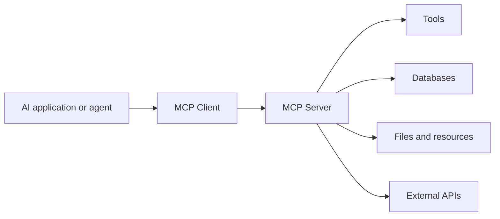
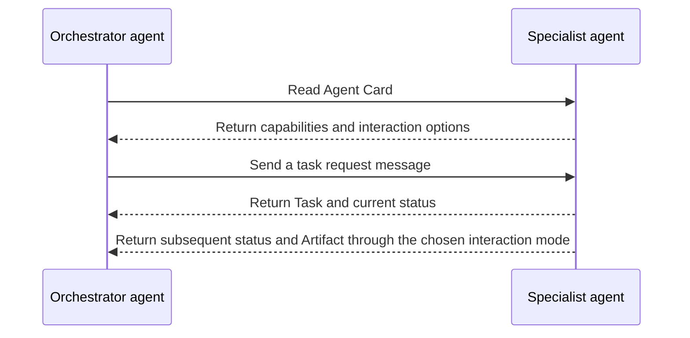
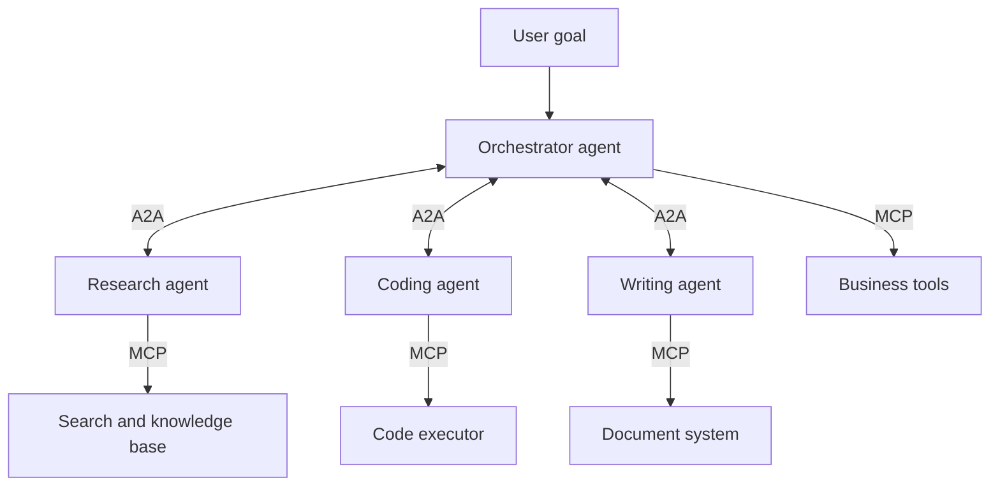

# Chapter 1: From Large Language Models to AI Agents

## 1.1 Three Limitations of a Standalone Model

If a model can already write emails and analyze orders, why do we need an agent? Because generating a proposed solution is not the same as completing the task. Acquiring facts, preserving state, and executing actions still need to happen. Model inference alone does not automatically do any of these.

### 1.1.1 Knowledge Is Frozen

A model's parametric knowledge comes primarily from its training data; it has no inherent awareness of events that occur after training ends. New information must come from its inputs or external systems: a user might supply additional material, or an application might query a search engine, database, or RAG system. Adding retrieval does not guarantee up-to-date facts, either. You still need to establish whether the knowledge base has been updated and when its data was collected.

### 1.1.2 No Automatic Persistent State

An ordinary inference call does not automatically write personal memories that persist across requests. Setting aside server-side session management, a single call can be expressed as:

$$
y_t \sim P_{\theta}(y\mid x_t)
$$

The model generates output $y_t$ from the effective context $x_t$ of that call. An application can supply the history again, or a provider's session service can restore it. The latter is state maintained by the API or runtime; it does not mean that the conversation updates the model's parameters. A KV cache is not long-term memory, either.

### 1.1.3 No Direct Ability to Act

Model inference on its own can only generate the outputs the model supports, such as text, structured requests, or multimodal content. Without an execution layer, those outputs alone cannot:

- Query real-time data;
- Execute code;
- Access databases;
- Call business APIs;
- Send emails or modify files.

An ordinary model therefore primarily handles:

> **Input → Content generation**

Not:

> **Goal → Task completion in the real world**

## 1.2 What Is an Agent?

The **LLM agents** discussed in this topic are systems in which a large language model participates in decision-making: they observe an environment, select actions toward a goal, and adapt to feedback. AI agents in the broader sense do not have to use LLMs. Even within LLM applications, an explicit planner, long-term memory, and multiple agents are not prerequisites. A budget-constrained loop of “call the model, execute a tool, return the observation” can be a minimal implementation.

The core is not a single answer, but an ongoing feedback loop:

> **Observe → Plan → Act → Observe again**

Let the agent's state at time $t$ be:

$$
S_t=(G,O_t,M_t,H_t)
$$

Where:

- $G$: the task goal;
- $O_t$: the current environmental observation;
- $M_t$: available memory;
- $H_t$: the execution history so far.

The agent selects an action based on its current state. If we explicitly separate decision-making into planning and action, we can write:

$$
P_t=\mathrm{Plan}(S_t)
$$

$$
A_t=\mathrm{Act}(S_t,P_t)
$$

After the action executes, the environment returns a new observation. Let $E_t$ represent the actual state of the environment. The same action can produce different results in different states, and a read-only query does not necessarily change business state:

$$
(E_{t+1},O_{t+1})\sim\mathrm{Environment}(\cdot\mid E_t,A_t)
$$

The agent then updates its own state and starts the next iteration:

$$
S_{t+1}=\mathrm{Update}(S_t,A_t,O_{t+1})
$$

This continues until the goal is achieved, a resource limit is reached, or human intervention is needed. Here, $S_t$ is the record maintained by the agent, not a complete account of the outside world. For example, “request accepted” must not be recorded as “email delivered.”

## 1.3 Three Core Agent Capabilities

### 1.3.1 Tool Use

Tool use is what allows an agent to move from talking about a task to carrying it out.

Tools available to an agent may include:

- Search engines;
- Code executors;
- File systems;
- Databases;
- Browsers;
- External APIs;
- Email and enterprise business systems.

> **LLM + Tools → Ability to execute**

In an agent that allows the model to make dynamic decisions, the model interprets the goal, selects from the permitted tools, and generates arguments. The runtime validates requests, executes tools, and returns results; the tools query information or produce external side effects. A user who says “Draft an email for me to review first” has authorized drafting, not sending. Even if the model generates a send request, the execution layer should block it.

### 1.3.2 Memory

The model itself does not permanently retain conversations. An agent's memory comes from systems designed around the model.

#### Short-Term Memory

Short-term memory preserves the state needed for later decisions across steps of the current task. Examples include:

- The current goal;
- Completed steps;
- Tool call results;
- Intermediate calculations;
- Unresolved questions.

It is typically held in the context window, task state, or temporary storage.

#### Long-Term Memory

Long-term memory holds information across tasks, such as:

- User preferences;
- Past operations;
- Domain knowledge;
- Lessons from previous tasks.

Long-term memory can be stored in relational, document, or vector databases and retrieved through keywords, conditional queries, or semantic retrieval.

> **Agent Memory = Short-term Memory + Long-term Memory**

### 1.3.3 Multi-Step Reasoning and Self-Correction

An agent can attempt to break a complex goal into multiple steps and adjust its strategy based on execution feedback:

> **Execute → Receive feedback → Analyze → Adjust → Retry**

For example:

- Generate new search terms when the original query is ineffective;
- Modify arguments based on an API error;
- Analyze an exception and fix code after execution fails;
- Replan the task when the current approach is infeasible.

Fixed automation scripts can also retry, branch, and adapt to feedback, so the presence of a feedback loop alone does not identify an LLM agent. A more useful distinction is who decides the next step:

- **Fixed automation script**: the developer encodes transition rules in advance;
- **LLM agent**: the model may dynamically select actions within the goal, authorization, and budget constraints.

Self-correction does not guarantee that an agent will solve the problem. Real systems still need retry limits, permission boundaries, resource budgets, and human confirmation mechanisms.

## 1.4 From Individual Agents to an Agent Ecosystem

As the number of agents and tools grows, two additional questions arise:

1. How can an agent connect to many external tools through a consistent interface?
2. How can agents built by different vendors with different frameworks collaborate?

These questions have driven the development of MCP and A2A, respectively.

## 1.5 MCP: Connecting Agents to External Tools

> This section takes the agent user's perspective. For MCP lifecycle, transport, and security specifications, see [Tools: MCP](../../tools/02-mcp/04-what-is-mcp.md). For cross-agent collaboration protocols, see [Tools: A2A](../../tools/04-agent-communication/11-a2a-protocol.md).

Anthropic introduced MCP in November 2024. In December 2025, Anthropic donated MCP to the Agentic AI Foundation (AAIF) under the Linux Foundation. Community maintainers oversee MCP's technical governance, while AAIF provides vendor-neutral organizational and infrastructure support.

**MCP = Model Context Protocol**

MCP provides a standard interface for connecting AI applications to external tools and data sources. A useful analogy is a “USB-C port” for the AI tool ecosystem.

MCP has three main roles:

- **Host**: the AI application running the model or agent;
- **Client**: maintains a connection to an MCP server;
- **Server**: exposes tools, resources, and prompt templates to the AI application.

Its core value is reducing tool integration effort. Connecting $N$ agents to $M$ tools might otherwise require:

$$
N \times M
$$

custom integrations. With standardization, the two sides can instead be implemented as:

**$N$ MCP clients + $M$ MCP servers**

This is an idealized count of adapters, not a formula for total engineering cost. One server can aggregate multiple tools, and the host must still handle authentication, version compatibility, authorization, and business semantics.

## 1.6 A2A: Connecting Agents to Other Agents

Google introduced A2A in April 2025. In June 2025, the project joined the Linux Foundation to continue its governance and development on a vendor-neutral basis:

**A2A = Agent2Agent Protocol**

If MCP addresses “How does an agent invoke external tools?”, A2A addresses “How does an agent discover and collaborate with another agent?”

Consider the core objects in the A2A v1.0.1 release specification:

- **Agent Card**: describes the agent's identity, capabilities, skills, service endpoint, and authentication requirements;
- **Task**: a unit of work that requires ongoing tracking, together with its lifecycle;
- **Message**: a single communication message between a client and a remote agent;
- **Part**: a content unit within a Message or Artifact, containing one of text, inline file bytes, a file URL, or structured data;
- **Artifact**: a task deliverable composed of one or more Parts.

> An Agent Card is more like a capability profile. Objects such as Task primarily describe what the agent is doing and its execution progress.

The diagram shows a task that requires ongoing tracking. Under the A2A v1.0.1 release specification, sending a message can also return a `Message` directly; not every interaction has to create a `Task`. Check the exact message fields and transports against the A2A versions actually supported by both parties.

## 1.7 How MCP and A2A Relate

| Dimension | MCP | A2A |
|---|---|---|
| Participants connected | Agents and tools | Agents and agents |
| Core question | How to use external capabilities | How to discover, delegate, and collaborate |
| Main abstractions | Tools, Resources, Prompts | Agent Card, Task, Message, Part, Artifact |
| Typical uses | Database queries, code execution | Dividing work among agents and exchanging results |
| Analogy | Using tools | Collaborating with colleagues |

The two are often complementary, but the distinction is not whether a service contains a model:

> Consider MCP when you need consistent tool and context interfaces. Consider A2A when you need interoperability for a remote agent's tasks, messages, and artifacts.

An MCP tool can run an agent behind the scenes; an A2A service can execute a deterministic workflow. Neither protocol automatically solves task decomposition, delegated authorization, or distributed transactions, and a multi-agent system does not have to adopt both.

MCP helps individual agents reach for tools, while A2A helps multiple agents communicate and divide the work. Together, they provide an important foundation for standardization and interoperability in multi-agent systems.

## References

- [Anthropic: Introducing the Model Context Protocol](https://www.anthropic.com/news/model-context-protocol)
- [OpenAI Agents SDK: Agents](https://openai.github.io/openai-agents-python/agents/)
- [LangChain: Short-term memory](https://docs.langchain.com/oss/python/langchain/short-term-memory)
- [MCP joins the Agentic AI Foundation](https://blog.modelcontextprotocol.io/posts/2025-12-09-mcp-joins-agentic-ai-foundation/)
- [Linux Foundation: Agent2Agent Protocol Project](https://www.linuxfoundation.org/press/linux-foundation-launches-the-agent2agent-protocol-project-to-enable-secure-intelligent-communication-between-ai-agents)
- [A2A v1.0.1 release specification: Core objects and message sending](https://github.com/a2aproject/A2A/blob/v1.0.1/specification/a2a.proto)
- [A2A Protocol: Core Concepts](https://a2a-protocol.org/latest/topics/key-concepts/)
- [Anthropic: Building Effective Agents](https://www.anthropic.com/engineering/building-effective-agents)
