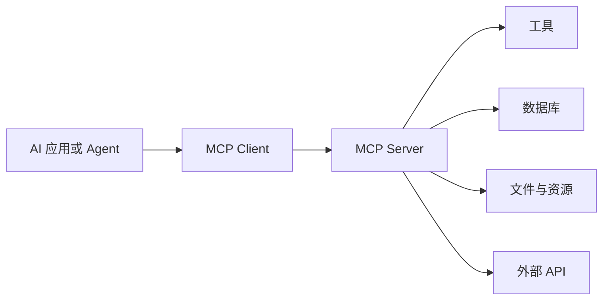
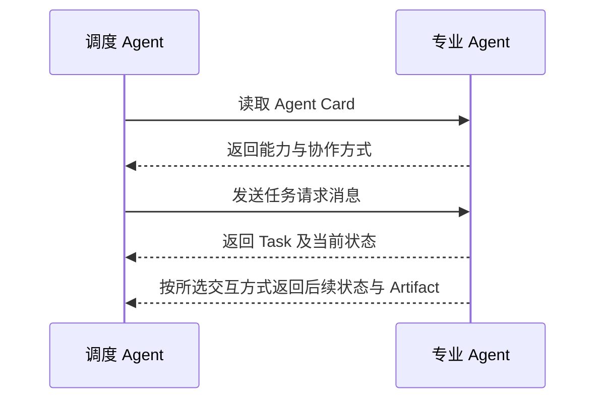
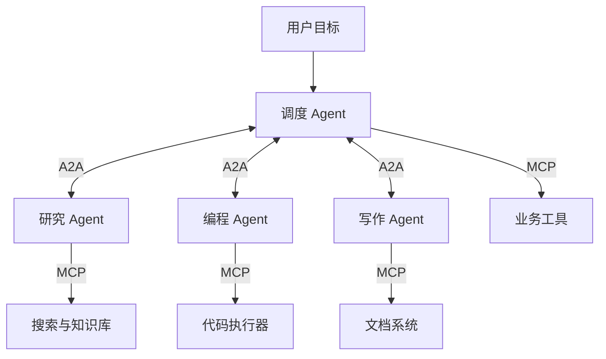

# 第一章：从大模型到 AI Agent

## 1.1 普通大模型的三类局限

模型已经能写邮件、分析订单，为什么还需要 Agent？因为“生成处理方案”和“把任务办完”之间，还隔着事实获取、状态保存和动作执行。单独的模型推理不会自动完成这三件事。

### 1.1.1 知识冻结

模型的参数知识主要来自训练数据，无法天然感知训练结束后发生的新事件。新信息必须由输入或外部系统提供，例如用户补充材料，或应用查询搜索引擎、数据库和 RAG 系统。接入检索也不等于获得实时事实：知识库是否更新、数据何时采集，仍需单独确认。

### 1.1.2 缺少持续状态

普通推理调用不会自动写入跨请求的个人记忆。忽略服务端会话管理时，一次调用可以表示为：

$$
y_t \sim P_{\theta}(y\mid x_t)
$$

模型根据本次有效上下文 $x_t$ 生成输出 $y_t$。历史可以由应用重新传入，也可以由提供商的会话服务恢复；后者是 API/运行时保存状态，不代表模型参数因对话而更新。KV Cache 同样不是长期记忆。

### 1.1.3 无法直接行动

单独的模型推理只能生成其支持的输出（文本、结构化请求或多模态内容）；没有执行层接入时，不能仅凭输出完成以下操作：

- 查询实时数据；
- 执行代码；
- 访问数据库；
- 调用业务 API；
- 发送邮件或修改文件。

因此，普通大模型主要解决的是：

> **输入 → 内容生成**

而不是：

> **目标 → 现实世界中的任务完成**

## 1.2 什么是 Agent

本主题讨论的 **LLM Agent**，是以大模型参与决策、围绕目标感知环境、选择行动并根据反馈调整的系统。广义 AI Agent 不要求使用 LLM；在 LLM 应用里，显式规划器、长期记忆和多 Agent 也都不是成立条件。一个受预算约束的“调用模型—执行工具—回传观察”循环就可以构成最小实现。

它的核心并不是某一次回答，而是一个持续运行的闭环：

> **感知 → 规划 → 行动 → 再感知**

设 Agent 在时刻 $t$ 的状态为：

$$
S_t=(G,O_t,M_t,H_t)
$$

其中：

- $G$：任务目标；
- $O_t$：当前环境观察；
- $M_t$：可用记忆；
- $H_t$：此前的执行历史。

Agent 根据当前状态选择动作。若把决策过程显式拆成规划和行动两步，可以写成：

$$
P_t=\mathrm{Plan}(S_t)
$$

$$
A_t=\mathrm{Act}(S_t,P_t)
$$

执行动作后，环境返回新的观察。用 $E_t$ 表示环境真实状态；同一个动作在不同状态下可能得到不同结果，只读查询也不一定改变业务状态：

$$
(E_{t+1},O_{t+1})\sim\mathrm{Environment}(\cdot\mid E_t,A_t)
$$

随后，Agent 更新自身状态并进入下一轮循环：

$$
S_{t+1}=\mathrm{Update}(S_t,A_t,O_{t+1})
$$

直到目标完成、达到资源限制，或者需要人工介入。这里的 $S_t$ 是 Agent 保存的记录，不是环境的完整真相；例如“请求已受理”不能直接记成“邮件已送达”。

## 1.3 Agent 的三大核心能力

### 1.3.1 工具调用（Tool Use）

工具调用是 Agent 从“会说话”走向“能做事”的关键。

Agent 可以使用的工具包括：

- 搜索引擎；
- 代码执行器；
- 文件系统；
- 数据库；
- 浏览器；
- 外部 API；
- 邮件和企业业务系统。

> **LLM + Tools → 可执行能力**

在允许模型动态决策的 Agent 中，大模型负责理解目标、在允许的工具范围内选择工具并生成参数，运行时负责校验请求、执行工具并返回结果；工具负责查询信息或产生外部副作用。用户要求“先写一封邮件让我看”，只授权了草稿生成，并没有授权发送。模型即使生成了发送请求，执行层也应拦住它。

### 1.3.2 记忆机制（Memory）

模型本身不会永久保存对话。Agent 的记忆能力来自模型之外的系统设计。

#### 短期记忆

短期记忆用于在当前任务的多个步骤之间保留后续决策仍需使用的状态信息，例如：

- 当前目标；
- 已完成的步骤；
- 工具调用结果；
- 中间计算结果；
- 尚未解决的问题。

它通常存放在上下文窗口、任务状态或临时存储中。

#### 长期记忆

长期记忆保存跨任务信息，例如：

- 用户偏好；
- 历史操作；
- 领域知识；
- 过去任务的经验。

长期记忆可以存储在关系数据库、文档数据库或向量数据库中，并通过关键词、条件查询或语义检索取回。

> **Agent Memory = Short-term Memory + Long-term Memory**

### 1.3.3 多步推理与自我纠错

Agent 可以尝试把复杂目标拆解为多个步骤，并根据执行反馈调整策略：

> **执行 → 反馈 → 分析 → 调整 → 重试**

例如：

- 搜索关键词无效时，重新生成查询词；
- API 返回错误时，根据错误信息修改参数；
- 代码执行失败时，分析异常并修正代码；
- 当前方案不可行时，重新规划任务路径。

固定自动化脚本也能重试、分支和根据反馈调整，因此不能仅凭“有反馈循环”判断它是不是 LLM Agent。更有用的区别是下一步策略由谁决定：

- **固定自动化脚本**：由开发者预先编码转移规则；
- **LLM Agent**：允许模型在目标、权限和预算范围内动态选择行动。

不过，自我纠错并不意味着 Agent 一定能解决问题。实际系统仍需设置最大重试次数、权限边界、资源预算和人工确认机制。

## 1.4 从单 Agent 到 Agent 生态

随着 Agent 和工具数量增加，两个新的问题随之出现：

1. Agent 如何统一连接大量外部工具？
2. 不同厂商、不同框架开发的 Agent 如何相互协作？

这两个问题分别推动了 MCP 和 A2A 协议的发展。

## 1.5 MCP：连接 Agent 与外部工具

> 这里从 Agent 的使用视角切入；MCP 的生命周期、传输和安全规范详见[Tools：MCP](../../tools/02-mcp/04-what-is-mcp.zh.md)，跨 Agent 协作协议详见[Tools：A2A](../../tools/04-agent-communication/11-a2a-protocol.zh.md)。

Anthropic 在 2024 年 11 月提出了 MCP。2025 年 12 月，Anthropic 将 MCP 捐赠给 Linux 基金会旗下的 Agentic AI Foundation（AAIF）；MCP 由社区维护者负责技术治理，AAIF 提供厂商中立的组织与基础设施支持。

**MCP = Model Context Protocol（模型上下文协议）**

MCP 为 AI 应用连接外部工具和数据源提供了标准接口，可以将它类比为 AI 工具生态中的“USB-C 接口”。

MCP 主要包含三个角色：

- **Host**：运行模型或 Agent 的 AI 应用；
- **Client**：维护与 MCP Server 的连接；
- **Server**：向 AI 应用暴露工具、资源和提示模板。

其核心价值是降低工具集成成本。原本 $N$ 个 Agent 与 $M$ 个工具之间可能需要：

$$
N \times M
$$

组定制集成，而标准化之后可以分别实现为：

**$N$ 个 MCP Client + $M$ 个 MCP Server**

这是理想化的适配关系计数，不是完整工程成本公式；一个 Server 可聚合多个工具，Host 仍需处理认证、版本兼容、权限和业务语义。

## 1.6 A2A：连接 Agent 与 Agent

Google 在 2025 年 4 月推出了 A2A。2025 年 6 月，A2A 项目进入 Linux 基金会，以厂商中立的方式继续治理和发展：

**A2A = Agent2Agent Protocol（Agent 间通信协议）**

如果说 MCP 解决的是“Agent 如何调用外部工具”，那么 A2A 解决的就是“Agent 如何发现并与另一个 Agent 协作”。

以 A2A v1.0.1 发布规范中的核心对象为例：

- **Agent Card**：描述 Agent 的身份、能力、技能、服务地址和认证要求；
- **Task**：需要持续跟踪的工作单元及其生命周期；
- **Message**：客户端与远端 Agent 之间的一条通信消息；
- **Part**：Message 和 Artifact 中承载实际内容的基本单元，每个 Part 的内容在文本、内联文件字节、文件 URL 或结构化数据中择一；
- **Artifact**：任务产生的实际交付物，由一个或多个 Part 组成。

> Agent Card 更像一份“能力名片”，而“正在做什么”和执行进度主要由 Task 等对象表达。

图中展示的是需要持续跟踪的任务。A2A v1.0.1 发布规范中的消息发送也允许直接返回 `Message`，不是每次交互都必须创建 `Task`；具体消息字段和传输方式应按双方实际支持的 A2A 版本核对。

## 1.7 MCP 与 A2A 的关系

| 维度 | MCP | A2A |
|---|---|---|
| 连接对象 | Agent 与工具 | Agent 与 Agent |
| 核心问题 | 如何使用外部能力 | 如何发现、委派和协作 |
| 主要抽象 | Tools、Resources、Prompts | Agent Card、Task、Message、Part、Artifact |
| 典型场景 | 查询数据库、执行代码 | 多 Agent 分工与结果传递 |
| 类比 | 使用工具 | 与同事协作 |

二者通常互补，但不是按服务内部“有没有模型”来划分：

> 需要统一工具与上下文接口时考虑 MCP；需要远程 Agent 的任务、消息和产物互操作时考虑 A2A。

一个 MCP Tool 的背后也可以运行 Agent；A2A 服务也可以执行确定性工作流。二者都不自动解决任务分解、权限委派或分布式事务，多 Agent 系统也不必须同时采用这两个协议。

MCP 让每个 Agent 能够方便地“伸手拿工具”，A2A 则让多个 Agent 能够“相互沟通与分工”。二者共同构成多 Agent 系统走向标准化和互操作的重要基础。

## 参考资料

- [Anthropic: Introducing the Model Context Protocol](https://www.anthropic.com/news/model-context-protocol)
- [OpenAI Agents SDK: Agents](https://openai.github.io/openai-agents-python/agents/)
- [LangChain: Short-term memory](https://docs.langchain.com/oss/python/langchain/short-term-memory)
- [MCP joins the Agentic AI Foundation](https://blog.modelcontextprotocol.io/posts/2025-12-09-mcp-joins-agentic-ai-foundation/)
- [Linux Foundation: Agent2Agent Protocol Project](https://www.linuxfoundation.org/press/linux-foundation-launches-the-agent2agent-protocol-project-to-enable-secure-intelligent-communication-between-ai-agents)
- [A2A v1.0.1 发布规范：核心对象与消息发送](https://github.com/a2aproject/A2A/blob/v1.0.1/specification/a2a.proto)
- [A2A Protocol: Core Concepts](https://a2a-protocol.org/latest/topics/key-concepts/)
- [Anthropic: Building Effective Agents](https://www.anthropic.com/engineering/building-effective-agents)
