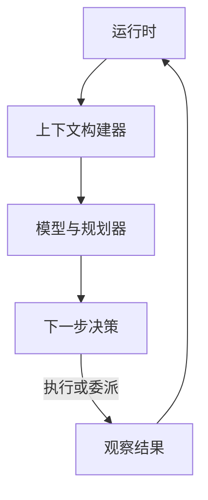
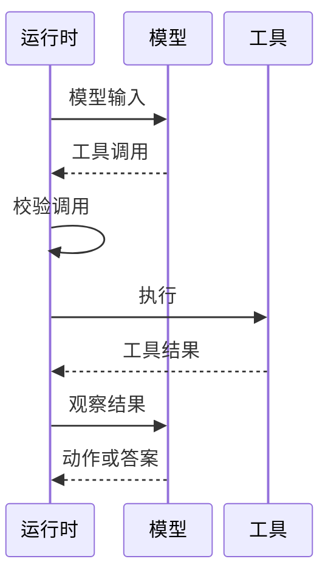
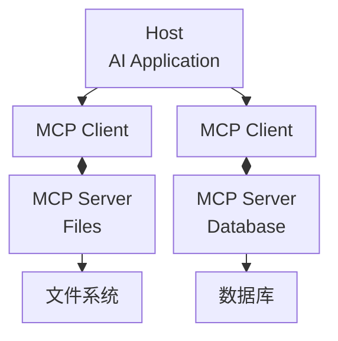
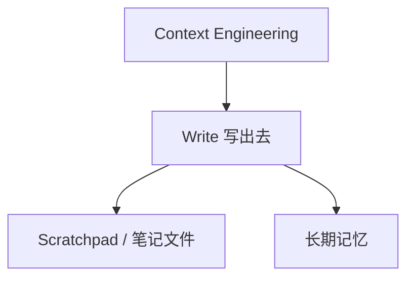
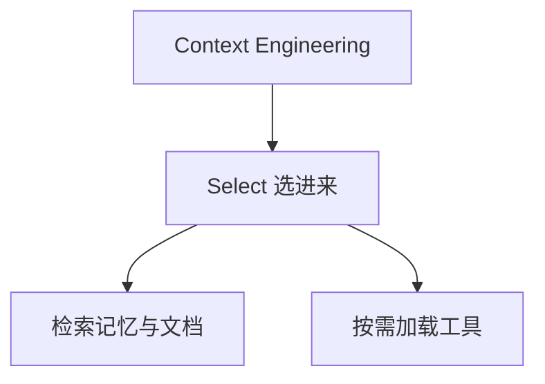
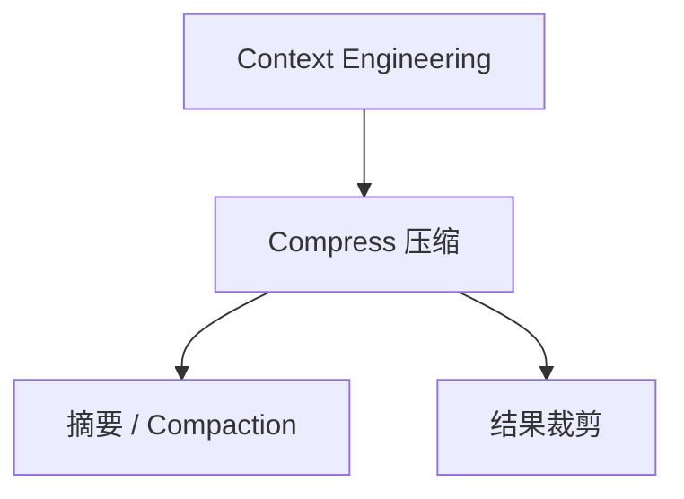
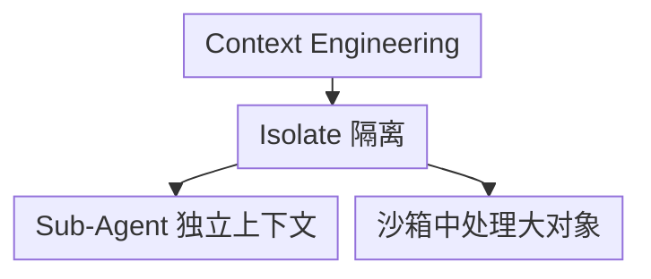
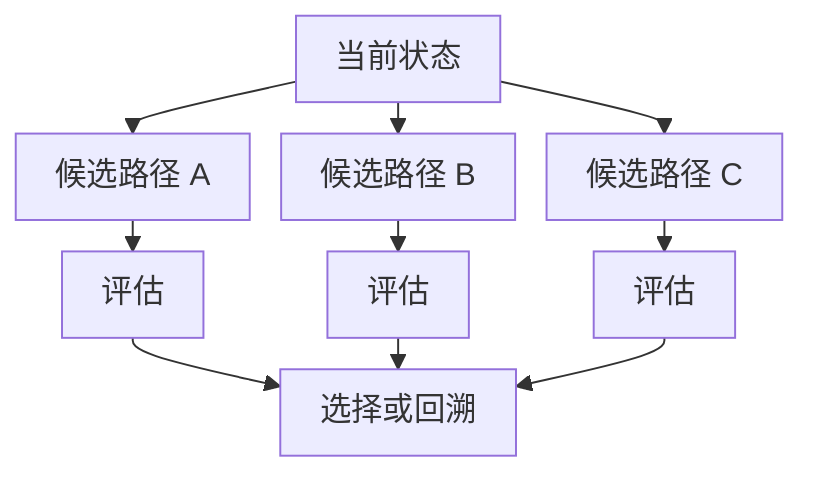
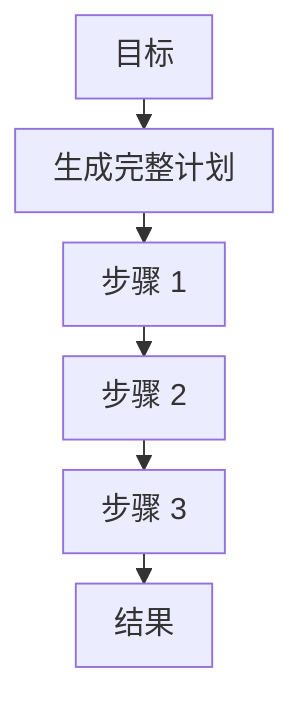
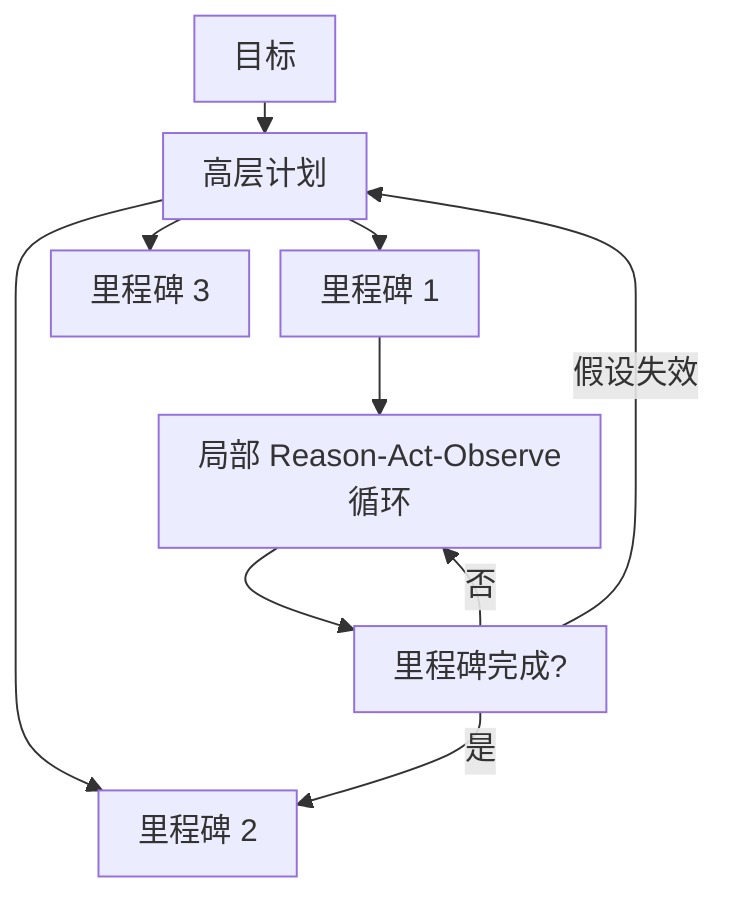

# 第二章：Agent 的现代系统架构

## 2.1 从“四组件模型”到生产级架构

模型已经能选工具，为什么还要单独设计架构？因为调用失败后谁负责恢复、写入前谁检查权限、何时算完成，都不能靠一句 Prompt 解决。入门资料通常将 Agent 概括为四个组件：

> **模型 + 工具 + 记忆 + 规划**

这个模型便于理解，但还不足以描述一个可运行、可控制、可观测的生产级 Agent。更完整的现代架构是：

> **Model + Tools + State/Memory + Planning/Control + Runtime/Guardrails**

各部分的职责如下：

| 组件 | 核心职责 |
|---|---|
| Model | 理解目标、推理、生成计划和选择动作 |
| Tools | 查询信息或改变外部环境 |
| State/Memory | 保存当前任务状态与可复用的历史信息 |
| Planning/Control | 拆解任务、调度步骤、重规划并判断终止 |
| Runtime/Guardrails | 执行工具、管理权限、限制资源并记录运行过程 |

需要特别注意：LLM 并不会亲自访问数据库或执行代码。它只能提出一个工具调用请求，真正的执行由 Agent Runtime 完成。

## 2.2 组件如何协同工作



用户目标进入运行时。运行时更新任务状态、工作记忆和长期记忆，三者共同为上下文构建器提供输入。如果决策是回答，则进入结果验收与输出，而不是再执行一轮。

图中的执行箭头包含两种不同的门控。工具调用先经过策略与权限检查，再经过 Tool Registry / MCP Client，最后到达工具 / MCP Server；搜索、文件、数据库、代码和 API 产生观察结果。委派则先检查权限与预算，再由其他 Agent 行动，其结果同样成为观察结果。运行时的执行轨迹和输出的结果评估共同进入追踪、评估与审计。

一次典型执行包含以下步骤：

1. Runtime 接收用户目标并初始化任务状态。
2. Context Builder 从当前状态、工作记忆和长期记忆中组装上下文。
3. 模型判断应该回答、调用工具、委派任务，还是重新规划。
4. 工具调用先经过参数校验、权限检查和风险控制。
5. Runtime 执行工具，并把结果作为 Observation 返回模型。
6. 系统更新任务状态，按写入规则决定哪些信息进入记忆，再进入下一轮决策。
7. 通过验收后结束；预算耗尽时报告未完成；需要审批时持久化状态并暂停，而不是把等待审批视为成功终止。

## 2.3 Model：推理与策略生成器

将 LLM 称为 Agent 的“大脑”是一种直观类比，但并不完全准确。现代模型可能同时处理文本、图像、音频等多种输入，因此它不只是“语言处理器”。

在 Agent 中，模型主要负责：

- 理解用户意图和约束；
- 分析当前任务状态；
- 生成或调整计划；
- 选择工具并生成参数；
- 根据工具反馈决定下一步；
- 判断是否可以生成最终结果。

模型能够生成工具调用请求，但默认不具备直接产生外部副作用的能力。它不能仅凭生成一段 JSON 就真的完成转账、发邮件或删除文件。

> **模型负责提出动作，Runtime 负责验证和执行动作。**

这种分工使系统能够在执行前加入权限检查、参数校验、人工确认和审计记录。

## 2.4 Tools：连接模型与外部世界

工具可以封装搜索、数据库查询、代码执行、文件操作和业务 API。原则上，能够通过稳定接口表达的外部能力都可以封装为工具。

但生产级工具不仅是一个函数，还应包含：

- 唯一且清晰的名称；
- 明确的功能描述；
- 结构化输入输出 Schema；
- 身份认证与权限范围；
- 参数校验；
- 超时、重试和取消机制；
- 幂等性与副作用说明；
- 可供模型理解的错误信息；
- 日志和审计记录。

### 2.4.1 工具定义

下面是 OpenAI **Chat Completions API** 的函数工具定义片段，放在请求的 `tools` 数组中。它使用嵌套的 `function` 对象；Responses API 的同类字段放在工具对象顶层，不能原样混用：

```json
{
  "type": "function",
  "function": {
    "name": "search_web",
    "description": "搜索公开网页并返回与查询相关的结果",
    "strict": true,
    "parameters": {
      "type": "object",
      "properties": {
        "query": {
          "type": "string",
          "description": "需要搜索的关键词"
        }
      },
      "required": ["query"],
      "additionalProperties": false
    }
  }
}
```

`strict: true` 用于约束模型生成的参数符合受支持的 Schema，不代表参数中的事实、业务权限或执行结果正确。Runtime 仍须校验并授权。模型决定使用工具时，会返回调用意图；下面只表示核心语义，不是某个 API 的原始响应：

```json
{
  "tool_call": {
    "name": "search_web",
    "arguments": {
      "query": "2026 年 Agent 技术最新进展"
    }
  }
}
```

应用程序随后执行以下流程：



这段交互开始前，用户先向运行时提交目标。模型输入包含目标、上下文与工具定义；执行前的调用校验同时检查参数与权限。模型收到观察结果后，选择下一步动作或最终答案，运行时再向用户返回结果。

### 2.4.2 工具调用的安全边界

并非所有工具调用都应该自动执行。生产系统通常按风险等级处理：

| 风险级别 | 示例 | 推荐策略 |
|---|---|---|
| 只读 | 搜索、读取文档 | 先验证数据访问与出口权限，低敏且已授权时可自动执行 |
| 可逆写入 | 创建草稿、修改临时文件 | 执行前展示变更或保留回滚能力 |
| 高风险写入 | 发邮件、发布内容、修改生产数据 | 要求明确确认 |
| 不可逆或敏感操作 | 转账、删除数据、修改权限 | 强认证、最小权限和人工审批 |

## 2.5 MCP：标准化工具与上下文连接

> 这里讨论架构集成边界；MCP 协议本身见[Tools：MCP](../../tools/02-mcp/04-what-is-mcp.zh.md)，需要跨系统 Agent 协作时见[Tools：A2A](../../tools/04-agent-communication/11-a2a-protocol.zh.md)。

MCP（Model Context Protocol）为 AI 应用连接工具和数据源提供了标准协议。

MCP 最初由 Anthropic 在 2024 年提出，2025 年 12 月成为 Linux 基金会旗下 Agentic AI Foundation 的创始项目。基金会提供厂商中立的组织治理，协议的技术方向仍由 MCP 社区维护者管理。

MCP 包含三个主要角色：

- **Host**：面向用户的 AI 应用，负责模型、权限和整体交互；
- **Client**：由 Host 创建和管理，维护与某个 MCP Server 的连接；
- **Server**：向 Client 暴露 Tools、Resources 和 Prompts 等能力。



“MCP 是工具世界的 USB-C”是一个有用的类比，但需要补充两个边界：

1. MCP Server 通常仍需安装、配置或由 Host 建立连接，并不是自动发现互联网上的所有工具。
2. 接口标准化不等于自动获得权限，认证、授权和用户确认仍由系统负责。

MCP 降低的是协议适配成本，而不是消除安全治理和业务集成。

## 2.6 State 与 Memory：不要混为一谈

### 2.6.1 任务状态

State 描述任务当前执行到哪里，例如：

- 原始目标；
- 当前计划；
- 已完成和待执行步骤；
- 工具调用及其结果；
- 错误、重试次数和预算；
- 等待中的人工审批。

状态通常需要结构化保存，并支持 checkpoint、恢复和并发控制。需要跨进程恢复的 Agent 应能从 checkpoint 继续执行，但恢复状态不等于外部动作只执行一次。例如退款已成功、进程却在保存结果前退出，恢复后直接重跑会重复退款；还需要查询业务状态或使用服务端支持的幂等键，详见[第六章](../02-reasoning-planning/06-task-decomposition.zh.md) §6.17 的失败处理。

### 2.6.2 工作记忆

工作记忆服务于当前任务，保存模型本轮决策所需的信息，例如最近的消息、关键观察和中间结论。

工作记忆受上下文窗口限制，但不一定在任务结束后立即销毁。系统可能将其摘要、归档或转化为长期记忆。

### 2.6.3 长期记忆

长期记忆保存跨任务可复用的信息。它并不等同于向量数据库，常见存储方式包括：

- 关系数据库：用户资料、权限和结构化事实；
- 键值或文档数据库：偏好、配置和任务快照；
- 向量数据库：非结构化内容的语义检索；
- 事件存储：完整操作历史和审计轨迹；
- 知识图谱：实体关系和可解释的关联查询。

向量检索适合“语义相近”的召回，但精确事实、时间条件和权限约束通常需要 metadata 过滤或结构化查询配合。

## 2.7 长期记忆的认知分类

可以借用认知科学中的分类理解 Agent 记忆，但它只是概念模型，不代表底层必须建立三个独立数据库。

### 2.7.1 语义记忆（Semantic Memory）

保存可复用的事实和概念，例如：

- 用户从事金融行业；
- 某 API 的调用限制是每分钟 60 次；
- 项目使用 PostgreSQL 作为主数据库。

### 2.7.2 情景记忆（Episodic Memory）

保存带有时间和上下文的具体经历，例如：

- 上次处理退款任务时发现订单已超过退款期限；
- 某次部署因为数据库迁移顺序错误而失败。

### 2.7.3 程序性记忆（Procedural Memory）

保存“如何完成任务”的经验，例如：

- 处理退款前先检查订单状态和支付渠道；
- 发布版本前依次执行测试、构建和变更检查。

程序性记忆在工程上可能表现为工作流、Skill、策略模板或经过验证的操作手册，而不一定是普通的向量文本。

## 2.8 Context Engineering：管理有限上下文

### 2.8.1 上下文是会耗尽的预算，不是可以填满的桶

复杂任务会产生大量工具结果。若将所有内容不断追加到 Prompt，会导致：

- 超出上下文窗口；
- 推理成本和延迟增加；
- 关键信息被噪音淹没；
- 模型出现“中间遗忘”或关注错误内容。

一个常见的误解是：上下文窗口越来越大，这个问题就自动消失了。

事实并非如此。Chroma 的 Context Rot 实验观察到，所测模型在不同任务上的性能可能随输入长度非均匀下降，且可能早于窗口上限；这不是所有模型和任务都遵循的单调定律。简单的字面“大海捞针”不能代表多跳检索、语义判断或长程执行，仍需按业务任务测试有效上下文长度。

因此正确的心智模型是：

> **为当前决策保留必要的目标、约束和证据，按任务表现决定上下文取舍，而不是把窗口填满。**

### 2.8.2 上下文失效的四种形态

把“上下文太长”笼统当成一个问题，是无法定位故障的。工程上应该区分四种不同的失效模式，它们的成因和解法都不同：

| 失效模式 | 表现 | 成因 | 解法 |
|---|---|---|---|
| Context Poisoning（污染） | 一个幻觉或错误结论进入上下文后被反复引用，越滚越实 | 错误内容没有被校验就沉淀下来 | 活跃上下文撤下错误结论，保留来源、更正记录和审计历史 |
| Context Distraction（分心） | 上下文过长后，模型过度依赖历史轨迹而不再灵活决策 | 历史信息权重压过了当前任务需求 | 压缩历史，突出当前目标 |
| Context Confusion（混淆） | 无关的工具或文档内容干扰了选择 | 塞入了当前任务用不到的内容 | 按需加载工具与文档 |
| Context Clash（冲突） | 上下文中存在互相矛盾的信息 | 多轮澄清、多来源信息未做合并 | 冲突检测与显式取舍，保留结论而非全部过程 |

工具集越大、描述越相似，选择和参数生成可能越难，但不存在通用的“几十个工具就失效”阈值。RAG-MCP 的实验支持在其模型与工具集上先检索候选工具；落到业务还要同时测候选召回率、最终调用正确率与额外检索延迟。小而稳定的工具集可以直接全量提供。

### 2.8.3 四类基本操作：Write / Select / Compress / Isolate

LangChain 的上下文工程文章用四类操作组织常见做法：

写入上下文。



选择上下文。



压缩上下文。



隔离上下文。



| 操作 | 含义 | 典型做法 |
|---|---|---|
| Write | 把信息存到上下文**之外** | 写入 `NOTES.md`、待办清单、长期记忆库 |
| Select | 在需要时把信息**取回**上下文 | 记忆检索、文档检索、工具检索 |
| Compress | 只保留必需的 Token | 摘要压缩、Compaction、结果裁剪 |
| Isolate | 把上下文**拆开** | Sub-Agent、沙箱执行、多环境分区 |

具体策略可以映射到这个框架里：

| 策略 | 归类 | 做法 | 主要风险 |
|---|---|---|---|
| 滑动窗口 | Compress | 只保留最近若干轮 | 丢失早期关键约束 |
| 摘要压缩 / Compaction | Compress | 将历史浓缩为摘要 | 摘要可能遗漏或扭曲信息 |
| 选择性检索 | Select | 按当前任务召回相关内容 | 检索可能漏召回 |
| 外部化 | Write | 将大结果写入文件或 Artifact | 需要可靠的引用与读取机制 |
| 分层摘要 | Compress | 保存任务、阶段和步骤多级摘要 | 实现复杂度较高 |
| Sub-Agent 隔离 | Isolate | 子任务使用独立上下文，只回传结论 | 主 Agent 丢失中间细节 |

### 2.8.4 Just-in-Time 检索：只维护引用，用时再取

一种已被生产系统验证的做法是：**上下文里只保留轻量引用**（文件路径、查询语句、URL、ID），真正的内容在需要时通过工具动态加载。

这模仿了人类使用文件系统的方式——你不会把整个代码库背下来，而是记住目录结构，需要时再打开具体文件。

可以先尝试**混合模式**：

- **预加载**少量稳定且高价值的内容，例如项目约定文件（`AGENTS.md` / `CLAUDE.md`）、核心业务规则；
- **JIT 加载**体量大或时效性强的内容，例如具体源文件、检索结果、数据库记录。

需要注意的是，JIT 检索本身也有成本：每次加载都要多一轮工具调用，会增加延迟。**对于每次任务都必然用到的内容，预加载反而更划算。**

### 2.8.5 Compaction：接近上限时重建上下文

当上下文接近窗口上限时，把历史压缩为摘要，然后用「摘要 + 少量最近工作集」重新初始化会话。典型的工作集包括最近访问的几个文件、当前待办清单、以及尚未验证的假设。

压缩时应先保留关键决策、约束与证据引用，再精简措辞。若原始记录仍可检索，摘要遗漏可以补取；若原文也被删除，就可能永久丢失。摘要不能替代持久化状态。

Compaction 有两个必须知道的风险：

1. **摘要可能把不确定的结论固化成事实**。例如某个命令因超时被中断、只输出了部分结果，摘要却把它记录成“已确认的执行结果”，后续会话便可能跳过验证。**缓解方式是在摘要中显式保留状态标记**（已验证 / 未验证 / 失败）和证据引用，而不是只记结论。
2. **反复压缩会累积信息损耗**。长周期项目中，早期的关键决策经过多轮压缩后可能彻底丢失，形成难以追溯的“历史债”。**缓解方式是把重要决策同时写入外部文件**（Write 操作），而不是只依赖上下文内的摘要链。

### 2.8.6 结构化笔记：把状态放到上下文之外

让 Agent 维护外部笔记文件（进度、已确认事实、待办、失败尝试），可以跨越上下文压缩边界。前提是文件位于持久化存储，路径可恢复且后续会话有访问权限；临时沙箱里的文件也会随环境销毁而丢失。

重读笔记能恢复语义进度，但待执行调用、审批、幂等键和预算仍应由结构化 checkpoint 保存，不能从自然语言笔记猜测。

### 2.8.7 Sub-Agent 隔离：用于分离关注点，而不只是并行

把探索性的子任务交给 Sub-Agent，在独立上下文中工作，再回传结论、证据引用和未解决项。回传长度由任务需要决定，不应为固定 Token 数牺牲关键证据。

Sub-Agent 可以用于上下文隔离，也可以用于并行，两者谁更重要取决于任务。即使串行执行，隔离探索过程也可能有收益；反过来，强依赖任务的交接成本可能超过隔离收益。

主 Agent 的上下文因此只包含「目标 + 各子任务结论」，而不是「目标 + 所有中间过程」，这让它在长任务中更不容易分心。

### 2.8.8 工具与知识的渐进式披露

对于工具和技能这类“可能用得上、但大多数任务用不到”的内容，可以采用**分级加载**：

1. **一级**：只加载名称与一句话描述（判断相关性用）；
2. **二级**：判定相关后，才加载完整说明与用法；
3. **三级**：需要细节时，再读取绑定的参考文件或脚本。

这样可以把大部分资料留在上下文之外，但索引、检索和存储仍有成本。Agent Skills 开放格式采用这一思路；具体何时触发、允许哪些工具，仍由宿主实现。

工具规模较大时，可以用 `search_tools` 先检索候选，也可以把工具暴露成代码 API，在受控执行环境中过滤和聚合结果。Anthropic 的 Code execution with MCP 文章给出的示例从 150,000 降到 2,000 Token；这是特定示例的上下文用量，不是所有任务的平均收益，也不等于端到端成本按同比例下降。

渐进式披露会引入漏召回和额外路由，不能只测省下多少 Token。应在同一任务集、模型和预算下，对比全量注入、工具检索、代码执行三种方式的成功率、延迟与调用成本；已有导航能力可能使新增路由的收益变小。

### 2.8.9 小结

这些策略可以组合，但不必全部启用。短任务可能只需要保留近期消息和结构化状态；只有检索、摘要或隔离带来可测量收益时，才值得增加相应环节。

> 上下文工程的核心，不是“保存得越多越好”，而是在正确的时刻提供完成当前决策所需的最小充分上下文。

## 2.9 记忆写入、检索与衰减

### 2.9.1 什么值得保存

如果把所有内容都写入长期记忆，噪音、重复和错误信息会持续累积。写入前应考虑：

- 是否与未来任务有关；
- 是否具有稳定性和可信来源；
- 是否包含敏感或受监管数据；
- 是否已经存在重复记录；
- 是否需要用户同意；
- 是否应该设置有效期。

可以结合重要性、新颖性、可信度和可复用性决定是否持久化。

### 2.9.2 基础时间衰减

一种简单的时间衰减函数是：

$$
D(\Delta t)=e^{-\lambda \Delta t}
$$

其中：

- $\Delta t$ 表示记忆距当前时间的间隔；
- $\lambda$ 表示衰减速度；
- $D(\Delta t)$ 表示时间权重。

最简单的检索分数可以写为：

$$
Score(m,q)=S(m,q)\cdot D(\Delta t)
$$

其中 $S(m,q)$ 是记忆 $m$ 与查询 $q$ 的非负相关性分数。若直接使用可能为负的余弦相似度，乘衰减反而可能把旧负分推向零，需要先约定归一化或重排语义。

### 2.9.3 更稳健的生产级排序

仅使用“相似度乘以时间衰减”可能错误地压低重要但久远的事实。更常见的思路是综合多个信号：

$$
Score(m,q)=
\alpha S_{sem}
+\beta S_{time}
+\gamma S_{importance}
+\delta S_{task}
+\epsilon S_{trust}
$$

这些信号分别表示语义相关性、时间新鲜度、重要性、任务匹配度和可信度。这只是启发式排序，需校准尺度与权重；租户、权限、撤销和有效期应先做硬过滤，不能被“高相关性”抵消。

不同业务应采用不同策略：

- 客服对话可以更强调新鲜度；
- 用户长期偏好可以缓慢衰减；
- 法律、审计和合规记录应按适用的保留期限处理，检索新鲜度分数不能决定是否销毁；
- 安全策略应使用当前有效版本，不能仅靠提高可信度权重与旧版本竞争。

此外，还需要处理记忆更新、冲突、去重、删除、隐私和数据保留策略。

## 2.10 Planning：从推理到可执行控制

规划模块负责：

- 将目标拆解为子任务；
- 识别步骤依赖；
- 选择执行顺序和工具；
- 跟踪完成状态；
- 根据反馈重新规划；
- 判断何时终止或请求人工帮助。

规划通常不是完全独立的单一模块，而是由模型、状态机、工作流引擎和 Runtime 共同实现。

### 2.10.1 CoT：链式推理

CoT（Chain of Thought）通过中间推理步骤帮助模型解决复杂问题。历史上常使用“Let's think step by step”等提示触发逐步推理。

但在现代 Agent 系统中，需要区分：

- **内部推理**：模型用于完成决策的内部计算；
- **可展示依据**：提供给用户的简洁理由、证据和执行记录。

系统不应依赖模型向用户暴露完整的隐藏思维过程。更可靠的做法是要求模型输出结构化计划、引用证据、工具轨迹和可验证结论。

### 2.10.2 ToT：搜索多个候选路径

ToT（Tree of Thoughts）在多个候选推理路径之间进行展开、评估和回溯：



它适合搜索空间较大、存在多种方案的任务，但调用次数、延迟和成本通常高于线性推理。生产系统更常使用受预算约束的候选生成、评分和回退，而不是无限展开完整思维树。

## 2.11 两类基础执行模式

### 2.11.1 Plan-and-Execute

Plan-and-Execute 先生成整体计划，再逐步执行：



优点：

- 全局结构清晰；
- 易于估算成本和依赖；
- 可以在执行前进行人工审核。

缺点：

- 早期计划可能建立在错误假设上；
- 环境变化后需要局部或整体重规划。

### 2.11.2 ReAct

ReAct 将推理、行动和观察交替进行：


优点：

- 能根据最新反馈动态调整；
- 适合信息不完整或环境变化频繁的任务。

缺点：

- 容易只关注局部下一步；
- 可能循环、走偏或反复调用工具；
- 成本和完成时间较难预估。

现代实现不一定向用户展示 ReAct 中完整的“Thought”，但会保留结构化的 Action、Observation 和运行轨迹。

### 2.11.3 分层混合规划

当任务既需要全局依赖，又存在局部未知时，可以将两种模式结合：

1. 先生成高层里程碑和约束；
2. 每个里程碑内部采用动态执行；
3. 遇到失败或关键假设变化时重新规划；
4. 持续检查目标、预算和终止条件。



这种方式保留全局方向和局部适应性，但增加计划维护开销；短小任务未必受益，需要与单纯 ReAct 或确定性工作流做同预算对照。

## 2.12 Runtime 与 Guardrails

Runtime 是把模型能力变成可靠系统的执行层，通常负责：

- 模型和工具调用调度；
- 状态持久化与 checkpoint；
- 超时、取消和重试；
- 并发与队列管理；
- Token、时间和费用预算；
- 人工审批；
- 错误传播和恢复；
- Trace、日志和审计。

Guardrails 则用于限制 Agent 可以做什么，包括：

- 输入输出校验；
- 工具白名单；
- 最小权限；
- 敏感数据保护；
- 高风险操作确认；
- Prompt Injection 防护；
- 沙箱和网络访问限制；
- 最大步骤数和循环检测。

只写提示词而没有执行层的权限、预算和恢复控制，难以满足生产要求；这些控制也不必由名为 Guardrails 的独立组件提供。尤其是模型判断式防护可能漏判，不能替代服务端授权和沙箱隔离。

## 2.13 可观测性与评估

Agent 的结果具有非确定性，仅判断“最终有没有回答”通常不够。系统还应记录和评估：

- 计划是否合理；
- 工具选择是否正确；
- 参数是否有效；
- 是否出现无效循环；
- 结果是否有证据支持；
- 成功率、延迟和成本；
- 是否违反权限或安全策略。

常见评估层次包括：

1. **结果评估**：最终任务是否完成；
2. **轨迹评估**：执行路径是否正确、高效；
3. **工具评估**：工具选择和参数是否合理；
4. **安全评估**：是否越权或产生高风险副作用；
5. **在线监控**：部署后的失败率、延迟和成本变化。

## 2.14 主流框架的侧重点

不同框架都覆盖 Agent 的若干组件，但侧重点不同：

| 框架 | 主要侧重点 |
|---|---|
| LangChain | 模型、工具、检索和 Agent 组件集成 |
| LangGraph | 有状态工作流、图执行、checkpoint 和人工介入 |
| LlamaIndex | 数据连接、索引、检索、Context Engineering 和 Agent |
| Microsoft Agent Framework | 提供 Agent、Harness Agent、Workflow、状态、上下文提供器和集成；各语言与功能的发布阶段需单独核实 |
| AutoGen / Semantic Kernel | 官方提供向 Microsoft Agent Framework 迁移的路径；维护策略、API 兼容与迁移成本应分别查对应项目，不能只凭框架新旧选型 |

框架只是实现手段。设计 Agent 时，应先明确状态、控制流、权限和评估方式，再选择合适的框架，而不是让框架替代系统架构设计。

## 2.15 本章总结

一个现代 Agent 通常按下面这条链路工作：

> **接收目标 → 读取状态与记忆 → 规划下一步 → 请求工具或 Agent → Runtime 安全执行 → 获取观察 → 更新状态 → 评估并继续**

四组件模型解释了 Agent 的基本能力，而 Runtime、Guardrails 和 Observability 决定了这些能力能否安全、稳定地运行在真实环境中。

## 参考资料

<!-- centralized-bibliography -->
本章的参考资料、阅读建议与来源说明见[集中参考资料章节](../../book/references.zh.md#reading-agent-02)。
