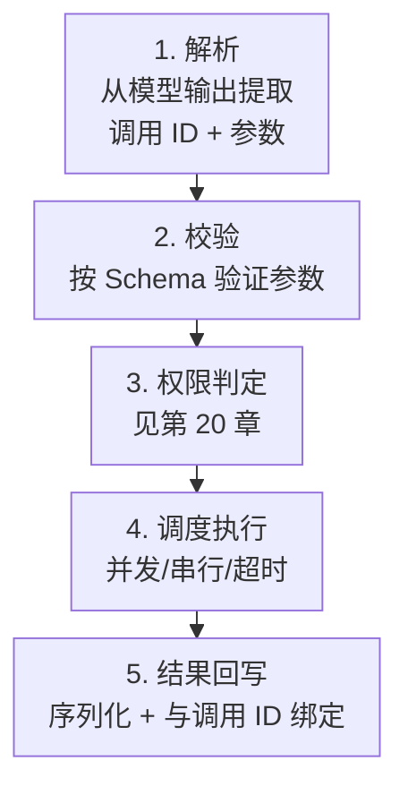

# 第十九章：Tool Registry、调用契约与执行管线

## 19.1 模型选中了工具，离执行还差什么？

还要确认它选的是哪个执行器、参数是否合法、当前身份是否有权调用，以及执行结果怎样回到原请求。两个服务器都暴露 `search` 时，名字相同并不能说明能力相同；一次超时也不能说明工具没有执行。本章从注册表走到结果回写，展开第 17 章的 `ToolExecution`。工具概念见第三章，协议结构见 [MCP 组件](../../tools/02-mcp/05-mcp-components.zh.md)。

## 19.2 Tool Registry：注册、发现与去重

Registry 是 harness 维护的"当前会话可用工具"的单一事实来源，至少要解决三个问题：

- **多来源合并**：内置工具、MCP Server 工具和宿主插件注册的工具统一进入 Registry。Skill 可以引用工具或附带脚本，但 `SKILL.md` 本身不是工具注册协议，仍需宿主适配执行器。
- **命名冲突与去重**：多个 MCP Server 可能提供同名工具（例如两个不同的 `search`），Registry 需要用命名空间前缀或显式路由规则消除歧义。前缀应绑定宿主配置中的服务身份；MCP 的 `serverInfo.name` 不保证跨服务器唯一，不能只信服务自报名称。
- **动态变化**：MCP 2026-07-28 中，`listChanged` 声明通知能力，客户端还要以 `toolsListChanged: true` 打开 `subscriptions/listen` 才接收列表变化通知。列表可随时间与请求授权变化，但不得随连接或连接上其他请求的副作用变化（Tools[【285】](../../book/references.zh.md#ref-285)）。缓存必须区分授权范围，收到通知后重新列举，不能跨租户复用私有工具列表。

规范对确定性顺序使用 **SHOULD**，有助于缓存但不是唯一变化检测机制。Registry 还应固定工具来源、Schema/描述版本及执行器映射；列表更新后重新做信任检查，审批过的调用不能悄悄改绑到新工具。

此处依据官方标记为 **Current** 的 2026-07-28 版本：已可使用，仍可接收向后兼容修改，不是 Draft，也不是已冻结的 Final。列表缓存还应遵循该版 `ttlMs` 与 `cacheScope`，不能仅用工具名推断缓存有效期。

## 19.3 调用契约：从 Tool Call 到 Tool Result 的接口

一次工具调用在 Harness 内部至少要关联调用 ID、工具名、经过校验的参数和执行状态。调用结束时回写与 ID 对应的内容及状态；超时则记录“结果未知”，不能补造成功。核心是**调用 ID 的双向可追溯**：由结果能找到请求，由请求能找到其处理进度。在要求调用/结果完整配对的模型接口中，缺失结果会造成非法消息序列；Harness 要先完成、拒绝或明确终止这些调用，再按接口规则继续，而不是悄悄丢掉它们。

## 19.4 执行管线的五个阶段

一次工具调用从被模型请求到结果写回上下文，要经过五个明确的阶段：

- **解析**：流式场景下需要等待参数 JSON 片段被完整拼接（呼应 17.5 节），提前解析会得到无效 JSON。
- **校验**：按工具声明的 `inputSchema` 校验参数类型、必填字段、取值范围，未通过校验的调用不应该进入执行阶段，而是直接构造一条"参数无效"的结果喂回模型，让模型有机会修正参数重试。
- **权限判定**：第 20 章的核心内容，决定这次调用是自动放行、需要人工审批还是直接拒绝。
- **调度执行**：真正运行工具逻辑，需要考虑并发度、超时和资源限制（19.5 节）。
- **结果回写**：把执行结果（或错误信息）序列化成模型能理解的格式，绑定回原调用 ID。

## 19.5 调度执行：并发、串行与超时

模型一次输出可能同时请求多个工具调用，harness 需要显式决定调度策略，而不是隐式地"能并发就并发"：

- **只读工具**（搜索、查询）通常可以安全并发执行；
- **有副作用且互相依赖的工具**（连续编辑同一个文件）需要串行执行，或者由 harness 检测到目标资源冲突后自动降级为串行；
- **每个工具调用应有独立的超时预算**，且这个超时应该嵌套在整个 Turn 乃至整个会话的更大预算之内（第 21 章 21.5 节展开分层超时的设计）；超时触发时应产出一个明确的"超时"错误结果，而不是让调用无限期挂起阻塞整个状态机。

OpenAI Agents SDK 的工具级 Guardrails 可以在配置了检查的 `FunctionTool` 执行前后插入业务规则（Guardrails[【549】](../../book/references.zh.md#ref-549)）。这不是对所有工具自动生效的总开关：托管工具、Handoff 及内置执行工具不一定经过同一管线，需核对覆盖范围。输出检查发生在执行之后，能阻止结果继续传播，却不能撤销已经产生的副作用。

## 19.6 结果回写与错误的一等公民地位

可恢复的工具业务错误应作为带调用 ID 的结构化结果回写；权限违规、预算耗尽或状态损坏则由 Runtime 决定停止。错误需区分“未执行”“执行失败”“结果未知”，特别是超时不证明远端没产生副作用。保留错误码、可重试性与脱敏摘要，不把凭据或整段内部堆栈送给模型。MCP 的协议错误与工具业务 `isError` 也不能混为一类。

## 19.7 动态工具集：降低固定开销的三种机制

第 18 章 18.5 节区分了工具定义的上下文占用、传输与计费。工程上有三类机制减少不必要的定义和结果进入模型：

- **渐进式披露**：第三章 3.5.3 节已讨论 Skill 的渐进式披露；工具层面的对应做法是只把当前任务相关的工具子集纳入本轮请求，其余工具保持"已注册但未装配"的状态，需要时再动态加入。
- **Code Execution with MCP**：让模型生成代码去调用工具，而不是把每个工具的完整 Schema 都塞进上下文——模型只需要知道有一个代码执行环境和一份 API 索引，具体的参数细节可以在执行时才按需读取（Anthropic: Code execution with MCP[【446】](../../book/references.zh.md#ref-446)；Cloudflare: Code Mode[【447】](../../book/references.zh.md#ref-447) 是同一思路的另一实现）。
- **检索式工具选择**：当工具数量达到成百上千时，用检索而不是全量枚举来决定本轮暴露哪些工具，RAG-MCP[【448】](../../book/references.zh.md#ref-448) 描述了这种思路应对"工具过多导致 Prompt 膨胀"问题的效果。

这三种机制的共同点是把"要不要把某个工具的完整定义放进这一轮上下文"从静态决策变成动态决策，本质上是第 18 章装配管线的一个可插拔组件。

## 19.8 常见错误

- **把校验顺序理解为所有系统都必须先解析业务参数。** 外层身份验证、请求大小与工具可见性可以先拒绝请求；对参数依赖的授权，应在无副作用的 Schema 校验和路径规范化后判定，并在执行时重新确认对象版本和权限。
- **结果回写时丢弃调用 ID 关联。** 在并发执行多个工具调用后，如果结果没有和原始调用 ID 严格绑定，就可能出现"结果对应错了工具调用"的错乱，这是第 17 章状态机能否正确推进的前提条件。
- **超时只设置在整个 Turn 层面，不设置到单个工具调用。** 会导致一个卡死的工具调用拖垮整个会话的响应时间，必须按 19.5 节做分层超时预算。
- **把所有工具调用都视为可以无脑并发。** 忽视资源竞争会引入第十三章 13.16 节讨论过的并发写入问题的单 Agent 版本。
- **只优化工具数量、不测缓存与漏召回。** 大而稳定的列表可能命中缓存；频繁变化的候选列表反而可能破坏前缀。动态工具集需要同时测召回、成功率、Token 与延迟。

## 19.9 本章总结

Registry 管理工具身份、定义版本与授权可见性，执行管线管理具体调用。并发前检查依赖和资源冲突，返回时保留调用 ID 与执行状态；“超时、结果未知”不能伪装成“未执行”。动态披露和代码执行优化的是上下文处理方式，不能绕过相同的权限、审计与幂等控制。

## 参考资料

<!-- centralized-bibliography -->
本章的参考资料、阅读建议与来源说明见[集中参考资料章节](../../book/references.zh.md#reading-agent-19)。
