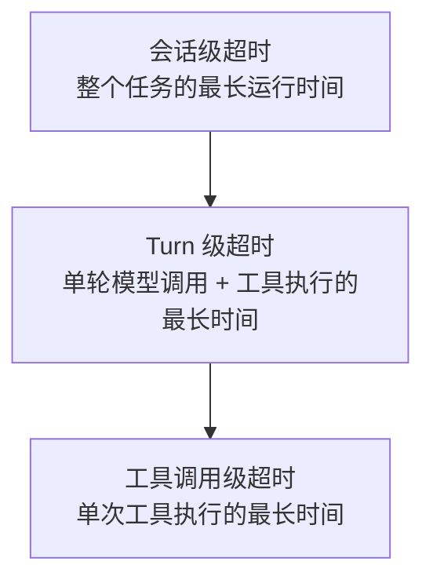

# 第二十一章：Checkpoint、持久化、重试、超时、幂等与恢复

## 21.1 本章边界：为什么"可恢复"比"能重跑"更重要

因为“再执行一次”不一定等于“接着做”。发邮件成功后，若响应在网络中丢失，Agent 看到的是超时，收件人却已经收到邮件；从头重跑可能再发一封。即使任务很短，也要根据副作用和恢复要求决定是否持久化，而不是仅按运行分钟数选择。本章让 checkpoint、重试、超时和幂等协同工作，区分已完成、未执行与结果未知，避免恢复时重复业务效果。

## 21.2 Checkpoint：保存什么、何时保存

Checkpoint 保存足以恢复某个执行边界的状态，可包含第 17.2 节的消息、待执行调用、阶段与预算，以及恢复所需的工件引用和版本。它不一定复制全部历史，更不会自动保存外部数据库、文件系统或远端服务的状态。

保存时机取决于允许重做多少工作：模型决策后、工具结果提交后，或明确的里程碑都是候选点。副作用调用还需要在执行前保存操作键，结果返回后再保存结论。框架可能按节点或 super-step 持久化，不是每个 token 或每次内部状态变化都落盘；内存型 checkpointer 也不能提供进程崩溃后的恢复。

## 21.3 持久化的两个层次

第七、八章已经区分过 Working Memory 与 Long-term Memory 在"内容"上的不同；本节从"持久化机制"的角度做同样的区分，二者需要用不同的存储策略实现：

| 层次 | 对应关系 | 典型实现 | 用途 |
|---|---|---|---|
| 线程内持久化（checkpoint） | 单次会话/单个任务 | LangGraph 的 Checkpointer——"持久化一个线程的图状态，用于短期的、线程范围内的记忆，包括对话连续性、人在环工作流、时间旅行、容错"([LangGraph: Persistence](https://docs.langchain.com/oss/python/langgraph/persistence)) | 支撑本章讨论的恢复能力 |
| 跨线程持久化（store） | 跨会话、跨任务 | LangGraph 的 Store——"持久化应用自定义的数据……用于长期的、跨线程的记忆" | 对应第七、八章的长期记忆存储 |

两者应分清数据模型、访问权限与保留策略，但可以共用 PostgreSQL 等物理存储。这里的“线程”是框架的会话标识，不是操作系统线程；短期记忆也可以长期持久化，跨线程 store 也可能频繁更新。

## 21.4 重试：哪些失败可以重试，哪些不能

不是所有失败都适合自动重试。区分标准是**失败是否是暂时性的、重试是否会产生副作用叠加**：

- **可考虑自动重试**：限流或瞬时基础设施故障，前提是操作可安全重发，遵循 `Retry-After`、退避、尝试次数和总时限。网络超时本身不能证明未执行，有副作用的调用需先查询状态或使用已持久化的幂等键。
- **不能原样盲目重试**：参数错误需要先修正；副作用结果未知时，先查状态或按业务幂等契约重发；任务确实不可行时，应解释缺失条件或交接。模型一句“做不到”也不是基础设施错误分类，仍要核对权限、信息与可用工具。

[Temporal 的默认行为](https://docs.temporal.io/encyclopedia/retry-policies)是 **Activity 自动重试，Workflow Execution 默认不重试**。业务需覆盖重试上限、不可重试错误与超时，不能假设未配置就不会重试；Workflow Task 的重试又是不同层次。自定义工具客户端常用带抖动的指数退避，第 $n$ 次等待可写为：

$$
t_n \sim \mathrm{Uniform}\left(0,\ \min\left(t_{max},\ t_0 \cdot 2^{n-1}\right)\right)
$$

其中 $t_0$ 是初始退避基数， $t_{max}$ 是等待上限。这是 full jitter 示例，不是 Temporal 默认策略；总等待还必须受剩余 deadline 约束。

## 21.5 超时：分层设置超时预算

第 19 章 19.5 节已提到"每个工具调用应有独立的超时预算，且应嵌套在更大预算之内"。完整的分层超时至少有三级：



子调用应继承父级剩余 deadline，实际可用时长不超过自身上限与父级剩余预算的较小值；仅把三个静态超时配置成递增仍不够。超时后明确记录状态，并尝试取消远端工作；取消是协作请求，不保证远端副作用已撤销。

## 21.6 幂等：让重试变得安全

幂等性要求同一逻辑操作重放不增加额外效果。常见做法是**执行前持久化操作键与参数摘要**，服务端原子记录该键的状态和结果，重复请求返回同一结果，参数变化则拒绝。还要处理并发重复、记录有效期、处理中状态及业务写入与去重记录的原子性；[Stripe 的幂等请求文档](https://docs.stripe.com/api/idempotent_requests)是具体 API 的参考，不是所有工具共有的保证。

**模型工具调用 ID、JSON-RPC 请求 ID 与业务幂等键不同。** 模型重新规划可能生成新调用 ID；MCP 多轮请求也可能要求新的 JSON-RPC ID。因此应另设稳定的逻辑操作键，并映射多次尝试。若服务不支持幂等或查询，结果未知时可能只能人工核对或执行补偿，不能宣称 checkpoint 带来了 exactly-once 副作用。

## 21.7 恢复会不会再次执行已经走过的代码？

可能会。恢复要保住的是已经确认的状态和业务效果，不是保证每行代码只运行一次。LangGraph 中断恢复会重新进入中断节点；Temporal 则可能重放 Workflow 代码，用历史结果重建决策。重放控制代码与重新执行外部操作是两件事。设计时尤其要区分：

- **"从中断点继续"不等于"从中断的那一行代码继续"。** 恢复重新进入的是状态机某个明确定义的状态（比如"上一次工具调用已完成，等待下一次模型调用"），而不是试图恢复到某个任意的程序计数器位置——这也是为什么 checkpoint 需要保存的是 17.2 节的显式状态字段，而不是整个进程的内存镜像。
- **checkpoint 与幂等必须配合，否则恢复本身可能重复执行副作用。** 工具已经执行但结果尚未持久化时崩溃，最近快照往往还显示“待执行”。恢复方不能据此断言从未执行；应按 21.6 节查询逻辑操作状态或使用同一幂等键重发。

### 21.7.1 区分失败恢复、审批恢复与新输入

**复用同一个 `thread_id`，不等于每次调用都在恢复失败任务。** 以已配置 checkpointer 的 LangGraph 为例，下面的 `config` 使用原线程 ID，且不指定历史 `checkpoint_id`：

| 当前情况 | 调用方式 | 含义 |
|---|---|---|
| 普通节点抛异常，排查后继续未完成工作 | `graph.invoke(None, config)` | 从最新检查点恢复，重新执行未完成的节点 |
| 节点通过 `interrupt()` 等待人工输入 | `graph.invoke(Command(resume=decision), config)` | 将外部决定传回中断；节点仍从头进入 |
| 用户提交新一轮消息或任务输入 | `graph.invoke(new_input, config)` | 向现有线程提交新输入，从图入口开始执行；不是故障恢复的替代写法 |

下面把订单 Agent 的只读工具阶段缩成“查订单 → 查物流”两个节点，用固定数据和一次模拟网络错误观察调用次数。安装 `langgraph==1.2.11` 后可直接运行，不需要模型 API 或业务服务。示例不配置节点自动重试，先让异常返回调用方，再显式恢复：

```python
from typing import TypedDict

from langgraph.checkpoint.memory import InMemorySaver
from langgraph.graph import END, START, StateGraph

class OrderState(TypedDict, total=False):
    order_id: str
    shipment_id: str
    delivery_status: str

calls = {"order": 0, "delivery": 0}

def lookup_order(state: OrderState) -> dict:
    calls["order"] += 1
    return {"shipment_id": f"S-{state['order_id']}"}

def lookup_delivery(state: OrderState) -> dict:
    calls["delivery"] += 1
    if calls["delivery"] == 1:
        raise ConnectionError("模拟物流服务暂时不可用")
    return {"delivery_status": f"{state['shipment_id']}：运输中"}

builder = StateGraph(OrderState)
builder.add_node("order", lookup_order)
builder.add_node("delivery", lookup_delivery)
builder.add_edge(START, "order")
builder.add_edge("order", "delivery")
builder.add_edge("delivery", END)

graph = builder.compile(checkpointer=InMemorySaver())
config = {"configurable": {"thread_id": "order-demo"}}
try:
    graph.invoke({"order_id": "A100"}, config)
except ConnectionError:
    pass  # 仅捕获本例的模拟故障，保留检查点供后续恢复。

print(graph.get_state(config).next)  # ('delivery',)
result = graph.invoke(None, config)
print(calls)                      # {'order': 1, 'delivery': 2}
print(result["delivery_status"])   # S-A100：运输中
```

订单节点的结果已进入检查点，所以恢复只重跑物流节点。若从头运行示例，并把恢复那一行改成再次传入 `{"order_id": "A100"}`，调用次数会变成 `{'order': 2, 'delivery': 2}`：相同输入被当成新输入，已完成的订单查询也重新执行了。重新提交消息时，追加型 reducer 还可能把同一条消息再次写入状态，不能把重新提交当作通用重试按钮。

`InMemorySaver` 和调用计数只用于同一进程内观察；进程重启后恢复需要持久化 checkpointer。失败节点在抛错前产生的外部副作用，也不会因为传入 `None` 就被撤销或自动去重，仍需按 21.6 节处理。人工审批的身份、参数绑定与恢复校验见[第二十二章](22-human-in-the-loop-and-interruption.md)。

## 21.8 常见反模式与检查清单

- **只在任务结束时写 checkpoint。** 等于没有恢复能力，任务运行到一半崩溃就必须从零开始。
- **把"加了 Checkpointer"等同于"不会重复执行"。** 这是[第十章（LangGraph 章）10.11.5 节](../../frameworks/01-langchain/04-langgraph/10-langgraph-advantages.md)专门点出的常见误区，checkpoint 只保证状态能恢复，不自动保证恢复过程不产生重复副作用，幂等仍需要单独设计。
- **重试策略不区分失败类型，一律重试或一律不重试。** 应按 21.4 节的标准显式分类。
- **超时只设一层。** 会导致局部卡死拖垮全局，必须按 21.5 节分层设置。
- **每次尝试生成新幂等键。** 同一逻辑操作必须复用已持久化的业务键；只有能证明调用 ID 在所有恢复路径中稳定且符合服务约定时，才可复用它。

## 21.9 本章总结

Checkpoint 保存执行状态，不自动保存外部世界，也不保证副作用只执行一次。恢复需要稳定的逻辑操作键、明确的未知状态和受 deadline 约束的重试。会话 checkpoint 与跨会话记忆要分清语义，但可共用底层数据库。

## 参考资料

- [LangGraph: Persistence](https://docs.langchain.com/oss/python/langgraph/persistence)
- [LangGraph: Checkpointers](https://docs.langchain.com/oss/python/langgraph/checkpointers)：检查点、线程状态与已完成节点结果的恢复。
- [LangGraph: Interrupts](https://docs.langchain.com/oss/python/langgraph/interrupts)：恢复时重新进入节点，节点内中断之前的代码会再次执行。
- [LangGraph: Fault tolerance](https://docs.langchain.com/oss/python/langgraph/fault-tolerance)
- [Temporal: Retry Policies](https://docs.temporal.io/encyclopedia/retry-policies)
- [Stripe: Idempotent requests](https://docs.stripe.com/api/idempotent_requests)
- [LangGraph 第十章：LangGraph 的核心优势](../../frameworks/01-langchain/04-langgraph/10-langgraph-advantages.md)

第 21.7.1 节示例于 2026-09-15 在 Python 3.13.14、LangGraph 1.2.11 下运行验证；分别对照了传入 `None` 恢复和重新提交原输入的调用次数。
