# 第十章：Agent 记忆与上下文压缩

本章讨论应用层上下文管理；JSON、时间、数量与预算均为教学示例，不是生产配置或实测结果。

## 10.1 为什么需要记忆压缩

上下文太长时，能不能直接总结一下再继续？可以，但要先区分两类信息：精确状态不能靠自由摘要维持，历史叙述则可以在保留证据入口的前提下压缩。例如，“付款结果未知，不要重试”应留在状态与约束中，不能变成一句“付款遇到问题”。

Agent 在长任务中会持续产生：

- 用户与模型消息；
- Tool Call 与 Tool Result；
- 计划和状态；
- 搜索文档；
- 代码、日志和表格；
- 中间结论；
- 错误与重试记录。

如果将所有内容不断追加到 Context，可能遇到：

- 超出模型 Context Window；
- 输入 Token 成本增加；
- Prefill（生成前处理输入）的开销增加，实际延迟还取决于缓存和服务实现；
- 关键信息被噪音稀释；
- 模型更难找到当前目标；
- 旧错误和无关信息持续影响后续决策。

记忆压缩不是单纯把文本变短，更重要的是：

> **在有限 Token Budget 内，尽可能保留完成当前任务所需的信息。**

长窗口能容纳更多内容，但不能保证每项证据都被正确使用；反过来，短上下文也不天然更准确。删除必要的原文、多跳证据或反例会降低质量，应以具体模型和任务的对照实验选择压缩强度，而不是假设“越短越好”。

写成一个简单目标函数，就是：

$$
J(C)=U(C)-\lambda L(C)
$$

并满足：

$$
L(C)\le B
$$

其中：

- `C` 是压缩后的 Context；
- `U(C)` 是保留信息对当前任务的效用；
- `L(C)` 是 Context 长度；
- `B` 是可用 Token Budget；
- `λ` 表示长度成本权重。

这是设计目标的示意，不是可以直接计算出最优摘要的算法。`U(C)` 通常只能由下游任务表现近似评估，授权范围、必需证据及消息协议应先作为硬约束；高效用不能抵消违规。

## 10.2 四类基础方法

四种常见方法解决的是不同问题：

| 方法 | 解决的问题 | 核心动作 | 是否有损 |
|---|---|---|---:|
| Sliding Window | 历史太长，保留哪一段 | 删除最早内容 | 是 |
| Summarization | 历史太长，如何提炼 | 用摘要替换原文 | 是 |
| Importance Filtering | 信息价值不同，保留什么 | 按任务价值选择 | 通常是 |
| Structured Extraction | 对话文本是否是最佳表示 | 转换为结构化状态 | 一般有损；仅对完整可逆表示例外 |

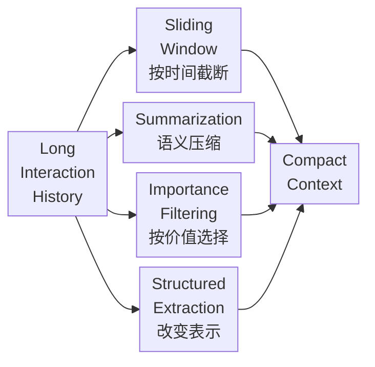

这四种方法通常组合使用，而不是互相替代。

外部化是把内容搬出活跃 Context，不一定减少总存储；从窗口移除也不等于从记忆库删除。应用层摘要、服务端 compaction、KV Cache 量化/淘汰分别改变文本表示、服务托管上下文或推理状态，不应统称为同一种“记忆压缩”。

## 10.3 Sliding Window：按时间截断

Sliding Window 只在活跃 Context 保留最近若干轮或若干 Token，移除更早内容；是否删除持久化原记录由另一套保留策略决定。

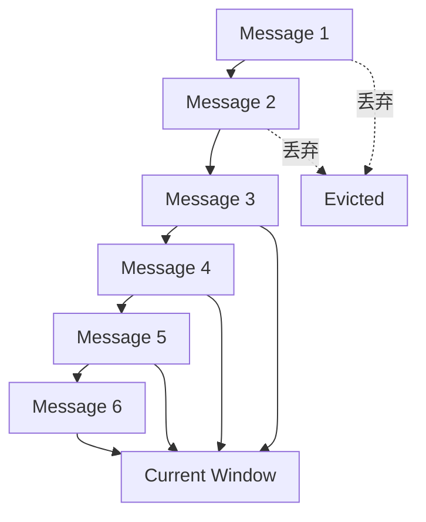

### 10.3.1 常见实现

#### 按消息轮数

只保留最近 `N` 轮对话。

优点：

- 实现简单；
- 速度快；
- 行为容易预测。

缺点：

- 不同消息长度差异很大；
- 不能精确控制 Token。

#### 按 Token 数

从最新消息向前装入，直到达到预算。

优点：

- 能控制模型输入大小；
- 更适合不同长度的消息。

缺点：

- 仍然只按时间，不考虑价值；
- 可能删除早期关键约束。

#### 按任务阶段

保留当前阶段的详细记录，将已完成阶段移出活跃窗口。

如果阶段之间的交接边界清楚，这比按轮数截断更容易保留完整过程。不过，“阶段完成”不代表其中证据再也无用；下一阶段依赖的结论、失败路径和来源仍要保留或能按需取回。

### 10.3.2 不能被普通窗口淘汰的信息

以下内容通常需要 Pin：

- System Instructions；
- 用户当前目标；
- 安全和权限规则；
- 成功标准；
- 当前计划和状态；
- 未解决问题；
- 高风险操作约束。

Pin 的是当前仍有效的受信内容，不是永久固定历史文本。用户改了目标或权限已撤销，应更新或撤销相应项；权限判断始终由运行时执行，不能只依靠上下文中的一句规则。若必需项本身超过预算，应拆分任务或停止请求，而不是静默截断。

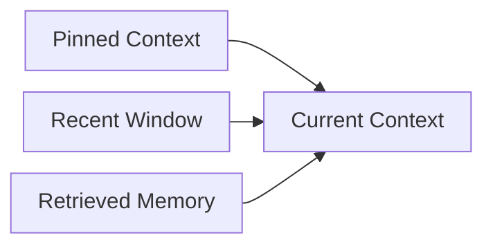

### 10.3.3 不要切断 Tool 交互

Tool Call 和对应 Tool Result 应视为一个逻辑单元。只保留调用、不保留结果，或只保留结果、不保留调用，都可能破坏上下文。

还可能直接违反 API 的消息格式要求。并行调用要核对各个 call ID 与结果；未完成调用不能伪造为成功结果。某些 API 还要求保留特定 continuation/reasoning item，应遵循其协议。需要裁剪时，可整体移除已完成交互并保存摘要/引用，而不是留下悬空的 tool result。

同样需要避免切断：

- 用户问题与 Agent 回答；
- 错误与对应修复；
- 计划步骤与执行结果；
- 引用与其支持的结论。

### 10.3.4 Sliding Window 的适用场景

- 最近内容明显比早期内容重要；
- 对话任务短；
- 可以从外部 State 恢复关键信息；
- 需要低成本、低延迟压缩。

它是截断策略，不是理解策略。

## 10.4 Summarization：用摘要替换历史

Summarization 在删除早期历史前，先提取重要信息形成更短表示。

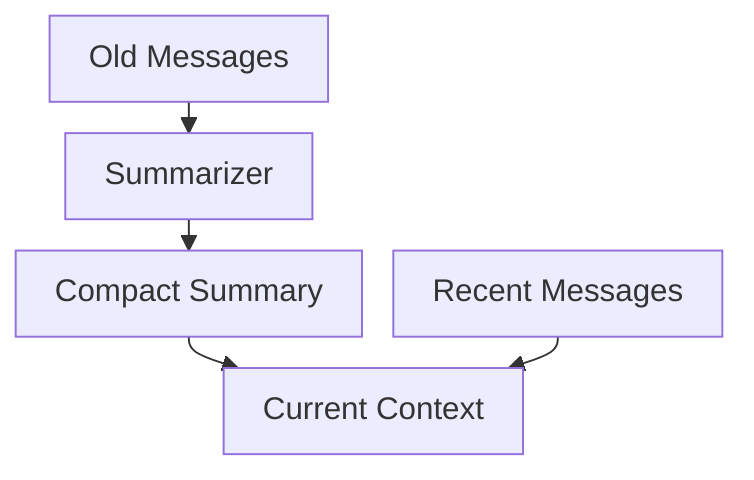

### 10.4.1 Rolling Summary

维护一个持续更新的摘要：

```text
new_summary = summarize(old_summary + newly_evicted_messages)
```

优点：

- 实现简单；
- 可通过输出预算约束摘要长度；
- 适合连续对话。

风险：

- 多次重写会产生 Summary Drift；
- 早期细节可能逐渐丢失；
- 模型生成的错误可能进入后续摘要。

例如原文是“测试超时，支付结果未知，不要重试”，摘要变成“支付失败，可以重试”，既丢了不确定性，也反转了操作约束。后续再摘要不会自动恢复这些信息，必须回到原始事件或权威业务状态核对。

### 10.4.2 Hierarchical Summary

先生成局部摘要，再合并成阶段或任务摘要：

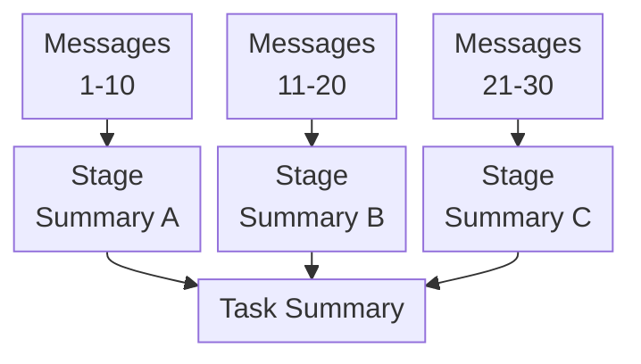

它比不断重写同一个摘要更容易：

- 保留来源；
- 定位丢失信息；
- 按阶段展开；
- 支持长周期任务。

### 10.4.3 Query-focused Summary

摘要只保留与当前任务或阶段相关的信息。

例如，Agent 从“资料收集”进入“报告撰写”阶段时，可以重点保留：

- 已验证事实；
- 来源；
- 比较结论；
- 未解决冲突。

不再保留每一次搜索尝试的详细过程。

但应保留已排除路径及排除理由的简记，避免下一阶段重复失败搜索。任务切换后重新评估摘要，不能把针对旧问题生成的摘要当作通用知识索引。

### 10.4.4 Event Summary

按关键事件总结：

- 决策；
- Tool 成功或失败；
- 计划变化；
- 用户确认；
- 发现的新约束。

### 10.4.5 高质量摘要应保留什么

- 原始目标；
- 用户明确约束；
- 已完成和未完成步骤；
- 关键事实；
- 重要 Tool 结果；
- 决策及依据；
- 错误与恢复状态；
- 来源和 Artifact 引用。

### 10.4.6 Summary Drift

多轮摘要可能发生：

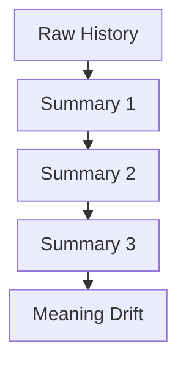

缓解方式：

- 保存原始历史或 Artifact；
- 摘要附带来源引用；
- 不重复总结稳定结构化字段；
- 周期性从原始数据重新生成摘要；
- 对目标、权限和数字使用结构化状态；
- 使用 Verifier 检查遗漏和矛盾。

Verifier 也可能漏判，尤其当它与摘要器只读取同一份有缺陷的摘要时。需要把摘要和原始证据对照，精确核验 ID、数字、否定、时间范围及状态；对丢失项重新取回原文。引用还应带来源事件、版本或内容哈希，只有 URL 而网页已变化时，不能恢复当时证据。

摘要是派生数据，权限通常不能宽于其所含来源的共同可读范围；若需要扩大读者范围，应经过独立脱敏与发布审核。来源被撤回、删除或替代后，要失效或重建依赖它的摘要，而不是只删向量记录。

## 10.5 Importance Filtering：按价值选择

时间顺序不代表信息价值。用户第一轮给出的安全约束，可能比最近十轮普通消息更重要。

Importance Filtering 根据当前任务选择应保留的内容。

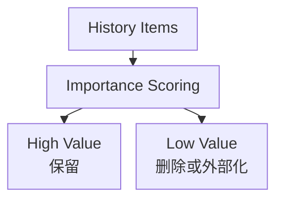

### 10.5.1 重要性信号

- 与当前目标的相关性；
- 是否为用户明确约束；
- 是否影响安全和权限；
- 是否是未解决问题；
- 是否被后续任务依赖；
- 来源可信度；
- 是否包含独特信息；
- 时间新鲜度；
- 是否能从外部系统重新获取。

可以用一个基础效用分数表示：

$$
U_i=\alpha R_i+\beta I_i+\gamma D_i+\delta T_i+\epsilon N_i-\zeta C_i
$$

其中：

- `Rᵢ`：Goal Relevance；
- `Iᵢ`：Importance；
- `Dᵢ`：Dependency Value；
- `Tᵢ`：Trust；
- `Nᵢ`：Novelty；
- `Cᵢ`：Token Cost。

这些分量需要在任务样本上校准，公式并不意味着有现成准确的“重要性分数”。同一信息在不同问题下价值不同：摘要中的结论可用于概览，财务核对却可能必须读取整行账目和单位。

### 10.5.2 Hard Rules 与 Model Scoring

不应让模型独自决定所有信息的重要性。

#### Hard Rules

必须保留：

- System Instructions；
- 安全策略；
- 用户明确目标；
- 权限；
- 当前任务状态；
- 尚未解决的错误。

#### Model Scoring

可以用于：

- 判断历史事实与当前阶段的相关性；
- 选择代表性 Episode；
- 从重复 Tool 结果中提取重点。

### 10.5.3 Importance Filtering 的风险

- 模型错误删除真正重要的信息；
- 当前看似无关的信息之后可能变得重要；
- 重要性评分受当前 Prompt 偏置；
- 恶意内容可能伪装成高优先级指令。

因此，仍有合法用途的原文可按保留政策外部化，支持后续取回；敏感或未授权内容不能借“以后可能有用”永久保存。

## 10.6 Structured Extraction：改变信息表示

自然语言对话通常冗长、重复且难以精确更新。Structured Extraction 将历史转换为高密度状态。

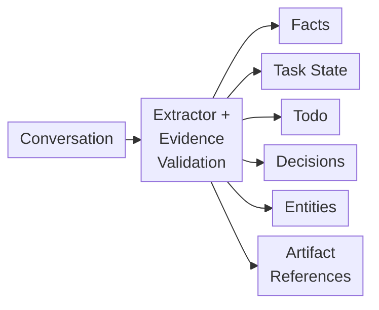

### 10.6.1 示例

原始对话：

```text
用户：不要创建 PR，直接把后续章节提交到 main。
Agent：明白，后续直接提交到 main。
```

结构化后：

```json
{
  "subject": "user-42",
  "repository": "example/knowledge-base",
  "publishing_preference": {
    "target_branch": "main",
    "create_pull_request": false
  },
  "source": "explicit_user_instruction",
  "source_event_id": "event-example",
  "verification_status": "user_stated",
  "scope": "current_repository"
}
```

结构化表示：

- 对冗长重复对话可能减少 Token，短句转 JSON 反而可能更长；
- 更容易精确更新；
- 更适合规则执行；
- 更容易检测冲突；
- 验证后可以按字段查询，不必每次重新解释整段对话。

抽取本身仍可能误读。“用户偏好直接提交”不能变成绕过分支保护的权限。这里只有数据表示变化，没有发生发布，也没有证明用户拥有发布权限。

### 10.6.2 适合抽取的内容

#### Task State

```json
{
  "goal": "完成 Agent 知识图谱",
  "current_chapter": 10,
  "status": "writing",
  "pending": [
    "validate formatting",
    "publish to main"
  ]
}
```

#### Decisions

```json
{
  "decision": "Use GitHub-Flavored Markdown",
  "reason": "章节需要标题、列表、链接和代码块",
  "status": "active"
}
```

#### Open Questions

```json
{
  "question": "Should the next chapter cover evaluation?",
  "owner": "user",
  "status": "open"
}
```

#### Entity Facts

```json
{
  "subject": "user",
  "predicate": "preferred_formula_format",
  "object": "GitHub-compatible LaTeX"
}
```

### 10.6.3 Structured Extraction 的风险

- Schema 设计遗漏信息；
- 模型抽取错误；
- 难以表达模糊和不确定内容；
- 结构化字段可能失去原始语境；
- Schema 版本变化需要迁移。

因此，应保留来源引用，并允许在需要时返回原文。

Schema 合法只证明字段形状正确，不证明内容真实。运行状态应由执行器及工具确认结果更新；模型可提出补丁，但不能仅从“我准备执行”抽取出 `completed`。含糊的声明应保留 `unknown`、适用范围和原话，不能强行填成确定事实。

## 10.7 四种方法如何组合

工程上通常把这几种方法串起来用：

分离历史前，先保护约束并提取状态。

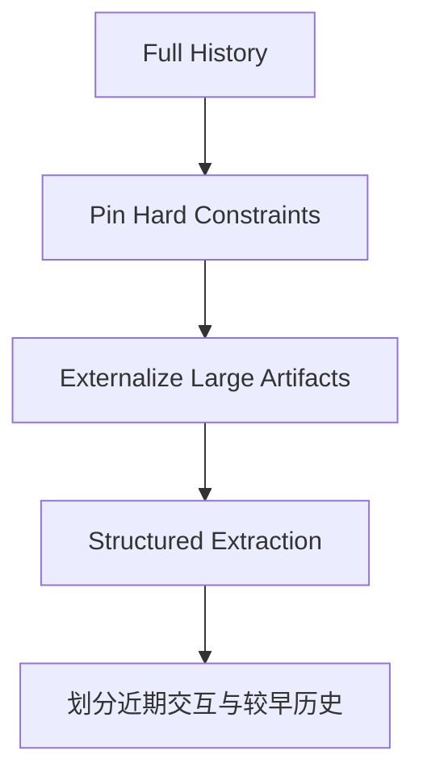

较早与近期交互沿不同路径汇入同一装配器。

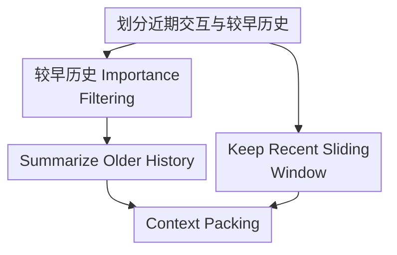

受保护的信息也直接进入该装配器。

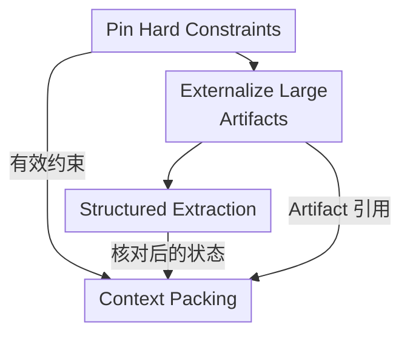

图中的并行入口很重要：当前约束、结构化状态与 Artifact 引用直接参与装箱，不必先经过历史摘要器。历史摘要负责补充背景，不能成为恢复精确状态的唯一来源。

一种常见 Context 结构是：

```text
1. System and safety instructions
2. Current goal and acceptance criteria
3. Structured task state
4. Important long-term memories
5. Summary of earlier stages
6. Recent message window
7. Current Tool results
```

输出预算是请求配置和容量预留，不是要在 Prompt 中写入的一段文字。上述序号是组织示例，不是模型指令优先级；历史摘要与召回数据不能因放在前面就获得系统指令权限。

各方法分工如下：

- Sliding Window 保留近期细节；
- Summary 保留早期整体语义；
- Importance Filtering 保留跨时间的关键内容；
- Structured Extraction 保留精确状态和事实；
- External Artifact 保存大体积原始数据。

## 10.8 额外方法：Deduplication

Agent 常产生大量重复内容：

- 多轮重复说明目标；
- 搜索结果重复引用同一网页；
- Tool 重试返回相同错误；
- 多个 Agent 生成相似结论。

Deduplication 可以：

- 使用内容哈希删除完全重复；
- 使用 Embedding 识别近似重复；
- 合并同一实体的相同事实；
- 将重复来源折叠为引用列表。

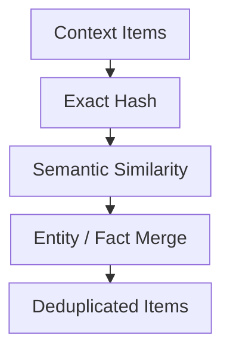

去重时应避免误删：

- 来自不同可信来源的相同结论；
- 看似相似但时间不同的事件；
- 数字不同的近似句子；
- 正向与否定表达。

同一错误发生多次还可能说明故障持续，不能去重后丢掉发生次数和时间跨度。多个来源相同结论若都转载自同一原文，只能保留一条来源链，不能当作独立佐证。

## 10.9 额外方法：Externalization

Externalization 将大内容移出 Context，只保留摘要和引用。

适合：

- 长文档；
- 代码库；
- 日志；
- 搜索结果；
- 表格；
- 图片和多模态数据；
- 已完成阶段的详细轨迹。

```json
{
  "artifact_id": "tool-result-123",
  "uri": "artifact://tool-result-123.json",
  "summary": "包含 200 条搜索结果，已筛选 12 条高可信来源",
  "content_hash": "sha256:...",
  "schema": "search-results"
}
```

需要时通过 Tool 按片段重新读取。

这种方法不是删除信息，而是将“始终在 Context 中”改为“按需加载”。

前提是引用可解析、有版本、未过期，且 Agent 有可用的读取工具。URI 和哈希不包含原文；对象已删、权限撤销、链接过期或检索失败时，恢复就不成立。按片段读取应返回位置、范围及是否截断，并在工具端鉴权；摘要泄露敏感结论也属于泄露，不能只保护原始对象。

## 10.10 额外方法：Hierarchical Memory

分层记忆同时保留不同粒度：

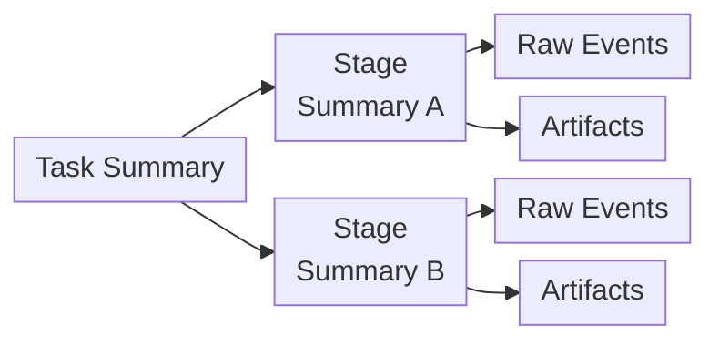

Agent 先读取 Task Summary；只有需要细节时，才展开 Stage Summary 或 Raw Event。

这是一种 Progressive Disclosure，可能减少无关上下文，但会增加检索轮次和遗漏风险。概要若没提到关键细节，Agent 可能不会展开正确分支，因此要保留直接检索原文的路径，并测量端到端延迟。

## 10.11 额外方法：Delta 与 State Compaction

对持续变化的状态，不需要每次保存完整副本。

例如计划更新：

```json
{
  "operation": "mark_completed",
  "task_id": "research-a",
  "timestamp": "2026-08-28T16:00:00Z"
}
```

系统可以：

- 用 Delta 记录变化；
- 周期性生成 Snapshot；
- 从 Snapshot + Delta 恢复当前状态。

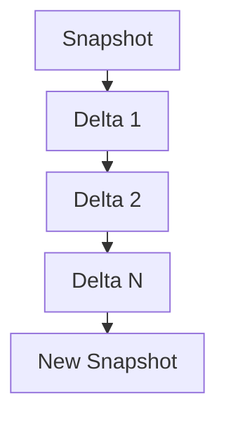

这种方法主要减少状态存储和传输，不等同于自然语言摘要。

恢复要有确定的事件顺序、稳定事件 ID、状态版本和幂等应用规则，且 Snapshot 与已纳入的日志位点一致。不能只凭时间戳推断所有并发事件的先后。事件回放也不应重新执行付款、发信等副作用；已发生的外部效果需要独立的执行记录与核对。

## 10.12 压缩触发时机

### 10.12.1 Token 阈值

当 Context 使用量接近预算时触发。

不应等到窗口完全耗尽，因为还需要为以下内容保留空间：

- 新 Tool Result；
- 模型输出；
- 错误恢复；
- 用户追加信息。

### 10.12.2 阶段切换

一个里程碑完成后：

- 生成阶段摘要；
- 提取结构化状态；
- 外部化 Artifact；
- 清理阶段内临时消息。

### 10.12.3 Tool Result 过大

大型 Tool 输出应立即外部化，而不是先塞入完整 Context 再压缩。

### 10.12.4 Checkpoint

任务暂停或转交 Agent 时可生成压缩交接信息，但保存 checkpoint 不应以 LLM 摘要成功为前提。先可靠保存精确状态、事件位点和工具结果，再异步生成可替换的摘要，避免压缩失败时连恢复点一起丢失。

### 10.12.5 Context 质量下降

即使尚未接近长度上限，如果出现：

- 目标被遗忘；
- 重复动作；
- 无关历史持续干扰；
- Tool 选择变差；

也应重新构建 Context。

这些只是诊断信号，也可能来自错误工具或不准确计划，不能一律归咎于上下文太长。重构失败时应保留旧状态与失败原因，回退到原文选择或分阶段执行，而不是继续基于不完整摘要行动。

## 10.13 Token Budget 分配

总 Context Budget 不应全部用于历史：

$$
B_{total}=
B_{instruction}
+B_{goal}
+B_{state}
+B_{memory}
+B_{recent}
+B_{tool}
+B_{output}
$$

其中：

- `B_instruction`：系统、安全和工具说明；
- `B_goal`：目标与成功标准；
- `B_state`：结构化状态；
- `B_memory`：长期记忆；
- `B_recent`：最近消息；
- `B_tool`：当前 Tool 结果；
- `B_output`：模型输出预留。

上式是预算分账示意：先确定该模型 API 的容量口径，再分配输入、输出与安全余量。某些推理模型还将推理 Token 计入输出额度或共享窗口；工具 Schema、图片/音频表示、消息封装也会消耗容量。应以实际 tokenizer 或服务端计数为准，不能按字符数估计后当作硬保证。

`B_total` 是实际分配的预算，不必等于模型公布的最大窗口；未分配的容量用于计数误差和恢复余量。计入工具 Schema 等开销后若必需内容仍装不下，应分阶段执行，而不是继续压缩精确 ID 或未决状态来凑长度。

设压缩触发阈值时，应预留最大可接受工具结果和下一轮输出，而不采用通用的“使用到某个百分比再压缩”。工具结果无上限时，应先限制、分页或外部化，避免一条响应挤爆窗口。

预算应随任务阶段动态调整。例如：

- 搜索阶段给 Tool Result 更多空间；
- 写作阶段给 Evidence 和 Outline 更多空间；
- 调试阶段给错误日志和代码更多空间。

## 10.14 Prompt Caching 是什么

> Prompt Caching 处理的是跨请求的前缀计算复用，不直接缓存 Embedding 或向量索引；与 RAG 入库时上下文增强的关系，见[RAG：语义被切断怎么办](../../rag/02-ingestion-indexing/05-semantic-truncation.zh.md)。

Prompt Caching 缓存重复 Prompt 前缀的中间计算结果，使后续请求可以复用。

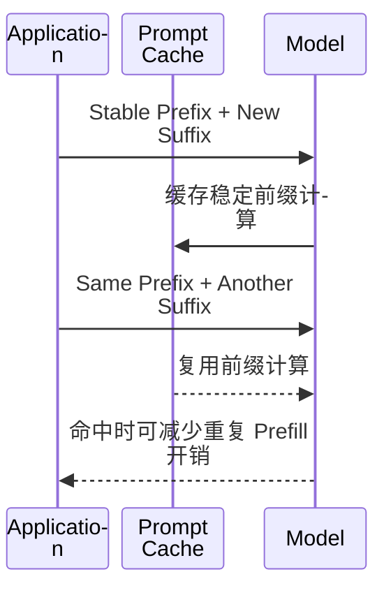

适合缓存：

- 长 System Prompt；
- Tool Definitions；
- 稳定项目说明；
- 大段重复文档；
- 多轮共享的固定前缀。

## 10.15 Prompt Caching 与记忆压缩的区别

| 维度 | Memory Compression | Prompt Caching |
|---|---|---|
| 优化层次 | 信息层 | 计算层 |
| 核心问题 | 带哪些信息进入 Context | 重复 Context 如何少算一次 |
| 是否减少 Context 长度 | 目标是减少；需实测，结构化后也可能更长 | 否 |
| 是否改变信息内容 | 可能改变或删除 | 不改变 |
| 是否释放 Context Window | 只有实际减少输入 Token 时才释放 | 否 |
| 是否降低重复 Prefill 成本 | 可能间接降低，需计入压缩本身成本 | 命中时可降低重复计算，总费用取决于写入和读取规则 |
| 是否解决噪音问题 | 可能减少噪音，也可能误删证据 | 否 |

这里最容易被误解的是：

> **Prompt Caching 通常不会让 Context Window 变大，缓存 Token 仍属于模型输入上下文。**

即使缓存命中，模型仍然“看到”相同内容，只是服务端可能复用计算，从而降低成本或延迟。

## 10.16 Prompt Caching 与压缩如何配合

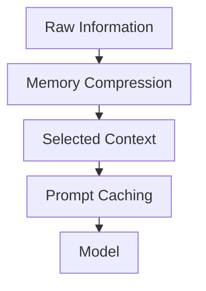

实践里通常先做两步：

1. 先决定哪些信息真正需要进入 Context；
2. 再对其中稳定、重复的前缀使用 Prompt Caching。

例如：

- System Instructions 和 Tool Definitions：适合缓存；
- 当前任务状态：需要压缩和动态更新；
- 旧对话：需要摘要或过滤；
- 大型 Artifact：需要外部化和按需检索。

不要只比较“本轮输入少了多少”。如果摘要花费超过后续调用节省的费用，或频繁重写摘要使稳定前缀失效，总成本反而可能上升。可以先测一次压缩的成本，再看剩余任务预计会复用多少轮；任务快结束时，简单裁剪往往更值得作为对照。

## 10.17 Prompt Caching 的限制

- 对这里讨论的前缀缓存，要求可复用前缀精确匹配，而不是语义相似或“高度一致”；
- 缓存有生命周期；
- 不同模型或配置可能不能共享；
- 动态内容放在前缀中会降低命中率；
- 不能消除 Context 中的错误和噪音；
- 不能替代权限过滤；
- 不能替代长期记忆；
- 具体费用和缓存规则由模型服务商决定。

Prompt 设计时通常将稳定内容放在前面，动态内容放在后面，以提高缓存复用。

OpenAI 官方文档<sup>[【80】](../../book/references.zh.md#ref-80)</sup>说明，需匹配实际渲染的前缀；模型、工具 Schema、顺序及相关设置变化都可能改变可复用部分。缓存最低长度、断点方式、写入费用和保留时间依模型与服务版本而异，不能把某个型号的数字推广为统一规则。

频繁改写前面的摘要可能使后续缓存失效，压缩调用自身也有成本。对照总账单和首 Token 延迟，分别测量冷缓存、热缓存及压缩后的请求；不要为了缓存命中继续发送失效权限或过期敏感数据。

## 10.18 KV Cache 与 Prompt Caching

KV Cache 是 Transformer 推理中缓存 Attention Key/Value 状态的底层机制。

Prompt Caching 是模型服务对应用暴露的跨请求复用能力，底层可能利用 KV 或其他缓存实现。

| KV Cache | Prompt Caching |
|---|---|
| 模型推理内部机制 | 服务或 API 产品能力 |
| 常用于一次生成过程 | 通常跨请求复用前缀 |
| 开发者未必直接控制 | 开发者可以通过 Prompt 结构优化命中 |

两者都属于计算优化，不属于语义记忆压缩。

但 KV Cache 的量化、淘汰、卸载又是另一组推理系统技术，它们可能改变精度、显存与延迟，并不等价于生成可审计摘要。应用若只使用托管 API，不应假定能操作这些底层状态。

### 10.18.1 服务端 Compaction 也不等于 Prompt Cache

OpenAI Responses 的 Compaction<sup>[【495】](../../book/references.zh.md#ref-495)</sup>会产生不透明的加密 compaction item，供后续请求继续使用。这是缩减后续 Context 的服务能力，不是仅复用前缀计算，也不能假定其内部就是可读的自然语言摘要。

要区分两条接口路径：

- **显式调用 `/responses/compact`**：提交的窗口必须仍能装入所用模型。返回值是新的完整压缩窗口，除了 compaction item，还可能保留其他消息；应整体作为后续请求的基础，不能只取出加密 item 就丢弃其余输出。
- **在 `/responses` 中启用服务端自动压缩**：由服务端按配置阈值触发。无状态数组续接和 `previous_response_id` 续接有不同的历史传递规则，不能混用手工裁剪逻辑。

应用不应解析或改写加密 item；模型支持范围及服务端状态保留选项需查对应接口文档。这两种方式都不能替代应用自己的任务状态、事实来源、权限及删除管理，也不能当成跨供应商可移植的审计记录。

## 10.19 压缩质量怎么评估

### 10.19.1 Compression Ratio

$$
CR=1-\frac{L_{after}}{L_{before}}
$$

这里将 `CR` 定义为 Token 减少率，要求 `L_before` 为正；若摘要或 JSON 比原文更长，`CR` 会为负，不能把它报告成节省。其他资料可能将压缩比定义为 `L_before / L_after`，报告时必须注明口径。

计数应使用同一 tokenizer、相同内容边界。这个指标只描述当前上下文缩短了多少；若要声称端到端节省，还必须计入摘要生成、外部化后重新读取和额外模型调用的费用。

压缩比例高不代表质量高。如果关键约束被删除，再短也没有价值。

### 10.19.2 Constraint Retention

检查：

- 用户目标；
- 安全规则；
- 验收条件；
- 未解决问题；
- 关键数字和实体；

是否仍然保留。

### 10.19.3 State Accuracy

压缩后的状态是否准确反映：

- 已完成步骤；
- 当前步骤；
- 待执行步骤；
- 错误和重试；
- Artifact。

### 10.19.4 Task Success

比较压缩前后：

- 任务成功率；
- Tool 选择正确率；
- 重复调用；
- 幻觉率；
- 成本和延迟。

### 10.19.5 Recoverability

Agent 能否从压缩后的 Context 和外部 State：

- 恢复任务；
- 解释已完成内容；
- 找到原始证据；
- 继续下一步。

## 10.20 压缩测试方法

### 10.20.1 Needle Test

在长历史中放入关键约束，检查压缩后是否保留并正确使用。

单个 needle 测试不足以证明长程推理能力，还要覆盖多个相关证据、干扰项、时间更新、否定和没有答案的情况。

### 10.20.2 Replay Test

从 Checkpoint 和压缩 Context 恢复 Agent，观察能否继续任务。

分别在“工具执行前”“执行后但状态落盘前”“摘要生成中”中断；断言不会重复副作用、不会把未知结果改为成功、不会读取已撤销权限的 Artifact。恢复正确性应检查实际状态，不只检查回答文本。

### 10.20.3 Differential Test

使用完整历史和压缩历史分别执行相同任务，比较结果差异。

完整历史必须能装入模型，并说明是否发生服务端裁剪；它是基线，不是正确答案。再加入无记忆、近期窗口、直接提供人工标注证据的对照，固定模型版本及任务分布，多次运行并报告波动。除了最终正确率，还统计约束保留、证据可追溯性和压缩造成的退化。

### 10.20.4 Adversarial Test

测试：

- 早期安全约束；
- 后期冲突指令；
- 重复噪音；
- 恶意 Prompt Injection；
- 关键数字和否定关系。

### 10.20.5 Long-horizon Test

让 Agent 执行几十或上百步，检查：

- Summary Drift；
- 目标遗忘；
- 状态错乱；
- 重复动作；
- Artifact 丢失。

测试步数来自业务轨迹分布，不是可靠性的统一门槛。要记录累计压缩次数，检查远期信息是否逐轮丢失；总成本应包含摘要生成、写入索引、额外检索和恢复调用。

公开数据可以参考 LoCoMo<sup>[【481】](../../book/references.zh.md#ref-481)</sup> 的事件摘要与问答、LongMemEval<sup>[【480】](../../book/references.zh.md#ref-480)</sup> 的知识更新与弃答，以及 LongMemEval-V2<sup>[【482】](../../book/references.zh.md#ref-482)</sup> 的轨迹经验检索。它们不直接验证你自己的 checkpoint、ACL 或副作用恢复；固定数据版本，按会话/轨迹分组统计，避免把相关问题当作独立用户样本。

## 10.21 常见反模式

### 10.21.1 只保留最近 N 轮

可能删除最初目标和安全约束。

### 10.21.2 每轮都重写一个总摘要

容易产生累积失真。

### 10.21.3 让模型自由判断什么都可以删

缺少 Hard Rules 和结构化状态保护。

### 10.21.4 把代码和错误日志全部摘要

可能丢失精确行号、错误码和调用栈。应外部化并保留引用。

### 10.21.5 压缩后删除所有原始数据

如果后续仍需精确取证，却只留下有损摘要，就无法审计、验证或重新生成。但这不是无限保留原文的理由；应按合法用途设定保留期，到期后清理原文及派生数据，并明确哪些恢复能力随之结束。

### 10.21.6 把 Prompt Caching 当作扩展窗口

缓存不减少输入长度，也不会消除信息噪音。

### 10.21.7 只追求最高 Compression Ratio

会鼓励系统删除真正有价值的信息。

### 10.21.8 摘要把「未验证的结论」写成「已确认的事实」

这种失效容易在多轮任务中传播，尤其会影响下一步操作判断。

典型场景：某个命令因超时或被中断而只输出了部分结果，摘要却把它记录为「已执行成功，结果为 X」。如果后续没有独立验证，这条虚假的确定性就可能传播到后面的计划和操作。

缓解方式有三条：

1. 分开保留执行状态（`pending` / `succeeded` / `failed` / `unknown`）与结论验证状态（`verified` / `unverified`），而不是只记结论；
2. 保留工具调用的退出码与截断标记，不要在摘要阶段丢弃；
3. 对关键结论保留原始引用（日志位置、文件路径），使其可被重新核对。

### 10.21.9 只依赖上下文内的摘要链承载长期决策

多轮压缩会累积信息损耗，早期的关键决策与约束在若干轮压缩后可能彻底消失，形成难以追溯的「历史债」。

可将重要决策同时写入外部文件或结构化状态（即 10.9 节的 Externalization），并保存来源、版本和适用范围。外部保存不代表模型自动能读到它，还需有稳定加载入口和读回校验；决策变化时同步失效旧记录，不能让旧文件一直充当有效约束。

## 10.22 推荐的生产级压缩管道

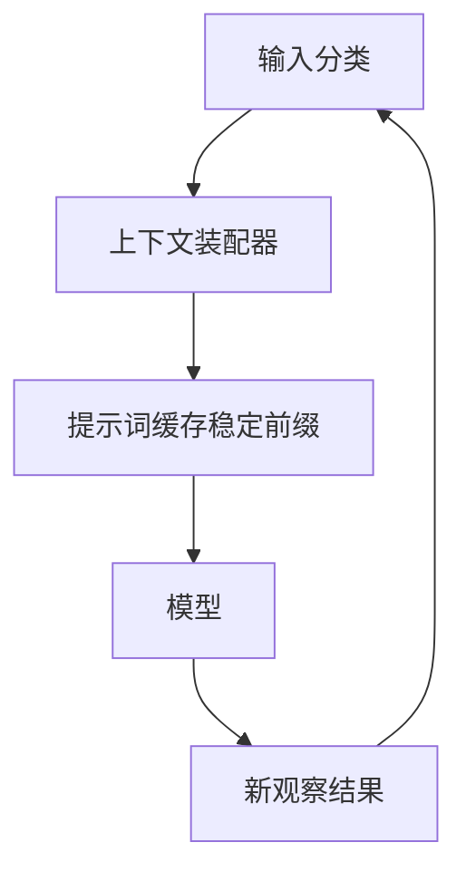

输入包含消息、工具结果与状态。分类时区分当前有效的固定约束、经执行证据核对的结构化状态、大型产物与历史消息。约束与已验证状态直接进入装配器，大型产物先外置并替换为引用。

历史按完整交互与阶段分组。近期完整交互直接进入装配器；较早历史先去重、按重要性筛选，再生成分层摘要。长期记忆同样可以进入装配器，但必须先复核权限与版本。装配后的上下文通过稳定前缀使用提示词缓存，再交给模型；新观察结果重新进入输入分类。

可按任务需要选择以下组合；短任务不一定需要摘要和分层存储：

1. 保留当前有效的系统、安全、目标和成功标准，并随权限和目标变化更新；
2. 将任务状态抽取为结构化数据，并用执行证据核对；
3. 大型 Tool Result 立即外部化；
4. 对历史做去重和重要性过滤；
5. 已完成阶段使用分层摘要；
6. 保留最近交互窗口；
7. 长期记忆按当前任务检索；
8. 按 Token Budget 组装 Context；
9. 对稳定前缀使用 Prompt Caching；
10. 在授权与保留期限内保留原始来源，验证引用可读和恢复路径可用。

## 10.23 方法选择表

| 问题 | 推荐方法 |
|---|---|
| 最近对话最重要 | Sliding Window |
| 需要保留早期整体语义 | Summarization |
| 关键内容分散在整个历史 | Importance Filtering |
| 需要精确状态和事实 | Structured Extraction |
| 存在大量重复信息 | Deduplication |
| Tool Result 或文档太大 | Externalization |
| 任务跨多个阶段 | Hierarchical Memory |
| 状态频繁变化 | Delta + Snapshot |
| 重复使用稳定 Prompt 前缀 | Prompt Caching |

## 10.24 本章总结

四种基础压缩方法解决不同维度：

1. **Sliding Window**：按时间截断历史；
2. **Summarization**：在截断前提炼语义；
3. **Importance Filtering**：打破时间顺序，按价值选择；
4. **Structured Extraction**：提取候选状态并核对证据；Schema 合法不保证事实正确，也不保证 Token 更少。

现代系统通常还会结合：

- Deduplication；
- Artifact Externalization；
- Hierarchical Memory；
- Delta 与 Snapshot；
- Retrieval；
- Token Budget Packing。

Prompt Caching 与这些方法位于不同层次：

> **记忆压缩决定带什么信息，Prompt Caching 决定重复信息如何减少计算。**

两者互补，但 Prompt Caching 不会释放 Context Window，也不能替代摘要、过滤和结构化抽取。

压缩后至少核对一次目标、未决状态、关键证据和引用可读性。若这些无法恢复，应回到原始记录或明确报告信息不足，而不是把流畅的摘要当作完整历史。

## 参考资料

<!-- centralized-bibliography -->
本章的参考资料、阅读建议与来源说明见[集中参考资料章节](../../book/references.zh.md#reading-agent-10)。
