# 第十三章：Multi-Agent 协作、路由与动态切换

把任务交给多个 Agent 后，最难的往往不是“各自能不能做”，而是“结果如何接起来，出了错谁决定下一步”。本章从协作拓扑出发，逐步讨论消息、共享状态、路由和控制权转移。

除明确标注框架或协议的部分外，JSON 均为应用层契约示例，字段名、数量和日期不是标准要求。讨论协作时需同时说明：模型提议什么、Runtime 强制什么、存储系统承诺什么。

## 13.1 问题的本质

多 Agent 分工只回答了：

> **谁擅长做什么？**

一个完整协作系统还必须回答：

1. 任务如何描述和分配？
2. Agent 之间如何传递结果？
3. 状态由谁维护？
4. 下一步由谁决定？
5. 控制权是否需要转移？
6. 失败、超时和循环如何处理？
7. 如何追踪整条执行链路？

这些问题可以分为四层：

通信与状态。

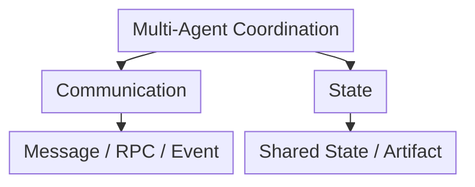

路由与控制权转移。

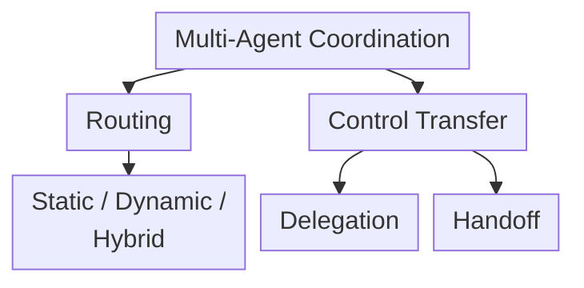

## 13.2 协作拓扑

可以将常见拓扑归纳为四类：

1. Pipeline；
2. Centralized Orchestrator；
3. Shared Workspace / Blackboard；
4. Peer-to-Peer / Negotiation。

真实系统经常混合使用。

## 13.3 Pipeline

Agent 按预定义顺序依次执行：

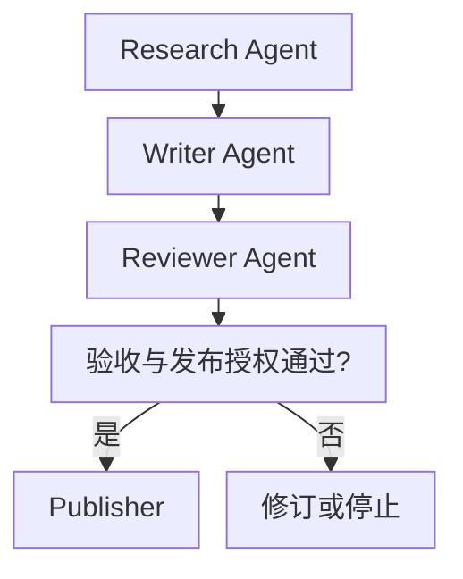

### 13.3.1 适用场景

- 阶段顺序稳定；
- 上下游接口明确；
- 每个阶段具有不同专业上下文；
- 需要清晰审计链路。

### 13.3.2 优势

- 控制流简单；
- 容易测试；
- 状态和责任清晰；
- 成本和延迟容易估算。

### 13.3.3 风险

- 上游错误传播；
- 中间 Agent 成为瓶颈；
- 早期 Agent 可能不知道下游真正需要什么；
- 固定流程难以处理例外。

每个阶段应输出结构化 Artifact，并设置 Gate。

## 13.4 Centralized Orchestrator

Orchestrator 负责：

- 理解全局目标；
- 拆分任务；
- 选择 Worker；
- 管理依赖；
- 跟踪状态；
- 收集和验证结果；
- 重试或重新规划。

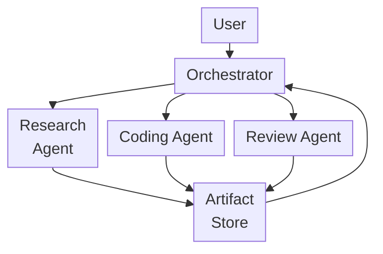

对单团队生产系统，中心化模式通常是比较稳妥的默认选项，因为：

- 全局目标集中；
- 路由可追踪；
- 权限容易统一控制；
- 失败路径容易定位；
- 可以集中管理预算和并发。

但 Orchestrator 也可能成为：

- 单点故障；
- 调度瓶颈；
- 大 Context 聚集点；
- 全局错误来源。

顶层上下文或调度成为瓶颈时，可以采用分层 Orchestrator；但多一层也多一次交接和信息压缩，不能仅凭系统规模决定。逻辑上的单一调度权可以由可恢复的服务实现，不等于依赖一个不可恢复的模型会话。

## 13.5 Shared Workspace / Blackboard

多个 Agent 通过共享工作区交换 Task、事实和 Artifact。

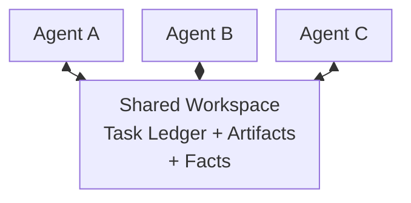

优势：

- Agent 不需要互相传递完整对话；
- 结果可被多个 Agent 复用；
- 支持异步协作；
- 新 Agent 可以读取当前状态后加入。

风险：

- 并发写冲突；
- 过期状态；
- 未验证信息污染全局；
- 责任边界模糊；
- 权限范围过大。

共享工作区需要 Schema、版本、所有权和写入规则。

## 13.6 Peer-to-Peer / Negotiation

Agent 之间直接通信、协商或委派：

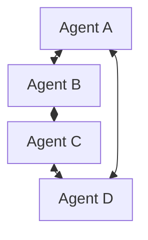

适合：

- 跨组织 Agent；
- 开放生态；
- 模拟与博弈；
- 没有统一中央控制方；
- 局部自治比全局一致更重要。

它不是天然不可用于生产，但必须解决：

- Agent Discovery；
- 身份和信任；
- 任务所有权；
- 重复领取；
- 故障检测；
- 消息幂等；
- 冲突；
- 全局完成判定；
- 费用和权限。

对单团队应用而言，这些分布式协调成本往往高于中心化模式。

## 13.7 通信方式不是只有两种

“消息传递”和“共享状态”是两个重要思路，但消息传递本身包含多种模式：

| 方式 | 特点 | 适用场景 |
|---|---|---|
| Request / Response | 调用方等待结果 | 短任务、强依赖 |
| Queue | Worker 从队列领取任务 | 异步任务、削峰 |
| Pub/Sub | 发布者不指定具体订阅者 | 事件广播、解耦 |
| Event Stream | 在约定的分区或键范围保存有序事件 | 状态重建、审计 |
| Shared State | 多节点读写状态 | 图工作流、紧密协作 |
| Artifact Store | 通过 URI 交换大结果 | 文档、代码、数据集 |

生产系统常同时使用：

> **消息触发执行 + State 保存任务状态及带来源的事实候选 + Artifact 传递大结果。**

## 13.8 Request / Response

调用方明确知道目标服务，并关联请求与响应；等待可以用同步阻塞，也可以用异步 I/O。不能把 Request/Response 等同于阻塞线程。

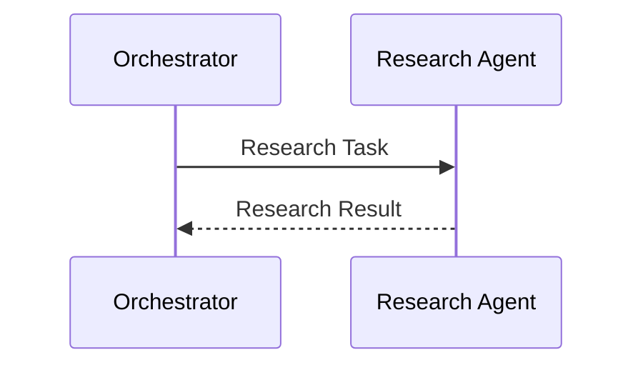

优势：

- 实现简单；
- 错误可直接返回；
- 适合短任务。

限制：

- 若要使用返回值，后续依赖仍需等待；
- 长任务容易超时；
- 强耦合；
- 断线恢复需要持久化 Task ID、查询接口和重试语义，单个 RPC 本身不够。

## 13.9 Queue

Producer 将 Task 放入队列，Worker 竞争消费。

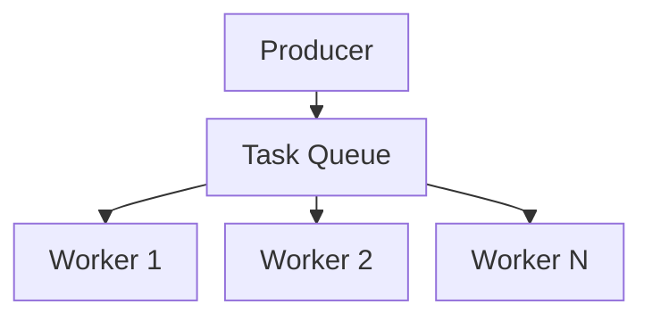

适合：

- 后台任务；
- Worker Pool；
- 弹性扩缩容；
- 重试；
- 流量削峰。

需要考虑：

- At-least-once Delivery；
- Idempotency；
- Visibility Timeout；
- Dead-letter Queue；
- Retry Backoff；
- Task Lease。

分布式系统中很难依赖“绝对只执行一次”，更常见做法是至少一次投递配合幂等执行。

例如 SQS Standard Queue<sup>[【511】](../../book/references.zh.md#ref-511)</sup>明确允许重复投递。ACK、消息去重与外部副作用是不同层次：Worker 退款成功后在 ACK 前崩溃，重投仍可能再次退款。应以稳定的业务操作 ID 调用支持幂等的退款 API，记录回执，并在超时后先查询结果。队列即使在自身边界内提供 exactly-once 处理，也不能自动覆盖外部系统的副作用。

## 13.10 Pub/Sub

Publisher 将事件发送到 Topic，不需要知道具体订阅者：

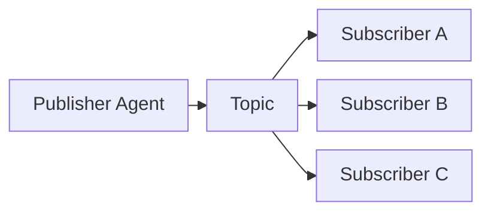

“发送方不需要知道谁在等待结果”准确描述的是 Pub/Sub，而不是所有消息传递。

适合：

- 多个 Agent 对同一事件做不同处理；
- 审计、通知和监控；
- 松耦合扩展。

风险：

- 消费顺序；
- 重复事件；
- Schema 演进；
- 难以知道所有下游是否完成。

## 13.11 Event Stream

Event Stream 在定义好的顺序范围内保存事件；多分区不自动形成全局总序，生产者时间戳也不代表提交顺序：

```json
{
  "event_id": "evt-1004",
  "event_type": "agent.task.completed",
  "task_id": "task-42",
  "agent_id": "research-agent",
  "sequence": 17,
  "artifact_uri": "artifact://research-result.json",
  "timestamp": "2026-08-28T09:00:00Z"
}
```

优势：

- 可审计；
- 可回放；
- 可以从事件重建状态；
- 便于多个消费者独立处理。

需要：

- Event Schema；
- 顺序键；
- 幂等消费；
- 保留策略；
- 版本兼容。

状态重建应折叠已经记录的事件，而不是重发邮件、付款或重新调用模型。消费者保存处理位置，并让状态更新与去重记录处于同一事务边界；保留窗口之外的事件需要快照或归档补足。缺失事件或不可重放的外部读取，会让“可回放”失去意义。

## 13.12 Artifact Store

Agent 不应通过消息传递大型完整内容。

推荐消息只包含：

- 摘要；
- Schema；
- URI；
- Hash；
- 来源；
- 权限。

```json
{
  "artifact_id": "report-draft-2",
  "uri": "artifact://report-draft-2.md",
  "schema": "research-report",
  "content_hash": "sha256:...",
  "summary": "包含三家竞品的产品、定价与风险对比"
}
```

接收 Agent 按需读取，避免：

- 消息体过大；
- Context 重复；
- 多次序列化；
- 内容版本不一致。

URI 必须指向可定位的不可变版本；`latest` 指针会让 Worker 读取到不同内容。Hash 只能验证字节未变，不能证明来源可信或结论正确；读取时还要检查租户、授权、Schema 和输入版本，不能因为发来一个 URI 就信任其中的指令。

## 13.13 共享状态如何分层

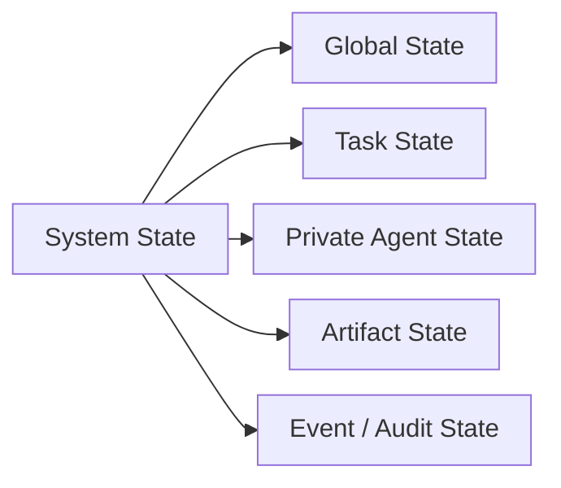

### 13.13.1 Global State

按任务相关性和权限暴露，而不是无条件向所有 Agent 开放：

- 用户原始目标；
- 全局约束；
- 总体进度；
- 预算；
- 最终输出引用。

### 13.13.2 Task State

某个子任务需要：

- 状态；
- 输入；
- 依赖；
- Owner；
- Deadline；
- Result；
- Error。

### 13.13.3 Private Agent State

只供单个 Agent 使用：

- 局部 Working Memory；
- 临时候选；
- 未验证笔记；
- 局部工具状态。

私有状态不应默认暴露给其他 Agent。

### 13.13.4 Artifact State

保存大体积、可版本化的产出引用。

### 13.13.5 Audit State

保存不可随意修改的消息、路由和操作记录。

## 13.14 状态写入不能简单概括为“只追加”

Append-only 适合：

- Event Log；
- 审计记录；
- 消息历史；
- 不可变 Artifact 版本。

但以下状态需要更新：

- 当前 Owner；
- 任务状态；
- 剩余预算；
- 当前计划版本；
- Lease；
- 最新有效结果。

更准确的策略是：

| 数据 | 推荐更新方式 |
|---|---|
| Event / Audit | Append-only |
| Current Status | 受版本控制地覆盖 |
| Messages | Reducer 追加、替换或删除 |
| Set / Tags | Union Reducer |
| Counter | 原子增量；重复事件另行去重 |
| Artifact | 新版本 + 不可变引用 |
| Task Owner | Compare-and-Swap / Lease |

## 13.15 LangGraph State 的准确理解

LangGraph 以 Graph、Node、Edge 和 State 构建工作流：

- Node 接收当前 State；
- Node 返回部分 State Update；
- 每个 State Channel 使用 Reducer 合并更新；
- Edge 决定下一个 Node；
- Checkpointer 可以持久化状态。

LangGraph 并不是所有字段都“只追加”：

- 没有自定义 Reducer 时，单次更新默认覆盖旧值；
- 列表可以使用 Append Reducer；
- 可以定义自定义 Reducer；
- 某些场景可以显式 Overwrite。

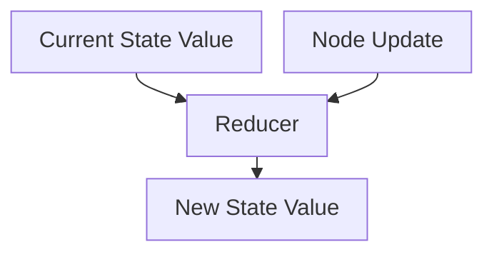

因此，必须为每个字段明确设计合并语义。

同一 super-step 的多个节点并行写入没有合并语义的同一字段，会触发 `INVALID_CONCURRENT_GRAPH_UPDATE`<sup>[【507】](../../book/references.zh.md#ref-507)</sup>，不是“最后完成的节点覆盖其他节点”。`operator.add` 合并列表能处理并发追加，却不会自动去重；`add_messages` 则按消息 ID 支持新增和替换，并有删除机制，不能把它当作普通列表追加。

Reducer 是图运行时的状态合并函数，不是跨进程数据库事务或分布式锁。Checkpointer 的线程内恢复也不自动解决多个运行竞争业务资源的问题；内存 Checkpointer 在进程退出后不能恢复。所谓 Private State 是数据组织方式，不是访问控制或日志脱敏承诺，应单独审查流式输出、Trace 和存储权限。

## 13.16 并发写入

多个 Agent 并行更新同一状态时，需要处理：

- Lost Update；
- Dirty Read；
- Write Conflict；
- Ordering；
- Duplicate Delivery。

### 13.16.1 字段所有权

给每个字段明确唯一写入者：

```text
research_result  -> Research Agent
code_artifact    -> Coding Agent
review_status    -> Review Agent
global_status    -> Orchestrator
```

这是较简单的冲突预防方式，但 Owner 的约束要由存储层执行。一个角色有多个副本，或旧 Worker 在超时后继续运行时，仍可能存在多个实际写入者。

### 13.16.2 Optimistic Concurrency

写入时携带版本：

```json
{
  "task_id": "task-42",
  "expected_version": 7,
  "update": {
    "status": "completed"
  }
}
```

提交时核对当前版本与预期版本、再写入更新，必须由存储系统原子执行，不能先在客户端比较再另发写入。版本不匹配后重新读取并重新判断业务前提，而不是仅把 `expected_version` 改成新值后盲目重试。

例如两个 Worker 同时把任务从 `running` 改为 `completed`，服务端要同时验证当前 `attempt_id`、Owner、计划版本、租约以及状态转换是否合法。已取消或已重新分配的任务不能被迟到的成功消息改回完成。

### 13.16.3 Reducer

对于可合并数据，先说明事件是否可能乱序、重复，再选择规则：

| 规则 | 能解决什么 | 边界 |
|---|---|---|
| List Append | 保存多个结果 | 顺序影响输出，重复投递会重复追加 |
| Set Union / 按稳定 ID 合并 | 可交换地收集结果、去重 | 同 ID 不同内容应报冲突，不宜静默覆盖 |
| Last Write Wins | 按明确定义的版本和决胜规则保留一个值 | 可能丢失业务信息；本机时间戳受时钟偏差影响 |
| Domain-specific Merge | 例如保留不同来源的事实候选 | 事实是否兼容仍需领域验证 |

跨副本、任意顺序合并时，常需结合律、交换律；要容忍重复还需幂等性，或在合并前去重。确定性函数本身不等于 CRDT，也不保证这些性质。选择“模型自报置信度最高”的值不可靠：不同模型的分数未必校准，更不能拿它解决权限或资金冲突。

### 13.16.4 Lease

一个 Agent 在有限时间内拥有 Task：

```json
{
  "owner": "agent-a",
  "attempt_id": "attempt-3",
  "fencing_token": 19,
  "lease_expires_at": "2026-08-28T09:05:00Z"
}
```

Agent 失联后 Lease 过期，任务可以重新分配。

Lease 过期不代表旧进程已经停止。暂停的 Worker 恢复后仍可能写入；每次领取应生成单调递增的 fencing token，由接受写入的存储或副作用网关原子地拒绝旧 token。只在 Prompt 中传入 token 没有约束力；外部 API 不支持 fencing 时，需要由可控网关串行化或使用业务幂等与对账，不能声称排除了全部晚到副作用。

仅记住“见过的最大 token”的接收端，要先见到新 token 才能拒绝旧持有者；这不等于租约一过期就即时禁止写入。若要求后者，需要让提交原子地验证当前租约/Owner，例如 etcd Lock 的事务保护方式<sup>[【513】](../../book/references.zh.md#ref-513)</sup>。跨系统副作用仍不在该事务保证内。

### 13.16.5 强一致需要到哪一层

| 状态 | 需要的保证 |
|---|---|
| 任务领取、预算预留、唯一最终提交 | 在权威账本中原子检查并更新；跨字段不变量需要事务 |
| 已提交 Artifact | 不可变版本；读取结果时核对输入与计划版本 |
| 搜索候选、工作笔记、进度投影 | 可容忍一定陈旧度，但必须标注版本和来源 |
| 互相矛盾的业务结论 | 留存证据，由规则或 Owner 裁决；数据库一致不等于事实正确 |

“三个 Agent 一致认为应该退款”只是应用层意见，不是 Raft/Paxos 共识。Raft 让副本对日志顺序达成一致，并不判断退款是否合规；要抵抗不可信 Agent，也不能直接套用 Raft 的崩溃故障假设。强共识、线性一致性和事务隔离是相关但不同的概念，应按底层 API 的实际保证设计。

例如 etcd 的 API 保证<sup>[【512】](../../book/references.zh.md#ref-512)</sup>区分 KV 的默认线性一致性与可能延迟的 Watch；收到某条 Watch 事件不等于此刻读取到了全局最新状态。预算扣减不能依赖可能过期的进度看板。丢失多数派时，依赖共识的提交可能无法推进；此时可继续只读探索，但不要绕过账本继续提交不可逆操作。

## 13.17 错误必须成为一等状态

错误不能只写进日志或被静默吞掉。

```json
{
  "task_id": "research-a",
  "status": "blocked",
  "error": {
    "code": "RATE_LIMITED",
    "message": "Search API rate limit exceeded",
    "retryable": true,
    "retry_after_seconds": 30,
    "source": "search-tool"
  }
}
```

Orchestrator 可以据此：

- 延迟重试；
- 切换 Tool；
- 切换 Agent；
- 跳过可选任务；
- 重规划；
- 终止；
- 请求人工处理。

## 13.18 Routing 是什么

Routing 决定：

> **当前状态下，应该由哪个 Agent 或节点处理下一步。**

Routing 不一定意味着控制权永久转移，也可能只是委派一个子任务。

常见策略：

1. Static Rule；
2. State-machine / Graph Edge；
3. Capability-based；
4. Score-based；
5. LLM-based；
6. Learned Router；
7. Hybrid。

## 13.19 Static Routing

使用规则、状态机或固定 Edge：

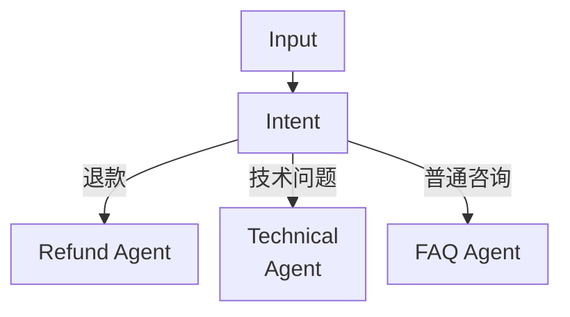

优势：

- 可预测；
- 延迟低；
- 易测试；
- 适合安全和合规；
- 不需要额外模型调用。

限制：

- 只能处理已定义路径；
- 规则增加后难以维护；
- 模糊输入容易落入错误分支。

## 13.20 Capability-based Routing

Router 根据 Agent Capability 选择目标。

Capability Registry 可以记录：

```json
{
  "agent_id": "research-agent",
  "capabilities": [
    "web_search",
    "source_validation",
    "competitor_research"
  ],
  "input_schema": "research-task",
  "output_schema": "research-artifact",
  "permissions": [
    "public-web-read"
  ],
  "status": "available"
}
```

选择时还需考虑：

- 当前可用性；
- 权限；
- 成本；
- 延迟；
- 历史成功率；
- 数据位置；
- 风险。

## 13.21 Score-based Routing

可以为每个候选 Agent 计算分数：

$$
Score(a)=\alpha C_a+\beta Q_a+\gamma A_a-\delta L_a-\epsilon K_a-\zeta R_a
$$

其中：

- `Cₐ`：Capability Match；
- `Qₐ`：历史质量；
- `Aₐ`：Availability；
- `Lₐ`：Latency；
- `Kₐ`：Cost；
- `Rₐ`：Risk。

评分可以由规则、统计模型或 LLM 辅助生成。

这只是候选排序的示意函数，不是优化正确性的保证。权限、数据驻留、协议版本和可用预算先做硬过滤，不能让“质量分高”抵消越权。剩余指标需统一量纲、按任务类别估计，并考虑数据量与置信区间；历史成功率会受路由选择偏差影响，不能把只接简单任务的 Agent 直接排在前面。

## 13.22 LLM-based Dynamic Routing

LLM 根据：

- 当前目标；
- 已完成工作；
- 当前状态；
- 候选 Agent；
- 能力描述；
- 权限和预算；

返回目标 Agent。

```json
{
  "target_agent": "review-agent",
  "reason": "代码已经生成，但尚未通过独立审查",
  "handoff_type": "delegation",
  "confidence": 0.91,
  "payload": {
    "artifact_uri": "artifact://patch.diff"
  }
}
```

### 13.22.1 优势

- 能处理模糊意图；
- 可以综合多个信号；
- 能覆盖部分未显式编码的组合情况。

### 13.22.2 局限

- 可能路由错误；
- 输出具有概率性；
- 增加 Token 和延迟；
- 可能选择越权 Agent；
- 候选过多时判断质量下降。

示例中的 `confidence: 0.91` 是模型自报值，不表示已校准的 91% 成功概率。阈值应在独立标注的路由评测集上校准；没有校准时，把它视为辅助信号，依据可执行校验和拒绝策略决定是否派发。

### 13.22.3 不一定额外增加一次模型调用

如果 Orchestrator 当前模型调用本来就需要决定下一动作，可以让它同时返回 Route。

路由若作为每次必经的独立 LLM 节点，通常会新增调用；命中规则、缓存或批处理的设计则需另算。即使合并在已有调用里，候选描述、结构化输出和后续重试仍有成本。

## 13.23 Dynamic Routing 必须受约束

动态不等于允许模型选择任意 Agent。

Runtime 应：

- 只暴露允许的候选；
- 检查输入输出 Schema；
- 校验权限；
- 检查目标 Agent 可用性；
- 设置最大切换次数；
- 提供安全 Fallback；
- 记录路由原因和 Trace。

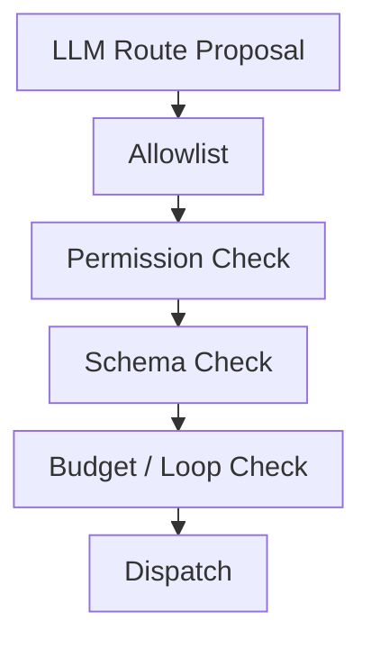

## 13.24 Hybrid Routing

Hybrid Routing 将确定性控制与模型判断组合：

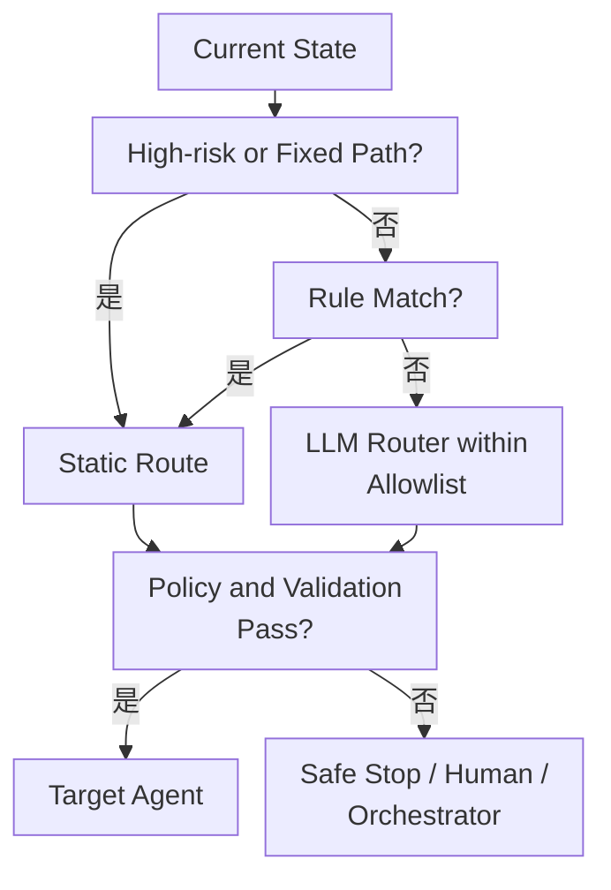

静态路由也必须经过授权、参数和预算检查；“路径预先写好”不等于当前请求获得了执行许可。

需要修正一个常见说法：

> 不是“静态负责保底，动态负责兜底所有异常”。

高风险异常的最终兜底应该是：

- 安全停止；
- 人工处理；
- 确定性 Fallback；

而不是无条件交给 LLM。

## 13.25 Delegation 与 Handoff

这两个概念都能让另一个 Agent 工作，但控制权不同。

### 13.25.1 Delegation

当前 Agent 保留控制权，将一个子任务交给 Worker：

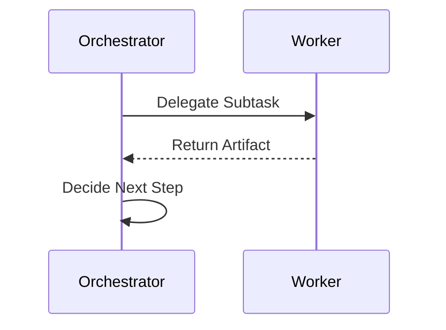

适合：

- Orchestrator 需要保持全局视角；
- 子任务边界明确；
- 多个 Worker 并行；
- 结果需要统一合并。

### 13.25.2 Handoff

当前 Agent 将后续对话或任务控制权转给另一个 Agent：

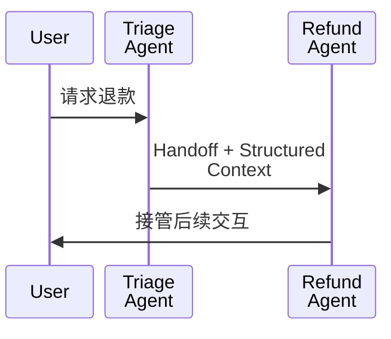

适合：

- 接收 Agent 应直接面向用户；
- 专业 Agent 需要持续控制后续回合；
- 任务边界稳定；
- 不需要原 Agent 汇总结果。

### 13.25.3 对比

这里按“谁在调用结束后决定下一步”作工程区分；SDK 文档可能广义地把 Handoff 也称为 delegation，应以控制流为准。进程内 Handoff 是 Runner 的执行转移；跨服务交接还需持久化接收确认和 Owner 变更，不能把一次网络发送当作控制权已成功转移。

| Delegation | Handoff |
|---|---|
| 调用方保留控制权 | 控制权转移 |
| Worker 返回结果给调用方 | 接收 Agent 继续处理 |
| 适合子任务 | 适合职责切换 |
| 常用于 Orchestrator-Workers | 常用于客服分流 |

## 13.26 OpenAI Swarm 与 Agents SDK

Swarm 是 OpenAI 早期用于展示 Handoff 的教育性、实验性框架。

对于这一技术路线，OpenAI 官方建议从 Swarm 迁移至 Agents SDK，并将后者称为 production-ready upgrade。SDK 支持：

- Agents；
- Agents as Tools；
- Handoffs；
- Guardrails；
- Sessions；
- Human-in-the-loop；
- Tracing。

在 Agents SDK 中，Handoff 通常作为一种 Tool 暴露给模型，例如：

```text
transfer_to_refund_agent
```

模型选择该 Tool 后，Runtime 将控制权转给对应 Agent。

框架提供这些能力不意味着默认完成所有授权和恢复。按 Handoffs 文档<sup>[【510】](../../book/references.zh.md#ref-510)</sup>，`input_type` 定义模型生成的交接参数，并不替换接收方的整段输入，也不是身份凭据；需要按参数授权时，在产生副作用前检查。`Agent.as_tool()` 更适合返回结果给原调用方，Handoff 则让接收 Agent 接管后续执行。具体参数与 Guardrail 覆盖范围应按部署时锁定的 SDK 版本确认。

## 13.27 Handoff Contract

一个可靠 Handoff 不应只传一句“交给你了”。

```json
{
  "handoff_id": "handoff-42",
  "from_agent": "triage-agent",
  "to_agent": "refund-agent",
  "task_id": "task-100",
  "reason": "用户报告重复扣款",
  "goal": "确认订单并处理退款",
  "context_summary": "用户已完成身份验证",
  "artifacts": [
    "artifact://order-details.json"
  ],
  "constraints": [
    "退款前必须再次确认金额"
  ],
  "deadline": "2026-08-28T10:00:00Z",
  "return_policy": "do_not_return"
}
```

至少包含：

- 来源和目标 Agent；
- Goal；
- Reason；
- 已完成内容；
- 未完成内容；
- 必需 Artifact；
- 约束；
- 权限；
- Deadline；
- 返回或终止策略。

其中“用户已完成身份验证”是自然语言摘要，不能作为可信身份。接收方应从受信 Runtime 取得用户身份、租户、授权范围、验证有效期及审批回执，并重新检查订单归属。`return_policy` 等字段是应用约定，SDK 不会因 JSON 中出现它们就自动执行。

## 13.28 Handoff Context Filtering

安全设计上应只传必需历史；但 OpenAI Agents SDK 的 Handoff 默认会让接收方看到此前会话，需显式配置 `input_filter` 等机制。这是推荐策略与框架默认行为的区别。

可以传递：

- 结构化摘要；
- 当前目标；
- 已验证事实；
- 必要 Artifact；
- 用户明确约束；
- 相关最近消息。

不应默认传递：

- 其他 Agent 的私有 Scratchpad；
- 无关 Tool Result；
- 敏感凭据；
- 未验证推测；
- 完整隐藏推理。

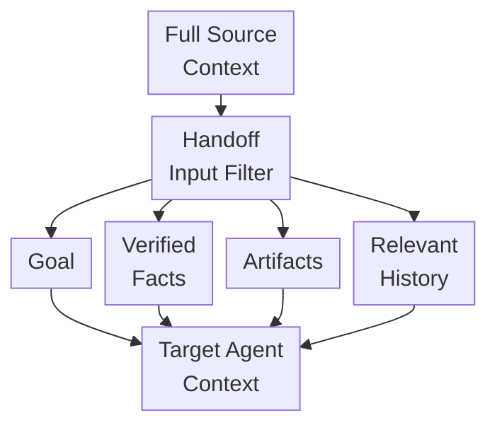

## 13.29 Handoff 循环

简单记录“访问过哪个 Agent”可以发现部分循环，但也可能误伤合法返回。

更稳健的检测信号：

- 总 Handoff 次数；
- 同一 Agent 访问次数；
- 相同 Task State Hash 重复出现；
- 相同 Agent Pair 反复切换；
- 多轮没有新 Artifact；
- Goal Progress 没有变化。

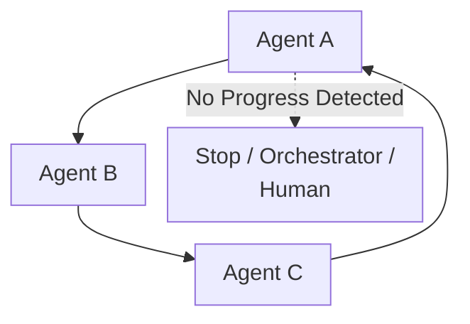

允许合理的回访，但要求：

- 状态已经变化；
- 有新的 Artifact；
- 有明确返回原因；
- 不超过预算。

检测状态时忽略时间戳、Token 计数等无关变化，否则每轮 Hash 都不同会掩盖循环；也不能只凭出现新文件就认定进展。进展应绑定尚未满足的验收项，并由 Runtime 设置最大修订、深度和总调用预算。

## 13.30 Routing Fallback

Router 无法可靠选择时，应返回：

```json
{
  "route_status": "UNRESOLVED",
  "reason": "两个 Agent 的能力都不足以处理法律判断",
  "recommended_action": "human_review"
}
```

不要：

- 随机选择 Agent；
- 静默落到权限最高的 Agent；
- 无限重试 Router；
- 把未知任务交给万能 Agent。

## 13.31 Agent Discovery

动态系统需要 Capability Registry：

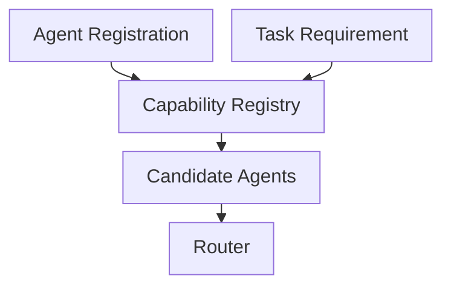

Registry 应记录：

- Agent ID；
- Skills；
- Input / Output Schema；
- Endpoint；
- Authentication；
- Availability；
- Cost；
- Latency；
- Version；
- Trust Level。

A2A Agent Card 可以承担跨系统能力描述，但系统内部仍可能需要运行时 Registry。

## 13.32 A2A 的作用

A2A 为独立 Agent 系统提供：

- Agent Card；
- Task；
- Message；
- Artifact；
- Streaming；
- Push Notification；
- Task Lifecycle；
- 多种协议绑定。

它允许 Agent 在不了解彼此内部 Memory、Tools 和实现细节的情况下协作。

以 v1.0.1 发布标签的规范<sup>[【311】](../../book/references.zh.md#ref-311)</sup>为例，线上协议版本为 `1.0`，与规范补丁号、SDK 和 Agent 软件版本分开。对接时固定协议绑定（binding），不能混用旧字段或 RPC 名。Streaming、Push Notification 等还要检查能力声明；发送 Message 可以返回 Task 或直接返回 Message，不是每次调用都创建任务。

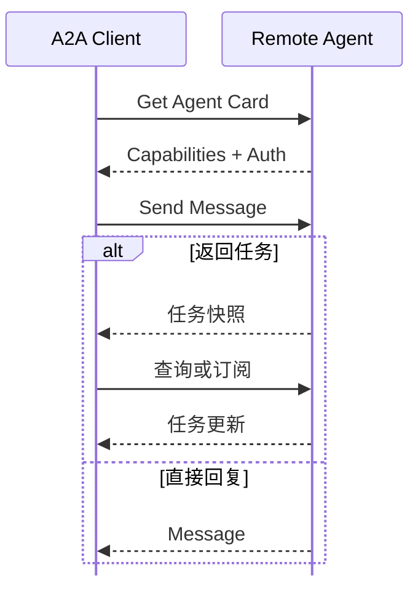

任务快照包含 Task、当前状态与可用产物。客户端可以查询进度，或在服务端**支持时**订阅；后续更新包含状态与产物。另一种分支是直接返回 Message，不进入 Task 生命周期。

A2A 解决互操作协议，不替代：

- Orchestrator；
- Task Decomposition；
- Router；
- 权限策略；
- 费用结算；
- 结果验证。

A2A 的 binding、Agent Card 与 Task 状态机详见 [Tools：A2A 协议](../../tools/04-agent-communication/11-a2a-protocol.zh.md)；跨组织身份、回调 SSRF、token audience 和 Card 信任边界详见 [Tool Protocol 安全](../../tools/02-mcp/15-tool-protocol-security.zh.md)。

## 13.33 Agent 协作消息 Schema

推荐消息字段：

```json
{
  "message_id": "msg-900",
  "schema_version": "1.0",
  "task_id": "task-42",
  "correlation_id": "run-101",
  "causation_id": "msg-899",
  "sender": "orchestrator",
  "recipient": "research-agent",
  "message_type": "task.request",
  "idempotency_key": "task-42-research-v1",
  "deadline": "2026-08-28T09:10:00Z",
  "trace_id": "trace-77",
  "payload": {
    "goal": "调研竞品 A",
    "artifact_schema": "competitor-research"
  }
}
```

字段作用：

- `message_id`：唯一消息；
- `task_id`：归属任务；
- `correlation_id`：关联一次完整运行；
- `causation_id`：追踪因果链；
- `idempotency_key`：由接收端按业务操作保存、核验并去重，字段本身不会防重复；
- `deadline`：由 Runtime 在派发、重试和提交前检查，不能自动终止远程副作用；
- `trace_id`：可观测性。

重投同一业务操作时保持幂等键稳定，不能每次重试都生成新键；新一轮执行使用独立 `attempt_id`，并附输入版本。相同幂等键却携带不同参数应拒绝。去重范围至少应区分租户和操作类型，保留时长要覆盖消息可能重放的窗口。

## 13.34 取消传播

用户取消全局任务时，需要取消：

- 正在执行的 Worker；
- 队列中的 Task；
- 外部 Tool；
- 后续依赖；
- 尚未完成的 Handoff。

```mermaid
%%{init: {"flowchart": {"nodeSpacing": 10, "rankSpacing": 16, "padding": 6}}}%%
flowchart LR
    CANCEL["Cancel<br/>Global Task"] --> O["Orchestrator"]
    O --> W1["Cancel<br/>Worker A"]
    O --> W2["Cancel<br/>Worker B"]
    O --> Q["Remove<br/>Queued Tasks"]
    O --> T["Cancel Tool<br/>Calls"]
```

对可控 Agent 和 Tool 应实现 Cancellation Token 或任务状态检查；外部服务未必支持取消，即使支持也可能来不及阻止已发生的副作用。先在权威账本持久化取消意图，再停止新增派发并向执行者传播；队列消息即使无法删除，领取时也应检查任务状态。迟到结果只留审计、不再推进下游。

取消不是回滚。已发送邮件无法“撤销执行”，已支付资金可能需要独立退款流程；补偿操作也要授权、幂等和记录失败。应分别记录“请求取消”“已确认停止”“副作用待对账”，不要用一个 `cancelled` 状态掩盖未知结果。

## 13.35 超时与重试

### 13.35.1 Timeout

区分：

- 单次 Tool Timeout；
- Agent Step Timeout；
- Task Timeout；
- 全局 Run Timeout。

子任务 Deadline 不应晚于父任务的剩余期限，并预留汇总或安全退出时间。客户端超时只说明未及时收到结果，不证明服务端没有完成操作。

### 13.35.2 Retry

只对可重试错误执行，并采用：

- Exponential Backoff；
- Jitter；
- 最大次数；
- 幂等键。

由一层负责统筹重试，避免 SDK、Worker、Orchestrator 同时重试造成放大；重试也占预算和并发槽。429 或临时服务错误可以按服务提示延迟，Schema 错误、权限拒绝、确定性测试失败应修正原因或重规划，而不是原样反复调用。

### 13.35.3 Fallback

可以：

- 切换 Agent；
- 切换 Tool；
- 降级模型；
- 返回部分结果；
- 请求人工处理。

## 13.36 可观测性

Multi-Agent 必须记录：

- 谁创建了 Task；
- 谁路由给谁；
- 为什么选择该 Agent；
- 传递了哪些 Context 和 Artifact；
- 每个 Agent 做了什么；
- 哪个步骤失败；
- Token、费用和延迟；
- Handoff 次数；
- 最终结果来源。

```mermaid
%%{init: {"flowchart": {"nodeSpacing": 16, "rankSpacing": 16, "padding": 10}}}%%
flowchart LR
    O["Orchestrator"] -.Trace.-> OBS["Observability"]
    A1["Agent A"] -.Trace.-> OBS
    A2["Agent B"] -.Trace.-> OBS
    Q["Queue / State"] -.Metrics.-> OBS
    T["Tools"] -.Logs.-> OBS
```

建议统一：

- Trace ID；
- Span；
- Task ID；
- Agent ID；
- Artifact ID；
- Route Decision；
- Error Code。

保留输入版本、模型及工具版本、关键调度决定、验证回执和预算预留记录，才能区分计划错误、执行错误和验收错误。Trace 应脱敏并限制访问；不要求记录隐藏推理。重放已记录的工具结果有助于定位调度问题，重新调用模型或外部 API 则可能得到不同结果，不能据此承诺字节级复现。

## 13.37 安全

动态切换会扩大权限边界。

必须检查：

- 来源 Agent 是否有权委派；
- 目标 Agent 是否有权处理数据；
- Handoff Payload 是否包含敏感信息；
- 目标 Agent 是否被允许调用高风险 Tool；
- 外部 Agent 身份是否可信；
- 消息是否被篡改或重放。

### 13.37.1 Confused Deputy

低权限 Agent 可能诱导高权限 Agent 代替它执行敏感操作。

防护：

- 每次 Tool Call 重新授权；
- 不继承来源 Agent 的隐含权限；
- 记录原始用户身份和意图；
- 高风险操作重新确认；
- Handoff 不自动升级权限。

## 13.38 客服系统示例

```mermaid
flowchart TB
    R[静态规则] -->|无法识别| L[LLM 路由器]
    L --> C[校验路由]
    C -->|通过| TARGET[获准 Agent]
    C -->|未通过或无法确认| H[人工客服]
```

用户请求先进入采用静态规则的分诊工作流：订单查询交给订单 Agent，退款交给退款 Agent，技术问题交给技术 Agent。只有无法识别的请求才走图中的 LLM 路由路径。另一个独立约束是，退款 Agent 必须先获得退款批准，才能调用退款工具；审批拒绝时转人工客服。

设计要点：

- 常见意图使用静态路由；
- 模糊意图在 Allowlist 内动态路由；
- 退款 Handoff 传递订单 Artifact；
- Refund Agent 不继承无限权限；
- 执行退款前需要审批；
- 未识别请求安全转人工。

## 13.39 代码协作示例

探索生成供编码使用的架构产物。

```mermaid
flowchart TB
    G[User Goal]
    O[Coding Orchestrator]
    E[Explore Agent]
    A[Architecture Artifact]
    C[Coding Agent]
    G --> O
    O --> E
    E --> A
    A --> C
```

必需测试决定能否进入评审，失败证据返回编码者。

```mermaid
flowchart TB
    C[Coding Agent]
    D[Patch Artifact]
    TEST{必需测试通过?}
    R[Review Agent]
    C --> D
    D --> TEST
    TEST -->|否，返回失败证据| C
    TEST -->|是| R
```

评审发现可触发重新编码，最终验收仍由编排器负责。

```mermaid
%%{init: {"flowchart": {"nodeSpacing": 10, "rankSpacing": 16, "padding": 6}}}%%
flowchart TB
    R["Review Agent"]
    V["Pass?"]
    C["Coding Agent"]
    ACCEPT["Orchestrator 最终验收"]
    DONE["交付结果"]
    R --> V
    V -->|否，返回有效 Finding| C
    V -->|是| ACCEPT
    ACCEPT --> DONE
```

图中先探索接口和依赖，再生成补丁；测试与审查各有失败出口。Orchestrator 管理整个流程，审查通过后进入最终验收，不是回到用户目标重新启动一轮探索。超预算、缺少权限或无法修复时则停止并报告未完成项。

推荐：

- Explore Agent 只读；
- Coding Agent 可修改工作区；
- Review Agent 只读 Diff 及相关上下文、测试和依赖；
- Orchestrator 保留最终控制；
- Patch 和报告使用 Artifact；
- Review Finding 使用结构化 Schema；
- 最大修订次数由 Runtime 控制。

若扩展为并行 Coding Worker，先固定接口和基准提交，为各自提供独立工作区；用 Patch 及基准 SHA 交付，由一个合并者在集成分支执行测试。没有文本冲突不等于语义兼容，例如两个模块各自通过测试却使用不同的单位或错误约定；反复发生这种问题说明任务拆分边界需要调整。

## 13.40 选型表

| 场景 | 推荐机制 |
|---|---|
| 固定顺序处理 | Pipeline |
| 复杂任务统一调度 | Orchestrator |
| 多 Worker 并发 | Queue + Task Ledger |
| 多消费者响应事件 | Pub/Sub |
| 多 Agent 复用结果 | Shared Workspace + Artifact |
| 跨组织 Agent 互操作 | A2A |
| 专业 Agent 接管用户会话 | Handoff |
| Worker 完成子任务后返回 | Delegation |
| 高风险或稳定主流程 | Static Routing |
| 模糊、开放式低风险分流 | Constrained LLM Routing |
| 顶层调度或上下文成为瓶颈 | 评估分层 Orchestrator |

## 13.41 推荐生产架构

```mermaid
%%{init: {"flowchart": {"nodeSpacing": 10, "rankSpacing": 16, "padding": 6}}}%%
flowchart TB
    WF["确定性工作流"] --> ROUTER["混合路由器"]
    ROUTER --> WORK["队列中的工作节点"]
    WORK --> ART["产物存储"]
    ART --> VERIFY["验证器"]
    VERIFY -->|验收通过| JOIN["结果聚合器"]
    VERIFY -->|失败或证据不足| WF
    JOIN --> WF
```

用户或事件输入进入确定性工作流。派发前，混合路由器依次查询能力注册表、权限与风险策略、任务账本。账本向任务队列提供任务，由队列派发给 A、B 至 N 等 Agent；它们是独立工作节点，不是串行阶段。获准的 Handoff 还可以从账本转交给专家 Agent；无法确定或无效的路由转人工审核。

每个工作节点都写入产物并发出事件。事件流构建物化状态，向路由器提供进度提示，但这本身不代表产物已经验收。验证器检查产物存储，将通过的工作交给聚合器，将失败或证据不足的情况交回工作流；聚合结果也返回工作流。可观测性系统接收工作流轨迹、路由决策，以及每个工作节点的 Span。

核心原则：

1. 确定性 Workflow 控制高层边界；
2. Hybrid Router 在 Allowlist 内选择 Agent；
3. Task Ledger 是任务状态真相源；
4. Queue 负责异步分发；
5. Artifact Store 传递大结果；
6. Event Stream 保留审计和状态变化；
7. Verifier 检查输出；
8. Handoff 只用于真正需要转移控制权的场景；
9. 无法可靠路由或未通过风险校验的请求安全停止或转人工。

这是功能分解示意，不要求每项都部署成独立服务。尤其不要把异步 `Materialized State` 当作领取、预算或提交的授权依据；这些检查应回到权威 Task Ledger。若选用账本作为真相源，可用同一事务写入状态变化与待发送事件（Transactional Outbox<sup>[【486】](../../book/references.zh.md#ref-486)</sup>），再异步投递；否则“状态已提交但通知未发送”的崩溃窗口会造成任务遗漏。事件溯源则是另一种真相源选择，不能同时把两份可独立修改的数据都当权威。

### 13.41.1 并行调度与 Join

模型提出 DAG 后，调度器检查依赖存在、无环、输出契约兼容；只有必需前置任务已验收通过，节点才进入 Ready 集合。随后原子领取租约、预留预算，再投递。不要先让模型调用发生，再事后发现没有额度。

并发上限需同时覆盖 Run、租户、模型端点和外部 Tool；限制 Worker 数不代表限制住 Worker 内部的并行调用。就绪任务较多时，兼顾关键路径优先级和公平性，避免一个大任务长期占满资源。队列用于背压，但排队耗时也计入端到端延迟。

Join 的语义必须在执行前确定：

- **All-required**：等待全部必需结果，逐项验收；可选任务失败可返回带缺口说明的部分结果。
- **First-valid**：适合可互相替代的候选，采用第一个通过独立验证的结果，而非第一个返回文本的结果；剩余工作要取消并核算费用。
- **K-of-N**：适合明确允许冗余的任务。达到数量阈值不等于事实正确，相同模型或相同来源的结果可能高度相关；更不等于存储系统的法定多数派提交。

Worker 报告 `completed` 后应先进入待验证状态。只有当前计划版本下所有必需验收项有证据、没有会影响结论的未决副作用，并且最终提交成功，Run 才算成功。任一分支永远等待、循环新增任务或静默遗漏依赖，都不能靠“队列暂时为空”判断完成。

### 13.41.2 预算预留与故障恢复

共享余额不能由每个 Worker 各自读一份后判断“还有钱”。在账本中维持已结算成本、在途预留和上限，例如：

$$
C_{spent}+C_{reserved}\le B_{run}
$$

这是一条调度不变量，不是对未知外部账单的数学保证。预留量应覆盖调用可控的最大 Token、工具次数和供应商计费约束；若无法给出硬上界，就不能承诺绝不超支，需要保守余量、供应商限额和超支处置。

派发时原子增加预留，收到可信用量后原子结算并释放差额；不确定是否已经产生费用时保留预留，查询或对账后再释放。父任务为汇总和必要验证保留额度，子 Agent 无权自行扩大子树预算。限制总调用次数、递归深度、重试次数和截止时间，才能防止“每个 Agent 都没超局部预算、全局却超支”。

恢复时按持久化的 Run ID、Task ID、attempt 和输入版本识别已完成工作；先核对租约、回执与预算，再重派失联任务。不要把恢复写成重跑整个模型计划，否则已执行副作用可能重复。

### 13.41.3 评测协作而不只是评测回答

除了[第九章 §9.31：评估 Multi-Agent 是否值得](09-single-vs-multi-agent.zh.md)，还要测路由误派与拒绝是否合理、Handoff 约束保留率、必需依赖覆盖、陈旧结果拒收、重试放大、重复副作用和预算超限。质量、费用、端到端延迟及其尾部应一起报告，不能只展示成功样本的平均用时。

用固定故障时序验证不变量：领取后宕机、外部操作成功但回执丢失、旧 Worker 在重新分配后回包、取消与完成同时发生、账本提交后通知投递失败。记录系统是否安全终止、保留部分成果或正确重试，并把“无法确认副作用”单列，不能计作已恢复成功。

## 13.42 设计检查表

### 13.42.1 协作拓扑

- 为什么选择 Pipeline、Orchestrator、Blackboard 或 P2P？
- 是否存在不必要的 Agent？
- 谁拥有全局目标和最终决策权？

### 13.42.2 通信

- 使用 Request/Response、Queue、Pub/Sub 还是 Event Stream？
- 消息是否有 Schema 和版本？
- 是否支持幂等、重试和取消？
- 大结果是否使用 Artifact？

### 13.42.3 状态

- Global、Task、Private State 是否分开？
- 每个字段由谁写？
- Reducer 是覆盖、追加还是自定义合并？
- 并发冲突如何检测？

### 13.42.4 Routing

- 静态规则能覆盖哪些路径？
- LLM Router 的候选是否受 Allowlist 限制？
- 权限、成本和可用性是否参与选择？
- 低置信度如何安全退出？

### 13.42.5 Handoff

- 是否真的需要转移控制权，还是 Delegation 足够？
- Handoff Contract 是否完整？
- 是否过滤无关或敏感 Context？
- 如何检测循环和无进展？

### 13.42.6 Reliability

- Agent 超时后谁接管？
- Task Lease 如何过期？
- Error 是否进入状态？
- 是否支持局部重试和重新规划？

### 13.42.7 Security

- Handoff 是否导致权限升级？
- 外部 Agent 是否经过认证？
- Shared State 是否存在跨租户泄露？
- 高风险操作是否重新授权？

### 13.42.8 Observability

- 是否有统一 Trace ID？
- 能否还原每次 Route 和 Handoff？
- 能否统计 Agent 成功率、成本和延迟？
- 能否定位循环、重复工作和消息丢失？

## 13.43 常见反模式

### 13.43.1 所有 Agent 共享完整对话

造成 Context 污染、隐私扩大和 Token 浪费。

### 13.43.2 所有 State 字段都追加

当前状态、Owner 和预算无法正确更新。

### 13.43.3 所有 State 字段都覆盖

并发结果和历史事件会丢失。

### 13.43.4 Message Passing 等同 Pub/Sub

忽略了 Request/Response、Queue 和 Event Stream 的不同语义。

### 13.43.5 LLM Router 可以选择任意 Agent

容易越权、误路由和形成循环。

### 13.43.6 动态路由作为所有异常的最终兜底

高风险未知情况应安全停止或转人工。

### 13.43.7 Handoff 与 Delegation 混为一谈

导致控制权不清和结果无人汇总。

### 13.43.8 只记录经过的 Agent 名称防循环

无法区分合法回访与无进展循环。

### 13.43.9 错误只写日志

Router 和 Orchestrator 无法根据失败状态决策。

### 13.43.10 大结果通过消息反复复制

造成传输和 Context 成本，应改用 Artifact。

## 13.44 本章总结

Multi-Agent 协作要把通信、状态、路由、控制权转移、可靠性、安全和可观测性一起设计清楚，少掉任何一项，系统一放大就容易出问题。

对需要异步多 Agent 协作的单团队系统，可以从以下组合中选取必要部分：

> **Workflow 控制高层边界，Orchestrator 管理任务，Hybrid Router 选择 Worker，消息触发执行，State 记录任务状态，Artifact 传递结果，Verifier 检查质量。**

Handoff 适合让专业 Agent 接管后续交互；Delegation 则把子任务结果交回原调用方。动态路由需要候选集、权限、预算和退出条件约束，模型自报置信度不能替代授权或验收。账本共识决定状态如何提交，证据验证决定业务结论是否可信；异步进度投影和多数 Agent 的意见都不能替代这两层保证。

## 参考资料

<!-- centralized-bibliography -->
本章的参考资料、阅读建议与来源说明见[集中参考资料章节](../../book/references.zh.md#reading-agent-13)。
