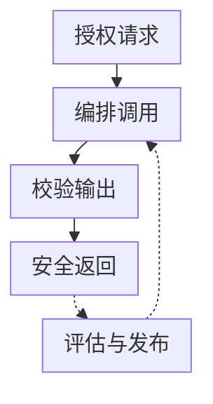
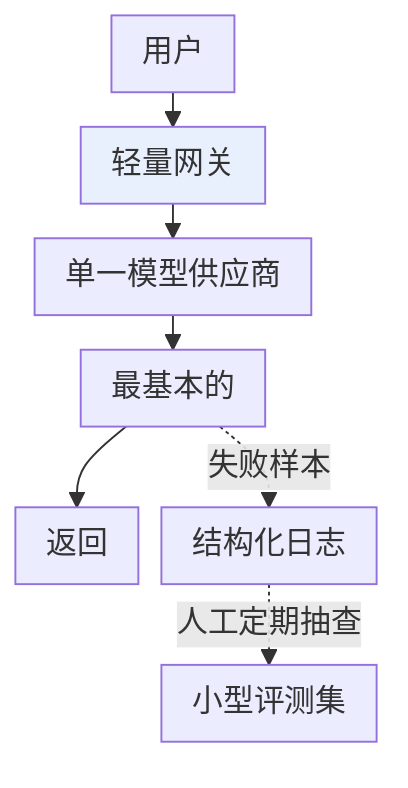

# 第二章：AI 应用生产架构全景

## 2.1 从「调用一次 API」到「一个生产系统」

Demo 阶段的 LLM 应用往往就是一次 `client.chat.completions.create()` 调用。要撑住真实流量，这一次调用的前后会长出一整条链路：网关、编排、输出校验、可观测性、评测和发布都得补上。

请求从入口 API 网关进入。编排层通过模型网关调用供应商，模型返回的文本或工具参数经过校验后再交回编排层。工具调用走独立的授权与执行路径，结果同样回到编排层。最终输出校验通过后才能返回；未通过时选择合适的降级响应。

改进闭环不是同步请求中的又一步。编排层、输出校验和模型网关产生 trace 与指标。可观测数据和用户反馈进入离线评测集，满足条件的反馈也可以进入训练或微调数据集。评测控制发布门禁，发布流水线再通过灰度方式更新模型网关和编排层。

图中各项的完整含义：

- 入口 API 网关 用户鉴权 · 租户限流
- 编排层 Agent / RAG / 工具调用
- 模型网关 供应商凭据 · 路由 · 回退 · 配额
- 模型供应商 OpenAI / Anthropic / 自研部署
- 模型响应校验 文本或工具参数
- 工具授权与执行 资源权限 · 审批 · 幂等
- 最终输出校验 契约 · Guardrails
- 可观测性 日志 · 指标 · Trace
- 离线评测 黄金测试集
- 发布流水线 灰度 / Canary / A-B

请求先经过入口鉴权，再进入编排层。编排层每次调用模型都经过模型网关，收到响应后判断是继续调用工具，还是结束任务并校验最终回答；工具有独立的授权与执行边界。图中区分的是职责，几个职责可以部署在同一服务中，但不能因此省略其中的检查。

## 2.2 请求路径：网关、编排、供应商

入口层验证用户与租户身份；**模型网关**管理模型供应商凭据、配额、路由和回退。两者不能替代工具服务对具体资源的授权。网关组件见 [Tools · LLM 网关](../../tools/05-transport-gateway/14-llm-gateway.zh.md)，路由见[第 3 章](../02-request-reliability/03-model-gateway-routing-fallback.zh.md)，超时和重试见[第 4 章](../02-request-reliability/04-retry-timeout-idempotency-circuit-breaker.zh.md)。

入口网关之后是**编排层**——单次问答可能只是一次模型调用，但 Agent 需要多轮工具调用与规划（见 [Agent](../../agent/README.zh.md)），知识密集型任务需要先检索再生成（见 [RAG](../../rag/README.zh.md)）。编排层通过模型网关访问具体的**模型供应商**：可能是托管 API，也可能是自研部署（部署细节见 [LLM · 推理与部署](../../llm/03-inference-serving/README.zh.md)）。

## 2.3 输出侧：校验、降级

模型返回的文本不能直接信任。**输出校验**检查它是否符合下游期望的结构化契约（[第 5 章](../03-output-safety/05-structured-output-contracts.zh.md)），以及是否触发了安全护栏（[第 6 章](../03-output-safety/06-guardrails-degradation.zh.md)）。校验不通过不代表直接报错给用户——降级路径可能是换用更保守的模型重试、返回缓存答案或模板化兜底回复,这也是第 6 章的核心内容。

## 2.4 反馈支路：可观测性、评测、发布

图中三条虚线（trace/metrics）汇入**可观测性**层——这是整条链路能不能被排查、被优化的前提,详见[第 8 章](../04-evaluation-observability/08-online-observability-tracing.zh.md)。可观测性积累的线上数据反过来喂给**离线评测**([第 7 章](../04-evaluation-observability/07-offline-eval-eval-driven-development.zh.md)),评测通过与否决定**发布流水线**是否放行一次 Prompt/模型/路由变更([第 9](../05-release-pipeline/09-prompt-model-data-versioning.zh.md)、[10 章](../05-release-pipeline/10-llm-cicd-canary-ab.zh.md))。

最外层的**反馈闭环**把用户的显式反馈(点赞/纠正)和隐式行为(重试、放弃)重新汇入评测数据集,长期看甚至会成为微调数据的来源,这是[第 13 章](../06-performance-operations/13-feedback-loop-data-flywheel.zh.md)的主题。

## 2.5 贯穿全图的两条隐藏关注点

架构图没有画出、但每个方框都必须考虑的两件事:

| 关注点 | 体现在哪些方框 | 对应章节 |
|---|---|---|
| **性能与成本** | 网关路由决策、编排层的批处理、缓存 | [第 11 章](../06-performance-operations/11-caching-batching-throughput-cost.zh.md) |
| **稳定性运营** | 整条链路的 SLO、容量规划、事故响应 | [第 12 章](../06-performance-operations/12-slo-capacity-incident-response.zh.md) |

这两点解释了为什么本主题最后一个模块叫「性能、成本与运营」而不是挂在某一个具体方框下——它们是横切关注点,和请求路径上任何一环都有关。

## 2.6 小规模团队的精简版架构

不是每个团队都需要图 2.1 的全部模块。一个精简但仍然「生产可用」的起点:

图中各项的完整含义：

- 轻量网关 (可先用开源网关代替自建)
- 最基本的 JSON Schema 校验

网关可以先用现成组件，日志先记录请求关联 ID、版本、延迟、状态和用量，**不默认落盘原始输入输出**。人工抽查几十条可以发现明显问题，但不能证明低失败率。即使规模很小，仍需鉴权、总超时、限流、成本上限和可关闭的发布开关；涉及副作用时再补工具授权、审批和幂等。是否需要多模型回退取决于风险与恢复目标，不是所有应用的上线前提。

## 2.7 常见错误

### 2.7.1 把 Demo 架构直接套用到生产

Demo 里「一次 API 调用直接返回」缺少失败预算和恢复路径。生产中至少应说明供应商不可用时，是快速失败、排队、降级还是切换；不能为了表面可用，把未经授权的数据发给备用供应商。

### 2.7.2 把所有能力一步到位建齐

小团队不必先自建完整平台，但不能因此省略关键评测和受控发布。可以按第 2.6 节的精简版起步，优先覆盖任务的风险与恢复要求；是否需要多模型路由、复杂灰度平台，再按规模和收益决定。

### 2.7.3 把可观测性当成事后补救

不少团队等出了生产事故才想起来加日志和 Trace。可观测性应该在架构设计阶段就规划好数据边界(见第 8 章),而不是事后补丁。

### 2.7.4 反馈闭环只停留在「收集」,没有「回流」

反馈应经授权、去重和人工归因后回流；反馈中的敏感内容可能需要删除而非保存。一个样本进入调参集后，不应再作为独立留出测试证明改进有效。

## 2.8 本章总结

1. **生产请求先经过入口鉴权，再由编排层调用模型或工具**；模型调用走模型网关，工具执行独立授权，最终回答校验后才返回，旁路再接可观测性、评测、发布与反馈;
2. **本主题每一章对应图中一个方框**:第 3–4 章讲请求路径可靠性,第 5–6 章讲输出质量与安全,第 7–8 章讲评测与可观测性,第 9–10 章讲版本与发布,第 11–13 章讲性能成本与运营;
3. **性能成本、稳定性运营是横切关注点**,不属于某个具体方框,而是贯穿整条链路;
4. **架构不是一步到位的**,小团队应从精简版起步,随规模增长逐步补齐;
5. **反馈闭环必须真正回流**到评测和发布决策,否则收集反馈没有意义。

## 参考资料

<!-- centralized-bibliography -->
本章的参考资料、阅读建议与来源说明见[集中参考资料章节](../../book/references.zh.md#reading-engineering-02)。
