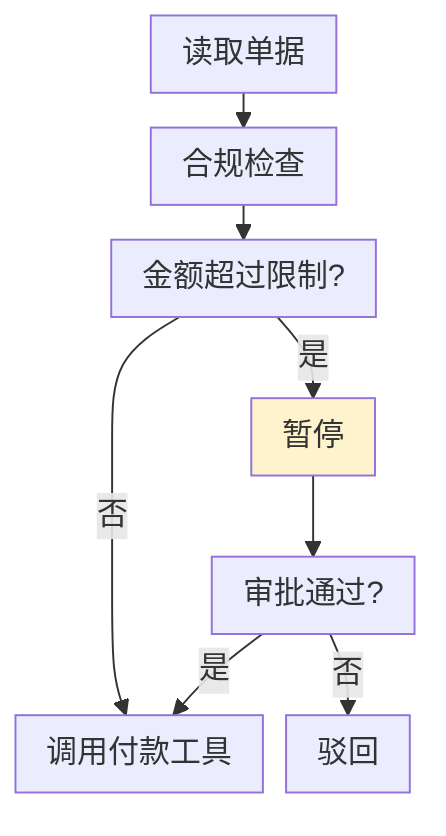
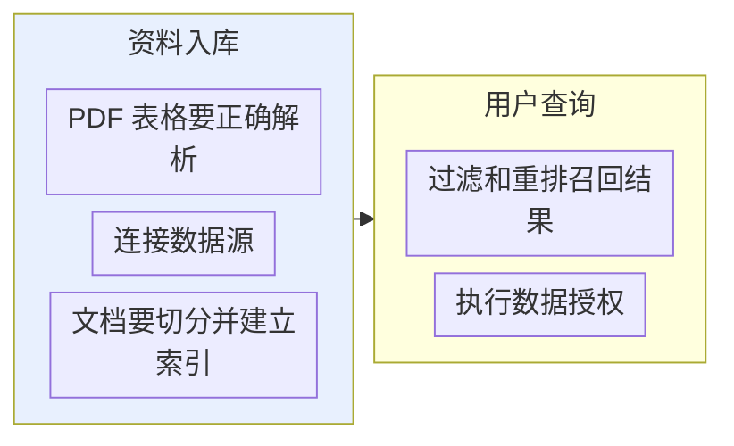
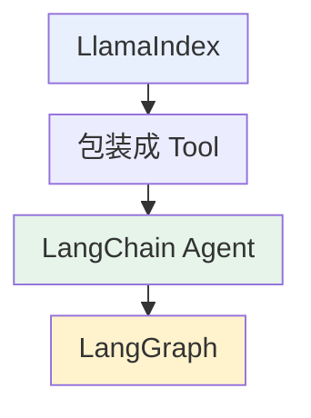
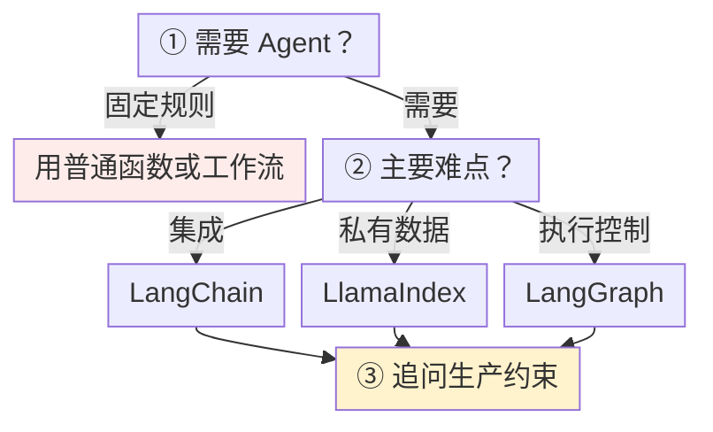

# 第一章：主流 AI Agent 开发框架概览

## 1.1 Agent 框架解决什么问题

不依赖任何框架时，要实现一个能查资料、调接口、记上下文的 Agent，通常至少要处理两类事情：

- 基础接入：接入模型、定义工具协议、实现 Agent 循环、把工具结果重新交回模型；
- 工程能力：状态管理、重试、超时、流式输出、人工确认、运行追踪。

一次演示能跑通并不难，难点在于系统执行十几步后还能恢复，并且出错时能快速定位。

Agent 框架就是把这些重复工程抽象成可复用组件。**但不同框架选择的重点并不相同**：

| 框架 | 重点 |
|---|---|
| **LangChain** | 通用组件和快速集成 |
| **LangGraph** | 状态与流程控制 |
| **LlamaIndex** | 数据与检索 |

比较框架时，更有用的问题是：在当前业务约束下，哪个框架更贴近项目的主要难点。

## 1.2 LangChain 的定位

LangChain 已经不只是早期那个「把多个 Prompt 串成 Chain」的库。它提供**模型、消息、Prompt、工具、结构化输出、中间件和 Agent** 等通用抽象，并集成了大量模型供应商、向量数据库和外部工具。

### 1.2.1 主要价值：集成范围广、开发速度快

需要切换不同模型，接入搜索、数据库或 MCP 工具，快速实现 RAG Agent、SQL Agent 或客服助手时，**LangChain 能省掉大量协议适配和样板代码**。

### 1.2.2 边界

**高层抽象更适合常见 Agent 模式。** 标准 Agent 可以直接配置 checkpointer 和人工审批中间件，不必为了暂停恢复重写图。只有当业务拓扑、状态字段或恢复边界超出标准循环与中间件的表达范围时，才需要下沉到 LangGraph。

## 1.3 LangGraph 与 LangChain 是什么关系

LangGraph 用 **State + Node + Edge** 表达 Agent 工作流：

| 概念 | 职责 |
|---|---|
| **State** | 保存共享状态 |
| **Node** | 执行模型或工具 |
| **Edge** | 决定下一步运行哪个节点 |

LangGraph 主要处理循环、条件分支、并行执行、持久化、暂停恢复和人工介入。

### 1.3.1 一个具体例子

图中各项的完整含义：

- 暂停 等待主管审批

这类流程通常更适合用图结构表达，而不是继续塞进单一 Agent 循环。

### 1.3.2 更准确的关系

**LangChain 的 Agent 高层接口现在运行在 LangGraph 之上。**

LangChain 提供常用组件和高层入口，LangGraph 提供底层执行、状态管理和恢复能力。简单 Agent 通常直接从 LangChain 入手；需要精细控制时，再下沉到 LangGraph。

**不要把两者说成互相替代的框架**——它们既有职责差异，也经常组合使用。

## 1.4 LlamaIndex 强在哪里

如果把 LlamaIndex 当成「另一个 LangChain」，很容易忽略它在私有数据链路上的侧重。**LlamaIndex 更强调在私有数据之上构建 AI 应用**：数据连接、文档解析、切分、索引、检索、重排、Query Engine、结构化数据访问，也可以把 RAG Pipeline 封装成 Agent 使用的工具。

### 1.4.1 企业知识库场景的难点不只在工具调用

图中各项的完整含义：

- 多种数据源要统一接入
- 确保不同用户只看到 自己有权访问的数据

企业知识库的问题会沿整条数据链路出现，不是多注册一个搜索工具就能解决。

这些需求使 LlamaIndex 成为企业知识库、文档 Agent、研究助手和复杂 RAG 系统的常见候选。不过，元数据过滤只是接入权限规则的手段，框架不会替应用识别登录身份或自动完成租户授权。

### 1.4.2 它也不只用于 RAG

LlamaIndex 同样提供 Agent、Memory、多 Agent Pattern 和 Workflow。

**从选型角度看**：LangChain 的入口更偏**通用 Agent 组装**，LlamaIndex 的优势更集中在**数据密集型应用**。

## 1.5 三个框架怎么配合

**它们不一定三选一。**

图中各项的完整含义：

- LlamaIndex 处理文档、建索引 提供检索结果
- LangChain Agent 决定何时调用
- LangGraph 负责查询改写、答案校验 人工审核、失败恢复 这些步骤如何衔接

**这是一种可选分工，不是互不重叠的能力划分。** LlamaIndex 也有工作流，LangChain 也有检索组件；同时引入三者时，应避免两套记忆、重试和追踪机制重复管理同一次请求。

> **但是否需要同时引入三者，取决于项目复杂度。** 只是简单工具调用，不必为了技术栈完整而引入 LlamaIndex；只是普通知识库问答，也不一定需要复杂的 LangGraph 工作流。

## 1.6 其他框架要了解到什么程度

| 框架 | 定位 | 适合 |
|---|---|---|
| **OpenAI Agents SDK** | 围绕 Agent、Runner、Tools、Handoffs、Guardrails、Sessions、Tracing 的**轻量开发方式** | 以 OpenAI 模型和接口为主，快速实现客服分流、语音助手、工具 Agent |
| **CrewAI** | 用**角色、目标、任务、团队**表达多 Agent 协作，通过 Flow 管理状态、条件和事件 | 研究报告、内容生产、多角色审核等**容易映射为团队分工**的场景。**但角色越多，调用成本和协作不确定性也越高** |
| **AutoGen / Semantic Kernel / Microsoft Agent Framework** | 微软生态中的不同代际与抽象；不能当作同一个产品 | 存量系统要审查迁移指南与支持状态，见 [第 19 章](../../04-semantic-kernel/19-process-and-agent-framework.zh.md)和[第 20 章](../../05-lightweight-agent-frameworks/20-autogen-and-crewai.zh.md) |
| **Dify** | **更接近低代码 AI 应用开发平台** | **不宜和 Python Agent 框架放在同一层面比较** |

## 1.7 选型顺序：从外到内收窄

图中条件与标签：

- 步骤固定、规则明确
- 模型和工具接入最费力
- 私有数据、文档解析、检索质量
- 复杂分支、循环、状态恢复

图中各项的完整含义：

- ① 这个任务 真的需要 Agent 吗?
- 用普通函数或工作流 更便宜、更稳定 本来能写成 if/else 的流程 交给模型只会增加不确定性
- ② 项目真正困难的 是哪一层?
- LlamaIndex 更贴近问题

### 1.7.1 第三步：Demo 能跑和系统能上线是两回事

流程越长，越需要补齐这些生产约束：

- 中断后能否恢复？
- 敏感动作是否需要审批？
- 重复执行会不会产生副作用？
- 不同用户的数据能否隔离？
- 出错后是否留有完整轨迹？

很多决定因素都在这些生产约束里，原型阶段往往还看不出来。

比较两个方案时，可以让它们完成同一批任务，并故意在「外部写入成功、返回结果前」制造超时。此时更值得讨论的是能否靠业务幂等键确认结果、恢复后会重复哪些步骤，以及代价增加在哪里。并行通常缩短关键路径等待，但所有分支仍会计费；多一层 Agent 还会增加上下文交接与模型调用，不应仅凭一次演示的响应速度选型。

### 1.7.2 掌握程度建议

| 框架 | 核心定位 | 更适合的场景 | 掌握程度 |
|---|---|---|---|
| **LangChain** | 通用模型、工具和 Agent 抽象 | 工具型 Agent、RAG Agent、SQL Agent | **重点掌握** |
| **LangGraph** | 有状态的图式流程编排 | 循环分支、暂停恢复、人工审批 | **重点掌握** |
| **LlamaIndex** | 数据接入、索引和检索 | 企业知识库、文档 Agent、复杂 RAG | **重点掌握** |
| **OpenAI Agents SDK** | OpenAI 技术栈下的轻量 SDK | 客服分流、语音助手、工具 Agent | 了解并按需深入 |
| **CrewAI** | 角色化多 Agent 协作 | 研究、内容生产、多角色审核 | 了解并按需深入 |

## 1.8 常见错误

### 1.8.1 一口气罗列十几个框架

如果一口气罗列十几个框架，后续讨论很容易退回到「只听过名字」的层面。围绕三个主力框架展开更稳。

### 1.8.2 把 LangChain 和 LangGraph 说成互相替代

**LangChain 的 Agent 高层接口就跑在 LangGraph 之上**，两者是分层关系。

### 1.8.3 把 LlamaIndex 当成「另一个 LangChain」

它的辨识度在整条数据链路：解析、切分、索引、重排、权限过滤。

### 1.8.4 跳过「这个任务真的需要 Agent 吗」这一步

**步骤固定、规则明确的流程用普通函数更便宜更稳定。**

### 1.8.5 只比功能数量不看业务约束

更关键的问题是「项目真正困难的是哪一层」。

### 1.8.6 只看 Demo 能不能跑

中断恢复、审批、幂等、数据隔离、可追溯这些生产约束才是决定项。

### 1.8.7 把 Dify 和 Python Agent 框架平级比较

它是低代码平台，不在同一层面。

## 1.9 本章总结

1. **框架解决的是重复工程**：模型接入、工具协议、Agent 循环，以及状态、重试、超时、流式、审批、追踪；
2. **难的不是跑通一次演示，是十几步之后能否恢复、出错能否定位**；
3. **三个主力框架各有侧重**：LangChain 偏通用组件与集成，LangGraph 偏有状态流程编排，LlamaIndex 偏数据与检索；
4. **LangChain 的价值是集成与高层入口**；标准暂停恢复可直接配置，复杂业务拓扑才需要显式图编排；
5. **LangGraph 用 State + Node + Edge 表达工作流**，解决循环、分支、并行、持久化、人工介入；
6. **两者是分层关系不是替代关系**——LangChain 提供高层组件与入口，LangGraph 提供底层执行与状态能力；
7. **LlamaIndex 的辨识度在整条数据链路**，而不是工具调用循环；
8. **三者可以组合**：LlamaIndex 供检索能力 → 包装成 Tool → LangChain Agent 决定调用 → LangGraph 编排外围流程；
9. **但不要为了技术栈完整而堆框架**；
10. **选型顺序是从外到内**：先问是否真的需要 Agent，再找项目最难的那一层，最后用生产约束做最终判断。

选框架时，更关键的是先判断项目最难的是模型接入、数据链路还是流程控制，再据此决定从哪个框架切入。

## 参考资料

<!-- centralized-bibliography -->
本章的参考资料、阅读建议与来源说明见[集中参考资料章节](../../../book/references.zh.md#reading-frameworks-01)。
