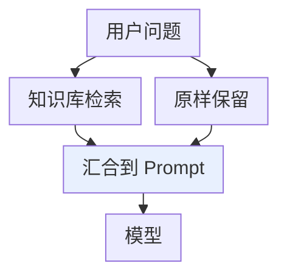
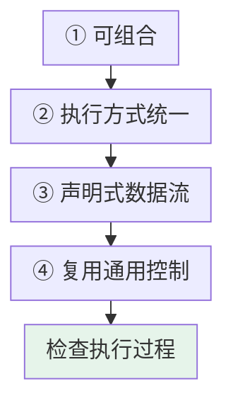
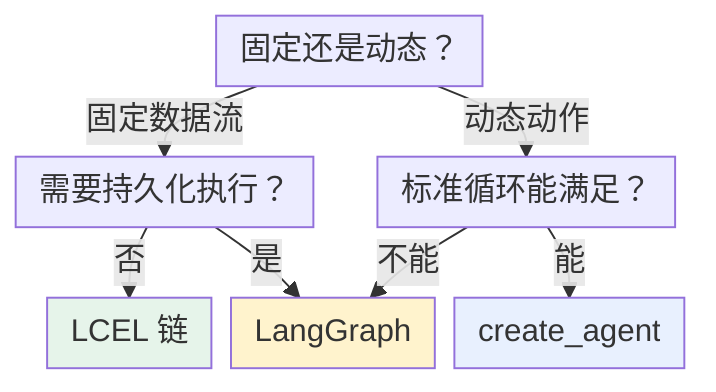

# 第二章：Chain 的设计理念与 LCEL

## 2.1 Chain 解决什么问题

以最简单的商品评价分类为例。完整过程**不是只调用一次模型**，而是：

```
清洗用户输入 → 把变量填进 Prompt → 调用模型 → 把返回的消息解析成业务需要的字符串
```

### 2.1.1 全部手写会遇到什么

- 这个函数返回字符串，下一个函数却要消息对象——**一堆胶水逻辑**；
- 同步调用写一套，异步调用再写一套；
- 想加流式输出、批处理、重试和链路追踪，**又得分别改造每一步**。

步骤只有三个时还能手写维护；等流程变成「问题改写 → 检索 → 文档整理 → Prompt → 模型 → 结构化解析」，接口转换、中间结果搬运和错误处理就会快速散落在各个步骤里。

### 2.1.2 Chain 的两个视角

| 视角 | Chain 是什么 |
|---|---|
| **业务视角** | 把多个处理步骤串成一个完整任务 |
| **软件设计视角** | **数据流编排和组件组合** |

**它先把各个零件收拢到统一调用协议，再按数据流接成完整任务。** 调用方不用逐个驱动内部步骤，只需要给整条链输入、从整条链拿输出。

## 2.2 Chain 只能线性执行吗

Chain 常被理解成从左到右的一根直线。最简单的 Chain 确实如此：

```
用户输入 → Prompt 模板 → Chat Model → 输出解析器 → 字符串答案
```

**但真实应用还可能出现并行分支和条件分支**：



### 2.2.1 更准确地说

> **Chain 描述了一张事先确定好的数据流图。** 节点负责处理数据，连接关系决定数据往哪里走。
>
> **即使某个节点内部调用了结果不确定的 LLM，流程拓扑本身仍然是开发者提前写好的。**

### 2.2.2 Chain 与 Agent 的分界

| | 谁决定下一步 |
|---|---|
| **Chain** | **开发者**决定「下一步调用谁」——偏**确定性编排** |
| **Agent** | **模型**根据当前状态动态决定「下一步做什么工具、是否继续循环」——偏**运行时决策** |

## 2.3 Runnable 解决了什么

Prompt、模型、检索器和解析器之所以能接在一起，是因为它们都实现了 Runnable。Runnable 是 LangChain 的统一调用协议：组件内部实现可以不同，只要遵守这套协议，就能被统一调用，也能继续和其他组件组合。

### 2.3.1 统一的执行接口

| 场景 | 接口 |
|---|---|
| 处理单个输入 | `invoke` / `ainvoke` |
| 输入变成一批 | `batch` / `abatch` |
| 边生成边展示 | `stream` / `astream`（**前提是内部组件真正支持流式**） |

执行方式统一之后，`with_config`、`with_retry`、`with_fallbacks` 才能在同一抽象上附加配置、重试和降级能力。

### 2.3.2 组合后的结果仍然是 Runnable

两个组件接成一条小链后，这条小链还可以继续接到更大的链里。因此可以先封装局部流程，再把它挂到更大的数据流上。

Runnable 还暴露**输入、输出和配置的 schema**，并允许通过 config 携带标签、元数据。这些能力让框架更容易检查数据契约，也方便 LangSmith 之类的追踪系统识别整条调用链里的**父子运行关系**。

### 2.3.3 但别把 Runnable 理解成魔法

**前一个步骤输出什么类型，后一个步骤就必须能够接住什么类型。**

| 组件 | 通常接收 |
|---|---|
| `ChatPromptTemplate` | 字典 |
| Chat Model | 格式化后的 Prompt Value 或消息 |
| `StrOutputParser` | 模型消息，输出字符串 |

**类型接不上，链照样会在运行时报错。**

## 2.4 LCEL 不只是语法糖

LCEL 全称 **LangChain Expression Language**，最显眼的写法是用 `|` 把 Runnable 接起来。

这里的 `|` 不是普通的 Python 管道：

> `prompt | model | parser` **声明的是三个 Runnable 的组合关系**，LangChain 会据此构造一个 `RunnableSequence`。在这个序列里，前一步的输出会作为后一步的输入。

### 2.4.1 一条完整的链

```python
from langchain.chat_models import init_chat_model
from langchain_core.output_parsers import StrOutputParser
from langchain_core.prompts import ChatPromptTemplate

# Prompt 本身就是 Runnable，输入是包含 product 和 review 的字典
prompt = ChatPromptTemplate.from_messages([
    ("system", "你是商品评价分类助手，只回答 positive、neutral 或 negative。"),
    ("human", "商品：{product}\n评价：{review}"),
])

# 统一的模型初始化入口，运行前需安装对应 Provider 包并配好密钥
model = init_chat_model("<provider>:<your-model-id>", temperature=0)

# LCEL 把三个步骤组合为 RunnableSequence
chain = prompt | model | StrOutputParser()

# 整条 chain 仍然是 Runnable
result = chain.invoke({
    "product": "机械键盘",
    "review": "手感不错，但空格键声音有点大。",
})
print(result)
```

这里的 `chain` 不是执行结果，而是一份已经组装好的「可执行流程」。只有调用 `invoke` 时，数据才真正从左向右流动。

**要异步不用重写内部流程**，改成 `await chain.ainvoke(...)`；批量用 `chain.batch([...])`；流式遍历 `chain.stream(...)`。

LCEL 的价值在于流程只组装一次，后续可以用同一套接口执行同步、异步、批量和流式调用。

### 2.4.2 流式能力的限制

`RunnableSequence` 会**尽量**保留各组件的流式能力，**但如果中间某个组件不支持流式转换，输出就要等它完成后才能继续流出**。

例如普通 `RunnableLambda` 默认不实现流式转换，**放错位置就可能推迟首个输出块**。

## 2.5 并行与汇合

**Runnable 不只支持串行，还支持并行。**

比如同一篇文章，既要生成摘要又要给出标题——两个任务互不依赖，没必要先后等待：

```python
from langchain_core.runnables import RunnableParallel

parser = StrOutputParser()

summary_chain = (
    ChatPromptTemplate.from_template("用两句话总结这篇文章：\n{article}")
    | model | parser
)
title_chain = (
    ChatPromptTemplate.from_template("为这篇文章起一个简洁标题：\n{article}")
    | model | parser
)

# 两个分支接收相同的输入字典，分别执行不同任务
chain = RunnableParallel(summary=summary_chain, title=title_chain)

result = chain.invoke({"article": "这里放待处理的文章正文"})
print(result["title"], result["summary"])
```

| 原语 | 解决 |
|---|---|
| `RunnableSequence` | **先做 A，再做 B** |
| `RunnableParallel` | **把相同输入同时交给 A 和 B** |

在 LCEL 里，字典也可以在组合上下文中被自动转换为 `RunnableParallel`。显式写出类名时，执行模型会更直观。

并行不等于免费加速：两个分支串行耗时近似相加，并行的理想耗时接近较慢分支加调度开销，但 Token 和调用费用仍需相加。用 `config={"max_concurrency": 4}` 控制适用 Runnable 的并发只是局部限制，还要协调模型服务的配额与重试。默认 `batch` 通常是客户端并发，不等于供应商的离线 Batch API，也不承诺批量折扣。

重试范围也会改变成本和语义：给整条链加 `with_retry` 可能重复已成功的检索或外部写入；只想重试模型调用时，应把重试附着在模型这个 Runnable。失败分支是否允许降级，需要业务明确规定，不能用空字符串伪装成成功。

## 2.6 为什么统一协议能不断扩展

统一协议的价值不只在「方便串起来」，还在于它让流程可以逐步扩展：



图中各项的完整含义：

- ① 可组合 每个步骤只处理自己的输入输出 小链可以继续组成大链 换掉某个模型/解析器/检索器 不必推翻整条业务流程
- ② 执行方式统一 单次、异步、批量、流式收拢到统一接口 组合后的流程才有机会继承这些能力
- ③ 声明式数据流 主要表达『数据先去哪，再去哪』 不用把线程调度、回调传递、中间结果搬运 混在业务逻辑里
- ④ 横切能力可复用 重试、回退、标签、元数据、追踪 可以附着在某个 Runnable，也可作用于整条链
- 生产排查时看到的不再只是最终报错 而是这次运行究竟经过了哪些子步骤

这里的限制也要一并看到：接口统一只代表调用方式一致，**最终效果仍取决于内部组件是否真正支持对应模式**。

## 2.7 旧式 Chain 为什么被弃用

这是版本迁移里最常见的混淆点。

### 2.7.1 旧式 Chain 的问题

早期 LangChain 提供大量**面向具体场景的类**：`LLMChain` 封装 Prompt 加模型，`SequentialChain` 把多条旧式 Chain 顺序连接。它们在老项目和老教程里非常常见，**所以很多人会误以为这就是今天的标准答案**。

问题在于：

> 专用 Chain 类越来越多，**每个类的输入字段、返回结构和扩展方式不完全一致**。开发者既要记住大量类名，又很难把它们自由拼装。

### 2.7.2 方向的转变

**从「为每个场景造一个专用类」转向「提供少量统一原语，让开发者自己组合」。**

`LLMChain(prompt=prompt, llm=model)` 能做的事，现在通常直接写成 `prompt | model | parser`——**数据流更清楚，组合能力也更一致**。

### 2.7.3 现状

LangChain v1 的迁移指南已经把旧式 chains 明确移到 **`langchain-classic`**，其中包括 `LLMChain`、`ConversationChain`、`SequentialChain` 等旧 API。

> **它们不是突然不能运行了。** 维护旧系统时仍可以安装兼容包，**但新项目不应该因为看到旧教程就继续把这些当成首选**。

**正确的态度**：看到老代码里的 `LLMChain` 要能读懂它过去解决了什么问题；写新代码时优先用 Runnable 与 LCEL。

## 2.8 三种编排方式怎么选

Chain 适合固定数据流，不适合把所有流程都塞进一条超长 LCEL。



图中条件与标签：

- 模型动态选择

图中各项的完整含义：

- 主要是固定数据流 还是模型动态选择动作?
- 需要跨调用恢复 或长时间等待?
- Chain（Runnable + LCEL） 检索、分类、摘要等短流程
- LangGraph 显式编排 设计状态与恢复边界
- 标准 Agent 循环 与中间件能否表达?
- create_agent 可配置检查点与工具审批

固定、短小的数据流通常先用 Chain；运行时要由模型决定下一步时，考虑 Agent。图中「步骤已知」也不是排除 LangGraph 的条件：确定性的长流程同样可能需要持久化、人工等待和恢复边界，此时可直接选择 LangGraph。

LangGraph 不是为了取代每一条简单 Chain，而是处理 Chain 难以清楚表达的长时、有状态工作流。

## 2.9 常见错误

### 2.9.1 把 Chain 缩小成「一次 LLM 调用」

**一次模型调用只能算流程中的一个节点。**

### 2.9.2 把 Chain 等同于 `LLMChain` 这个具体类

旧类只是早期实现。今天谈 Chain 重点应放在**如何用 Runnable 组织完整数据流**。

### 2.9.3 认为 Chain 只能线性执行

它描述的是一张**事先确定好的数据流图**，可以有并行分支和条件分支。

### 2.9.4 把 `|` 当成能自动修好一切的魔法

**LCEL 负责组合，不会猜测业务语义。** 上下步类型不匹配时仍要用 `RunnableLambda`、`RunnablePassthrough`、`itemgetter` 或显式转换函数整理数据。

### 2.9.5 认为统一接口意味着组件天然具备相同能力

**某一步不支持流式转换，整条链的首个输出就会被推迟；模型没有服务端批处理能力，调用 `batch` 也不会凭空获得最优性能。**

### 2.9.6 把 Chain 和 Agent 混为一谈

**Chain 的连接关系由代码预先确定，Agent 的动作路径由模型在运行中选择。** 二者可以组合，但不能因为都调用了模型就混同。

### 2.9.7 没有版本意识

`LLMChain`、`SequentialChain` 已是 legacy，被移入 `langchain-classic`。**新项目不要照抄旧教程。**

### 2.9.8 只写字典简写不知道背后生成了什么

字典在组合上下文里会被转成 `RunnableParallel`，**要能说出显式类名**。

## 2.10 本章总结

1. **Chain 解决的是胶水逻辑爆炸**：类型不匹配、同步异步各写一套、横切能力要逐步改造；
2. **它是确定性的数据流编排**——事先确定好的数据流图，节点处理数据、连接决定走向；
3. **Chain 与 Agent 的分界是「谁决定下一步」**：开发者 vs 模型；
4. **Runnable 提供统一调用协议**，收拢了 invoke / batch / stream 及其异步版本；
5. **组合后的结果仍是 Runnable**，所以小链能继续嵌进大链；
6. **但类型必须接得上**，Runnable 不是魔法；
7. **LCEL 的 `|` 声明的是组合关系**，生成 `RunnableSequence`，`chain` 是流程不是结果；
8. **流式能力会尽量传播，但被不支持流式的中间组件卡住**；
9. **`RunnableParallel` 解决同一输入分发到多个分支**，与 Sequence 组合可表达大量固定流程；
10. **统一协议的价值链条**：可组合 → 执行方式统一 → 声明式数据流 → 横切能力复用 → 可观测；
11. **旧式 Chain 被移入 `langchain-classic`**，方向是从「专用类」转向「少量统一原语自由组合」；
12. **三层选型**：固定数据流用 Chain，动态工具决策用 `create_agent`，有状态长流程用 LangGraph。

Runnable 是统一调用协议，Chain 是用这些组件组成的数据流，LCEL 则是声明组合关系的一种方式。分清这三个概念，才能判断重试、流式和追踪应该加在哪一步。

## 参考资料

<!-- centralized-bibliography -->
本章的参考资料、阅读建议与来源说明见[集中参考资料章节](../../../book/references.zh.md#reading-frameworks-02)。
