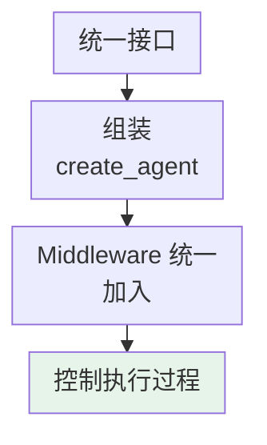
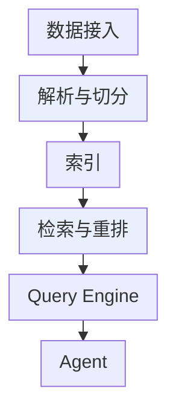

# 第七章：LangChain 与 LlamaIndex 的分工

## 7.1 为什么容易混淆

两个框架都支持模型调用、Tools、RAG、Agent 和 Workflow。只看功能清单，很容易得出「它们差不多」的结论。

> 更有区分度的是设计重心：
>
> - **LangChain** 更关心如何**统一模型与工具，并快速组装通用 Agent**；
> - **LlamaIndex** 更关心如何把**私有数据加工成高质量上下文**，再交给模型或 Agent 使用。

## 7.2 核心区别

| 维度 | LangChain | LlamaIndex |
|---|---|---|
| **设计重心** | 通用 Agent 组装和工具集成 | 数据接入与上下文增强 |
| **主要优势** | 模型、Tools、中间件和第三方集成 | 文档处理、索引、检索和重排 |
| **常见场景** | 工具型 Agent、SQL Agent、业务助手 | 企业知识库、文档 Agent、复杂 RAG |
| **复杂流程** | 通过 LangGraph 管理状态、恢复和人工介入 | 使用 Workflows，或与 LangGraph 组合 |

> **这张表比较的是优势重心，不是能力边界。** LangChain 也有完整的 RAG 组件，LlamaIndex 也能创建 Agent；**区别在于哪一套抽象更贴近项目的主要问题**。

## 7.3 LangChain 强在哪里

**如果项目需要接入多个模型、搜索、数据库、浏览器、MCP Server 和公司内部 API**，最大的工程成本往往是**不同接口之间的适配**。



图中各项的完整含义：

- 统一 Model / Message / Tool / Structured Output 接口 屏蔽厂商差异
- create_agent 组装模型与工具
- Middleware 统一加入 权限、重试、摘要、动态模型选择、人工审批
- 流程复杂到需要精细控制分支、并行和恢复时 继续下沉到 LangGraph 不必推翻已定义好的模型与工具

**它的主要难点**：让模型**选对工具、填对参数**，并把权限、重试和审批统一接入调用过程。

> **LangGraph 是 LangChain Agent 的底层运行时。** 标准循环中的暂停恢复和工具审批可直接配置 `create_agent`；只有业务拓扑需要额外控制时，才显式编写状态图。

## 7.4 LlamaIndex 强在哪里

**真实 RAG 项目的困难通常不止是把文档放进向量数据库。**

| 阶段 | 真实困难 |
|---|---|
| **数据刚进来** | PDF 表格、跨页内容、切分方式、元数据；同一制度多个版本，**要判断哪一份仍然有效** |
| **查询阶段** | 决定走向量检索、关键词检索还是结构化数据库 |
| **多路结果回来后** | 过滤、重排、**处理冲突** |

> **难点沿着「数据进入 → 建立索引 → 发起检索 → 组织上下文」一路传递，而不是某一个向量库能单独解决。**



> **LlamaIndex 把「如何得到高质量上下文」当作主要工程问题。**

企业文档、多数据源路由和复杂检索是它更自然的应用入口。

更准确地说，**LlamaIndex 的优势重心在数据**，而不是「只能做 RAG」——它同样提供 Agent 和事件驱动 Workflow。

## 7.5 应该如何选型

选型时先看项目最怕哪类风险。

| 项目主要风险 | 优先评估 | 原因 |
|---|---|---|
| 模型和业务工具太多，集成复杂 | **LangChain** | 通用组件和工具接口更自然 |
| 文档解析、切分和检索质量差 | **LlamaIndex** | 数据与上下文链路抽象更细 |
| 流程需要暂停恢复和人工审批 | **LangGraph**，可搭配 LangChain | 状态与执行控制是核心能力 |
| 同时需要复杂检索和复杂流程 | **LlamaIndex + LangChain/LangGraph** | 数据层与编排层分别选合适组件 |

> **如果只是简单知识库或单工具 Agent，没有必要为了架构完整同时引入两套框架。**
>
> 组合会增加依赖、追踪和调试成本，**只有当两边确实解决独立难题时才值得**。

## 7.6 两者如何组合

**最常见的组合边界是 Tool。**

```python
# LlamaIndex Query Engine 被包装成 LangChain 可以调用的 Tool
@tool
def search_company_knowledge(question: str) -> str:
    """查询企业知识库。"""
    return str(query_engine.query(question))

# LangChain Agent 负责判断何时查询知识库，何时调用订单工具
agent = create_agent(
    model=chat_model,
    tools=[search_company_knowledge, lookup_order],
)
```

| 层 | 谁负责 |
|---|---|
| 数据加载、构建索引、Query Engine | **LlamaIndex** |
| 判断什么时候调用、工具选择 | **LangChain Agent** |
| 审批、重试、恢复 | **LangGraph** |

> **这段代码表达的重点是职责边界。** 生产环境还需要补充**租户权限、引用来源、超时和可观测性**。

`str(query_engine.query(...))` 只展示答案文本边界，可能丢失 `source_nodes` 等证据元数据，而且 Query Engine 若已经调用一次生成模型，外层 Agent 再总结就有两次生成成本和事实漂移风险。需要可核验引用时，应把答案与经权限过滤的证据 ID、片段、来源版本分别传递；若外层模型负责最终写作，可以直接暴露 Retriever 的证据结果，避免重复生成。

判断这种组合是否值得，不能只测最终答案：固定同一批文档、切片和问题，分别比较召回质量、引用支持率、生成次数、P95 延迟，以及单框架基线。两层各自配置三次尝试，最坏可能放大成九次底层请求；因此跨边界的 deadline、取消和重试预算应由一层统一负责。

## 7.7 常见错误

### 7.7.1 用「LangChain 做 Chain，LlamaIndex 做 RAG」这个过时标签

**两者都能做 Agent、工具调用和 RAG**，区别是设计重心。

### 7.7.2 以为 LangChain 只会把 Prompt 串成 Chain

**当前主线已经转向 Agent**，固定流程才由 Runnable 和 LCEL 承担。

### 7.7.3 以为 LlamaIndex 是向量数据库

**它能连接向量库，但本身是数据处理、索引、检索与上下文组织的抽象。**

### 7.7.4 按功能清单比框架

**功能重叠不代表设计重心相同**，要看哪套抽象更贴近你的主要难题。

### 7.7.5 认为必须二选一

可以通过 **Tool 或服务接口**组合。

### 7.7.6 为了架构完整同时引入两套

**简单知识库或单工具 Agent 不需要**，多一套依赖只增加调试成本。

### 7.7.7 把 RAG 难点简化成「选个向量库」

**难点沿数据进入 → 索引 → 检索 → 组上下文一路传递。**

### 7.7.8 组合时忘了生产要素

租户权限、引用来源、超时、可观测性**都不会自动来**。

## 7.8 本章总结

1. **不要再用过时标签**，两者都能做 Agent、工具调用和 RAG；
2. **真正的区别是设计重心**：LangChain 偏通用 Agent 组装与工具集成，LlamaIndex 偏数据接入与上下文增强；
3. **LangChain 的价值在屏蔽接口差异**：统一 Model / Message / Tool / 结构化输出，再用 `create_agent` 组装，Middleware 统一横切；
4. **复杂流程可以从 LangChain 下沉到 LangGraph**，不必推翻已有模型与工具定义；
5. **LlamaIndex 的价值在把「如何得到高质量上下文」当成核心工程问题**，链路拆得更细；
6. **RAG 的困难是链式传递的**，不是某个向量库能单独解决；
7. **选型先看项目最怕哪类风险**，再决定优先评估谁；
8. **最常见的组合边界是 Tool**：LlamaIndex 管数据与检索，LangChain 管模型和工具选择，LangGraph 管状态与恢复；
9. **组合有成本**，只有两边各自存在独立难题时才值得。

> 可以把分界记成这样：LangChain 先解决模型与工具怎么统一和调度，LlamaIndex 先解决私有数据怎么变成高质量上下文；两类问题同时存在时，再用 Tool 把它们接起来。

## 参考资料

<!-- centralized-bibliography -->
本章的参考资料、阅读建议与来源说明见[集中参考资料章节](../../../book/references.zh.md#reading-frameworks-07)。
