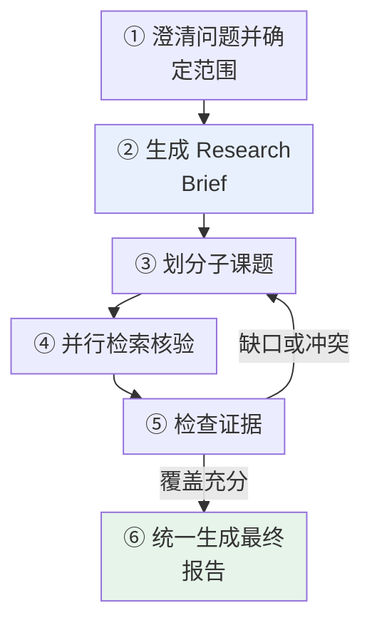
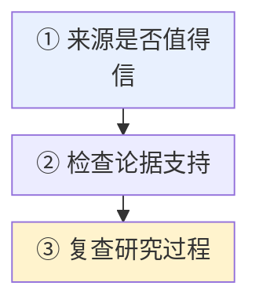
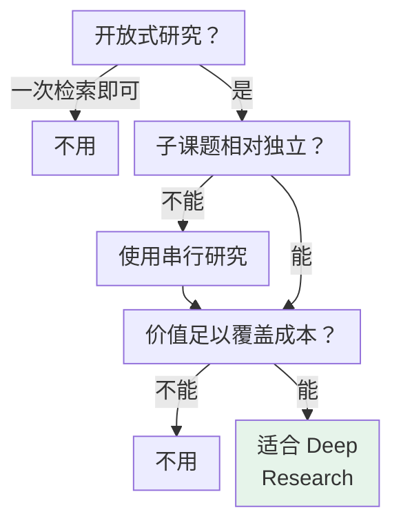

# 第十二章：Deep Research 的实现逻辑

## 12.1 Deep Research 是什么

简单事实问答可能一次检索就能得到答案；开放研究任务往往一开始就没有固定路径。需要多跳检索的普通问答与 Deep Research 并无严格次数分界。

例如比较三家云厂商的 Agent 托管能力，需要分别查产品定位、价格、限制和区域差异，还要处理**产品改名、资料过期和来源矛盾**。

> Deep Research 关注的是一套研究流程：系统要围绕研究目标决定下一步搜什么、哪些问题可以并行、证据是否充分，以及何时停止。

### 12.1.1 生态里几个名字的区别

| 名字 | 定位 |
|---|---|
| **LangChain** | 提供模型、工具和 Agent 等**高层积木** |
| **LangGraph** | 负责**有状态流程如何编排和运行** |
| **open_deep_research** | 展示一套**具体研究流程** |
| **Deep Agents** | 构建在 LangGraph 上的 Python **agent harness**：提供规划、子 Agent、上下文管理和文件系统工具；不是一个保证研究正确性的托管研究产品 |

> 边界需要明确：Deep Agents 是单独安装的 `deepagents` SDK/harness，不是 LangChain 核心包的开关，也不替你提供模型、身份系统、业务授权、数据治理或安全隔离。`task` 子 Agent 默认是一次性、隔离上下文后只回传最终报告；任务清单从 v0.7 起是 opt-in，不应假设每个 Deep Agent 都会规划或长期记忆。

这里的 `task` 指同步子 Agent：主调用等待它完成，不代表所有委派都能后台运行。官方另有 async subagents，用于长任务、运行中追加指令和取消，依赖实现 Agent Protocol 的服务端，可以是 LangSmith Deployment，也可以自行托管兼容服务。不能把同步子任务包装成线程就宣称已经具备持久化后台调度。可选任务清单也不等于模型一定产生有效研究计划。

## 12.2 核心流程

图中条件与标签：

- 发现缺口或冲突

图中各项的完整含义：

- ③ Supervisor 拆分子课题
- ④ Researcher 并行检索与核验
- ⑤ 压缩证据并检查研究缺口

| 步骤 | 关键点 |
|---|---|
| **① 范围澄清** | 用户只说「研究某家公司」时，要确认是关注**投资价值、技术路线还是就业风险**，否则后续搜索很容易跑偏 |
| **② Research Brief** | 把用户目标、研究维度、时间范围、来源要求和交付形式整理成**稳定的成功标准** |
| **③ 拆分子课题** | **只有相对独立的问题才适合并行**（如分别研究三家公司的定价）；后一个问题依赖前一个结论就应该串行 |
| **④ 多轮检索** | 每个研究员**只处理一个主题**，并**保留来源信息** |
| **⑤ 压缩与查缺** | **不是把所有网页原文塞回 Supervisor**，而是压缩成**带出处的关键证据**；再检查 Brief 是否被覆盖 |
| **⑥ 统一写作** | 组织论证、处理重复内容，**将事实、推断和不确定性分开表达** |

## 12.3 为什么需要子 Agent

**如果一个 Agent 同时研究多个主题**，搜索结果会不断占用同一个上下文——A 公司的价格、B 公司的安全文档和 C 公司的失败请求混在一起，**模型反而更难关注当前证据**。

### 12.3.1 第一目的是隔离上下文

> **每个 Researcher 只处理一个子课题，最终只返回压缩后的结论和来源，主 Agent 不必背着全部搜索过程继续思考。**

这里隔离的是消息上下文，不是操作系统权限或所有存储。Deep Agents 的默认 State backend 文件可由主 Agent 与子 Agent 共享；需要保密隔离时，还要分别配置工具权限和存储边界，不能只靠委派。

### 12.3.2 并行是隔离之后的自然结果

- 相互独立的研究任务可以同时执行，**整体等待时间下降**；
- **彼此依赖的任务却仍要按顺序完成**。

> **Agent 数量越多，模型调用、搜索费用、限流和协调成本也越高。不能为了并行而并行，关键仍是子课题能否独立推进。**

### 12.3.3 为什么不让子 Agent 分别写报告章节

> **因为各章节可能重复背景、使用不同口径，甚至得出相互冲突的结论。**
>
> **并行搜证据、统一写报告**，更容易保持全文一致性。

## 12.4 如何保证研究质量

**研究报告很长、链接很多，并不代表质量高。**

判断质量时，可以沿着「来源 → 证据 → 结论」反向追查：

图中各项的完整含义：

- ① 来源是否值得信 官方文档、论文、监管文件、一手资料更接近原始事实 多篇转载可能都来自同一篇文章 不能因为链接数量多就当成交叉验证
- ② 来源是否真的支持当前结论 报告应把事实、推断和不确定性分开 遇到冲突时追查发布时间、统计口径和原始出处 而不是挑一个最符合预期的答案
- ③ 结论仍不稳就回到研究过程 搜索词是否漏掉关键限定 子课题是否重复 停止条件是否过早 工具失败后有没有换用有效来源

### 12.4.1 评测既看答案也看轨迹

| 维度 | 检查 |
|---|---|
| 最终答案 | 是否覆盖 Brief |
| **研究轨迹** | 搜索路径是否合理 |
| **来源覆盖率** | 关键维度是否都有证据 |
| **引用正确性** | 引用是否真的支持结论 |
| 耗时与成本 | 是否在预算内 |

> **通用 Benchmark 可以用于版本比较，但不能代替企业自己的业务数据集。**

证据压缩后至少保留「主张、原文片段、URL/文档 ID、页码或段落位置、来源版本与抓取时间」。写作模型使用这些证据 ID，而不是凭记忆重新生成链接；最后逐项验证引用是否支持相邻主张，并统计需要引用却缺少证据的主张。一个链接真实存在只能证明可访问，不能证明结论正确；多篇转载也不构成多个独立来源。

停止条件不宜只写「继续直到充分」：设定必须覆盖的研究维度、未解决冲突清单、连续补搜的新增有效证据量，以及硬性时间/费用上限。预算耗尽时应交付部分结论并标明缺口，而不是让总结模型把未查到的内容补成肯定事实。

## 12.5 如何控制成本和安全

### 12.5.1 成本受「宽度」和「深度」双重影响

| 维度 | 含义 | 控制手段 |
|---|---|---|
| **宽度** | 并行研究单元数量 | **限制同时运行的研究单元** |
| **深度** | 每个 Researcher 和 Supervisor 最多迭代多少轮 | **限制工具调用次数和补搜轮数** |

**单个分支有上限还不够**——整项任务还要设置**总 Token、搜索费用和超时预算**，再补上失败重试、缓存、限流和取消策略。

> 这样才能明确继续、降级或停止的条件。

### 12.5.2 网页和外部文档都是不可信输入

> **它们可能包含诱导 Agent 泄露密钥或执行危险操作的提示词注入。**

| 措施 |
|---|
| 研究工具**优先只读** |
| 内部数据遵循**最小权限** |
| **密钥不要暴露给搜索或沙箱环境** |
| 高风险操作**必须人工审批并保留 Trace** |

> **对于金融、医疗、法律和安全决策，Deep Research 只能辅助资料整理，不能因为报告带有引用就取消专家复核。**

### 12.5.3 Deep Agents 的文件系统与沙箱边界

Deep Agents 向模型提供的是**可插拔 backend 后面的文件系统工具面**：`ls`、`read_file`、`write_file`、`edit_file`、`delete`、`glob`、`grep`。这不是抽象概念——给错 backend 就可能让模型读写真实文件。

| Backend / 场景 | 数据与能力 | 安全边界 |
|---|---|---|
| 默认 State backend | 文件随 LangGraph state/checkpointer 在**同一 thread**内保存 | 适合临时工作区；不跨 thread 共享 |
| `StoreBackend` | 文件跨 thread 持久化 | namespace、租户隔离、保留与删除策略由应用负责 |
| `FilesystemBackend` | 读写真实本地文件 | `root_dir` 本身不是访问限制；需配合 `virtual_mode=True` 约束文件工具路径，仍不等于进程沙箱 |
| `LocalShellBackend` | 本机文件系统，另有 `execute` | **没有隔离**；仅限受控开发环境 |
| Sandbox backend | 隔离的文件系统和 `execute` | 适合不可信代码与自主 Agent；仍须限制网络、凭证、挂载目录、资源和生命周期 |

> 上表中 Sandbox 和 LocalShell backend 提供 shell `execute`，自定义 backend 或工具还可能扩展能力。Sandbox 是隔离边界，不是「默认安全」的同义词：把最小权限凭证按需注入，使用只读/受限网络与 CPU、内存、时间配额，并在删除、外发、付费调用等动作前启用 `interrupt_on` 审批。不要把宿主机的环境变量或云凭证直接暴露给 Agent。

官方说明 `FilesystemBackend` 默认 `virtual_mode=False`，即使设置 `root_dir` 也不提供路径安全边界。启用虚拟路径后仍应只暴露专用最小目录；若同时开放本机 shell，命令可以绕过文件工具的路径约束，必须另用受限执行环境。

**推荐组合**：临时中间产物放 thread-scoped State backend；经审核、需要跨会话保留的资料放带租户 namespace 的 Store backend；代码执行放一次性 sandbox。需要同时使用时用 Composite backend 按路径路由，而不是把所有数据和权限放进一个可写本地目录。

## 12.6 哪些场景适合

先判断是否需要动态、多轮的证据收集，再判断是否值得使用并行研究员。能否拆成独立子课题只影响并行方案，不是 Deep Research 的必要条件：

图中条件与标签：

- 一次权威检索就能回答

图中各项的完整含义：

- 问题是否开放到 需要多轮搜索和动态调整方向?
- 不用 复杂研究流程只会增加成本
- 能否拆出相对独立的子课题?
- 使用串行研究 避免强行并行
- 报告价值能否覆盖 多轮模型与搜索成本?

**典型场景**：竞品分析、技术路线调研、文献综述、供应商尽调、政策影响研究，以及企业内部资料与公开信息的联合分析。

**不适合的情形**：

| 情形 | 原因 |
|---|---|
| 只查一个容易核验的实时事实 | **一次权威搜索更快、更便宜** |
| 多个子任务必须严格共享中间状态 | 不适合强行并行；可采用串行研究或显式依赖工作流 |
| 数据源本身不可靠或没有访问权限 | **研究 Agent 也无法凭空得到正确答案** |

## 12.7 常见错误

### 12.7.1 把 Deep Research 理解成「搜索很多次」

重点在于动态决定搜什么、能否并行、证据够不够、何时停止。

### 12.7.2 把它当成 LangChain 核心包里的一个开关

**它是一类研究型 Agent 架构**，参考实现和通用框架定位不同。

### 12.7.3 跳过范围澄清直接开搜

**Brief 不明确，后续所有搜索都可能跑偏。**

### 12.7.4 把有依赖关系的子课题也并行

**后一个依赖前一个结论时必须串行。**

### 12.7.5 把网页原文全部塞回 Supervisor

**应该压缩成带出处的关键证据**，否则上下文很快被占满。

### 12.7.6 让子 Agent 分别写报告章节

**会重复背景、口径不一、结论冲突**，应并行搜证据、统一写报告。

### 12.7.7 用链接数量当交叉验证

**多篇转载可能都来自同一篇文章。**

### 12.7.8 遇到冲突挑一个最符合预期的答案

**要追查发布时间、统计口径和原始出处。**

### 12.7.9 只控制单分支迭代不设总预算

**整项任务还要有总 Token、搜索费用和超时上限。**

### 12.7.10 把网页内容当可信输入

**提示词注入可能诱导泄露密钥或执行危险操作**，研究工具应优先只读。

### 12.7.11 因为报告有引用就取消专家复核

**金融、医疗、法律和安全决策它只能辅助。**

### 12.7.12 只用通用 Benchmark 评测

**不能代替企业自己的业务数据集。**

### 12.7.13 把 Deep Agents 当成默认隔离环境

文件工具和 `execute` 的权限由 backend 决定；`LocalShellBackend` 直接操作宿主机。对不可信输入或自主代码执行，应选 sandbox，并单独约束凭证、网络、挂载和资源。

## 12.8 本章总结

1. **Deep Research 是一类研究型 Agent 架构**，不是核心包中的一个开关；
2. **本章参考实现使用 LangChain 与 LangGraph**，研究型 Agent 的一般方法并不依赖这套框架；
3. **六步流程**：明确范围 → 生成 Brief → 拆分子课题 → 并行检索核验 → 压缩证据查缺 → 统一写作；
4. **Research Brief 明确成功标准**，可以降低搜索偏离目标的风险；
5. **只有独立子课题适合并行**，有依赖就串行；
6. **子 Agent 的第一目的是隔离上下文**，并行是隔离之后的自然结果；
7. **并行搜证据、统一写报告**，避免章节重复与结论冲突；
8. **质量沿「来源 → 证据 → 结论」反向追查**，链接多不等于交叉验证；
9. **评测既看答案也看轨迹、覆盖率、引用正确性、耗时和成本**；
10. **成本受宽度和深度双重影响**，单分支上限之外还要有总预算和取消策略；
11. **外部文档是不可信输入**：工具只读、最小权限、密钥隔离、高风险人工审批；
12. **开放程度和报告价值决定是否研究，子课题独立性决定是否并行**；串行研究同样可以是 Deep Research；
13. **Deep Agents 是 SDK/harness 而非安全或正确性承诺**：文件、持久化和 shell 权限取决于 backend；不可信代码要在受限 sandbox 中执行。

> 可以把它理解为：把一个没有固定路径的研究任务，拆成「Supervisor 规划补缺 + Researcher 隔离上下文并行搜证 + 统一写作」的有状态流程；能否上线，还取决于宽度、深度、预算、来源可信度和提示词注入风险是否被一起控制。

## 参考资料

<!-- centralized-bibliography -->
本章的参考资料、阅读建议与来源说明见[集中参考资料章节](../../../book/references.zh.md#reading-frameworks-12)。
