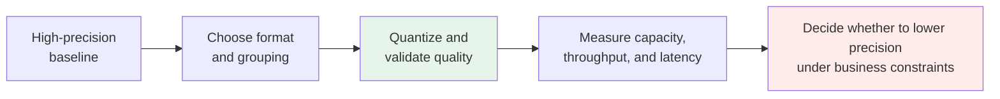
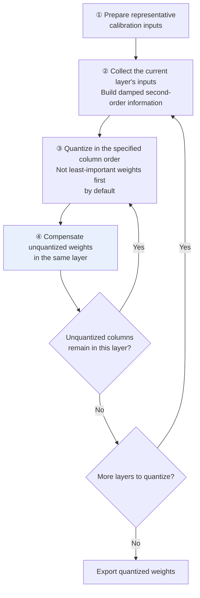

# Chapter 15: Model Quantization

## 15.1 What quantization does, and when it is worthwhile

Quantization represents weights or intermediate states with fewer bits. Training typically uses mixed precision, potentially combining BF16/FP16 with FP32 master weights or optimizer states; hardware-specific low-precision training also exists. Not every training tensor uses the same format.

Considering only ideal raw weight storage, in decimal GB:

| Model | FP16 weights | INT4 weights |
|---|---|---|
| 7B | $7 \times 10^9 \times 2 = 14$ GB | $7 \times 10^9 \times 0.5 = 3.5$ GB |
| 70B | $70 \times 10^9 \times 2 = 140$ GB | $70 \times 10^9 \times 0.5 = 35$ GB |

A 70B model's roughly 140 GB of raw FP16 weights does not imply a minimum of four A100 80GB GPUs. Two GPUs may have enough aggregate capacity for the weights, but the target context and concurrency also require KV storage, activations, communication buffers, workspace, and sharding or replication overhead.

Actual INT4 storage includes scales, zero points, alignment, and unquantized layers, so it usually exceeds the table's figures. Fitting a quantized model on one GPU does not establish acceptable latency or concurrency for the target workload.

### 15.1.1 A second potential benefit: speed

Low-bit weights reduce weight memory traffic: 4-bit weights need one-quarter of the data of 16-bit weights. End-to-end speed, however, depends on matching hardware kernels, dequantization overhead, batch size, and whether the KV cache is the bottleneck. Bit width alone cannot establish a fixed speedup.

### 15.1.2 It is not a free lunch

Mapping continuous weights into a finite representation introduces representation error. Whether task quality drops, and by how much, depends on the format, calibration, model, and task. Quantization algorithms address a central question:

> **How can high-precision values be represented at low precision with as little accuracy loss as possible?**

## 15.2 The core mechanism: mapping continuous values to discrete levels

First specify the integer range. For **asymmetric unsigned 4-bit quantization**, let $q_{\min}=0$ and $q_{\max}=15$. Given a calibration range $[x_{\min},x_{\max}]$:

$$
s = \frac{x_{\max}-x_{\min}}{q_{\max}-q_{\min}},\qquad
z = \mathrm{clip}\left(q_{\min}-\mathrm{round}\left(\frac{x_{\min}}s\right),q_{\min},q_{\max}\right)
$$

$$
q=\mathrm{clip}\left(\mathrm{round}\left(\frac{x}{s}\right)+z,q_{\min},q_{\max}\right),\qquad
\hat{x}=s(q-z)
$$

For the range $[-2.5,2.5]$, using ties-to-even rounding gives $s=5/15=1/3$ and $z=8$. For $x=0.7$, q=10 and the dequantized value is 2/3, approximately 0.667, with an absolute error of approximately 0.033. Do not truncate the scale to 0.333 before calculating.

Common **symmetric signed INT4** instead uses $q\in[-8,7]$, typically with $s=\max(|x_{\min}|,|x_{\max}|)/7$, $q=\mathrm{clip}(\mathrm{round}(x/s),-8,7)$, and $\hat{x}=sq$. The exact range, grouping granularity, and rounding rules depend on the format and kernel.

**Algorithms differ in** how they choose scale and zero_point, handle outliers, and compensate for quantization error.

The asymmetric formulas above assume a nonzero range and require zero to be representable; implementations commonly include 0 in the calibration range. A degenerate constant range needs separate handling so the scale does not become zero. Quantization has two types of error: rounding within the range and clipping outside it. A narrower range gives finer resolution but may increase clipping error.

```python
def quantize_uint4(x, x_min, x_max):
    """Asymmetric unsigned 4-bit quantization; return the integer, scale, and zero point."""
    q_min, q_max = 0, 15
    s = (x_max - x_min) / (q_max - q_min)
    # The zero point maps real-valued 0 onto an integer grid point.
    z = min(max(q_min - round(x_min / s), q_min), q_max)
    q = min(max(round(x / s) + z, q_min), q_max)  # Out-of-range values incur clipping error.
    return q, s, z


def dequantize_uint4(q, s, z):
    return s * (q - z)


def quantize_int4(x, absmax):
    """Symmetric signed quantization: q is in [-8, 7], with zero point fixed at 0."""
    s = absmax / 7
    return min(max(round(x / s), -8), 7), s
```


### 15.2.1 Symmetric and asymmetric quantization

| Style | Assumption | Typical use |
|---|---|---|
| **Symmetric quantization** | Use an integer range centered at 0, usually with $z=0$, simplifying the formula | Common for weights |
| **Asymmetric quantization** | Use scale and zero point to align an asymmetric range | Common for activations; also applicable to weights |

### 15.2.2 Granularity and training method are separate dimensions

| Dimension | Choices and costs |
|---|---|
| Per-tensor / per-channel / per-group | Finer granularity usually fits local distributions better, but adds scale/zero-point metadata and complicates kernel layouts |
| Static / dynamic activation quantization | Static ranges come from calibration, lowering runtime overhead but risking distribution shift; dynamic ranges are estimated at runtime, adding reduction and scaling work |
| PTQ | Quantize after training, often with a small calibration set, without full quantization-aware training |
| QAT | Simulate or introduce target quantization error during training, commonly using approximate gradients so weights adapt to low precision; requires training data and additional optimization |

W4A16 means 4-bit weights and 16-bit activations. It does not mean every matrix multiplication uses INT4 arithmetic, and it does not specify KV precision. W8A8, FP8, and NF4 have different numerical encodings and computation paths; equal bit widths do not make them interchangeable.

For example, one 16-bit scale per 128 4-bit weights raises the average bit width to `4 + 16/128 = 4.125` bit from that metadata alone. Zero points, alignment, and layers retained at high precision increase file size further. This is a storage example, not the layout of a particular checkpoint.

### 15.2.3 How do FP8 and FP4 differ from INT8 and INT4?

An integer format places its levels on a uniform grid. Once the scale `s` is fixed, every in-range value has the same maximum absolute rounding error, `s/2`. A floating-point format spends some bits on an exponent, so the spacing between levels grows with magnitude; across the normal range, the **relative** rounding error stays roughly constant. At the same bit width, a floating-point format gives up some resolution near the top of its range in exchange for covering a much wider dynamic range. Neither is uniformly more accurate.

The FP8 paper defines two 8-bit encodings:

| Property                              | E4M3                                         | E5M2                           |
| ------------------------------------- | -------------------------------------------- | ------------------------------ |
| Exponent / mantissa bits              | 4 / 3                                        | 5 / 2                          |
| Exponent bias                         | 7                                            | 15                             |
| Largest finite value                  | 448                                          | 57,344                         |
| Smallest normal / subnormal magnitude | `2^-6` / `2^-9`                              | `2^-14` / `2^-16`              |
| Special values                        | No infinities; a single NaN mantissa pattern | IEEE-style infinities and NaNs |
| Use recommended by the paper          | Weights and activations                      | Gradients                      |

E4M3 gives up infinities to extend its largest value to 448. E5M2 keeps an extra exponent bit for the wide range of gradients at the cost of one mantissa bit. NVIDIA Transformer Engine's `HYBRID` recipe follows the same split: E4M3 in the forward pass and E5M2 in the backward pass.

FP8 still needs scaling. Neither range fits arbitrary tensors, so implementations use a higher-precision scale factor to map a tensor's or block's absolute maximum near the format's largest value, as integer quantization does. Transformer Engine, for example, supports per-tensor scales and delayed scaling, which estimates the scale from absolute maxima seen in recent iterations.

For a hand-calculable comparison, reuse the range `[-2.5, 2.5]` from the example above. Symmetric INT8 uses `s = 2.5/127`; E4M3 uses a per-tensor scale `s = 2.5/448` and rounds to the nearest representable value:

| Value | INT8: integer code → dequantized value | E4M3: scaled value → nearest level → dequantized value |
| ----- | -------------------------------------- | ------------------------------------------------------ |
| 0.7   | 36 → 0.7087, 1.2% relative error       | 125.44 → 128 → 0.7143, 2.0% relative error             |
| 0.01  | 1 → 0.0197, 97% relative error         | 1.792 → 1.75 → 0.00977, 2.3% relative error            |

Near the top of the range, INT8's uniform steps are finer than E4M3's three mantissa bits. For small values, INT8 has only a few codes left, while E4M3 keeps its relative precision. This is why FP8 handles wide dynamic ranges, such as activations with outliers, more gracefully than INT8 at the same width, while an INT8 grid fitted to a narrow, well-behaved range can be more accurate. Decide with the target tensors' distributions and task evaluation, not a rule of thumb.

**Block-scaled FP4.** A 4-bit E2M1 float can represent only the magnitudes `0, 0.5, 1, 1.5, 2, 3, 4, 6`. One scale for an entire tensor is far too coarse, so FP4 formats attach a scale to each small block:

| Format             | Element type | Block size | Block scale                         | Average bits per value, counting only scales |
| ------------------ | ------------ | ---------- | ----------------------------------- | -------------------------------------------- |
| MXFP4, OCP MX v1.0 | E2M1         | 32         | E8M0: a power of two                | `4 + 8/32 = 4.25`                            |
| NVFP4, NVIDIA      | E2M1         | 16         | E4M3, plus an FP32 per-tensor scale | `4 + 8/16 = 4.5`                             |

The OCP MX specification also defines MXFP8, MXFP6, and MXINT8 with the same 32-element E8M0 block scale. Its reference conversion sets the block scale `X` to the largest power of two not exceeding the block's absolute maximum, divided by the largest power of two in the element format, which is 4 for E2M1. Each element is divided by `X`, rounded to nearest with ties to even, and clamped to ±6. For a block whose absolute maximum is 2.5, `X = 2/4 = 0.5`:

- `0.7 / 0.5 = 1.4` rounds to 1.5, which dequantizes to 0.75.
- `2.5 / 0.5 = 5` is a tie between 4 and 6. Ties-to-even selects 4, so the block's largest value dequantizes to 2.0, a 20% error.
- `0.01 / 0.5 = 0.02` rounds to 0 and is lost.

Because this scale is a power of two, the scaled block maximum can land anywhere in `[4, 8)`, where the E2M1 grid is coarsest or where values are clamped. NVFP4's smaller blocks and fractional E4M3 scales are designed to fit each block's range more closely, at the cost of more scale metadata and a second scaling level. Neither design removes the need to evaluate quality.

Two practical consequences follow:

- **A format is not a quantization method.** FP8 or MXFP4 fixes the encoding; choosing scales, calibrating, and deciding whether the model must train with that error are still separate decisions. OpenAI's gpt-oss model card reports that the MoE weights, over 90% of all parameters, were quantized to MXFP4 at 4.25 bits per parameter and that the models were post-trained with this quantization, which lets the 120B model fit on one 80 GB GPU. That result belongs to that model and training process; it is not evidence that any BF16 checkpoint converts to FP4 without loss.
- **Check the exact variant and the hardware path.** NVIDIA introduced FP8 Tensor Core support with H100 and added NVFP4 and MXFP8 with Blackwell. AMD's CDNA3 (MI300 series) uses the FNUZ variants of FP8, whereas CDNA4 uses the OCP E4M3FN and E5M2 variants. E4M3FNUZ has a largest value of 240, no negative zero, and a single NaN. For the same bit pattern, its value is half the E4M3FN value, and `0x80` is negative zero in E4M3FN but NaN in E4M3FNUZ. Checkpoints must therefore be converted, for example by clearing that pattern and doubling the scale, rather than reinterpreted. Without native kernels, a runtime may dequantize to higher precision, which saves memory but not necessarily time.

## 15.3 Quality limits at different bit widths

| Precision | Ideal raw storage for 7B weights | Quality risk | Practical role |
|---|---|---|---|
| FP16 | 14 GB | Reference baseline | Usable for training and inference |
| **INT8** | 7 GB | Often lower, but still needs validation | Common compromise |
| **INT4** | 3.5 GB | More sensitive to format and task | Common deployment choice |
| INT3 | 2.6 GB | Higher risk | Evaluate under resource constraints |
| INT2 | 1.75 GB | Very high risk | Use only after dedicated validation |

### 15.3.1 There is no universal bit-width cliff

Lower bit widths generally make error control harder, but there is no universal rule that INT4 to INT3 must cause a sharp collapse or that INT2 is unusable. Model size, group size, algorithm, calibration data, and task all change the curve. The original GPTQ paper and its authors' implementation include 2/3/4-bit experiments.



> Even INT8 is not absolutely lossless. Test math, code, long contexts, and tool calls rather than relying on a single perplexity score.

### 15.3.2 Average quality loss hides differences between tasks

**Quality degradation is not evenly distributed.**

| Task type | Common risk |
|---|---|
| Simple classification and extraction | Potentially small, but dependent on the calibration set |
| General conversation | Requires quality and style regression testing |
| **Mathematical reasoning** | May be more sensitive to errors, formatting, and long reasoning chains |
| **Long-chain code generation** | Test compilation, test pass rates, and long-context degradation |

GPTQ and AWQ improve low-bit weight quantization through output reconstruction and activation-aware scaling, respectively. Task difficulty alone does not explain their mechanisms.

## 15.4 GPTQ: layer-wise quantization with error compensation

Elementwise round-to-nearest (RTN) ignores correlations between input channels. Weight errors of the same magnitude can produce very different output errors.

GPTQ approximately minimizes each layer's output reconstruction error on calibration data:

$$
\min_{\widehat W}\left\Vert WX-\widehat WX\right\Vert_F^2
$$

The quantized weights must be constrained to the target quantization grid; otherwise, retaining the original weights trivially gives zero error. X is the calibration input to the current linear layer. This quadratic objective's Hessian relates to `XXᵀ`; it is not the exact Hessian of the full language model training loss. After quantizing a column, second-order information corrects **the remaining unquantized weights in the same layer**, usually with damping and blockwise updates for stability and efficiency.

### 15.4.1 Procedure



### 15.4.2 Strengths and limitations

| Strength | Limitation |
|---|---|
| Uses input correlations to compensate for output error | Second-order matrices, factorization, and updates add calibration time and memory costs |
| Supports evaluating 2/3/4-bit precision and different groups | Low-bit quality must be measured |
| The classic method is weight-only and needs no full-model retraining | Activations commonly remain high precision; acceleration depends on kernels and is not necessarily slower than AWQ |

The original algorithm can use a fixed column order. The authors' later `act-order` option quantizes in descending activation magnitude, not in order of least-important weights first. A tool's maintenance status and the viability of the GPTQ algorithm are separate questions; new deployments must check current model support and output formats.

## 15.5 AWQ: activation-aware weight protection

The MIT approach starts with a straightforward idea: identify which weights actually need protection.

### 15.5.1 The insight: protect activation-sensitive channels

The AWQ paper uses a comparison that retains approximately 1% of salient weights at high precision to demonstrate large differences in quantization sensitivity. **It does not establish a law that “1% of weights contribute 99% of the output,”** and actual AWQ does not require storing that 1% in FP16.

### 15.5.2 The mechanism: scale according to input activations

For a linear layer Y=WX, the output change caused by weight error is ΔY=ΔW·X, so both input-channel magnitudes and correlations matter.

If an input channel has large activations, the same weight error affects the layer output more strongly. AWQ uses per-channel magnitudes from calibration inputs rather than merely ranking weights by absolute value.

Let S be a positive diagonal scaling matrix. Before quantization:

$$
WX=(WS)(S^{-1}X)
$$

Quantizing WS while inversely scaling the input can reduce output error for some salient channels; input scaling can usually be fused into a preceding operator. Scaling may also widen the group's quantization range and harm other channels. AWQ therefore searches scaling strength and applies clipping rather than increasing important weights without limit.

> **The scaling transformation is equivalent before quantization; the quantized model still has error.** This identity does not establish that AWQ produces outputs identical to the original model.

### 15.5.3 Strengths and limitations

| Strength | Limitation |
|---|---|
| **Can use efficient kernels**: weight layouts can be optimized for target hardware | **Very low-bit performance must be measured**; different models and implementations can reverse the comparison |
| **Activation-aware scaling** can improve low-bit quality for some models | Still requires calibration data |
| Does not require GPTQ-style second-order matrix factorization | Scaling search, clipping, and calibration still take time; parameter count alone cannot give a fixed number of minutes |

Compare both quality and actual execution paths for AWQ and GPTQ. W4A16 can help at low batch sizes when weight bandwidth is limiting; dequantization and GEMM efficiency can change the result during large-batch prefill.

> Keep the levels distinct: GPTQ/AWQ are algorithms, FP8/NF4 are numerical formats, Marlin/CUTLASS are execution kernels or kernel libraries, and GGUF is a container. AutoAWQ's official repository declares it deprecated and points to `llm-compressor`; an old installation tutorial is not the algorithm's current support matrix.

## 15.6 How does QLoRA fine-tune a frozen low-bit base?

QLoRA freezes a low-bit base and trains additional high-precision LoRA parameters. It reduces base-model storage without making all training computation 4-bit. GPTQ and AWQ mainly address deployment-time weight quantization, whereas QLoRA combines quantization with adapter training.

### 15.6.1 NF4 is nonuniform quantization

Ordinary INT4 uses **uniform spacing**: 16 evenly spaced values.

NF4 uses a nonuniform codebook designed for approximately normally distributed weights, with denser levels near zero and sparser levels in the tails. Actual weights need not be strictly normal, and blockwise normalization also changes their distribution; the assumption is not guaranteed for every tensor.

NF4 outperformed the compared uniform integer and floating-point 4-bit formats in the QLoRA paper's setting. That does not make it optimal for every model and metric.

### 15.6.2 Two additional optimizations

| Optimization | Purpose |
|---|---|
| **Double quantization** | Quantize the scale constants themselves to save more memory |
| **Paged optimizers** | Use unified memory to move optimizer state between CPU and GPU, reducing some memory spikes; migration has performance costs and does not prevent every OOM |

The QLoRA paper reports a configuration that fine-tunes a 65B model on one 48 GB GPU. That result depends on particular sequence lengths, batch sizes, optimizer settings, and checkpointing, not a universal model-selection table based on memory alone. Long-context activations can still dominate peak usage. See [Chapter 8](../02-training-alignment/08-finetuning.md).

The key is to **freeze the 4-bit base and train only high-precision LoRA adapters**. Dequantize as needed for computation, allowing gradients to flow through the base computation to the adapters. This does not directly update discrete INT4/NF4 codes with gradients and is not full-parameter QAT.

## 15.7 Choosing an approach

| Scenario | Candidate approach | Reason |
|---|---|---|
| **Production deployment prioritizing speed** | AWQ / GPTQ / FP8 / framework-native INT4 | **Check the target framework and GPU kernels rather than memorizing one algorithm name** |
| **Deployment prioritizing quality** | Establish a high-precision baseline, then compare INT8 / INT4 | Use acceptable business degradation as the threshold; do not promise lossless quantization |
| **Memory-constrained adapter fine-tuning** | QLoRA NF4 | Estimate peak activations, adapters, and optimizer state first |
| **Edge deployment: phones / laptops** | Low-bit formats supported by the device runtime, such as GGUF Q4_K_M | Check memory, bandwidth, power, and operator support |
| **CPU deployment** | llama.cpp + GGUF | Can run without a GPU |

### 15.7.1 Three practical reminders

**① Choosing AWQ versus GPTQ**

First check formats supported by the target model, GPU, and framework. Then compare at the same bit width, grouping, calibration set, and business evaluation. Existing weight files and conversion costs matter too; do not assume AWQ is faster or GPTQ more accurate.

> **Do not judge an algorithm independently of framework support.** Runtime speed depends on **whether the quantization format matches the inference kernel**.

**② Choosing INT4 versus INT8**

Use high precision as a quality baseline when memory permits; evaluate lower bit widths when capacity or weight bandwidth is tight. If long-context KV storage is the bottleneck rather than weights, reducing weight precision alone may be insufficient. If large-batch computation is limiting, examine arithmetic paths such as W8A8/FP8, not just compression ratios.

**③ What is GGUF?**

> **GGUF is a file format used by llama.cpp, not a quantization algorithm.**

It can store weights using different quantization schemes, including Q4_K_M, Q5_K_M, and Q8_0. **It is a container**, not the same kind of thing as an algorithm such as AWQ/GPTQ. **Confusing these levels is a common mistake.**

## 15.8 Four side effects and pitfalls

### 15.8.1 Outliers

A large-magnitude outlier in a weight group widens a max-based quantization range, reducing resolution for ordinary weights in that group. The impact depends on the distribution and grouping.

**Response**: grouping limits the region affected by an outlier; clipping trades tail error against resolution for the bulk of values. AWQ scales according to activation sensitivity, while GPTQ compensates using input correlations. Neither simply protects the largest weights first. SmoothQuant instead uses equivalent scaling to transfer activation quantization difficulty to weights for W8A8; do not confuse that objective with AWQ's weight quantization.

### 15.8.2 Challenges in KV cache quantization

KV cache quantization already has research and framework implementations; “it is only just beginning” is not a useful availability criterion. Support depends on model architecture, attention backend, and target bit width.

In some long-context or highly concurrent workloads, KV storage can exceed weight storage; see [Chapter 14](14-kv-cache.md). K errors affect attention scores, while V errors affect aggregation. Include scales, residual windows, and conversion costs when measuring gains, and test long-document retrieval and reasoning quality.

### 15.8.3 Task sensitivity varies greatly

There is no transferable “average INT4 loss.” **Evaluate a quantized model on your own business scenarios before deployment rather than applying a paper's or another team's average.**

### 15.8.4 Compatibility with other optimizations

When combining quantization with Flash Attention, KV caching, and speculative decoding, **framework support varies considerably**.

**Check which combinations the serving framework supports before choosing a quantization method, then test quality and throughput on your own workload.**

## 15.9 Common mistakes

### 15.9.1 Being unable to explain the basic mapping

Linear integer formats commonly use a scale and zero point; NF4 uses a nonuniform codebook. Identify the format before explaining its mapping.

### 15.9.2 Assuming quality loss is linear

Degradation need not be linear, and no universal cliff exists. Changing group size, calibration, or algorithm can change the curve.

### 15.9.3 Assigning one universal quality penalty to INT4

Mathematical reasoning and long-chain code tasks can be more sensitive. Measure on your own business test set.

### 15.9.4 Missing the core innovations in GPTQ and AWQ

GPTQ uses second-order information from calibration inputs to compensate unquantized weights within the same layer. AWQ uses activation-aware scaling and clipping to protect sensitive channels. Both are usually PTQ methods.

### 15.9.5 Treating GGUF as a quantization algorithm

It is a file format and container, not an algorithm like AWQ/GPTQ. Its extension alone does not identify the quantization precision.

### 15.9.6 Judging algorithms without the framework and GPU

Speed depends on a match between quantization format and inference kernel.

### 15.9.7 Ignoring outliers

Outliers widen the range of their quantization group. Weight outliers, activation outliers, and output sensitivity are not the same concept.

### 15.9.8 Assuming quantized models cannot be trained further

QLoRA trains adapters. Its frozen low-bit base participates in forward computation and the gradient propagation path; it does not directly update integer codes.

## 15.10 Chapter summary

1. **Linear uniform integer quantization** commonly uses scale and zero-point mappings; nonuniform formats such as NF4 use codebooks. Do not generalize one mechanism to all formats.
2. **FP8 and FP4 are floating-point grids**: roughly constant relative error over a wider dynamic range, still paired with per-tensor or per-block scales. MXFP4 and NVFP4 differ in block size and scale encoding, and FP8 variants such as E4M3FN and E4M3FNUZ are not bit-compatible.
3. **Two potential benefits**: raw 4-bit weight storage and weight traffic can be one-quarter of FP16; end-to-end speed depends on kernels and workload.
4. **Symmetric quantization is common for weights and asymmetric quantization for activations, but neither is a hard rule**. Follow the format, kernel, calibration data, and task evaluation.
5. **Lower bit widths usually require more careful evaluation**. Practical INT8, INT4, and INT3 limits depend on the model, format, and task.
6. **Average metrics hide task differences**. Test math, code, long contexts, and structured output separately.
7. **GPTQ compensates quantization error with second-order information from a layer-wise reconstruction objective**. It does not default to quantizing unimportant weights first.
8. **AWQ improves weight quantization through activation-aware scaling and clipping**. An equivalent pre-quantization transformation does not imply lossless quantization.
9. **QLoRA uses a frozen NF4 base and trainable adapters**, with double quantization and paged optimizers to lower fine-tuning memory use.
10. **GGUF is a file format, not an algorithm**, an especially common source of confusion.
11. **Selection depends on the framework and GPU kernels**. Final performance depends on the format–kernel match.
12. **Four pitfalls**: outliers, KV precision and backend limitations, calibration/task distribution differences, and compatibility with other optimizations.


## References

- [GPTQ: Accurate Post-Training Quantization for Generative Pre-trained Transformers](https://arxiv.org/abs/2210.17323)
- [AWQ: Activation-aware Weight Quantization for LLM Compression and Acceleration](https://arxiv.org/abs/2306.00978)
- [QLoRA: Efficient Finetuning of Quantized LLMs (NF4)](https://arxiv.org/abs/2305.14314)
- [LLM.int8(): 8-bit Matrix Multiplication for Transformers at Scale](https://arxiv.org/abs/2208.07339)
- [SmoothQuant: Accurate and Efficient Post-Training Quantization for Large Language Models](https://arxiv.org/abs/2211.10438)
- [Optimal Brain Compression: A Framework for Accurate Post-Training Quantization and Pruning](https://arxiv.org/abs/2208.11580)
- [llama.cpp / GGUF](https://github.com/ggml-org/llama.cpp)
- [AutoAWQ](https://github.com/casper-hansen/AutoAWQ)
- [GPTQ authors' implementation: column order, act-order, and grouping](https://github.com/IST-DASLab/gptq)
- [AWQ paper: per-channel scaling and search](https://arxiv.org/html/2306.00978v5)
- [PyTorch AO: Quantization-Aware Training](https://docs.pytorch.org/ao/main/workflows/qat.html)
- [FP8 Formats for Deep Learning](https://arxiv.org/abs/2209.05433)
- [OCP Microscaling Formats (MX) Specification v1.0](https://www.opencompute.org/documents/ocp-microscaling-formats-mx-v1-0-spec-final-pdf)
- [NVIDIA: Introducing NVFP4 for Efficient and Accurate Low-Precision Inference](https://developer.nvidia.com/blog/introducing-nvfp4-for-efficient-and-accurate-low-precision-inference/)
- [NVIDIA Transformer Engine: FP8 primer, scaling recipes, and MXFP8/NVFP4](https://docs.nvidia.com/deeplearning/transformer-engine/user-guide/examples/fp8_primer.html)
- [gpt-oss-120b & gpt-oss-20b model card: MXFP4 MoE weights](https://arxiv.org/abs/2508.10925)
- [AMD ROCm blog: FP8 FNUZ and OCP variants on CDNA3 and CDNA4](https://rocm.blogs.amd.com/software-tools-optimization/matrix-cores-cdna/README.html)
- [vLLM: converting E4M3FN weights to E4M3FNUZ](https://github.com/vllm-project/vllm/blob/main/vllm/model_executor/layers/quantization/utils/w8a8_utils.py)
