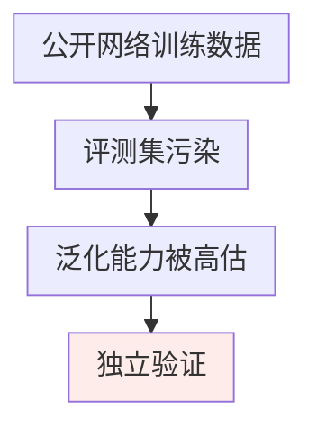
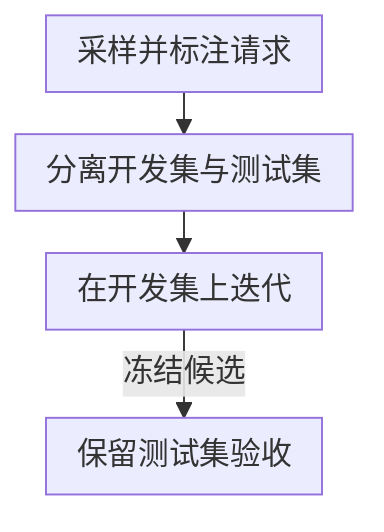

# 第二十一章：能力评测指标

## 21.1 为什么需要评测指标

大模型的能力是多维度的，「**感觉用起来还不错**」不足以支撑工程决策。

当你要从一个模型换到另一个、决定是否微调、衡量 Prompt 优化的效果，都需要量化指标。

> **评测指标的价值在于把「主观感受」转化成「可比较的数字」。**

开放式语言任务往往允许多个有效答案，难以只靠字符串一致性判定；分类、计算等受限任务则可能有明确的正确性标准。不同任务需要不同侧重的 Benchmark，不能用一个总分代替全部验收条件。

## 21.2 常见公开 Benchmark

下表介绍任务与评分对象，不是截至某日的模型排名。对比结果前，应固定数据集版本、子集、Prompt、是否使用工具、采样次数和推理预算。

| 维度 | Benchmark | 考查什么及其边界 |
|---|---|---|
| **综合知识与推理** | **MMLU** | 57 个学科的四选一题；主要测封闭题目的知识与问题求解，不等于开放任务可靠性 |
| | **MMLU-Pro** | 清理与扩展题目，更强调推理，选项扩展到最多十个；不是与 MMLU 完全相同题集的直接分数对比 |
| **代码能力** | **HumanEval / MBPP** | 函数级编程任务；HumanEval 原版有 164 题，以函数签名、docstring 为输入，通过测试检验功能。测试已公开，「不放进模型输入」不等于未公开 |
| | **SWE-bench Verified** | 经人工核验的 500 个仓库 issue 修复任务；分数衡量模型、Agent 脚手架、环境、工具与预算的组合，不是裸模型分数 |
| **数学与科学推理** | **GSM8K** | 小学数学应用题，考基础四则运算和逻辑推理 |
| | **MATH** | 竞赛数学：代数、几何、组合数学 |
| | **GPQA** | 物理、化学、生物的专家编写选择题；需标明完整集或 Diamond 等子集，不能混比 |
| **对话与 Agent** | **MT-Bench** | 多轮交互场景，用 **LLM-as-Judge** 打分 |
| | **Chatbot Arena** | 匿名成对回答的众包偏好比较；用户与问题分布、风格偏好和统计不确定性会影响排名，不是事实正确率 |
| | **τ-bench** | 模拟用户与工具 Agent 的交互，用任务末尾数据库状态等条件检查目标是否实现；另测多次运行的一致成功能力 |
| **综合 / 新型** | **HELM** | 覆盖准确率、鲁棒性、公平性、有害性等多个维度 |
| | **LiveBench** | 持续更新题目并按客观答案评分，以降低污染风险；仍需锁定发布版本，不能保证绝无泄漏 |
| | **Humanity's Last Exam** | 跨学科高难度学术题，含选择、短答及多模态内容；不是通用工作能力或自主研究能力的充分证明 |

SWE-bench Verified 还需要额外留意基准有效性：OpenAI 指出其测试设计缺陷与训练数据污染问题，已停止报告该分数，并建议改报 SWE-bench Pro，见 OpenAI 声明[【155】](../../book/references.zh.md#ref-155)。这是该机构的评测决定，不代表所有使用者都已停止使用；保留历史成绩时，应说明其版本与局限，不能直接与另一套题目的分数比较。

### 21.2.1 Pass@k

代码评测的常见指标：**生成 $k$ 个候选代码，至少 1 个能通过所有测试的比例**。

$k=1$ 衡量一次采样成功的能力；更大的 `k` 衡量多次尝试中存在成功解的概率，不能当作系统实际选中正确解的概率。

HumanEval 的常用估计方式是：每题从同一固定生成配置独立采样 `n` 个候选，其中 `c` 个通过测试，且 `n ≥ k`，计算：

$$
\widehat{\mathrm{pass@}k}
=1-\frac{\binom{n-c}{k}}{\binom{n}{k}}
$$

再对题目取平均。若失败候选数不足 `k`，分子组合数按零处理。它利用已采样候选估计「至少一个通过」，并不要求生产系统拥有知道哪个正确的 oracle。

代码测试通过仍可能漏掉边界条件、安全缺陷或规格歧义；应隔离执行环境，不给生成代码生产密钥和外部写权限。

**不要混淆 `pass@k` 与 τ-bench 的 `pass^k`**：前者关注 `k` 次中至少成功一次，后者关注 `k` 次全部成功。独立且每次成功概率均为 `p` 的理想条件下，分别为 `1-(1-p)^k` 与 `p^k`；实际任务有难度差异，不能直接把全数据集平均成功率代入后者。

### 21.2.2 从任务定义选择指标

| 评测目标 | 可用指标 | 不能省略的口径 |
|---|---|---|
| 分类与抽取 | Accuracy、Precision、Recall、F1、字段精确匹配 | 类别不平衡时区分 micro/macro；定义空值与等价文本的归一化方式 |
| 摘要与问答 | 关键点覆盖、声明正确性、来源支持度；必要时参考 ROUGE 等重合指标 | 文本相似不等于真实；正确改写也可能与参考答案低重合 |
| 概率校准与弃答 | Brier score、可靠性分箱、覆盖率—错误率曲线 | 自报置信度需要验证；只报已回答准确率会掩盖过度拒答 |
| Agent | 端到端目标成功率、策略违规率、重复运行成功率 | 工具名和参数正确只是中间指标，不能替代任务完成 |
| 服务效率 | 输入/输出用量、成功任务成本、p50/p95 延迟、吞吐 | 固定并发、输出长度、缓存状态及资源配置 |

困惑度（PPL）衡量参考文本在模型下的平均预测难度，不直接衡量回答是否真实或有用；跨 tokenizer、语料和归一化口径比较 PPL 也容易误判。

## 21.3 Benchmark 的系统性缺陷：数据污染

训练或后训练的数据流水线可能包含公开评测题目、答案及改写版本。模型因此可能在预训练时已经见过答案，使未见题泛化能力的估计过于乐观。需要使用独立任务与保留数据验证，不能仅凭排名判断泛化能力。

污染是一个风险，任务分布不匹配、测试饱和、评分错误和推理预算不同也是风险。榜单与业务结果不一致，不足以证明某模型「背过题」；确认污染需要数据或实验依据。

### 21.3.1 三个应对方向

1. 按题目及其近似改写做训练/测试去重，公开训练划分可以用于训练，但评测保留集不能参与优化；
2. 使用持续更新的题库时记录发布时间与版本，仍检查是否进入微调、示例或调参流程；
3. 按时间、客户或业务实体隔离真实数据，留出未参与调参的集合。私有数据若反复用于选 Prompt，同样会被过拟合。

## 21.4 建自己的业务评估集

**面对 Benchmark 的局限，最务实的做法是建任务特定测试集。**

从真实用户请求中采样，由人工标注期望答案。使用分层开发集迭代模型或 Prompt，反复比较通过率或质量分。隔离保留测试集，只有在候选冻结后才做阶段验收，并报告统计不确定性。

### 21.4.1 两类任务的评分方式

| 任务类型 | 评分方式 |
|---|---|
| **可验证任务**（信息提取、分类、代码） | 优先使用字段校验、标签、规则和测试；规范可能允许多个等价答案，测试本身也可能不完整 |
| **开放任务**（摘要、报告、复杂问答） | 组合事实核查、覆盖度标注、人工评价与 LLM-as-Judge，不要把事实性完全交给主观总分 |

### 21.4.2 校验裁判，不只是找一个「更强模型」

LLM 裁判可能偏爱较长回答、特定位置、自己熟悉的风格，也可能被待评文本中的指令影响。应固定裁判版本、rubric 和上下文，屏蔽候选模型身份，交换成对答案顺序，并按子任务对照人工裁决。重要分歧需要独立复核，模型裁判的「理由」也不能替代核查。

人工抽查量取决于错误率、风险与分层覆盖，不是固定的 10–20%。除了随机样本，应重点检查裁判分歧、低置信度、罕见类别与高影响错误，报告人机一致性及误判类型。

### 21.4.3 如何判断提升不是抽样波动

同一批题上比较两个方案，记录哪些题从错变对、从对变错，而不只看均分。对于二元结果，可做配对检验或配对 bootstrap；重复运行应按题或会话聚类，不能把同一道题的重复采样全当成独立用户。

例如，在假设样本相互独立的情况下，100 题做对 80 题的粗略标准误约为 4 个百分点，不能把一个百分点的提升直接解释为真实改进。样本更少、风险更低频或同源样本高度相关时，应增加数据或明确不确定性。开发集用于调参，保留集用于阶段性验收，线上新失败再进入后续版本的数据集。

## 21.5 离线评估 + 线上指标的闭环

**只有离线测试集还不够**，生产环境还要监控实际的用户体验指标。

| 层次 | 指标 | 作用 |
|---|---|---|
| **离线评估** | 黄金测试集通过率、质量分 | **帮你找问题、快速迭代** |
| **线上指标** | 任务完成率、用户反馈、人工接管率、会话放弃率、失败重试与延迟 | 观察真实体验；追问可能是感兴趣，退出也可能已解决问题，不能直接当好坏标签 |

> 离线评估用来筛方案、定位问题，线上指标才说明用户体验有没有真的变好；两边少一边都容易误判。

具备条件时按用户或会话随机分组做 A/B 测试，避免流量结构变化被误认为模型收益。同步监控越权、隐私、严重事实错误等护栏指标，不能用平均满意度的提升抵消高影响违规。无法做随机实验时，应承认因果解释的限制。

## 21.6 常见错误

### 21.6.1 只会报 Benchmark 名字说不出它测什么

需要说明任务、输入、评分规则和预算。例如 SWE-bench 分数衡量一套修复系统，τ-bench 还检查交互后的业务状态。

### 21.6.2 完全相信学术排行榜

检查版本、工具、候选次数、裁判和置信区间；差异未必来自模型本身，也不能在无证据时归咎于污染。

### 21.6.3 不建业务测试集，靠「感觉变好了」判断

从代表性案例起步，再按任务频率、风险和所需统计精度扩展；不要把固定样本数当作上线标准。

### 21.6.4 对主观任务硬套自动指标

词面重合不是语义和事实性的充分指标；但开放式问答中的数字、引用和权限条件仍可程序化检查。

### 21.6.5 用了 LLM-as-Judge 但不做人工校准

对照人工标准，检查位置、长度、风格偏差和严重错误漏判；抽样比例应有风险与统计依据。

### 21.6.6 只做离线评估不看线上指标

离线通过率提升不等于用户体验改善。**要看满意度、任务完成率、会话放弃率。**

### 21.6.7 把公开 Benchmark 直接拿来当训练数据

允许使用明确定义的训练划分；不能把测试题、答案或等价改写用于训练或提示优化后，还把该测试成绩当作未见泛化能力。

## 21.7 本章总结

1. 先定义任务与验收口径，再选择 benchmark 和指标；同名基准也要固定版本、子集与预算。
2. `pass@k` 衡量至少一次成功，`pass^k` 衡量重复执行全部成功，均不等同于选择器的实际表现。
3. 污染、分布偏移、裁判偏差与抽样误差都可能影响结论。
4. 开发集和保留测试集分离，程序验证、模型裁判与人工核查各自承担适合的部分。
5. 用配对比较和不确定性报告支撑离线结论，再用线上实验与风险护栏检验真实收益。

> 公开 Benchmark 适合看模型大致区间，真正决定上线的还是你自己的测试集和线上指标。

## 参考资料

<!-- centralized-bibliography -->
本章的参考资料、阅读建议与来源说明见[集中参考资料章节](../../book/references.zh.md#reading-llm-21)。
