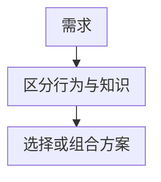
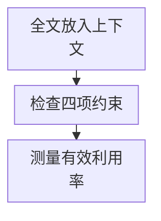
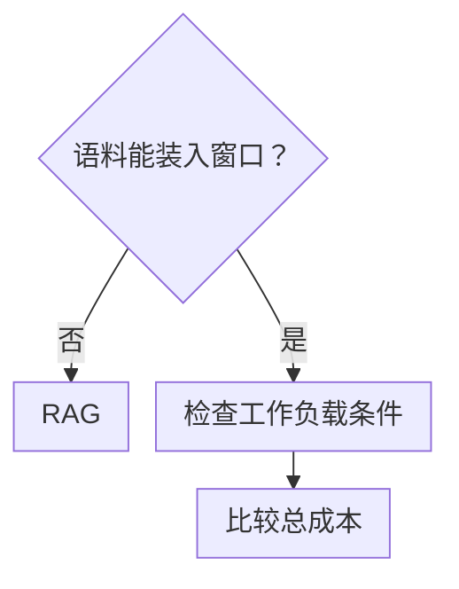

# 第二章：RAG、微调与长上下文的三方取舍

## 2.1 不要把它当成单选题

讨论 RAG 和微调时，最常见的误区是**二选一思维**：把它们当成互斥选项，说完其中一个的优点就结束了。

支持长上下文的模型让选型多了一个维度：「既然材料装得下，为什么还要检索？」窗口长度只是条件之一，不能代替质量与成本验证。

更合适的比较方式，是把微调、长上下文和 RAG 放在一起看，再决定是否组合使用。

要改变行为、风格或格式，可以考虑微调。对知识需求，小且稳定的材料可以直接放入长上下文；语料规模大、频繁变化或需要权限过滤时，更倾向于 RAG。实践中经常组合使用这些方法。

## 2.2 三种方案的区别

可以先这样区分：

| 方案 | 知识存在哪 | 什么时候确定 | 改一条知识的代价 |
|---|---|---|---|
| 微调 | 模型参数里 | 训练时 | 再训练或模型编辑后验证、发布 |
| 长上下文 | Prompt 里 | 每次调用时 | 改输入即可 |
| RAG | 外部知识库 | 每次调用时动态检索 | 更新数据、索引与相关缓存 |

微调改的是**模型本身**，另外两个都是**在推理时提供材料**，区别只在于材料是「全塞」还是「先检索再塞」。

这个区分决定了后面的判断方式：长上下文和 RAG 都是在推理时提供材料，区别在于 RAG 多了一步「筛选」。因此真正要判断的不是「要不要 RAG」，而是**「需不需要在把材料给模型之前先筛一遍」**。

## 2.3 微调：把能力烧进参数

### 2.3.1 微调更适合什么

微调擅长的是**改变模型的行为方式**，而不是灌输事实：

- 提高固定格式、特定报告结构的遵循率；严格 JSON/schema 约束还需结构化输出或程序校验，不能靠微调保证；
- 特定的语气与风格（客服话术、法律文书口吻）；
- 领域术语与表达习惯（医疗、金融的专业措辞）；
- 特定任务的能力提升（分类、抽取这类结构化任务）；
- 让小模型在窄任务上逼近大模型，从而降低推理成本。

最后一条在长期运行的窄任务里尤其重要：微调一个小模型专做某个任务，长期推理成本可能远低于持续调用大模型。

### 2.3.2 微调不擅长的

- **注入大量事实知识**。这需要足够多的样本反复强化，成本高且效果不稳定；
- **频繁更新的知识**。需要再训练或模型编辑并回归，难以像数据库一样可靠地逐条更新、撤销；
- **溯源**。参数本身不提供可靠的逐条事实来源；模型生成一个书名或链接，不等于证明该事实来自那里；
- **权限隔离**。共享参数不提供可靠的文档级 ACL，不能保证敏感知识不会被无权限用户诱出；外部授权仍然必要。

**「不可溯源」和「无法做权限隔离」这两条，往往是企业选择 RAG 的关键原因之一**，而不只是效果好坏的问题。

### 2.3.3 微调可以学知识，但不适合当知识库

微调和继续预训练可以学习事实，但是否划算取决于任务、更新频率和监督数据。更准确的说法是：

> **参数学习可以补充领域知识，但不等价于一个可逐条更新、撤销和审计的知识库。**

## 2.4 长上下文：直接把材料全塞进去

模型窗口变大后，一个很自然的想法是：把所有资料一次性放进 Prompt，让模型自己找。

这个做法值得作为基线：当前用户有权访问的材料装得下，且读取成本可接受。它省掉检索链路，不会在检索阶段漏掉证据，但模型仍可能在长输入中漏读。长上下文同样可以先执行权限过滤，并逐条标注引用。

配合 Prompt Caching，重复使用同一批材料的成本还能进一步降低。

如果知识库只有几十篇稳定文档，直接全塞往往比搭一套 RAG 更快，工程复杂度也更低。

### 2.4.1 但它有四个硬约束

四项约束分别是：**规模**（语料超过窗口就装不下）、**时效**（频繁更新使缓存失效）、**权限**（输入前执行 ACL，不同权限降低缓存复用）和**质量**（位置与干扰内容可能降低有效利用率）。

前三条是常见工程约束，**第四条直接影响最终效果**。

### 2.4.2 窗口容量不等于有效利用能力

这不是猜测，而是有系统性实验证据的。

早期的 **Lost in the Middle** 研究发现：模型对上下文**开头和结尾**的信息利用得更好，放在中间的关键信息容易被忽略。

后续更严格的实验进一步表明：

- 在所测模型和任务上，输入变长可能导致性能下降，且可早于窗口上限；下降不是对所有模型都单调成立的定律；
- **当问题和答案之间是语义关联而非字面匹配时，下降更明显**；
- **语义相近但错误的干扰内容**，比完全无关的内容伤害更大；
- 经典的「大海捞针」测试拿满分，**不代表**模型在真实长上下文任务中可靠——因为它只考察字面匹配。

这个现象通常被称为 **Context Rot**（上下文腐化）。

这些结果支持的工程判断是：单纯塞更多材料不一定提升效果，应区分必要证据与干扰。RAG 的最终上下文选择也面临相同问题——见 2.6 节。

### 2.4.3 长上下文能取代 RAG 吗

已有研究测试了若干模型与任务，显示长上下文不能无条件替代检索、SQL 等组件；这不排除它在某个小语料任务上比 RAG 更合适。需要检查：

1. 语料规模超出窗口——这是硬性的；
2. 语料频繁更新——变化位置可能影响前缀缓存复用，需测实际预填充成本；
3. 需要精确检索的结构化查询；
4. 相关信息稀疏地分布在大量文档中时的多文档融合。

工程上可以把两者组合，但不应把某年的“共识”当作选型证据。

> **RAG 负责「从海量语料中筛出候选」，长上下文负责「把候选读得更充分」。**

一个正在增多的做法是把两者结合：检索阶段不再返回几百 Token 的小片段，而是返回**整篇文档或大段落**，交给长上下文模型阅读。这样既避免了小片段丢失语境的问题，又避免了全量塞入的规模问题。

## 2.5 三方对比表

| 方案 | 主要预算与失败模式 |
|---|---|
| 微调 | 容量、训练数据与发布流程限制知识更新；可能过拟合或遗忘。推理成本和首 Token 延迟由实际模型、输入和服务负载决定 |
| 长上下文 | 受窗口及有效利用能力限制；预填充、缓存命中和更新位置影响成本与延迟，材料装得下也可能漏读 |
| RAG | 受存储、摄取、检索和治理预算限制；查询多了召回、重排等工作，也可能因缩短输入减少预填充；主要风险是漏检、错检和生成误读 |

溯源和权限应单独比较：长上下文与 RAG 都能携带引用，也都需要在输入前外部授权并校验引用；共享模型参数本身不提供文档级 ACL 或可靠事实来源。前期投入和首 Token 延迟不能简单排成“高、中、低”，小模型微调、长前缀缓存和复杂检索链路可能改变次序。

比较总成本时，把数据与训练、索引构建与更新、每次查询、缓存写入/命中和运维分别计费。只有微调后能换用较小模型或明显减少输入时，才可能摊薄训练成本；高命中率长上下文缓存也可能比复杂检索链路便宜。

## 2.6 Top-K 不是越大越好

「多召回一些 chunk 总没坏处」并不成立。

很多人默认 Top-K 越大越好，反正模型自己会挑。但 2.4.2 节的证据表明，无关或语义相近但错误的内容会**主动损害**答案质量，模型并不会干净地忽略它们。

正确的做法是：

- **把 Top-K 当作需要实测调优的超参数**，而不是设个大数了事；
- 用 Rerank 把候选压缩到少而准，而不是把粗排结果直接全给模型；
- 注意最优 K 值**依赖于具体模型和任务**，换模型后需要重新测。

Anthropic 的 Contextual Retrieval 博客在所测设置中比较了 5、10、20 个片段，并报告 20 更好；长上下文研究则显示干扰内容可能损害质量。**这不矛盾：片段数量、长度、相关性和模型共同决定结果，不存在通用的最优 K。**

## 2.7 怎么选：一套可执行的判断顺序

这一步针对知识需求；行为、格式或风格变化仍然对应微调。语料能装入窗口时，依次检查**更新是否频繁**、**是否按用户过滤**、**调用量是否很大**。任何一项为“是”，都应比较更新、授权过滤、缓存与检索的总成本。只有三项都为“否”时，直接将全部材料放入长上下文才是简单的起点。

可以按四个问题依次判断：**装不装得下 → 更不更新 → 要不要过滤 → 调用量大不大**。超出窗口时必须筛选、分组或分轮处理；频繁更新和权限差异则要求比较方案，不自动排除长上下文。即使选择全量输入，也要在固定任务集上检验漏读和干扰。

## 2.8 组合使用才是常态

这三者不是互斥的，生产系统中经常同时存在：

| 组合 | 分工 |
|---|---|
| 微调 + RAG | 微调解决「**怎么说**」（格式、语气、领域表达），RAG 解决「**说什么**」（事实依据） |
| RAG + 长上下文 | RAG 粗筛出相关文档，长上下文模型完整阅读，而不是只读碎片 |
| 三者齐用 | 微调一个小模型做领域任务，RAG 提供实时知识，长上下文承载检索出的完整文档 |

**「微调解决怎么说，RAG 解决说什么」说明了两者的分工**：它们处理的不是同一个问题，因此通常不是互斥关系。

还有一种把两者结合的思路：**针对 RAG 场景微调模型**，设计抗干扰样本，训练它区分给定材料中的有用信息与干扰信息。若任务要求答案必须有材料依据，还应单独设计并评估证据不足时的拒答训练。两者不能混为一种已被证明的能力：所引 RAFT 的训练包含移除正确文档但仍保留目标答案的样本，鼓励模型利用参数知识回答，不能据此认定它已学会在缺少证据时拒答。

## 2.9 常见错误

### 2.9.1 把问题答成单选题

如果完全不考虑组合使用，往往会遗漏实际系统里的常见做法。

### 2.9.2 说「微调学不到知识」

不准确。可以学习事实，但共享参数不适合承担频繁的逐条更新、撤销与来源审计。

### 2.9.3 认为长上下文已经淘汰了 RAG

有明确的实验证据反驳，且忽略了规模、时效、权限、成本四个约束。

### 2.9.4 认为窗口够大就可以随便塞

长输入中的位置效应和干扰风险有实验证据，但不是“每加一个 Token 必然变差”；需在当前模型和任务上复测。

### 2.9.5 只比效果不比成本结构

不计调用量、模型大小、缓存命中和更新频率，就无法比较训练、检索与长上下文的总成本。

### 2.9.6 忽略权限与溯源

在企业场景里，这两条经常直接决定方案选型，且不可通过「效果更好」来弥补。

## 2.10 本章总结

1. 微调改的是模型行为；长上下文和 RAG 都是在推理时提供材料，区别在于 RAG 先做筛选；
2. 微调更适合格式、风格、领域表达和小模型降本，不适合承载大量事实知识、频繁更新、溯源和权限隔离；
3. 长上下文在语料小且稳定时很有效，但仍受规模、时效、权限和质量四个约束；
4. 长输入可能出现非均匀退化，「大海捞针」满分不代表真实任务可靠；
5. 长上下文可在特定小语料任务中替代检索，也可与 RAG 组合；不能无条件推广到海量语料；
6. Top-K 需要按模型和任务实测调优，不存在一组固定答案；
7. 实际判断通常按四个问题展开：装不装得下、是否频繁更新、是否需要过滤、调用量是否足够大；
8. 三种方案可以组合，但是否增加一个组件，应由它解决的失败问题和新增成本决定。

## 参考资料

<!-- centralized-bibliography -->
本章的参考资料、阅读建议与来源说明见[集中参考资料章节](../../book/references.zh.md#reading-rag-02)。
