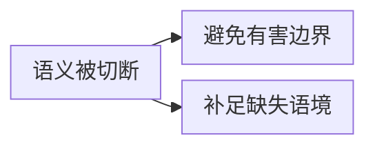
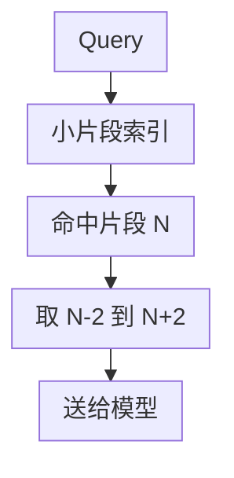
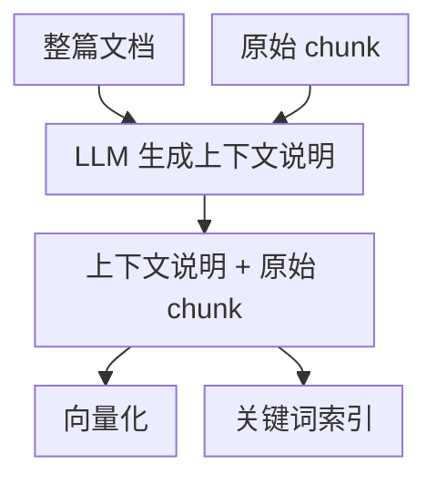
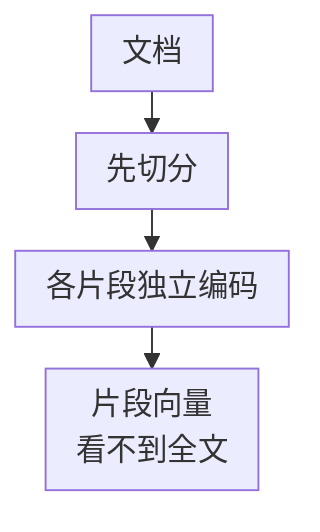
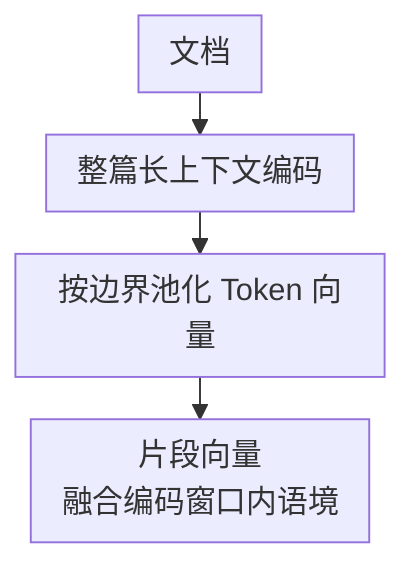

# 第五章：语义被切断怎么办

## 5.1 问题的两个方向

上一章讨论的是粒度权衡。这一章关注它的直接后果：**一段话被切开后，片段丢失了理解它所必需的上下文**。

常见解法可以分成两个方向：

边界类方法包括重叠切分、语义边界切分和结构化切分。语境类方法包括句子窗口检索、父子切分、命题化改写、上下文增强（Contextual Retrieval）和 Late Chunking。两组方法按保护的内容分类，并非要求语境恢复都在切分后发生：Late Chunking 先编码较大的上下文，再按块边界池化。

- **方向一是预防**：在切分时尽量不破坏语义单元；
- **方向二是补足语境**：句子窗口和父子切分在命中后扩展阅读材料；命题化、上下文增强和 Late Chunking 则在建库时改善片段表示。小片段是否检索更准仍需评测。

方向二把检索单元与阅读单元解耦，但不是免费消除权衡：父块扩展会增加 Token、噪声和权限核验成本，仍须在固定预算下验证收益。

## 5.2 方向一：切的时候别切错

### 5.2.1 重叠切分

最简单的兜底手段：相邻片段共享一部分内容，增加边界附近的短句在某个片段里完整出现的机会。

优点是实现简单；代价是重复嵌入、存储和召回。有限重叠既不能保证长句完整，也不能补全远距离指代。

### 5.2.2 结构化切分

按文档的天然结构（标题层级、条款编号、章节）切分。

文档结构可靠时，这是值得先试的基线；但标题不保证章节语义自足，跨节定义、脚注和引用仍需补齐。

### 5.2.3 语义边界切分

计算相邻句子的向量相似度，在相似度低谷处切断。

这种方法需要额外的句子编码和断点计算。**如第四章所述，应在目标查询集上与固定或递归切分比较检索、生成质量及预处理成本**，不能仅凭“语义”这个名字默认采用。

## 5.3 方向二：切完了把上下文补回来

### 5.3.1 句子窗口检索

做法是用**小单元**（句子或短片段）建索引参与检索，命中后返回它**前后若干个单元**一起送给模型。

**检索用小的，生成用大的**——这就是方向二的核心范式。

适合叙述性、上下文连贯的文本。缺点是固定窗口大小不适应变化的语义单元长度。

### 5.3.2 父子切分（Parent-Child）

与命中后扩展固定窗口不同，这种方法通过明确的子片段到父片段映射查找上下文：

- **子片段**（小）：参与向量化和检索；
- **父片段**（大）：命中子片段后实际返回的单元，可以是整篇原文、一个章节，也可以是按长度或递归分隔生成的大块。

原文不必已有标题层级。例如，LangChain 的 `ParentDocumentRetriever`[【366】](../../book/references.zh.md#ref-366) 既支持直接以原文档为父片段，也支持先切出较大的父块。

| 对比 | 句子窗口 | 父子切分 |
|---|---|---|
| 扩展依据 | 位置（前后 N 个） | 映射到所属父文档或父块 |
| 边界是否语义完整 | 不保证 | 不保证；按真实结构构造的父块可能保留完整章节，但仍可能需要外部定义 |
| 是否依赖原文已有结构 | 否 | 否，但需要明确的子片段到父片段映射 |

父子切分适合定义、限定条件分布在同一章节的资料。代价包括更多子向量、父文档存取和更长的生成输入；返回父块时必须再次核验整个父块的 ACL，不能凭子块权限放行父块。

一个实用细节：多个子片段命中同一个父片段时要**去重**，否则会重复占用 Prompt 预算。

### 5.3.3 命题化改写

**思路**：用 LLM 把段落改写成一组**独立自足**的陈述句，每句话都不依赖上下文即可理解。

例如把：

> 「该金额不得超过前款规定的上限。」

只有原文前款确实包含以下事实时，才可以改写为（此处为假设示例）：

> 「差旅住宿费报销金额不得超过员工月基本工资的百分之十五。」

**这类方法在实体密集的问答任务上有明确的效果提升**，因为每个命题都是自足的，向量表达非常聚焦。

**代价也很明确**：

- 每个片段都要过一次 LLM，**建库成本显著上升**；
- 改写过程有**信息失真和幻觉风险**；
- 改写后**丢失了原文措辞**，不利于精确匹配和引用溯源。

可以用命题参与检索，再取其对应原文作为证据，避免把改写句直接当成原件引用。是否能处理大语料取决于生成、核验与更新预算，不能仅凭规模否定这种方法。

### 5.3.4 上下文增强（Contextual Retrieval）

这是近年常用的方案之一。

**思路**：不改写原文，而是在每个 chunk 前**拼接一段由 LLM 生成的、说明该片段在整篇文档中位置和背景的短说明**，然后再做向量化和关键词索引。

它与命题化的关键区别是：**原文一字不改，只是在前面加了一段背景说明**。所以既补上了上下文，又保留了原始措辞。

**Anthropic 公布的实验数据**（注意：这是厂商工程博客，非同行评审论文）：

| 方案 | Top-20 检索失败率 | 相对降幅 |
|---|---|---|
| 图示基线（普通嵌入） | 5.7% | — |
| + 上下文增强嵌入 | 3.7% | −35% |
| + 上下文增强 BM25 | 2.9% | −49% |
| + Rerank | 1.9% | −67% |

上表是 Anthropic 2024 年博客在所选数据域、Gemini Text 004 配置下的 `1 − Recall@20`，不是端到端回答错误率；最后一行先召回 150 个候选再重排到 20。相对降幅不能当作业务提升保证。

博客给出的 **$1.02/百万文档 Token** 是按当时价格估算生成上下文说明的成本：800 Token 的块、8k Token 的文档、50 Token 指令和 100 Token 生成说明，并使用前缀缓存。它不是当前报价，也不包括完整索引和查询成本；缓存命中仍有读取费用，不能理解为后续输入免费。

> **Prompt Caching 是「计算层」的优化，它降低的是重复输入的计算成本；上下文增强是「信息层」的改造，它改变的是被索引的内容。两者是配合关系，不是替代关系。**

### 5.3.5 Late Chunking

**思路更进一步**：先编码能装进窗口的文档文本，得到 Token 级表示，再按 chunk 边界做池化。论文采用的双向编码器让 Token 表示能够结合窗口内前后文；如果使用因果注意力，每个位置只能读取此前内容，不能照搬“每个 Token 都看到全文”的解释。块边界仍需确定，只是池化放到编码之后。

**传统方式**

**Late Chunking**

它的巧妙之处在于：**上下文信息是在编码阶段自然注入的，不需要额外调用 LLM 生成说明。**

**局限**：

- 必须能取得 Token 级隐状态，并按论文方式在编码后池化；仅有“长窗口、返回单向量”的 API 不够；
- 文档超过模型上限时仍需分段处理；
- 全文编码增加计算与峰值显存；文档一处改变可能影响多个块向量，须重算受上下文影响的编码窗口。

上下文增强和 Late Chunking 还会扩大权限依赖：如果一个块的说明或向量使用了受限章节，不能只按块自身的原文 ACL 放行。应在相同权限域内构建，或让派生物继承全部来源的访问限制；撤权时同步失效。它们改善了检索表示，也不代表送给生成器的短原文已补齐所有前提。

## 5.4 方案对比与选择

这些方法解决不同缺口，不能排成固定的精度或成熟度等级。保留原文指方法是否改写被检索的文本，所有派生表示都应另存原文与映射以便核验。

| 方案 | 选择时要核算什么 |
|---|---|
| 重叠切分 | 用重复嵌入、存储和 Token 换局部边界覆盖，不能补远距离指代 |
| 结构化切分 | 结构恢复成本，以及跨章节定义和脚注是否仍完整 |
| 语义边界切分 | 句子编码与阈值标定成本，主题断点是否真的改善召回 |
| 句子窗口 | 扩展读取和生成输入；位置邻近不等于语义充分 |
| 父子切分 | 子向量、父块存取与去重，同时核验父块 Token 和 ACL |
| 命题化改写 | 生成、事实核验和原文映射；不能把派生文本当作已验证事实 |
| 上下文增强 | 背景生成、索引载荷、来源权限与更新依赖；新增说明也可能错误 |
| Late Chunking | Token 级接口、长编码与相关窗口重算，不保证指代必然消解 |

**推荐的实施顺序**（按投入产出比）：

1. **结构化切分 + 合理的 size/overlap** —— 结构已经可靠时实现成本较低，先建立基线；
2. **父子切分** —— 发现上下文缺失时尝试，同时检查父块 Token 和权限预算；
3. **上下文增强** —— 有一定成本，但有公开数据支撑，值得投入；
4. **命题化 / Late Chunking** —— 视场景和语料规模评估。

## 5.5 常见错误

### 5.5.1 只答重叠切分

重叠只解决「不要在边界上截断」的问题，不能保证语义完整。

### 5.5.2 不区分「预防」和「补救」两个方向

把六七种方法平铺罗列，设计和调参时就很难判断自己是在改善切分，还是在补上下文。

### 5.5.3 把 Prompt Caching 说成一种压缩或补上下文的方法

Prompt Caching 的机制、与 KV Cache/记忆压缩的边界及生命周期限制见[Agent 记忆与上下文压缩](../../agent/03-memory-context/10-agent-memory-compression.zh.md)；本节只讨论其在上下文增强索引成本中的作用。

它是计算层优化，不改变被索引的内容。混淆这一点是典型的概念不清。

### 5.5.4 把上下文增强和命题化混为一谈

前者保留原文只加说明，后者重写原文。在溯源和精确匹配上差别很大。

### 5.5.5 忽略父子切分的去重

多个子片段命中同一父片段时不去重，会浪费大量 Prompt 预算。

### 5.5.6 认为越复杂的方法越好

复杂方法可能增加预处理和维护开销。应先建立调好基础参数的简单基线，再在相同目标查询集与上下文预算下比较质量和成本，而不是把复杂度当成收益的证据。

## 5.6 本章总结

1. **两个方向**：预防（切的时候别切错）与补救（切完把上下文补回来），二者可组合；
2. **核心范式**：**用小片段检索，用大上下文生成**；
3. **父子切分**解耦检索和阅读粒度，但增加存取、Token 与权限校验成本；
4. **上下文增强**生成背景说明并保留原文；官方实验报告的是特定配置的检索失败率相对下降，成本与收益不能直接外推；
5. **Prompt Caching 是计算层优化，与信息层的上下文改造是互补关系**；
6. **命题化改写**可补全独立事实表示，但增加生成与事实核验成本，并须保留原文映射；
7. **Late Chunking** 在编码后按块池化，需要 Token 级表示接口，并考虑整段编码和更新成本；
8. **实施顺序**：结构化切分 → 父子切分 → 上下文增强 → 更前沿方案。

## 参考资料

<!-- centralized-bibliography -->
本章的参考资料、阅读建议与来源说明见[集中参考资料章节](../../book/references.zh.md#reading-rag-05)。
