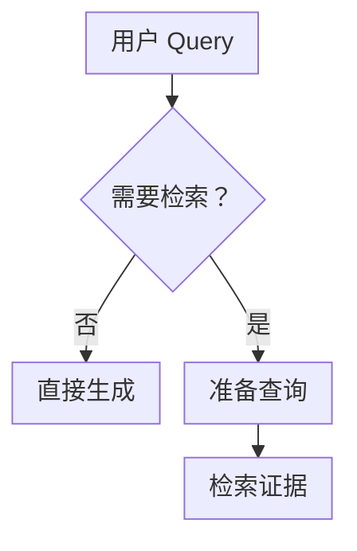
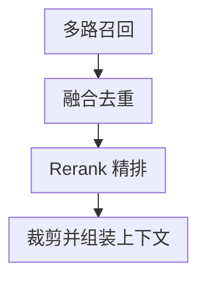
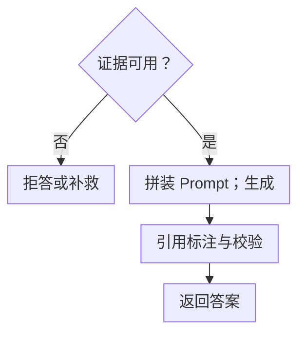

# 第十章：RAG 在线链路全流程

## 10.1 为什么要单独讲在线链路

第一章给出了离线与在线的全景。这一章聚焦在线部分，因为以下约束直接落在当前请求上：

| 约束 | 说明 |
|---|---|
| **延迟** | 每次提问都要走一遍，用户在等 |
| **成本** | 每次提问消耗服务资源；API 调用计费，自部署也有算力成本 |
| **失败处理** | 任何一步失败都会直接反映到用户看到的答案里 |

离线构建也有成本、时效和失败约束，错误入库同样会影响用户；区别是在线链路通常必须在当前请求截止时间内给出明确结果或失败状态。

## 10.2 完整链路

查询准备包括理解与改写问题，再进行向量化。检索分支继续经过以下证据筛选阶段：

筛选出的上下文必须先通过证据与授权检查，才能进入生成：

“可用”同时要求证据充分且有权使用。不通过时，拒答、请求澄清或进行受控补检。引用标注与校验在生成后执行，不能用生成前的检查替代。

第 0 步和第 9 步在基础版 RAG 的示意图里常被省略，但在生产系统里往往必需。

## 10.3 逐步拆解

### 10.3.1 第 0 步：判断要不要检索

**不是所有问题都需要检索。**

- 「你好」「帮我把上一段翻译成英文」——不需要检索，检索反而会引入噪音；
- 「今年的报销标准是多少」——需要检索。

对所有输入都检索会增加查询和上下文成本，也可能给闲聊任务引入无关文档。具体延迟由启用的检索方式、缓存和负载决定，不能统一算作几百毫秒。

判断方式可以是轻量分类模型、规则，或者让 LLM 自己决定（把检索做成一个工具）。**后者是 Agentic RAG 的雏形**（第十五章）。

### 10.3.2 第 1 步：Query 理解与改写

原始的用户输入常常不适合直接检索：口语化、有指代、太笼统、或者一个问题里包含多个子问题。

这一步的常见动作（第十二章详细展开）：

- **指代消解**：把「它的价格呢」结合上文还原成「iPhone 17 的价格是多少」；
- **改写**：口语转书面、补充领域术语；
- **分解**：一个复合问题拆成多个子问题；
- **扩展**：生成多个不同表述的 Query 并行检索。

改写会引入一次额外的 LLM 调用，也会带来方向跑偏的风险。工程上通常同时保留原始 Query 和改写后的 Query 一起检索，这样即使改写失败，原始 Query 仍能兜底。

多轮对话场景里通常要先做指代消解；直接拿「它多少钱」去检索，往往什么都搜不到。

### 10.3.3 第 2 步：Query 向量化

技术上最简单，但有**整条链路最重要的一条硬性约束**：

> **Query 编码器必须与建库的 Document 编码器构成发布者声明的兼容模型对，并使用同一可比较向量空间。**

许多模型以同一个编码器完成两端编码；若模型卡明确提供共同训练的 query/document 双塔，可按其指定前缀、归一化和度量使用。任意两个维度相同的模型并不兼容：跨空间计算距离没有意义，而且**这个错误不会报错**——维度对得上仍会得到噪音。

一个实用做法是：**把模型对、版本、维度、归一化和距离度量写入索引元数据，服务启动时校验 Query 配置与索引记录的兼容性；不兼容则重建或拒绝启动。** 这比事后排查便宜得多。

另外记得按模型卡要求给 Query 加**指令前缀**（第六章 6.5.3）。

### 10.3.4 第 3 步：多路召回

常见的基线是两路：**向量检索**（语义匹配）+ **关键词检索**（词项匹配）。若单路已经满足业务质量和延迟目标，不必为了架构完整强加第二路。

两者通常互补：向量检索可能漏掉精确型号，未扩展的 BM25 可能漏掉同义表述；但否定、数值范围、权限等约束仍需结构化处理，不能靠两路打分保证。

**这一步应该并行执行**，两路的耗时取最大值而非累加。

### 10.3.5 第 4 步：融合去重

不同召回路的分数**不在同一个量纲上**——向量的余弦相似度和 BM25 的分数无法直接比较，简单加权需要归一化且很难调。

**主流做法是 RRF（倒数排名融合）**：只用排名不用原始分数，天然规避了量纲问题（第十三章展开）。

**去重也在这一步做**：父子切分下多个子块命中同一父块要合并（第五章 5.3.2），不同召回路命中同一 chunk 要合并。

### 10.3.6 第 5 步：Rerank 精排

用 cross-encoder 对候选重新打分，在粗排已覆盖证据但排序不佳时通常值得尝试；实际收益和延迟取决于模型、硬件、输入长度与候选数。

**两个工程要点**：

- **候选数要控制**。候选减少通常降低计算量，但批处理、padding 和排队使延迟不一定同比下降，需同时测候选证据覆盖；
- **要采用经业务评测集校准的置信度/拒答策略**。不同 Query 的裸分不可直接比较；低置信度时直接拒答、澄清或降级，而不是硬凑够 K 个候选（详见[第十三章](13-hybrid-retrieval-rerank.zh.md)）。

### 10.3.7 第 6 步：上下文裁剪与组装

拿到精排结果后，还要处理三件事。先按 Token 预算选择完整证据单元，给问题、指令和输出留空间；不能把否定、例外或表格单位从中间硬截掉。必要证据装不下时，拆分任务或受控压缩，并复核证据覆盖。再比较相关性排序、首尾放置和按原文顺序组织的效果；“lost in the middle”是风险提示，不是所有模型都应照搬的排序规则。最后附上可信服务提供的来源、章节、版本和生效日期，供生成与引用校验使用。

### 10.3.8 第 7 步：Prompt 拼装

Prompt 需要明确约束模型的行为（第十七章详细展开）：

- **只依据给定材料回答**；
- **材料不足时明确说明，不要编造**；
- **每个结论标注来源编号**；
- **材料之间冲突时说明冲突，不要擅自选一个**。

知识库里经常同时存在新旧版本的冲突材料，因此最后一条通常不能省略。

### 10.3.9 第 8 步：生成

流式输出可以减少等待完整答案的时间，但不会跳过改写、检索、重排和预填充。高风险回答若需要发布前校验，应先缓冲完整答案或逐条校验后再发；事后发现错引无法收回已经展示的 Token。

### 10.3.10 第 9 步：引用标注与校验

生成完不等于结束。至少要做：

- **引用有效性检查**：模型标注的来源编号是否真实存在（**模型会编引用编号**）；
- **主张—引用校验**：按业务风险检查每条关键主张是否被它实际引用的片段支持，而非只检查“某处材料能支持”；同时验证引用完整性、版本和用户访问权限；
- **发布闸门**：关键主张无法核验、引用越权或版本不适用时，修正后重验、交人工或返回无法确认，不能照常发布。

检索为空和证据不足应在生成前就处理；这里检查的是生成后才出现的错引与无依据主张。检索服务故障要报“暂时无法检索”，不能伪装成“知识库没有答案”。

## 10.4 延迟预算表

下面是用于拆预算的示例，不是实测分位数或硬件承诺。

| 环节 | 示例预算 | 可优化手段 |
|---|---|---|
| 前置判断 | 0–100 ms | 用规则或小模型替代 LLM |
| Query 改写 | 100–500 ms | 缓存、小模型、与原 Query 并行 |
| Query 向量化 | 10–50 ms | 本地部署、缓存热门 Query |
| 多路召回 | 5–50 ms | 并行执行 |
| 融合去重 | < 5 ms | — |
| Rerank | 100–400 ms | 减少候选数、更小的模型 |
| Prompt 拼装 | < 5 ms | — |
| LLM 生成首 Token | 300 ms–2 s | 缩短输入、有效前缀缓存、减少排队 |

按同一请求的 trace 找关键路径，再决定优化哪一步。检索并行时通常等待较慢分支，且还有排队与合并开销；各环节的 P95 不能直接相加成端到端 P95。

## 10.5 每一步的降级路径

生产系统必须为每一步准备失败后的行为：

| 环节 | 失败时 |
|---|---|
| Query 改写 | 用原始 Query 继续（**所以要保留原始 Query**） |
| 关键词检索 | 仅用向量结果 |
| 向量检索 | 仅用关键词结果 |
| 两路都失败 | 直接拒答，不要让模型裸答 |
| Rerank 超时 | 仅在粗排结果通过该降级路径的证据闸门时继续，否则拒答 |
| LLM 超时 | 返回检索到的原文片段 + 提示 |

> **原则：宁可返回一个诚实的「暂时无法回答」，也不要返回一个编造的答案。** 前者还能继续引导用户，后者会直接破坏结果的可信度。

任何降级都不能绕过 ACL、版本和引用限制。特别是“返回原文”也会暴露数据，必须先授权；不能把依赖 reranker 分数的原闸门直接套到粗排分数上。记录实际采用的分支和失败原因。

## 10.6 缓存能加在哪

| 缓存层 | 复用条件与失效边界 |
|---|---|
| Query 向量 | 完整编码输入、编码器版本、前缀、预处理、维度与归一化配置一致；敏感 Query 的缓存仍需访问控制 |
| 检索结果 | Query、租户、权限版本、过滤条件、索引快照与检索配置一致；更新、删除、撤权时失效，命中后仍校验授权 |
| 语义答案 | 除相似度外，还须匹配实体、日期、数值、权限及证据版本；高相似度不能证明答案可复用 |
| Prompt Caching | 满足提供方的前缀、长度、有效期等条件；核算写入/读取费用与隐私约束，它不等于答案缓存 |

**语义缓存要特别小心**：「iPhone 16 的价格」和「iPhone 17 的价格」语义高度相似，但答案完全不同。**阈值定低会直接产生错误答案**，这类故障比不缓存严重得多。

## 10.7 常见错误

### 10.7.1 建库和查询用了不兼容的编码器

不同权重不一定有问题，例如共同训练的双塔；真正的错误是破坏了表示契约，同维时还可能静默返回噪声。

### 10.7.2 对所有输入无条件检索

浪费成本，还给闲聊类问题引入噪音。

### 10.7.3 改写后丢掉原始 Query

改写失败时没有兜底路径。

### 10.7.4 Rerank 后硬凑够 K 个结果

即使所有候选都不相关也强行塞满，会增加无依据回答风险。应使用经评测集校准的置信度/拒答策略，并允许返回空、澄清或降级。

### 10.7.5 不做引用有效性检查

模型会编造来源编号，不校验等于引用形同虚设。

### 10.7.6 没有降级路径

任何一步失败就整体报错，或者更糟——让模型在没有材料的情况下裸答。

### 10.7.7 语义缓存阈值定太低

会直接返回错误答案，比不缓存危险得多。

### 10.7.8 优化方向错误

在几毫秒的向量检索上做优化，忽略几百毫秒的 Rerank 和秒级的生成。

## 10.8 本章总结

1. **在线链路的三个特殊约束**：延迟、成本、失败直接可见；
2. **完整链路十步**，其中前置判断和引用校验是生产系统区别于 Demo 的关键；
3. **最硬的约束**：Query/Document 为兼容编码器对，启动时校验完整表示契约；
4. **改写要保留原始 Query**，作为改写失败的兜底；
5. **多路召回并行执行**，用 RRF 融合规避量纲问题；
6. **Rerank 要采用经评测集校准的置信度/拒答策略**，并允许返回空、澄清或降级；
7. **上下文组装要控总量、排顺序、附元数据**；
8. **流式输出与发布前校验有取舍**，分别度量首 Token、完整答案和校验完成时延；
9. **每一步都要有降级路径**，宁可诚实拒答也不要编造；
10. **按实际关键路径优化**，分别度量首 Token、完整答案和校验后可发布的时间。

## 参考资料

<!-- centralized-bibliography -->
本章的参考资料、阅读建议与来源说明见[集中参考资料章节](../../book/references.zh.md#reading-rag-10)。
