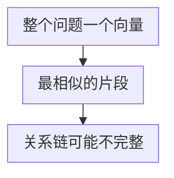
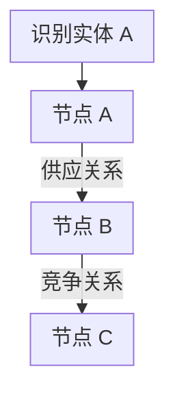
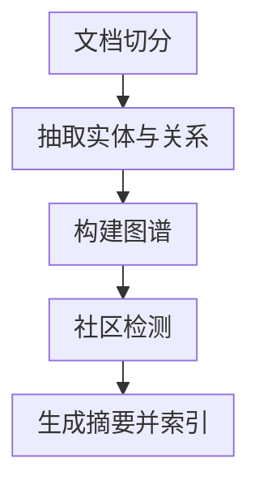
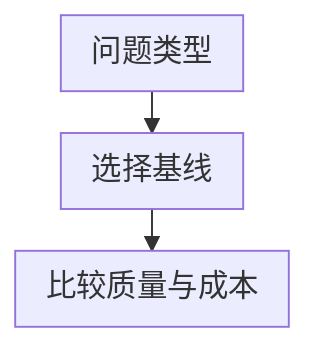

# 第十六章：GraphRAG 与图检索

## 16.1 向量检索的结构性局限

先看一个具体的失败案例。

**问题**：「A 公司的最大供应商的主要竞争对手是谁？」

这个问题需要三步：

1. 查出 A 公司的最大供应商是 B 公司；
2. 查出 B 公司的主要竞争对手是 C 公司；
3. 回答 C。

**单次向量检索的困难**：它通常把 Query 编码为一个向量，返回最相似的片段；若没有片段同时提到 A、B、C，单次召回未必能给出完整关系链。这个限制不等于向量方法“做不到”多跳：查询分解、多轮检索、实体扩展、后期交互或 Agent 都可以组合多个证据，只是需要额外的控制逻辑与验证。

图检索将关系路径显式表示出来：

> **标准的单轮向量召回不显式表示图拓扑，也不会自行沿关系边遍历。** 对关系链问题，它更适合作为找到证据入口的一环，而非完整推理器。

加大 Top-K、换模型或 rerank 有时能改善证据覆盖，但不能替代显式的多步检索、关系建模和答案验证；是否需要这些能力必须在任务集上验证。

**另一类单轮局部检索较难覆盖的问题**：全局性、主题性的问题。

「这一千份客户反馈的主要抱怨集中在哪几类？」——这需要**综合整个语料**，而不是找出最相关的几个片段。

## 16.2 GraphRAG 的思路

GraphRAG 泛指利用图结构辅助检索生成的路线。本章构图与社区摘要流程主要对应微软 **Standard GraphRAG**，不能代表所有图 RAG 都必须调用 LLM 抽取。

### 16.2.1 构建阶段

LLM 从块中抽取实体与关系。社区检测将强关联节点聚成社区；为每个社区生成摘要，随后构建图与社区摘要索引。

关键在于**社区摘要**这一步：把图划分成若干个紧密关联的子图（社区），为每个社区生成一段摘要。**这些摘要就是回答全局性问题的素材。**

### 16.2.2 检索阶段

| 检索模式 | 做法 | 适合 |
|---|---|---|
| **局部检索** | 定位问题涉及的实体节点，沿关系边扩展邻居，收集相关文本 | 具体实体的多跳问题 |
| **全局检索** | 对社区报告执行 map-reduce 式问答与汇总 | 主题性、全局性问题 |
| **DRIFT** | 以社区信息扩展入口，再生成细化追问 | 需要更广背景的实体问题 |
| **Basic** | 对文本单元进行基础向量 RAG | 建立普通检索对照 |

微软 Local Search 用实体描述嵌入定位入口，组合相关实体、关系、社区报告和原始文本，再按预算排序过滤。一般图检索可以设 1–3 跳扩展，但不能把这个示例范围说成官方 Local Search 固定算法。

**这个混合思路很重要**：向量负责「从文本世界跳进图世界」，图负责「在结构化世界里走关系」。

社区报告能帮助回答“主要有哪些主题”，却不能仅凭摘要声称“某类抱怨占 37%”。比例和总数需要完整统计对象、去重与分类口径，再用结构化计算验收；摘要覆盖不等于全量计数。

## 16.3 必须诚实说明的代价

只讲 GraphRAG 的优点而不谈代价，往往不足以支撑实际选型。

### 16.3.1 事实查找未必值得使用

选型时应先建立一个对照：

> **对具体事实查找，先测基础 RAG 是否已经足够，再判断图抽取和额外上下文是否值得。**

如果一个片段已经包含完整答案，额外扩展实体和关系可能增加噪声与成本；若事实分散在多处，图扩展仍可能有帮助。

这是任务与实现相关的经验结论，不应泛化为所有 GraphRAG 都一定更差；应以同一数据集、预算和时延约束下的对照实验决定。

### 16.3.2 索引成本很高

构建阶段需要**对每个 chunk 调用 LLM 抽取实体和关系**，再对每个社区生成摘要。

不要套用“每百万 Token 几百美元”的固定估算。应统计抽取输入/输出、重复抽取、实体合并、社区报告与向量化，并按实际价格或自托管资源计费。实体密度和社区重组使成本不一定随原文 Token 线性增长。

官方 **FastGraphRAG** 用 NLP 名词短语与共现关系替代部分 LLM 抽取，降低成本但产生更噪声化的图；共现不等于真实业务关系。应区分 Standard 与 Fast，而不是把一种索引成本推广给整个产品。

Fast 的默认名词短语抽取配置主要面向英语，不能因为中文文本能读入，就认定实体抽取已经适配中文。替换 NLP 模型或分词、句法配置后，需要重新评测实体覆盖、关系噪声与社区报告质量。

### 16.3.3 更新极其困难

新增一份文档，可能改变实体之间的关系，进而改变社区划分，进而使**大量社区摘要失效**。

微软 CLI 文档提供 `standard-update` 与 `fast-update` 索引方法，不能将其描述成“只能全量重建”。但能运行 update 不等于任意修改、删除和派生摘要都会正确同步；应固定安装版本，分别测试新增、替换、撤销和权限变化的依赖更新。LightRAG 也研究增量处理，实际代价仍需同任务比较。

### 16.3.4 抽取质量与证据校验

Standard 路线依赖 LLM 抽取实体与关系，Fast 路线的 NLP 抽取与共现建图也会产生错误。需要关注：

- **实体消歧问题**：「张三」「张总」「张经理」可能是同一个人，也可能不是；
- **关系抽取错误**可能被后续路径和摘要反复使用；若没有来源回链，排查会更困难，但边并非“隐形”，可以通过图检查、原文对照和关系约束发现；
- **抽取的一致性差**：同样的关系在不同文档里可能被抽成不同的关系类型。

图中每条事实边应保留支持它的原文、版本、有效期与来源可信度。实体消歧、关系类型约束和人工抽检能改善质量；不能把 LLM 生成的边直接视为已验证事实。

权限也要沿派生关系传播。社区报告若汇总了多个权限域，不能只过滤最终返回的原文块，因为报告本身已可能含有受限信息。可在权限域内构图，或让边、描述、报告和缓存继承全部来源限制；删除、撤权和回滚都要覆盖这些派生物。仅给入口实体做 ACL 检查不够。

例如“最大供应商”需要采购金额、统计时间和覆盖范围，只有 `供应商` 边并不能证明“最大”。图路径回答应逐边核验；社区摘要还需回链原文，不能仅引用二次生成的报告来证明具体数值。最坏情况下 h 跳邻域按分支因子约呈 `b^h` 增长，需控制实体数、边类型、遍历深度与 Token 预算。

## 16.4 相关方案对比

| 方案 | 特点 | 适合 |
|---|---|---|
| **GraphRAG**（微软） | 社区检测 + 分层摘要，全局问题能力强 | 主题分析、全局综合 |
| **LightRAG** | 更轻量，**支持增量更新** | 语料频繁变化的场景 |
| **HippoRAG** | 借鉴海马体索引理论，用个性化 PageRank 做图遍历 | **多跳问答** |
| **PathRAG** | 关注图上的关键路径，减少冗余信息 | 路径推理类问题 |

这些方案构图、检索和更新策略不同，不能只用“谁支持增量”区分；微软当前官方实现也有更新方法。

## 16.5 什么时候值得用

- **具体事实查找：** 从基础 RAG 开始，再做对照评测。
- **多跳推理：** 关系本身重要时，考虑图检索；否则先试 Agentic RAG，多轮检索也可以处理多跳问题。
- **全局主题综合：** 语料规模和预算允许时考虑 GraphRAG；否则比较分组摘要或 RAPTOR，测量构建与查询成本。

**值得用的信号**：

- 领域**本身就是关系密集的**：组织架构、供应链、知识产权、金融关联、代码依赖；
- 大量真实问题是**多跳的**；
- 需要**全局主题分析**，且预算允许；
- 语料**相对稳定**，更新不频繁。

**不值得用的信号**：

- 问题以事实查找为主；
- 语料**高频更新**；
- 预算敏感；
- 基础 RAG 还没调好。

**一个重要的替代方案**：**多跳问题也可以用 Agentic RAG 做**——让 Agent 分多轮检索，第一轮查出 B，第二轮查 B 的竞争对手。

比较时可以分别列两本账：

- **图检索**：建库计入 Standard/Fast 抽取、实体合并与社区报告；查询按 Local、Global、DRIFT 的候选和调用量计费；更新追踪受影响实体、关系与社区。全局题检查摘要遗漏，多跳题检查实体链接与逐边证据。
- **Agentic 多轮检索**：复用普通索引时没有额外构图成本，但辅助摘要仍要维护；查询按实际轮次、工具、缓存与停止策略计费；更新仍依赖底层索引。全局题检查遍历覆盖，多跳题检查分解与中间结果，不能因采用 Agent 就假定更新更便宜。

> **结论：多跳不自动意味着需要 GraphRAG。** 先比较查询分解/Agentic 多轮检索、显式关系表与图检索的质量、成本、延迟和更新代价；社区摘要在全局综合中可能有价值，但也不是唯一选择。

## 16.6 一个务实的中间方案

不一定非要上完整的知识图谱。**很多多跳需求可以用更轻的手段满足**：

- **在元数据里存实体标签**，检索时按实体做过滤和关联；
- **建立文档之间的显式引用关系**（「本条参见第 X 条」），检索时自动带出被引用内容；
- **对结构化程度高的部分单独建关系表**，用 SQL 查询，与向量检索结果合并。

如果已有可靠实体标签、引用关系或结构化表，这些方案可能减少新增抽取与维护成本；若需要补做消歧、关系标注和持续治理，成本也可能很高。应在同一任务集上比较证据覆盖、更新滞后、索引维护人力、查询延迟与总成本，再判断是否比完整图方案更合适。

## 16.7 常见错误

### 16.7.1 只讲 GraphRAG 的优点

如果省略事实查找的对照结果、索引成本和更新困难，就很难完成实际选型。

### 16.7.2 把向量检索绝对化为“做不到多跳”

单轮向量召回不显式遍历关系，但查询分解、多轮检索、实体扩展和 Agent 能组合证据。关键是比较这些路径与图检索是否满足任务要求。

### 16.7.3 忽略抽取质量的风险

缺少来源回链时，错误边可能难以排查；应保留可检查的边属性与原文定位，并做关系约束和抽样复核。

### 16.7.4 不知道 GraphRAG 更新困难

这在动态语料场景里是决定性的劣势。

### 16.7.5 认为 GraphRAG 是通用升级

它针对特定问题类型；对事实查找应先以基础 RAG 为基线比较成本与质量。

### 16.7.6 不知道多跳还有更便宜的做法

Agentic 多轮检索、元数据实体关联都能覆盖部分需求。

## 16.8 本章总结

1. **单轮向量召回不显式遍历关系图**：对多跳问题常需查询分解、多轮检索、实体扩展或图结构；它不是“绝对做不到”；
2. **较难覆盖的任务**：多跳关系推理、全局主题综合；是否需要图取决于实测；
3. **微软 Standard 路线**使用 LLM 抽取、社区检测与报告；Fast 使用不同抽取机制。Local 组装实体相关证据，Global 汇总社区报告，另有 DRIFT 和 Basic；
4. **必须比较的四类约束**：事实查找的投入产出、具体索引与查询模式的成本、更新依赖范围、抽取与证据校验质量；这些都要用对照实验确认；
5. **相关方案**：LightRAG 支持增量更新，HippoRAG 专长多跳，PathRAG 关注关键路径；
6. **只需要多跳时，应比较 Agentic 多轮检索、结构化查询与图检索**；全局综合也应以任务评测而非“不可替代”判断；
7. **务实的中间方案**：元数据实体标签、显式引用关系、结构化部分单独建表。

## 参考资料

<!-- centralized-bibliography -->
本章的参考资料、阅读建议与来源说明见[集中参考资料章节](../../book/references.zh.md#reading-rag-16)。
