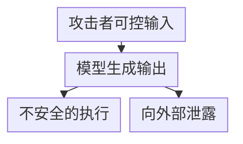

# 第三章：输出处理与 Secret Exfiltration

## 3.1 为什么输出侧需要单独的一章

前两章关注「不可信内容怎么进入模型」，本章关注**模型的输出本身应被当作不可信内容**。这是 OWASP LLM05（Improper Output Handling）的核心命题：很多团队严格校验输入，却把模型输出直接拼进 SQL、Shell 命令、HTML、Markdown 渲染器或下游 API 调用参数，相当于把模型变成了一个「可被攻击者远程编程的模板引擎」。

攻击者可控的直接或间接输入到达模型后，模型输出如果未经适当处理就进入 SQL、Shell、反序列化或前端 HTML/Markdown 渲染，就可能形成执行漏洞；工具调用参数也可能进入下游 API 或文件系统。另一条泄露路径是：含凭据或内部信息的输出到达外部可访问的目的地。需要哪些校验与转义，应由接收系统决定，而不是由模型表现出的自信决定。

图中条件与标签：

- 未经处理直接执行/渲染
- 未经处理直接执行/渲染
- 作为工具调用参数
- 夹带凭据或内部信息

图中各项的完整含义：

- 攻击者可控输入 直接或间接

模型输出之所以危险，是因为它同时具备两个特征：**内容可被攻击者间接操纵**（通过 Prompt Injection 或越狱），**又天然被下游系统当作「AI 生成的正常结果」而降低审查力度**。后面就沿着几个最容易出事的消费点往下看：执行、渲染、工具参数，以及单独拎出来看的密钥与敏感数据外泄（secret exfiltration）。

## 3.2 不安全输出处理的典型路径

### 3.2.1 注入类：输出被当作可执行内容

| 下游消费方式 | 风险 | 示例 |
|---|---|---|
| 拼接 SQL/命令行 | 注入攻击 | 模型生成的「用户名」字段被直接拼进 SQL WHERE 子句 |
| eval / 动态代码执行 | 远程代码执行 | 把模型返回的「表达式」直接传给 `eval()` |
| 反序列化（pickle 等） | 反序列化 RCE，详见第五章 | 模型输出被当作可信的序列化对象加载 |
| Shell 调用 | 命令注入 | 模型生成的文件名/参数未转义就传给 shell |

**防御**：对模型输出的处理方式，应遵循与「任意不可信用户输入」完全相同的安全编码规范——参数化查询、禁止拼接式 shell 调用、白名单校验、沙箱执行（第八章）。**「这是 AI 生成的」不能成为跳过校验的理由。**

### 3.2.2 渲染类：输出被当作可信前端内容

| 渲染场景 | 风险 |
|---|---|
| 直接渲染 HTML/Markdown | 未安全净化时可能发生 XSS；是否为存储型取决于输出是否保存后再展示 |
| 渲染为可点击链接 | 钓鱼：模型被诱导生成指向攻击者站点的链接，用户信任「AI 推荐的链接」而点击 |
| 富文本/Markdown 图片语法 | 隐蔽外带：见 3.3 |
| 表格/CSV 导出 | CSV 注入：以 `=`、`+`、`-`、`@` 开头的单元格被电子表格软件当作公式执行 |

**防御必须匹配消费上下文**：SQL 用参数化查询，Shell 优先传固定命令与参数数组并校验选项，HTML 用上下文编码或维护中的白名单 Sanitizer；JSON Schema 不能替代它们。Markdown 还需控制 URL 协议和外部资源。CSV 的普通引号转义不防公式执行，前导单引号的效果也依赖表格软件；优先导出明确文本类型的单元格，并测试目标客户端的打开、保存、再打开行为。

### 3.2.3 工具调用参数：输出直接驱动动作

Agent 场景下，模型输出不只是展示文本，还会直接成为工具调用的参数。若下游工具对参数「因为来自模型」而信任度过高，就会重现 [Tool Protocol 安全 15.3.2](../../tools/02-mcp/15-tool-protocol-security.zh.md) 描述的问题。这部分的权限与校验设计已在 [Agent 安全](../../agent/05-production/15-agent-security.zh.md) 和 [Tool Protocol 安全](../../tools/02-mcp/15-tool-protocol-security.zh.md) 讲清楚；这里直接盯住一个最容易失手的点：**服务端重新校验参数，不能相信「这是模型自己算出来的」**。

## 3.3 隐蔽外带通道（Covert Exfiltration Channels）

即使系统本身没有明显的「发送数据」功能，模型仍可能通过一些容易被忽视的输出形式把上下文中的敏感数据带出系统边界，这是 [Agent 安全 15.5.1](../../agent/05-production/15-agent-security.zh.md)「对外通信比想象中广」的具体展开。

| 通道 | 原理 |
|---|---|
| Markdown 图片自动加载 | `` 被渲染器自动请求，URL 中夹带的数据会发往目标服务器，无需用户点击 |
| 超链接文本 | 生成的链接 URL 本身携带编码后的数据，用户点击后触发外带 |
| 隐藏字符编码 | 用零宽字符或非打印 Unicode 把数据编码进看似正常的文本 |
| 分批/隐写式外带 | 把秘密拆分到多轮回复或多个字段中，单次输出体量小、不触发异常检测 |
| 副信道时序/长度 | 通过回复长度、是否报错、响应时间的差异间接传递 1 bit 信息（类似 [RAG 安全 20.3.3](../../rag/06-operations-security/20-rag-challenges-security.zh.md) 的差分探测，但方向是「模型主动泄漏」） |

**防御**：

- 渲染层禁止未经审查的外部资源自动加载；仅加代理不够，代理若原样转发含秘密的 URL，仍然会外泄，并可能引入服务端 SSRF；
- 对目标、路径与数据类别执行出口策略；域名白名单不能阻止向允许域名中的攻击者账号上传数据，重定向和最终连接地址也要重新校验；
- 输出侧异常检测应关注「结构异常但语义正常」的模式，例如异常多的编码字符、异常规律的字符间隔；
- 从根源上限制模型与执行环境能接触到的敏感数据（最小化原则，见 [Agent 安全 15.9](../../agent/05-production/15-agent-security.zh.md)）。模型复述秘密需要接触该信息，但工具也可能直接读取并外传数据，无需先把原文交给模型；因此不能只保护上下文而放开工具的文件与网络权限。

## 3.4 密钥、凭据与内部信息的外泄

这是隐蔽外带的一个高价值特例，值得单独强调排查清单：

| 泄漏源 | 场景 |
|---|---|
| System Prompt 中硬编码的密钥 | 见第二章系统提示泄漏 |
| 工具返回值中的原始凭据 | 工具把数据库连接串、内部 Token 直接返回给模型，模型可能在后续回复中复述 |
| 代码执行环境变量 | 代码解释器/Computer Use 环境中的环境变量、云凭据被模型读取后写入输出（见第八章） |
| 训练数据记忆化 | 模型直接背诵训练语料中出现过的密钥或个人数据（见第六章） |
| 日志与可观测系统 | 完整 Prompt/输出被记录到日志，日志访问权限过宽 |

模型请求本身不等于在线训练：凭据进入上下文主要带来本次复述、工具外传和日志留存风险，是否进入权重取决于后续数据使用流程。泄漏后应撤销或轮换凭据并审计使用记录，仅删除聊天记录不足以止损。

**上线前应做的最小检查**：

- 传给模型上下文的任何字段，若不是完成当前任务所必需，就不应该出现在上下文里（凭据尤其如此）；
- 工具设计上，需要凭据的操作应在工具内部完成鉴权，**不把凭据本身透传给模型**，模型只应看到「操作是否成功」；
- 输出侧接入密钥格式检测（如常见云厂商 Key 的正则特征）作为最后一道防线，命中则拦截或脱敏；
- 日志、追踪系统对 Prompt 和输出做默认脱敏，访问权限单独收紧。

## 3.5 上线检查表

- [ ] SQL 使用参数化查询，Shell 避免字符串拼接，不反序列化不可信 Pickle；不存在一种「转义」能统一解决三类风险；
- [ ] 富文本/Markdown 禁止未经批准的外部资源自动加载，代理也不转发夹带敏感数据的 URL；
- [ ] 表格导出优先使用明确的文本单元格类型；必须使用 CSV 时，按目标软件验证公式防护及保存后重开行为，不把普通引号转义当成完整防护；
- [ ] 链接检查协议、目标、路径与重定向，向允许域名中的第三方账号发送数据也受出口策略限制；
- [ ] 工具调用参数在服务端重新校验，不直接信任模型生成的 JSON；
- [ ] 上下文中不出现非必要的凭据、内部主机名、未脱敏个人数据；
- [ ] 输出侧接入密钥格式检测和敏感信息 DLP 规则；
- [ ] 日志与追踪系统默认脱敏，访问权限单独控制。

## 3.6 常见错误

### 3.6.1 认为「AI 生成的内容」天然可信

模型输出的风险等级应等同于任意不可信用户输入，所有下游消费点都要按此设计。

### 3.6.2 只做输入过滤，不做输出净化

即使输入侧防御完备，越狱或对齐失效仍可能让模型生成危险内容；输出净化是独立的、必需的一层。

### 3.6.3 忽视图片、链接等隐蔽外带通道

这是最容易被忽视但危害很大的一类问题，防御重点应放在限制上下文中的敏感数据和渲染层资源加载策略上。

### 3.6.4 把凭据透传给模型而不是在工具内部鉴权

一旦凭据进入模型上下文，就可能被复述、留存或外带；并不代表它会在此次推理中被写入模型权重。工具应在模型不可见的执行边界内使用凭据。

## 3.7 本章总结

1. 模型输出应被当作不可信内容处理，风险等级等同于任意用户输入，不能因为「是 AI 生成的」而放松校验；
2. 各消费点采用对应控制：SQL 参数化、固定命令与参数校验、安全渲染、表格公式防护和工具授权，不能用一种“净化”替代全部检查；
3. 图片自动加载、隐藏字符编码、分批外带、响应时序差异都是隐蔽外带通道；与其穷举通道，不如先把敏感数据尽量挡在上下文外；
4. 密钥与凭据的外泄往往源于「工具把凭据透传给模型」，正确设计是让工具内部完成鉴权，模型只看到操作结果；
5. 输出侧防御是纵深防御的最后一层，不能替代第二章和 [Agent 安全](../../agent/05-production/15-agent-security.zh.md) 中的架构级隔离，但同样不可或缺。

## 参考资料

<!-- centralized-bibliography -->
本章的参考资料、阅读建议与来源说明见[集中参考资料章节](../../book/references.zh.md#reading-safety-03)。
