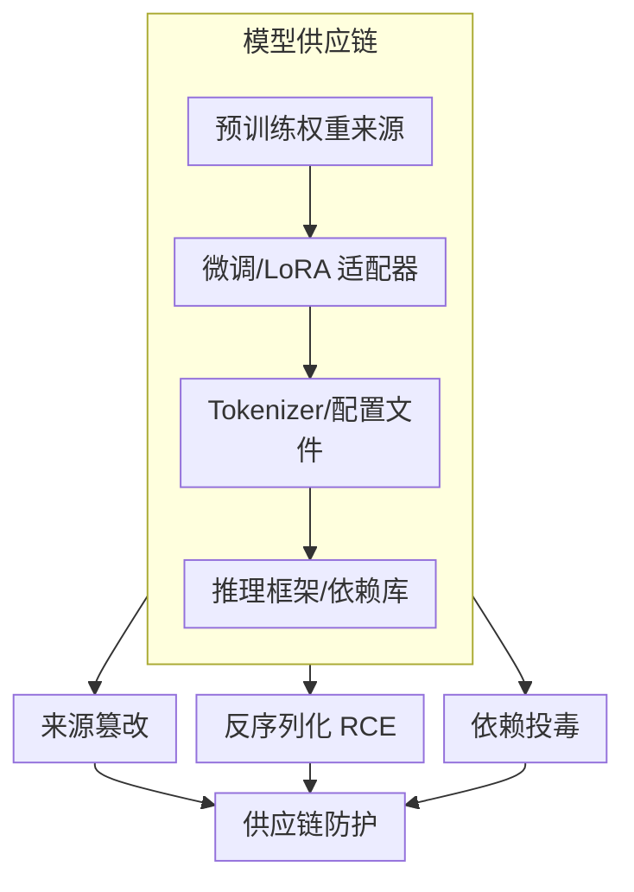
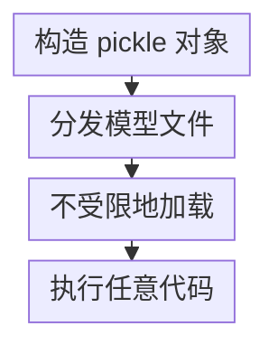

# 第五章：模型供应链与序列化风险

## 5.1 模型也是一种依赖

现代 AI 应用很少从零训练模型，而是从模型仓库（Hugging Face、云厂商模型市场等）下载预训练权重、适配器（LoRA）、Tokenizer 和评测脚本，再叠加自己的微调和 Prompt 工程。这意味着**模型和它的配套文件应该被当作软件依赖来管理**，需要与开源库依赖同等级别的供应链治理——但现实中很多团队只对代码依赖做扫描，对模型文件毫无审查。OWASP 将其列为 LLM03（Supply Chain Vulnerabilities）。

图中各项的完整含义：

- 来源篡改 5.2
- 反序列化 RCE 5.3
- 依赖投毒 5.4
- 防御：签名/出处/ML-BOM 5.5

## 5.2 来源篡改：模型仓库不是可信根

任何人都可以在公开模型仓库上传文件，仓库平台的「下载量」「点赞数」不构成安全审查。已被公开报告的风险包括：

- **仿冒模型**：上传与知名模型同名或极相似名称的权重，内容被植入后门（见第四章）或直接是恶意程序；
- **看似正常但携带后门的微调版本**：某个热门开源模型的「优化版」实际上被植入了触发器；
- **账号劫持后的恶意更新**：合法维护者账号被盗后，原本可信的模型条目被替换为恶意版本，而下游应用如果没有锁定具体版本/哈希，会静默拉取新内容。

**防御**：拉取模型前验证发布者身份（组织认证、历史提交记录）；锁定具体的 commit hash 或版本号而非 `latest`/`main` 分支；对权重文件计算并核对哈希；内部维护一份「已审查模型」的私有镜像仓库，生产环境只允许从私有镜像拉取。

## 5.3 反序列化风险：Pickle 与安全格式的选择

PyTorch 检查点常含 Pickle 元数据，而**通用 Pickle 反序列化可以执行代码**。但不能把任意 `.pt`/`.bin` 文件或所有 `torch.load()` 调用都描述为同一种执行路径：扩展名不决定内容与加载器，限制模式也影响可执行能力。

PyTorch 2.6 起，未传入 `pickle_module` 时，`torch.load` 默认采用 `weights_only=True`，限制可构造类型并禁止动态导入。它是攻击面缩减措施，不是完整沙箱；拒绝服务、解析器缺陷和不安全 allowlist 仍需防范。不能为消除报错就无审查地切换 `weights_only=False`。

完整消息顺序（含阶段说明）：

| 交互双方 | 消息或动作 |
| --- | --- |
| 攻击者 → 恶意 .pt/.bin 文件 | 构造带 __reduce__ 的对象并 pickle |
| 受害者环境 → 恶意 .pt/.bin 文件 | 不受限的 Pickle 加载；例如 weights_only=False |
| 恶意 .pt/.bin 文件 → 受害者环境（返回） | 反序列化时执行任意代码 |

**防御要点**：

- **优先使用不可执行代码的序列化格式**，例如 `safetensors`——它只存储张量数据，不支持任意 Python 对象反序列化，从格式层面消除了这一类风险；
- 必须处理历史 Pickle 时，先验证来源并扫描，再在无凭据、受限网络与资源的隔离环境处理；静态扫描无告警不等于可安全执行；
- 框架层面优先使用支持 `weights_only=True` 等安全加载模式的新版本 API，并保持推理框架本身的及时更新，历史上多个推理框架都修复过与模型加载相关的反序列化漏洞；
- 不要因为「文件扩展名是 .bin/.pt 看起来像模型」就降低警惕，模型文件的可信度评估标准应该与任意可执行文件一致。

## 5.4 依赖与工具链投毒

模型之外，整个 AI 应用的依赖链同样是攻击面：

| 风险 | 说明 |
|---|---|
| 依赖混淆（Dependency Confusion） | 内部私有包名被发布到公共仓库的同名恶意包抢注，构建时被错误拉取公共版本 |
| 恶意 MCP Server / Tool 包 | 与 [Tool Protocol 安全 15.3.2](../../tools/02-mcp/15-tool-protocol-security.zh.md) 描述的工具投毒相同思路，扩展到「工具本身作为软件包分发」的场景，需在安装前审查来源、版本与请求权限 |
| 恶意评测/预处理脚本 | 模型仓库附带的 `tokenizer.py`、自定义 `modeling_*.py` 等「远程代码」（`trust_remote_code`）文件本身可以包含任意逻辑 |
| CI/CD 供应链 | 模型训练、评测、发布流水线中的任一环节（构建镜像、依赖安装脚本）被污染，都能影响最终产出物 |

**关于「远程自定义代码」的特别提醒**：部分模型仓库允许模型附带自定义 Python 代码（用于自定义架构或 Tokenizer 逻辑），加载时如果开启了信任远程代码的选项，这段代码会被直接执行——这和执行任意脚本没有区别，应仅对来源明确、经过审查的模型开启，且应在隔离环境中首次执行。

## 5.5 出处、签名与 ML-BOM

供应链治理让来源和完整性可核验，但仍依赖可信发布者、构建环境及验证策略。攻击者与文件一起提供的哈希没有独立可信度；签名只能证明受信身份签过这些字节，不能证明权重无后门或数据许可合法。`safetensors` 不执行任意 Python 对象，但不能阻止伴随的远程代码、推理框架缺陷或模型行为后门。

| 手段 | 作用 |
|---|---|
| **模型签名** | 对发布的模型文件做数字签名（如基于 Sigstore 一类的透明签名生态），下游在加载前验证签名与发布者身份 |
| **ML-BOM（Machine Learning Bill of Materials）** | 参照软件 SBOM 的思路，记录模型的训练数据来源、基础模型血缘、依赖库版本、评测结果，作为可审计的物料清单 |
| **模型卡/数据集卡** | 记录用途、已知局限、训练数据特征、评测结果，是治理和事后追责的基础文档（详见第十章） |
| **可复现构建/训练记录** | 记录代码、环境、数据与种子；分布式训练不一定逐位复现，需声明可重复的指标与容差 |
| **内部制品库** | 私有镜像仓库统一管理已审查通过的模型、适配器和工具版本，生产环境禁止直接从公网拉取 |

## 5.6 上线检查表

- [ ] 模型、适配器、Tokenizer 均锁定具体版本/哈希，而非跟随最新分支自动更新；
- [ ] 生产环境模型来自内部已审查的私有镜像，而非直接从公网仓库拉取；
- [ ] 优先使用张量数据格式；历史 Pickle 做来源验证、扫描和隔离，不把扫描当作沙箱替代；
- [ ] 默认关闭「信任远程自定义代码」，确需开启时仅对审查过的来源放行；
- [ ] 依赖扫描覆盖模型文件、工具包、MCP Server 及其传递依赖，防范依赖混淆；
- [ ] 关键模型具备可复现构建记录或 ML-BOM，供事后审计。

## 5.7 常见错误

### 5.7.1 只扫描代码依赖，不扫描模型文件

模型权重、适配器、Tokenizer 配置都应纳入供应链安全管理范围，与代码依赖同等对待。

### 5.7.2 认为下载量高、点赞多的模型天然可信

平台的热度指标不构成安全审查，账号劫持和仿冒模型在热门条目上同样会发生。

### 5.7.3 默认信任远程自定义代码

开启该选项等同于执行任意脚本，必须仅对来源明确、经过审查的模型开启。

### 5.7.4 混淆"模型来源可信"与"文件格式安全"

即便模型来源可信，pickle 格式本身的反序列化机制依然存在被篡改利用的风险，两者需要分别把关。

## 5.8 本章总结

1. 模型、适配器、Tokenizer 和相关脚本应被当作软件依赖管理，供应链风险覆盖来源篡改、反序列化漏洞和依赖投毒三类；
2. 模型仓库的热度指标不构成安全审查，应验证发布者身份、锁定版本哈希，并优先使用内部审查过的私有镜像；
3. Pickle 格式的反序列化机制本身可执行任意代码，应优先迁移到 `safetensors` 等不可执行代码的格式；
4. 「信任远程自定义代码」选项等同于执行任意脚本，默认应关闭；
5. 模型签名、ML-BOM、模型卡和可复现构建是让供应链可验证、可审计的核心手段，为第十章的治理与审计提供基础物料。

## 参考资料

<!-- centralized-bibliography -->
本章的参考资料、阅读建议与来源说明见[集中参考资料章节](../../book/references.zh.md#reading-safety-05)。
