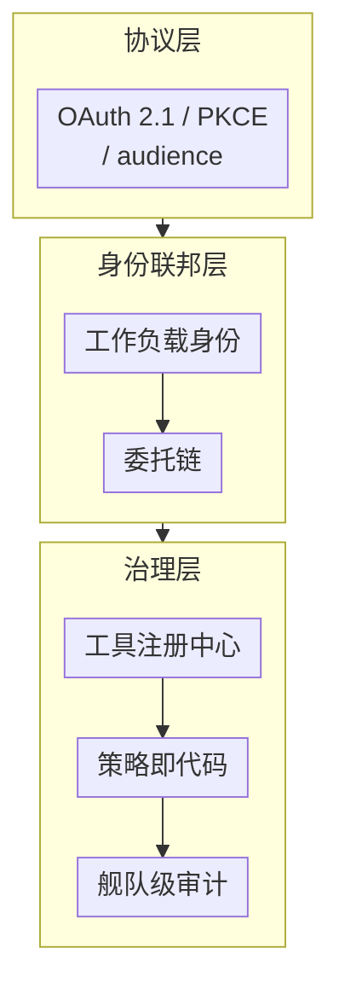
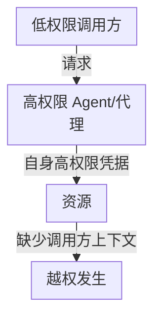
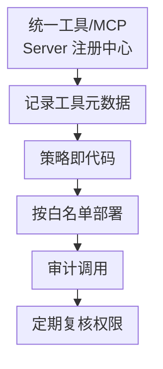

# 第七章：Agent、Tool、MCP、A2A 最小权限与身份治理

## 7.1 本章的定位：从单个协议到组织级身份治理

[Tool Protocol 安全](../../tools/02-mcp/15-tool-protocol-security.zh.md) 讨论认证、令牌受众和协议边界。本章关注跨系统的三个问题：谁能代表谁行动、权限如何在委托链上收紧、工具接入和撤权由谁负责。即使每个接口单独符合其协议，也不能证明整条委托链没有越权。

协议层见《工具协议安全》；身份联邦在本章 7.2–7.3 节展开，治理层在 7.4–7.5 节展开。

图中各项的完整含义：

- 协议层（见 Tool Protocol 安全）
- 身份联邦层（本章 7.2-7.3）

MCP 与 A2A 不共享一套完全相同的授权规范。本章引用的 MCP 2026-07-28 授权规范针对 HTTP 传输，引用 OAuth 2.1 草案；STDIO 的凭据处理不同。A2A 的具体认证方案需核对其规范和服务配置，不能把 MCP 的每条要求直接套过去。

## 7.2 Agent 的身份模型：谁在代表谁

传统系统早已有用户、服务、设备与委托身份，Agent 不天然创造一种新的密码学身份。工程上应区分谁运行 Agent（工作负载）、谁发起任务（用户或自动任务主体）、谁授权动作，以及执行中的 Agent/任务 ID。后两者常是审计属性，不应直接替代可验证的主体凭据。

| 身份类型 | 特点 | 典型问题 |
|---|---|---|
| 用户委托身份（On-behalf-of） | Agent 代表具体用户执行操作，权限应等于或小于该用户 | 委托链拉长后，中间某一跳权限被放大 |
| 服务/工作负载身份 | Agent 本身作为一个服务主体，拥有独立的凭据 | 服务身份权限范围设置过宽，被用于本应走用户委托的场景 |
| 混合身份 | Agent 同时持有服务身份和临时的用户上下文 | 日志和审计无法区分"这个动作是 Agent 自主决定还是代表用户执行" |

**核心设计原则**：每一次跨系统调用都应该能明确回答"这次动作是以谁的身份、基于谁的授权发生的"。做不到这一点，就无法在事后审计中定位责任，也无法在权限收紧时知道该收紧谁的权限。

### 7.2.1 工作负载身份联邦

在多云、多服务的现实环境中，让每个 Agent/工具持有静态的长期凭据是不可扩展也不安全的做法。更好的做法是使用**工作负载身份联邦**：Agent 运行时环境（如容器、函数计算实例）本身具备可验证的身份，通过短期令牌交换的方式获得访问下游资源所需的临时凭据，而不是在配置里硬编码密钥。这与 [Tool Protocol 安全 15.2](../../tools/02-mcp/15-tool-protocol-security.zh.md) 中"短生命周期 access token"的原则是一致的，只是把它从单次协议调用扩展到了整个部署环境的凭据管理策略。

## 7.3 Confused Deputy：通用模式而非 MCP 专属问题

Confused Deputy（迷惑的代理人）问题最早出现在传统操作系统安全领域：一个拥有较高权限的程序被诱导代表低权限的调用方执行了后者本不该有权限做的操作。在 Agent 系统里，这个模式反复出现在不同层面，token passthrough（详见 [Tool Protocol 安全 15.2.1](../../tools/02-mcp/15-tool-protocol-security.zh.md)）只是其中一种具体表现。

图中条件与标签：

- 使用自己的高权限凭据执行
- 资源无法区分 是谁的真实意图

其他常见变体：

- **多 Agent 委托链中的权限放大**：Agent A 以自己的高权限身份调用 Agent B 完成一个子任务，但没有把"这个子任务的实际发起者是低权限用户"这一信息传递下去，B 就按 A 的权限而非用户的权限执行；
- **共享工具账号**：多个 Agent 或多个租户共用同一个工具/数据库的服务账号，操作日志无法归因到具体发起者，任何一个 Agent 出问题都可能被误认为是账号本身被攻破；
- **审批流程被代理**：高风险操作的人工审批环节，如果审批者看到的是 Agent 汇总后的摘要而不是原始意图和参数，实际上是把审批权"委托"给了可能被注入影响的摘要生成过程。

**通用防御原则**：

1. **委托不得隐式放大权限**：有效权限受主体可委托范围、显式授权、接收方策略、资源归属和任务约束共同限制。「交集」是策略原则，不是把不同服务的 scope 字符串直接求交集；需由授权系统映射语义。
2. **使用受验证的委托信息**：RFC 8693 Token Exchange 定义 `subject_token`、`actor_token`，JWT `act` 可表达行动者；`act_as`、`on_behalf_of` 不是所有 OAuth 实现通用的标准声明。令牌交换不自动保证权限衰减，签发方仍须执行策略。
3. **每跳重新授权**：资源服务按令牌类型校验。JWT 需检查签名、issuer、audience 和有效期；不透明令牌则通过受信的内省接口或服务端状态验证。两者都还要检查本地资源权限，仅在 Prompt、请求头或 JSON 中写「代表用户 A」不是授权证明。

RFC 8693 的嵌套 `act` 可保留历史行动者，但历史项只用于追溯，不能被接收方当成额外授权。令牌消费者按顶层声明与当前行动者执行访问控制；逐跳衰减由签发和资源策略实现，而不是遍历历史 `act` 后自动得出。

人工审批要绑定规范化的动作参数、资源、金额、目的地、有效期与一次性动作 ID。执行前参数变化应重新审批，不能复用一句笼统的「允许 Agent 操作」。用户撤销授权后还需阻断排队任务、清理凭据缓存；短期令牌在过期前仍可能有效，高风险系统要补撤销或实时策略检查。

## 7.4 多 Agent 与跨组织场景下的信任边界

A2A 等跨 Agent 协议让不同团队、甚至不同组织运营的 Agent 可以互相调用。这时候身份治理还要额外考虑：

| 场景 | 额外风险 | 治理要点 |
|---|---|---|
| 跨团队内部 Agent 互调 | 团队间权限边界模糊，一个团队的 Agent 意外获得了另一团队数据的访问权 | 内部也要做租户级隔离，而不是假设"都是自己人" |
| 跨组织 Agent 协作 | 对端组织的安全成熟度未知，其 Agent 可能本身已被攻陷 | 对外部 Agent 的调用按最低信任度设计，输出当作不可信内容（呼应第二、三章） |
| Agent 市场/第三方 Agent 接入 | 第三方 Agent 的实现细节不可见，"黑盒调用黑盒" | 引入前审查其声明的权限范围、数据处理方式，签署明确的数据处理协议 |

多 Agent 系统的协作模式、路由和混淆代理问题的架构设计见 [Agent 安全 15.12](../../agent/05-production/15-agent-security.zh.md) 和[多 Agent 协作与路由](../../agent/04-multi-agent/13-multi-agent-coordination.zh.md)；这里直接从身份和权限治理看这件事，两边要结合着读。

## 7.5 舰队级的工具权限治理

当组织内 Agent 和工具数量达到一定规模，逐个人工审批已经不可持续，需要系统化的治理机制：

图中各项的完整含义：

- 记录：发布者/版本/请求权限/数据分类
- 策略即代码 按角色/环境/数据敏感度定义可用工具集
- Agent 部署时按策略自动生成 allowlist
- 集中审计：谁在何时以何身份调用了什么
- 定期复核：权限是否仍然必要

- **统一注册中心**：所有可被 Agent 使用的工具/MCP Server 在接入前必须登记发布者、版本、请求的权限范围和涉及的数据分类，禁止"团队私下拉一个工具就接进 Agent"；
- **策略即代码**：工具的可用范围（哪些 Agent、哪些环境、哪些数据敏感度下可以使用）用可版本化、可评审的策略描述，而不是散落在各个 Agent 的配置文件里；
- **权限随环境自动收紧**：生产环境默认使用比测试环境更严格的策略集，与 [Agent 安全 15.9.2](../../agent/05-production/15-agent-security.zh.md)"权限随上下文收紧"的原则一致，只是把它上升到组织级的默认策略；
- **集中审计与定期复核**：审计日志需要能跨 Agent、跨工具关联同一次任务的完整链路（呼应 [Tool Protocol 安全 15.4](../../tools/02-mcp/15-tool-protocol-security.zh.md) 的审计要求），并且需要有固定节奏的权限复核机制，撤回不再需要的授权——这是很多组织"权限只增不减"问题的根本解法。

## 7.6 上线检查表

- [ ] 每一次跨系统调用都能明确回答"以谁的身份、基于谁的授权"发生；
- [ ] Agent 的服务身份与用户委托身份分离管理，不用服务身份代替应有的用户委托流程；
- [ ] 长期静态凭据已替换为工作负载身份联邦 + 短期令牌；
- [ ] 委托权限经过授权系统衰减与资源侧复核，声明可验证，审批绑定实际动作；
- [ ] 跨团队、跨组织的 Agent 调用按最低信任度设计，不假设"内部就是可信的"；
- [ ] 所有工具/MCP Server 在统一注册中心登记，策略以代码形式管理并可版本化评审；
- [ ] 建立固定节奏的权限复核机制，撤回不再需要的授权。

## 7.7 常见错误

### 7.7.1 只在单次协议调用层面做安全，不管委托链的整体权限走向

单次调用符合 OAuth 最佳实践，不代表委托链末端没有权限被放大的问题，必须端到端追踪有效权限。

### 7.7.2 多个 Agent/租户共用同一个工具服务账号

若只记录共享服务账号，审计就无法区分实际发起者。应按隔离需求拆分凭据，或使用能验证委托主体并逐次授权的连接器；即使底层旧系统只能用共享账号，上游仍须保留用户、租户、任务与动作的可验证关联。

### 7.7.3 假设内部 Agent 互调不需要身份校验

团队边界和租户边界同样需要授权检查，"都是自己人"不是安全边界。

### 7.7.4 权限只增不减，没有复核机制

大多数组织的权限膨胀问题源于从未主动撤回不再需要的授权，必须建立定期复核流程。

## 7.8 本章总结

1. 本章聚焦跨系统、组织级的身份治理，与 [Tool Protocol 安全](../../tools/02-mcp/15-tool-protocol-security.zh.md) 覆盖的单协议实现细节互补而不重复；
2. Agent 的身份应明确区分用户委托身份和服务/工作负载身份，工作负载身份联邦 + 短期令牌优于静态长期凭据；
3. Confused Deputy 是贯穿多层的通用模式；委托不得隐式放大权限，但跨服务的权限语义需要映射，不能对 scope 字符串或历史 `act` 机械求交集；
4. 多 Agent、跨组织协作场景需要额外的信任边界设计，内部团队之间也不能假设默认可信；
5. 组织规模化后需要工具注册中心、策略即代码、集中审计和定期权限复核这套舰队级治理机制，而不能依赖逐个人工审批。

## 参考资料

<!-- centralized-bibliography -->
本章的参考资料、阅读建议与来源说明见[集中参考资料章节](../../book/references.zh.md#reading-safety-07)。
