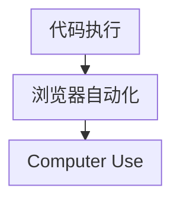
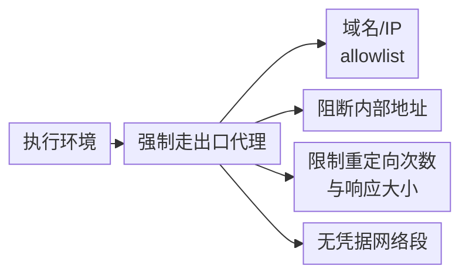

# 第八章：代码执行、浏览器与 Computer Use 沙箱及网络隔离

## 8.1 三类执行能力，边界取决于实际授权

代码解释器、浏览器自动化和 Computer Use（让模型直接操作图形界面、鼠标键盘）是当前 Agent 能力扩展最快的三类工具，也是攻击面最不容易被完整枚举的三类工具。它们的共同点是：**执行的具体指令由模型运行时生成，无法在设计阶段穷举**，因此防御重心必须放在"限制执行环境本身能造成的最大损害"，而不是"预判模型会生成什么指令"。

图中各项的完整含义：

- 代码执行 进程、文件与网络权限
- 浏览器自动化 页面、登录态与下载
- Computer Use 可见桌面、应用与剪贴板

三者没有固定风险排序。带宿主挂载和云凭据的代码容器，可能比一次性虚拟桌面更危险；浏览器和 Computer Use 的影响也受登录账户与操作系统权限限制。评估时先列出可读数据、可写资源、网络目的地与持有凭据，再选择隔离强度。

## 8.2 代码执行沙箱

### 8.2.1 隔离层级选择

| 隔离方式 | 隔离强度 | 典型场景 |
|---|---|---|
| 语言级沙箱（受限解释器） | 弱，容易被已知技巧绕过 | 不推荐用于不可信代码 |
| 容器（Docker 等） | 中，共享宿主内核 | 内部可信度较高的场景，仍需配合内核加固 |
| 用户态内核隔离（gVisor 等） | 较强，拦截并模拟系统调用，减少宿主内核暴露面 | 多租户代码执行服务 |
| 微虚拟机（Firecracker 等） | 独立客户机内核和虚拟化边界，仍依赖宿主与 VMM 安全 | 高隔离要求的不可信代码，需权衡启动、兼容和运维成本 |

**原则**：只要执行的代码来自模型生成、且模型的生成过程可能被 Prompt Injection 或越狱影响（见第二章），就应该按"不可信代码"的最高标准隔离，而不是按"这是我们自己 Agent 生成的代码，应该问题不大"的乐观假设。

### 8.2.2 资源与生命周期限制

- **每个已授权任务或会话使用有界、可销毁的环境**：明确归属、权限和存活时间。同一范围内的连续代码调用可以保留文件与解释器状态，彼此独立的执行使用新环境。任务或会话结束、授权边界改变时销毁环境，不把残留状态直接交给另一用户或无关任务；
- **CPU/内存/磁盘/执行时长硬限制**：防止资源耗尽型攻击（构造无限循环、大量写盘、fork bomb）；
- **文件系统最小化**：沙箱内不挂载宿主机的真实文件系统、不包含无关的凭据文件、环境变量默认不包含云凭据（呼应第三章"密钥不进上下文"）；
- **无出站网络或按需最小开放**：默认禁止沙箱访问外部网络，确需网络能力时走 8.5 的出口控制，而不是给沙箱直连公网的能力。

## 8.3 浏览器自动化的特有风险

### 8.3.1 身份与会话相关风险

浏览器自动化可能需要登录态，因而增加以下风险；若代码环境也能访问同样的会话材料，它同样面临这些问题：

- **会话能力被滥用**：恶意页面不能仅因被访问就任意读取其他站点 Cookie；同源策略和 HttpOnly 仍有效。但注入可能诱导 Agent 前往已登录站点并执行动作，无需偷到 Cookie；
- **跨站与跨步骤诱导**：传统 CSRF 仍需站点侧防护；Agent 受诱导后在目标站点执行合法导航或表单操作，不一定是 CSRF，令牌校验也未必阻止这种授权意图被劫持；
- **下载文件执行**：浏览器下载的文件如果被后续步骤（代码解释器、桌面操作）打开或执行，等同于引入了一个新的、来源不可控的代码执行入口。

### 8.3.2 防御设计

- **登录态最小化**：只在完成特定任务必需时注入特定域名的登录态，不做"全程携带用户完整会话"的设计；任务结束后销毁会话；
- **页面内容视为不可信输入**：网页的文本、alt 属性、隐藏元素都可能包含注入指令，处理方式与 [RAG 安全 20.3.2](../../rag/06-operations-security/20-rag-challenges-security.zh.md) 描述的间接注入防御一致——能力隔离和数据流控制是主防线，不能依赖"提醒模型小心网页内容"这种概率性缓解；
- **高风险操作二次确认**：涉及支付、密码修改、数据提交类的页面操作，应有独立于模型判断的确定性规则触发人工确认，而不是让模型自己判断"这个操作安全吗"；
- **下载文件默认隔离**：下载内容进入独立沙箱做扫描和格式校验，不自动传递给可执行环境。

## 8.4 Computer Use 的特有风险

Computer Use 让模型通过截图理解界面、通过鼠标键盘操作可访问的桌面应用。风险取决于桌面的实际权限与共享数据，尤其要防止不同应用间的信息与动作被非预期地串联。

### 8.4.1 视觉层面的间接 Prompt Injection

模型依赖截图来"看懂"当前屏幕，任何出现在屏幕上的内容——包括其他窗口的通知、桌面壁纸上的文字、恶意网页渲染出的伪造系统对话框——都可能被模型当作需要响应的指令。**这是间接 Prompt Injection 在视觉模态上的延伸**，与文本文档中的隐藏指令原理相同，只是载体从文本变成了截图。

### 8.4.2 操作系统级攻击面

| 风险 | 说明 |
|---|---|
| 剪贴板劫持 | 模型可以读写系统剪贴板，可能被诱导读取剪贴板中的敏感数据并粘贴到不当位置，或反过来把恶意内容写入剪贴板供用户后续误粘贴 |
| 伪造系统弹窗 | 恶意页面可以渲染出与真实操作系统权限请求框高度相似的界面，诱导模型（或后续的人工审批者）误点"允许" |
| 跨应用数据串联 | 模型可以在一个操作序列里跨越邮件、浏览器、文件管理器等多个应用，任何一环被注入都可能导致整个操作链被劫持 |
| 无法细粒度限权 | 相比 API 调用可以精确控制"允许调用哪个函数"，图形界面操作很难做到"只允许点击这个按钮"级别的白名单 |

### 8.4.3 防御设计

- **默认在隔离桌面环境中运行**：使用独立虚拟机或受控桌面，禁用无关宿主目录、剪贴板、设备和会话共享；容器化桌面是逻辑隔离，不是物理隔离，也不保证不会逃逸；
- **任务范围声明与越界检测**：在任务开始前声明允许操作的应用范围，运行时检测是否出现了超出声明范围的应用切换或窗口，超出则暂停并要求确认；
- **高权限操作的确定性拦截**：涉及系统设置修改、权限授予、文件删除等操作，由操作系统层面的策略（而非模型自我克制）强制拦截或要求二次确认，这与浏览器自动化的"二次确认不能靠模型自我判断"是同一原则；
- **截图内容的输入检测**：对截图做 OCR/内容分析，识别是否存在异常的、疑似注入的文字或界面元素，作为纵深防御的一层，但不能替代隔离桌面这一主防线。

## 8.5 统一的网络出口控制

三类执行环境都需要一致的网络隔离策略，这与 [Tool Protocol 安全 15.3.1](../../tools/02-mcp/15-tool-protocol-security.zh.md) 描述的 SSRF 防护原则相通；放到执行沙箱里，就是下面这套网络设计：

图中各项的完整含义：

- 执行环境 代码/浏览器/Computer Use
- 拒绝 loopback/私网/metadata 地址
- 无凭据网络段 凭据由代理按需注入

- 执行环境不直连公网，所有出站流量强制经过受控代理；
- 代理层维护 allowlist 而非 blocklist，默认拒绝一切未声明的目的地；
- 代理层负责在需要时按需注入凭据（如访问特定内部 API 需要的 Token），执行环境本身不持有长期凭据，这与[第三章](../02-prompt-content-attacks/03-output-handling-secret-exfiltration.zh.md)“凭据不进模型上下文”的原则一致；
- 记录目的地、动作、策略决策和用量等必要元数据，不全量记录 URL 查询参数、正文或凭据。

代理只有在网络层禁止直连时才构成强制边界：需覆盖 DNS、IPv4/IPv6、重定向与其他协议，并验证最终解析和连接地址。阻断 metadata、loopback 与非授权私网；确需内部 API 时通过独立连接器逐服务放行，不是放开整个内网。按需注入凭据也应绑定目标、方法、路径和作用域，重定向不得携带凭据到另一目的地。允许域名仍可能提供向外上传数据的功能，不能把 allowlist 当作完整 DLP。

## 8.6 上线检查表

- [ ] 不可信代码执行默认使用微虚拟机/用户态内核隔离级别的沙箱，而非仅语言级沙箱；
- [ ] 执行环境有明确的任务或会话归属及存活时间上限，状态仅在该授权范围内保留，范围结束或改变时销毁环境；
- [ ] 沙箱内 CPU/内存/磁盘/执行时长有硬限制；
- [ ] 浏览器自动化的登录态按任务最小化注入，任务结束即销毁；
- [ ] 浏览器/Computer Use 中涉及支付、密码修改等高风险操作，由确定性规则强制人工确认，不依赖模型自我判断；
- [ ] Computer Use 使用明确的虚拟化或逻辑隔离边界，不共享无关的宿主数据与会话；
- [ ] 出站网络强制走代理，拒绝 metadata、loopback 和非授权私网，业务例外逐服务审批；
- [ ] 执行环境不持有长期凭据，按需通过代理注入。

## 8.7 常见错误

### 8.7.1 认为"代码是自己 Agent 生成的"所以风险较低

只要生成过程可能被 Prompt Injection 或越狱影响，就应按不可信代码的最高标准隔离。

### 8.7.2 浏览器自动化全程携带用户完整登录会话

应按任务最小化注入特定域名的登录态，而不是让 Agent 拥有用户的完整会话权限。

### 8.7.3 依赖提醒模型"小心可疑内容"作为注入防御

无论文本还是视觉模态的间接注入，都需要能力隔离和数据流控制作为主防线，提示词层面的提醒只是概率性缓解。

### 8.7.4 Computer Use 在用户真实桌面环境直接运行

一旦被视觉层面的注入劫持，会直接影响宿主机的真实数据和应用，必须使用隔离桌面环境。

## 8.8 本章总结

1. 三类能力的风险由实际权限、数据和网络决定，防御重点是限制最大损害，而非假定固定风险排序；
2. 代码执行应使用微虚拟机/用户态内核级别的隔离、短生命周期环境和严格的资源限制；
3. 浏览器自动化的特有风险在于登录态和会话相关的攻击面，登录态应按任务最小化注入，网页内容按不可信输入处理；
4. Computer Use 把风险扩展到其可访问的桌面、应用和共享状态，不等于拥有整个操作系统的权限；默认使用隔离桌面，并控制视觉注入、剪贴板和伪造弹窗带来的动作风险；
5. 三类执行环境应共享网络出口控制原则：强制代理，拒绝 metadata、loopback 和非授权私网，业务例外逐服务放行，凭据绑定目标与动作。

## 参考资料

<!-- centralized-bibliography -->
本章的参考资料、阅读建议与来源说明见[集中参考资料章节](../../book/references.zh.md#reading-safety-08)。
