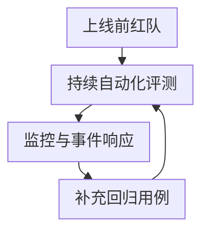
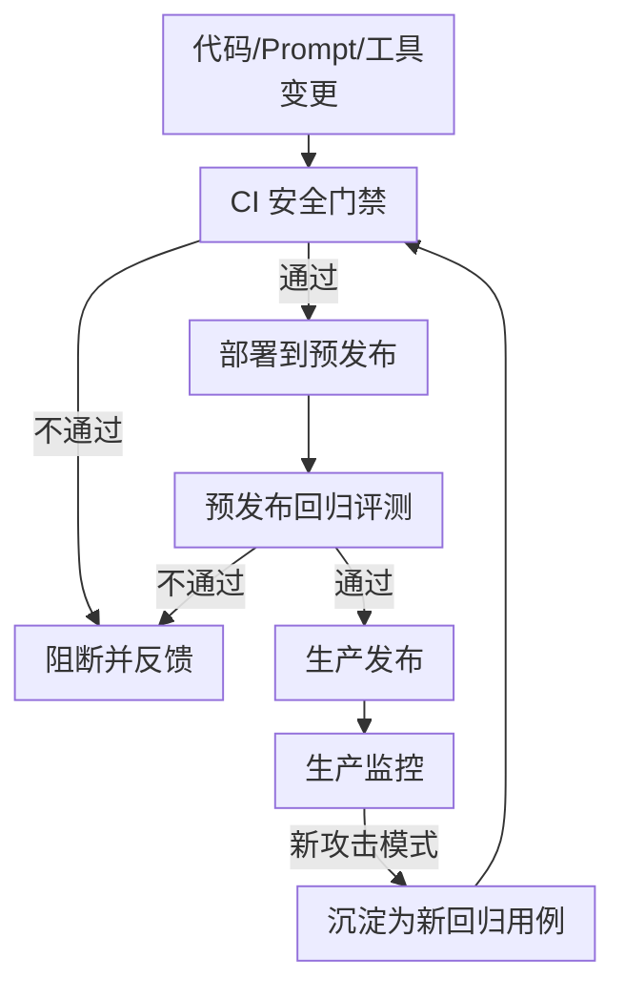

# 第九章：安全评测、红队与持续保障

## 9.1 安全评测为什么不能只是一次性的上线检查

前面章节多次提到"某类攻击在标准评测中不可见""对齐是概率性缓解"——这意味着 AI 系统的安全水位不是一次测试能确定的常量，而是随模型版本、Prompt 变化、新工具接入、新越狱手法公开而持续波动的变量。[Agent 安全 15.13](../../agent/05-production/15-agent-security.zh.md) 和 [RAG 安全 20.4](../../rag/06-operations-security/20-rag-challenges-security.zh.md) 已经给出了单个应用场景下"ASR（攻击成功率）与 Utility（效用）必须成对报告"的评测原则；放到组织里，就得把它变成红队方法论、自动化工具链和持续保障流程。

图中各项的完整含义：

- 生产监控与事件响应
- 反馈进新一轮评测集

## 9.2 红队方法论

### 9.2.1 人工红队与自动化红队的分工

| 类型 | 优势 | 局限 |
|---|---|---|
| 人工红队 | 能发现开放式、需要创造性组合的新攻击路径；擅长针对具体业务场景构造有说服力的社会工程式载荷 | 成本高、覆盖面有限、结果难以自动化回归 |
| 自动化红队 | 可重复运行模式库，也可搜索新变体和多轮策略 | 覆盖受搜索空间、预算和评分器限制，容易围绕已有基准过拟合 |

人工与自动化都可能发现新变体，区别在于成本、覆盖与搜索策略，不是「机器只能找已知、人才能找未知」。人工发现的有效路径应转成可重复用例，自动化搜索发现也需复核；不要把工具扫描结果直接当作实际业务损害。

### 9.2.2 红队覆盖的层面

红队不应该只测"模型会不会说脏话"，而应对照第一章的攻击面图谱，覆盖：

- **模型层**：越狱、系统提示泄漏（第二章）；
- **数据层**：已知触发器模式的探测、训练数据记忆化抽取测试（第四、六章）；
- **供应链层**：模拟依赖投毒、恶意模型加载路径（第五章）；
- **应用层**：间接注入、工具滥用、confused deputy 路径（第七章、[Tool Protocol 安全](../../tools/02-mcp/15-tool-protocol-security.zh.md)）；
- **执行环境层**：沙箱逃逸尝试、网络出口绕过（第八章）；
- **端到端场景**：模拟真实攻击者从初始接触到达成目标的完整路径，而不是孤立测试单点。

测试前先取得授权并约定范围、时间、速率、停止条件和事故联系人。用合成身份、测试资金与隔离租户，工具外传使用受控接收端；禁止把真实个人数据或生产密钥作为测试载荷。发现意外影响时立即停止相关测试、保留最小证据并按响应流程处理。

### 9.2.3 红队的角色与独立性

红队应保持相对于研发团队的独立性——由同一批人既写防御又测防御，容易产生盲区。较成熟的组织会引入外部红队或独立安全团队定期评估，并明确红队发现问题后的分级响应流程和修复时限（SLA），而不是把红队报告当作可选参考。

## 9.3 自动化评测工具与基准

| 工具/基准类别 | 定位 |
|---|---|
| 通用红队框架（如 garak） | 针对 LLM 的自动化漏洞扫描器，内置大量已知的越狱、注入、数据泄漏探测插件，适合作为持续回归的基础工具 |
| 编排式红队框架（如 PyRIT） | 提供攻击策略编排能力，支持组合多轮攻击、自动变异 Prompt，适合模拟更复杂的攻击链路 |
| 危害性基准（如 HarmBench） | 标准化的有害行为评测集，用于跨模型、跨版本做可比较的安全水位评估 |
| 护栏/审核模型评测 | 专门评测输入输出护栏模型自身的漏报率和误报率，护栏模型本身也需要被评测，而不是假设它天然可靠 |
| 供应链扫描工具 | 覆盖第五章提到的模型文件恶意对象扫描、依赖漏洞扫描 |

固定工具、探针、模型和评分器版本，记录运行配置。通过一轮扫描只说明在这些输入、预算和判据下未观察到失败，不提供「安全下限保证」。框架支持某个探针，也不等于它能检测应用的全部授权与执行路径。

## 9.4 持续保障：把安全评测嵌进研发流程

图中条件与标签：

- 发现新攻击模式

- **CI 安全门禁**：任何 System Prompt、工具授权范围、模型版本的变更都触发一轮自动化安全回归，而不只是功能测试；
- **分级评测集**：参照 [RAG 安全上线检查清单](../../rag/06-operations-security/20-rag-challenges-security.zh.md) 的 Smoke/Regression/Full 三档思路，安全评测同样应分层——每次提交跑最小冒烟集，合并前跑完整回归集，定期跑覆盖新披露攻击手法的全量集；
- **生产监控闭环**：线上真实触发的异常请求、护栏拦截记录应定期回流为新的评测用例，而不是只在事故发生时临时处理；
- **版本变更的特别关注**：模型供应商发布新版本时，历史上被验证有效的防御可能失效（对齐行为改变）或护栏出现新的误报模式，模型切换必须重新跑一遍完整安全回归，不能假设"新版本只会更安全"。

## 9.5 指标体系

先写明「成功」的对象：生成不当文字、产生危险工具调用、被执行服务接受、实际改变资源，是不同指标。被授权层拦下的调用不能计为已造成业务损害，但仍可作为模型层失败记录。

**ASR 的分母和攻击预算必须公开**。单次尝试成功率与每个目标在最多 k 次尝试内至少成功一次的比例不可直接比较；超时、无效载荷与不可执行用例要单独列出。重复改写同一个目标不是独立目标，应按目标或会话估计不确定性。自适应红队用于发现失败，不能把其挑选后的 ASR 当成真实用户分布的发生概率。

同时报告正常任务完成率、误拒、时延和费用；总是拒绝能压低 ASR，却没有业务效用。防御调参集与攻击留出集分开，新增失败用例加入回归后不再冒充独立留出。对「模型裁判认定成功」的样本抽查实际执行和审计证据，避免被回答中的虚构成功描述误导。

组织级保障还应跟踪：

| 指标 | 含义 |
|---|---|
| MTTD | 从可观察事件开始到被检测的平均时长，起点不可知时要说明估计方法 |
| MTTR / 修复周期 | MTTR 需明确是恢复还是修复；发现到补丁生效的周期另行记录，不能与 MTTD 混称 |
| 护栏误报率 | 护栏拦截正常请求的比例，直接影响业务可用性 |
| 回归用例覆盖的攻击类型数 | 衡量评测集对第一章攻击面图谱的覆盖广度，而非用例总数 |
| 红队发现问题的修复 SLA 达成率 | 衡量安全发现能否转化为实际修复，而不是停留在报告里 |

## 9.6 常见错误

### 9.6.1 只做一次上线前红队测试

模型、Prompt、工具集持续变化，安全水位必须持续评测，一次性测试只能反映测试当时的状态。

### 9.6.2 只依赖自动化工具，不做人工红队

自动化覆盖受探针、搜索预算和评分器限制，人工覆盖也有限。两者应共享失败证据与回归用例，不能把任一方测试通过当作完整保证。

### 9.6.3 模型版本升级时跳过安全回归

新版本可能改变对齐行为或护栏的误报/漏报模式，"应该只会更好"是没有依据的假设。

### 9.6.4 只统计回归用例数量，不衡量攻击面覆盖广度

大量重复相似的用例无法反映真实的安全水位，评测集设计应对照攻击面图谱有意识地补齐薄弱环节。

## 9.7 本章总结

1. 安全评测必须是持续过程而非一次性检查，因为模型、Prompt、工具集和已知攻击手法都在持续变化；
2. 人工红队与自动化红队应形成"发现新模式 → 沉淀为自动化用例 → 持续回归 → 探索新场景"的闭环，而非互相替代；
3. 红队覆盖范围应对照第一章的攻击面图谱，覆盖模型、数据、供应链、应用、执行环境和端到端场景，而不只是测试模型会不会说不当内容；
4. CI 安全门禁、分级评测集和生产监控闭环应把安全评测嵌入日常研发流程，模型版本变更必须触发完整回归；
5. 指标体系除 ASR/Utility 外，还应跟踪 MTTD/MTTR、护栏误报率、攻击面覆盖广度和红队问题修复 SLA 达成率。

## 参考资料

<!-- centralized-bibliography -->
本章的参考资料、阅读建议与来源说明见[集中参考资料章节](../../book/references.zh.md#reading-safety-09)。
