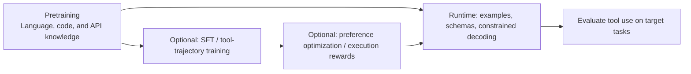
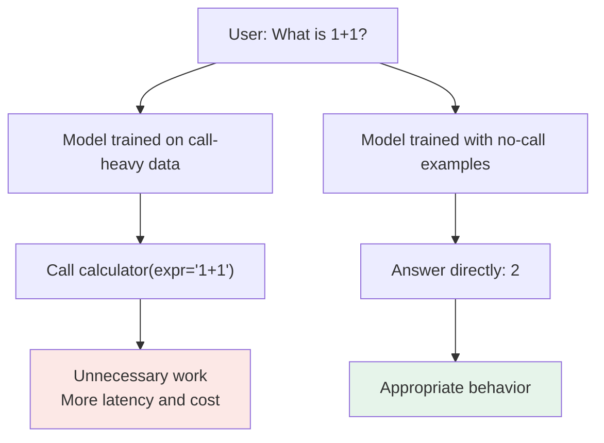
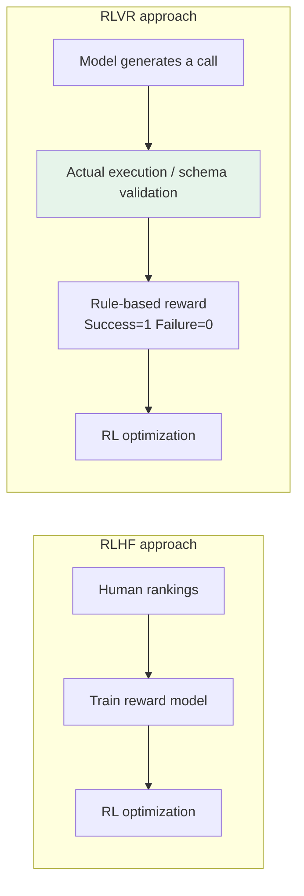
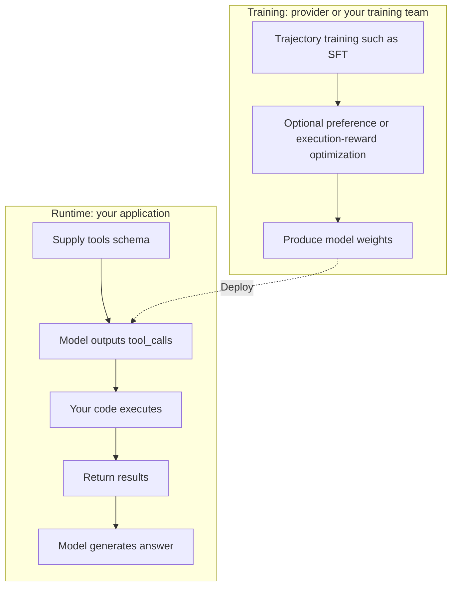

# Chapter 2: How LLMs Learn to Use Tools

## 2.1 Capability comes from data, training, and the runtime together

**Parameter count alone does not ensure reliable tool use, but neither can we claim that pretrained models have no tool-use ability.**

Tool use involves at least three abilities: selecting a tool, constructing arguments that fit its interface, and continuing the task from its results. These abilities draw on code and API knowledge acquired during pretraining, and are also affected by example-based prompting, post-training, and constrained decoding. A successful `json.loads` call does not tell you whether the right tool was selected.

We cannot assume that modern pretraining corpora contain no tool trajectories, or infer a closed model's training recipe from its API support. Toolformer demonstrated generating and filtering API-call data from a small set of examples before further training. ReAct demonstrated prompting that alternates reasoning and action. Neither proves that SFT must precede RLHF.

A model might simply describe its intent:

> I need to query a weather API to answer this question.

With examples, it might also produce call text. Reliability must be tested on unseen tools, error recovery, and multi-turn tasks, not inferred from a single successful example.

## 2.2 Learning tool-use trajectories with SFT

Supervised fine-tuning (SFT) trains a model on demonstration trajectories. This section describes a common approach, not a mandatory first stage for every tool-using model.

### 2.2.1 What does a training example look like?

A tool-use SFT example is distinctive because it is a **complete, multi-role conversation trajectory**, rather than a simple question–answer pair:

| Role | Content | Included in training loss? |
|---|---|---|
| `system` | Tool definitions (JSON Schema) | No |
| `user` | 北京今天天气怎么样？ | No |
| `assistant` | `{"tool_calls":[{"name":"get_weather","arguments":{"city":"北京"}}]}` | **Yes** |
| `tool` | 晴，15°C，东北风 3 级 | No |
| `assistant` | 北京今天天气晴朗，气温 15°C…… | **Yes** |

The Chinese example asks for today's weather in Beijing (`北京`). The tool returns "Sunny, 15°C, northeasterly wind at force 3," and the assistant begins, "Beijing is sunny today, with a temperature of 15°C…". The table uses a common assistant-only loss recipe; the training implementation determines the exact serialization and masks. Tool results are input context. The objective is to generate calls and follow-up answers, not to impersonate an external tool at runtime.

An incorrect mask may encourage continuation in the wrong role, but does not inevitably cause hallucinations. Check the chat template, role terminators, and inference-time stopping conditions too. Even if a model emits a fabricated result, the host must not accept it as a genuine tool response.

### 2.2.2 Five scenarios the training data should cover

Insufficient coverage leaves evaluation blind spots and may introduce systematic bias. Check at least these five scenarios:

| Scenario | Consequence of missing it |
|---|---|
| Single-tool calls | The basic case; usually already covered |
| **Multiple parallel tool calls** | The model may request independent queries one at a time, adding round trips; dependencies or write conflicts still require sequential execution |
| **Handling failed tool calls** | The model may abandon the task or repeat the same incorrect call unchanged |
| **Answering directly when no tool is needed** | The model may develop a habit of calling a tool for every question, even using a calculator for simple arithmetic |
| **Reusing previous tool results in a multi-turn conversation** | The model may ignore results already in context and call the same tool again |

The fourth is easy to overlook: **teach tool selection, but include cases where no tool should be called**. Adjust their proportion to the target tasks and measured overcalling rate; more is not automatically better.

### 2.2.3 Where does training data come from?

| Source | Cost | Quality | Typical use |
|---|---|---|---|
| Human annotation | Very high | High | Seed data and evaluation sets |
| Distillation from a stronger model (Self-Instruct / distillation) | Low | Moderate; spot checks needed | Scaling up the dataset |
| **Real API execution feedback** | Depends on the environment and call costs | Can verify some facts, but does not automatically supply complete ground truth | Filtering invalid calls and checking result state |

ToolLLM builds its data from real RapidAPI tools and model-generated instructions and solution trajectories; its evaluation also involves model judgments. Describing it as merely checking HTTP success codes would be inaccurate. Execution checks can filter nonexistent parameters and invalid calls, but API success does not imply that the user's goal was achieved. The target object, time range, results, and permissions still need checking.

Validate safely executable trajectories against their execution results. Payments, email sending, data deletion, and similar operations belong in isolated environments or controlled simulators. Do not create real side effects merely to validate training examples.

## 2.3 SFT data distributions and limitations

If "must call a tool" scenarios are overrepresented, an SFT model may overcall.

This is a mismatch between the data distribution and task objectives, not an inherent property of SFT. Demonstrations of direct answers, clarification when information is missing, and refusal of unauthorized actions can also teach selection boundaries through SFT.

SFT maximizes the likelihood of demonstrated trajectories. Preference optimization explicitly compares candidates, while RL optimizes a policy under a reward. These are different forms of supervision, but all can affect formatting, selection, and planning.

## 2.4 Using feedback to improve selection and invocation boundaries

### 2.4.1 Four steps in RLHF

One classic implementation of reinforcement learning from human feedback (RLHF) proceeds as follows. It is not the only feedback approach available for tool training:

1. **Sample varied responses.** Generate several approaches to the same question: some use tools, some answer directly, and some supply incorrect arguments.
2. **Rank them by human preference.** Annotators rank the responses. A tool-using answer ranks first for "Beijing weather"; a direct answer ranks first for "1+1."
3. **Train a reward model.** Use the ranking data to train a scoring model that predicts how humans would rate a response.
4. **Optimize the main model with RL.** Use reward-model scores as the signal for updating the main model with an algorithm such as PPO.

### 2.4.2 The reward model distills human preferences

A reward model is affected by annotation quality, coverage, and distribution shift. Its capabilities cannot be equated precisely with those of an individual annotator.

Human judgment is distilled into this "judge." If annotation standards conflict—for example, some annotators require search for encyclopedic questions while others accept an answer from the model's knowledge—the reward model learns inconsistent criteria. Further optimization then pushes the main model toward an ill-defined objective.

Define annotation guidelines and examine disagreements rather than reporting only that reward scores increased.

### 2.4.3 PPO and KL regularization are not the same thing

The original InstructGPT used PPO. Keep two ideas separate:

- **PPO's clipped surrogate objective** limits updates through the probability ratio between the new and old policies. It is not a strict guarantee on distribution distance.
- **The KL penalty against a reference model in RLHF** is typically added separately to the reward or objective to limit deviation from that reference. It is not a constraint inherently built into PPO itself.

KL regularization may reduce excessive drift, but cannot eliminate reward hacking. If the reward counts only "successful tool calls," the model may generate pointless calls. Measure task success, call cost, and unauthorized-action rates directly.

For a full comparison of PPO, DPO, and GRPO, see the Post-Training and DPO/PPO chapters in the LLM topic.

### 2.4.4 RLAIF: replacing human ratings with AI feedback

RLAIF replaces some human feedback with AI feedback, potentially reducing annotation cost. The actual cost depends on the judge model, sample count, and human-review fraction; there is no universal order-of-magnitude reduction.

The tradeoff is **bias propagation**. If the AI judge believes that every math question should use a calculator, the model trained from its judgments may inherit that tendency.

Human and AI feedback can be combined, with independent review of critical evaluation sets. The same judge used during training cannot establish that the resulting system is reliable in every respect.

## 2.5 Tool execution and verifiable rewards

Execution feedback did not first appear in 2025. ToolRL, ReTool, and related work further investigate incorporating tool interactions into reinforcement learning. This is a research direction, not evidence that every provider uses the same training recipe.

### 2.5.1 Why is this possible?

Some aspects of tool use can be checked programmatically, much like verifiable math tasks or code tests. **Specific conditions are checkable; the user's entire goal is not automatically checkable**:

- Is the requested function name in the tool list? → Checkable.
- Do its arguments pass JSON Schema validation? → Checkable.
- Did the tool actually execute successfully? → Checkable with trustworthy execution records or business state that can be inspected.
- Does the final answer satisfy the task? → Checkable with a reliable reference answer or state validator; open-ended tasks may have neither.

Such rules can supply rewards automatically during training without asking a person to score every instance. This is the idea behind reinforcement learning with verifiable rewards (RLVR). People still need to design the tasks, validators, and safe execution environment.

### 2.5.2 What changes?

| Dimension | Preference rewards | Verifiable rewards |
|---|---|---|
| Reward source | Preference evaluator | Validators, tests, and execution environments, which may themselves contain flaws |
| Annotation cost | Requires preference data or an AI judge | Reduces some annotation, but requires tasks, an execution environment, and validators |
| Directly optimized signal | The evaluator's preference for behavior or answers | Format, outcome, or state conditions defined by the validator |
| Limitation | Reward-model drift | Limited to checkable tasks |

Verifiable rewards are also vulnerable to **reward hacking**. Treating HTTP 200 as success can reward a query against the wrong account; checking only that a file exists can reward an empty file. Validate final business state, prohibited side effects, and cost constraints, and execute training trajectories in isolation.

The reward sources in these studies are not identical. ToolRL analyzes fine-grained rewards for tool selection, arguments, and related components. ReTool studies code-tool interactions during reasoning. Neither should be reduced to a single "did the real API succeed?" signal, and one experiment does not establish arbitrary multi-step planning ability.

### 2.5.3 Combining tool use with reasoning models

Tool interaction can also be combined with reasoning training: the model proposes a call during reasoning, continues after receiving the result, and learns from a task-level reward over the trajectory. ReTool is a public example. The names of models such as the o-series or DeepSeek-R1 do not establish that they used the same tool environment or rewards.

This introduces an engineering challenge: managing state when reasoning pauses for a tool and then resumes. [Chapter 7](07-reasoning-models-and-tools.md) covers that issue.

## 2.6 What happens at runtime after training?

Training and runtime are different, although interview questions often blur them. [Chapter 1](01-function-calling.md) covers the complete runtime flow; the important distinction here is:

Runtime choices affect the capabilities available in practice: the chat template, tool parser, constrained decoding, context, and routing can all change the outcome. First confirm the interface's support for parallel calls and its call format, then evaluate target tasks. A public leaderboard is not a ceiling on the model's capability in every application.

## 2.7 How do you evaluate a model's tool use?

Common public benchmarks include:

| Benchmark | Focus |
|---|---|
| **BFCL** (Berkeley Function Calling Leaderboard) | Function-call accuracy across languages and scenarios, including relevance detection for cases where no call should be made |
| **ToolBench** | Tool tasks built around real APIs; the evaluator and live API availability can affect results |
| **API-Bank** | Planning, retrieval, and calling in an executable tool environment, not necessarily direct testing of production APIs |
| **τ-bench** | End-to-end task completion through interaction with both users and tools |

BFCL includes categories such as relevance judgments. Report the leaderboard version, model snapshot, native function-calling or prompt-based mode, and runtime configuration. In your own evaluation, record tool selection, argument validity, correct target objects, final success, repeated calls, unauthorized actions, and cost separately.

Apply the same principle when building a test set: **include questions that should not trigger a tool call**. Otherwise, you cannot measure overcalling.

### 2.7.1 Starting with a small evaluation set

You do not need a complete evaluation platform to start. **A set of 20–30 cases can be a useful smoke test and starting point for regression testing**, not evidence of production reliability. For example, start with 4–6 cases for each scenario in Section 2.2.2: single-tool calls, independent parallel calls, failure recovery, direct answers without tools, and reuse of earlier results. These categories can overlap; choose the no-call coverage according to business risks and expected traffic, not a universal quota.

| Step | Practical approach |
|---|---|
| 1. Build cases | Use authorized, de-identified business examples or construct boundary cases from business requirements; production logs are not a prerequisite. Include necessary conversation history, existing tool results, permissions, and fixed test data or simulated failures. |
| 2. Define expected behavior | Specify whether to call, answer directly, clarify missing information, or refuse an unauthorized action. State which decision point or whole interaction is being judged. Check argument meaning, target objects, and business rules; accept equivalent valid calls and different orderings of independent parallel calls, rather than matching one JSON string. Resolve annotation disagreements before scoring. |
| 3. Record the setup | Pin the model snapshot where available; otherwise record the API used and returned version information, if exposed, without claiming to control provider internals. Version the system prompt, controllable chat template, generation parameters, tool schemas and runtime, fixtures or external responses, budgets, retry policy, and grader. |
| 4. Run and inspect | Reset fixtures between runs. Keep traces and report tool selection, semantic argument correctness, target correctness, task completion, unnecessary or repeated calls, unauthorized attempts and executed actions, and cost separately. For multi-turn or stochastic tasks, repeat runs and state how many; repeated runs are not additional independent cases. |
| 5. Reuse for regression | Rerun after prompt, model, or schema changes, holding other conditions fixed where possible. Compare traces to locate regressions rather than presuming either the runtime or model is at fault. Once cases guide tuning, treat them as development/regression data; keep a separate holdout out of both tuning and training, grouping related conversations and source examples to prevent near-duplicate leakage. |

Make the denominators explicit. **No-call overcalling rate** is the number of evaluated case-runs that emit at least one tool call where none is permitted, divided by all evaluated case-runs with that no-call expectation. Count emitted calls even if the runtime blocks execution. For clarification, judge the step before the missing information arrives; a later authorized call is not an error. **End-to-end task success rate** is the number of full-task case-runs meeting the annotated outcome and constraints within budget, divided by all evaluated full-task case-runs, including failures and timeouts. Check the final answer and, where relevant, business state—not just HTTP success. Report results by scenario as well as overall.

Use isolated fixtures or mocks for payments, email, and other side effects, never live business writes. Label schema-only checks separately from controlled execution checks: neither passing JSON validation nor success in a mock establishes production integration correctness. This small set can uncover faults, but cannot guarantee coverage of rare failures. Expand scenario diversity rather than copying similar questions; see [Offline Evaluation and Eval-Driven Development](../../engineering/04-evaluation-observability/07-offline-eval-eval-driven-development.md) for dataset splits and interpreting small-sample results.

## 2.8 Common mistakes

### 2.8.1 Inferring interface capability from model size

Size is not sufficient, and dedicated post-training is not the only possible route. A mismatch between the interface, prompt format, and parser can also appear as an inability to call tools.

### 2.8.2 Training only on positive examples

Demonstrations containing only "should call" cases increase the risk of overcalling. Cover direct answers, error recovery, reuse of history, clarification, and refusal of unauthorized requests too.

### 2.8.3 Applying the loss mask to tool messages incorrectly

Assistant-only loss requires correct role-based masking, together with validation of the template and stopping conditions. Whether to learn tool text is a training-recipe choice; it does not by itself establish that hallucinations will appear or disappear.

### 2.8.4 Distilling without execution checks

Errors in the teacher model can propagate through distilled data. Beyond format and argument checks, inspect results in a safe execution environment. Mark the verified scope of samples that cannot be executed separately; do not treat them as proven-correct trajectories.

### 2.8.5 Assigning mutually exclusive capabilities to SFT and RL

SFT can teach both format and invocation boundaries; RL can optimize format, selection, and planning. Whether SFT should come first depends on the base model's capabilities, exploration difficulty, and reward design. It is not a necessary sequence to memorize.

### 2.8.6 Blaming training before inspecting the runtime

Check the model snapshot, API parameters, tool schemas, parser, and history submission before comparing prompt or training changes. Run ablations in the same execution environment so an adapter failure is not mistaken for a missing model capability.

## 2.9 Chapter summary

1. **Reliable tool use depends on training and runtime together**; neither size nor interface behavior reveals the training recipe.
2. **SFT often uses multi-role trajectories with assistant-only loss**; verify role boundaries.
3. **Training data should cover both calling and not calling**, rather than teaching the model merely to use more tools.
4. **Validate distilled data for format, arguments, and task outcomes**; use execution checks when safe to avoid inheriting teacher errors.
5. **Both SFT and RL can affect selection and planning**; they do not divide neatly into "can call" and "should call."
6. **Distinguish PPO clipping from reference-model KL regularization**; neither is a safety guarantee.
7. **Execution rewards can still be gamed**; a successful status code is not business success.
8. **Hold the model, template, and runtime fixed for evaluation**, and report final task success alongside safety and cost metrics.

## References

- [Toolformer: Language Models Can Teach Themselves to Use Tools](https://arxiv.org/abs/2302.04761)
- [ReAct paper](https://arxiv.org/abs/2210.03629)
- [PPO paper](https://arxiv.org/abs/1707.06347)
- [ToolLLM: Facilitating Large Language Models to Master 16000+ Real-world APIs](https://arxiv.org/abs/2307.16789)
- [Training language models to follow instructions with human feedback (InstructGPT)](https://arxiv.org/abs/2203.02155)
- [Constitutional AI: Harmlessness from AI Feedback](https://arxiv.org/abs/2212.08073)
- [ToolRL: Reward is All Tool Learning Needs](https://arxiv.org/abs/2504.13958)
- [ReTool: Reinforcement Learning for Strategic Tool Use in LLMs](https://arxiv.org/abs/2504.11536)
- [Berkeley Function Calling Leaderboard](https://gorilla.cs.berkeley.edu/leaderboard.html)
- [API-Bank: A Comprehensive Benchmark for Tool-Augmented LLMs](https://aclanthology.org/2023.emnlp-main.187/)
- [τ-bench: A Benchmark for Tool-Agent-User Interaction in Real-World Domains](https://arxiv.org/abs/2406.12045)
