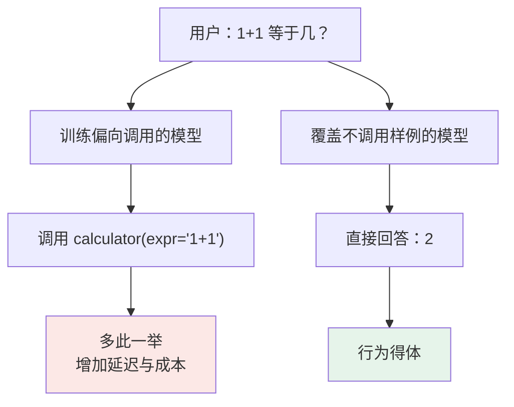
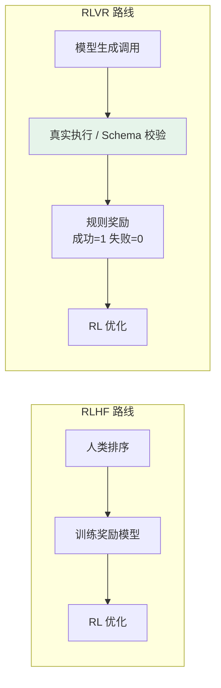
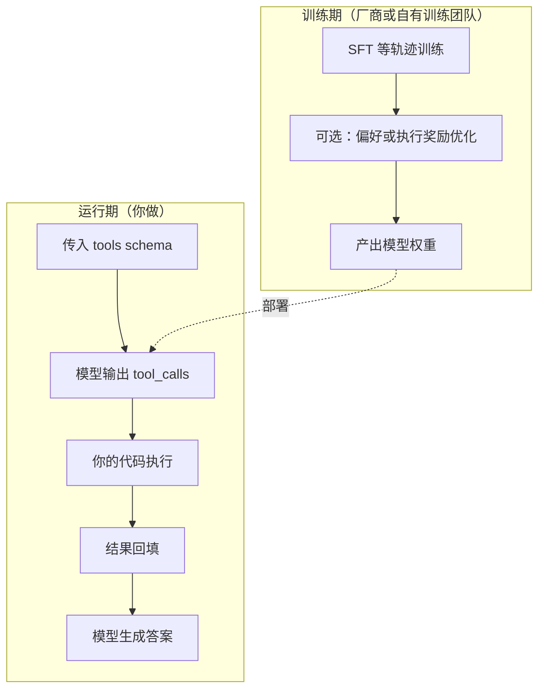

# 第二章：LLM 如何学会调用工具

## 2.1 能力来自数据、训练与运行时的共同作用

**参数量本身不能保证可靠的工具调用，但不能断言预训练模型绝无工具能力。**

工具调用至少包含三种能力：选择工具、构造符合接口的参数、根据执行结果继续任务。它们与预训练中的代码和 API 知识有关，也会受示例提示、后训练及约束解码影响。单看 `json.loads` 是否成功，无法判断工具是否选对。

不能假定现代预训练语料完全没有工具轨迹，也不能从 API 支持情况反推闭源模型的训练配方。Toolformer 已展示用少量示例生成、筛选 API 调用数据再训练的路线；ReAct 则展示提示驱动的推理—行动交替。两者都不是“必须先 SFT 再 RLHF”的证明。

模型可能只描述意图：

> 我需要查询天气 API 才能回答这个问题。

也可能在示例引导下输出调用文本。可靠性需要用未见工具、错误恢复和多轮任务检验，不能靠单个成功样例判断。

## 2.2 用 SFT 学习工具调用轨迹

SFT（Supervised Fine-Tuning，监督微调）让模型学习示范轨迹。本节介绍一种常见训练方式，不是所有工具模型必经的第一阶段。

### 2.2.1 训练样本长什么样

工具调用的 SFT 样本，特殊之处在于它是一条**完整的多角色对话轨迹**，而不是简单的问答对：

| 角色 | 内容 | 训练时是否计算 loss |
|---|---|---|
| `system` | 工具定义（JSON Schema） | 否 |
| `user` | 北京今天天气怎么样？ | 否 |
| `assistant` | `{"tool_calls":[{"name":"get_weather","arguments":{"city":"北京"}}]}` | **是** |
| `tool` | 晴，15°C，东北风 3 级 | 否 |
| `assistant` | 北京今天天气晴朗，气温 15°C…… | **是** |

表中采用常见的 assistant-only loss 配方，具体序列化和掩码以训练实现为准。工具结果作为输入上下文，目标是让模型生成调用与后续回答，而不是在运行时冒充外部工具。

掩码错误可能强化错误角色的续写倾向，但并不必然导致幻觉。还要检查 chat template、角色终止符和推理端停止条件；即使模型输出了伪造结果，宿主也不能把它当真实工具响应。

### 2.2.2 训练数据必须覆盖的五类场景

场景覆盖不足会留下评测盲区，也可能形成系统性偏差。应至少检查以下五类场景：

| 场景 | 不覆盖的后果 |
|---|---|
| 单工具调用 | 最基础，一般不会缺 |
| **多工具并行调用** | 可能对无依赖查询逐次请求，增加往返；有依赖或写冲突时仍应串行 |
| **工具调用失败后的处理** | 可能放弃任务，或原样重复同一个错误调用 |
| **不需要工具，直接回答** | 形成「见问题就调工具」的惯性，简单算术也去调计算器 |
| **多轮对话中引用历史工具结果** | 无视上下文里已有的结果，重复调用同一个工具 |

第四类容易被忽略：**要教模型选择工具，也要覆盖「不该调工具」的样本**。比例应按目标任务和过度调用率调整，不是越多越好。

### 2.2.3 训练数据从哪来

| 来源 | 成本 | 质量 | 典型用途 |
|---|---|---|---|
| 人工标注 | 极高 | 高 | 种子数据、评测集 |
| 强模型蒸馏（Self-Instruct / Distillation） | 低 | 中，需抽检 | 规模化扩充 |
| **真实 API 执行反馈** | 取决于环境与调用费用 | 可验证部分事实，不自动提供完整 ground truth | 过滤无效调用、验证结果状态 |

ToolLLM 使用真实 RapidAPI 工具和模型生成的指令、解题轨迹构建数据，评测也涉及模型判定；不能概括成“只看 HTTP 成功码”。执行校验能筛掉不存在的参数、无效调用等错误，但 API 成功不等于用户目标达成，还需检查对象、时间范围、结果和权限。

能安全执行的轨迹应结合执行结果校验；支付、发信、删数据等操作要放进隔离环境或受控模拟器，不能为了验证训练样本触发真实副作用。

## 2.3 SFT 的数据分布与局限

若数据中过度代表“必须调用”的场景，SFT 模型可能过度调用。

这是数据分布与任务目标不匹配，不是 SFT 的必然性质。补充无需工具、信息不足需澄清、拒绝越权等轨迹，也能通过 SFT 学习选择边界。

SFT 最大化示范轨迹的似然；偏好优化显式比较候选，RL 则优化奖励下的策略。三者监督形式不同，但都可能同时影响格式、选择和规划能力。

## 2.4 用反馈优化选择与调用边界

### 2.4.1 RLHF 的四步

RLHF（Reinforcement Learning from Human Feedback，基于人类反馈的强化学习）的一种经典实现如下，不是工具训练唯一可用的反馈形式：

1. **采样多样回答**：对同一问题让模型生成若干种处理方式——有的调工具、有的直接答、有的参数填错；
2. **人类偏好排序**：标注员对这些回答排序。「北京天气」题里调工具的排第一，「1+1」题里直接回答的排第一；
3. **训练奖励模型**：用排序数据训练一个只负责打分的模型，它学的是「预测人类会给这个回答打多少分」；
4. **强化学习优化主模型**：用奖励模型的打分作为信号，通过 PPO 等算法调整主模型参数。

### 2.4.2 奖励模型是人类偏好的蒸馏体

奖励模型受标注质量、覆盖范围和分布偏移影响；不能把它的能力严格等同于单个标注员的水平。

人类的判断被蒸馏进了这个「裁判」。如果标注标准不一致——比如有的标注员认为查百科该调搜索，有的认为模型自己知道就行——奖励模型学到的就是一个自相矛盾的标准，后面主模型再怎么优化，也是往一个模糊的方向走。

因此要明确标注规范并检查分歧，不能只报告奖励分数上涨。

### 2.4.3 PPO 与 KL 正则不是同一个概念

经典 InstructGPT 使用 PPO。理解时要分清：

- **PPO 的 clipped surrogate objective**：限制新旧策略概率比带来的更新幅度；它不是严格的分布距离保证；
- **RLHF 中对参考模型的 KL 惩罚**：通常另外加入奖励或目标，限制策略偏离参考模型。它不等于 PPO 本身必然内置的约束。

KL 正则可能缓解过度偏移，但不能消除奖励投机。若奖励只数“成功工具调用次数”，模型仍可能制造无用调用；应直接测任务成功率、调用成本和越权率。

关于 PPO、DPO、GRPO 的完整对比，见 LLM 主题的 Post-Training 与 DPO/PPO 章节。

### 2.4.4 RLAIF：用 AI 代替人工打分

RLAIF 用 AI 反馈替代部分人工反馈，可能降低人工标注成本。具体成本与评委模型、采样数、复核比例有关，没有通用的数量级降幅。

代价是**偏见传递**：如果 AI 评委自己认为「所有数学题都该调计算器」，被它训练出来的模型也会继承这个倾向。

可混合人工和 AI 反馈，并对关键评测集做独立复核；不能用训练时的同一个评委证明系统全面可靠。

## 2.5 工具执行与可验证奖励

执行反馈并非 2025 年才出现。ToolRL、ReTool 等工作进一步研究将工具交互纳入强化学习；这是一条研究路线，不代表所有厂商都采用同样的训练配方。

### 2.5.1 为什么可以这么做

工具调用的一部分行为能用程序验证，这与数学题、代码测试等可验证任务相似。**可判定的是具体条件，不是整个用户目标天然可判定**：

- 调用的函数名在工具列表里吗？→ 可判定；
- 参数能通过 JSON Schema 校验吗？→ 可判定；
- 工具实际执行成功了吗？→ 有可信执行记录或可核对的业务状态时可判定；
- 最终答案满足任务要求吗？→ 有可靠标准答案或状态校验器时可判定，开放任务未必具备。

这类规则可在训练循环中自动提供奖励，不必每次请人评分，这就是 RLVR（Reinforcement Learning with Verifiable Rewards，可验证奖励强化学习）的思路。人仍需设计任务、校验器及安全执行环境。

### 2.5.2 带来的变化

| 维度 | 偏好奖励 | 可验证奖励 |
|---|---|---|
| 奖励来源 | 偏好评估器 | 校验器、测试与执行环境，也可能有漏洞 |
| 标注成本 | 需要偏好数据或 AI 评委 | 减少部分标注，但需构建任务、执行环境和校验器 |
| 直接优化的信号 | 评估器对行为或答案的偏好 | 校验器定义的格式、结果或状态条件 |
| 局限 | 奖励模型漂移 | 只适用于可判定任务 |

可验证奖励也会发生 **reward hacking**。例如把“HTTP 200”作为成功，会奖励查询了错误账户的调用；只检查文件存在，可能奖励空文件。应验证最终业务状态、禁止副作用和成本约束，并在隔离环境中执行训练轨迹。

这些研究的奖励来源不完全相同：ToolRL 分析工具选择、参数等细粒度奖励设计；ReTool 研究推理过程中的代码工具交互。不能把它们都说成只用“真实 API 是否成功”评分，也不能由单项实验推断模型已经学会任意多步规划。

### 2.5.3 与推理模型的合流

工具交互也可与推理训练结合：模型在推理中提出调用，拿到结果后继续推理，再用任务奖励优化轨迹。ReTool 是公开例子；o 系列、DeepSeek-R1 等模型的名称本身不能证明其训练使用了相同的工具环境或奖励。

这带来一个新的技术难点——推理过程中断与恢复的状态管理，这正是 [第七章](07-reasoning-models-and-tools.zh.md) 要讲的内容。

## 2.6 训练好之后，运行时发生了什么

训练与运行时是两件事，面试里经常被混着问。运行时的完整流程在 [第一章](01-function-calling.zh.md) 已经讲过，这里只强调分界：

运行时会改变可用能力：chat template、工具解析器、约束解码、上下文与路由都可能影响结果。先确认接口是否支持并行及调用格式，再用目标任务评测；公开榜单不是模型在所有应用中的能力上限。

## 2.7 怎么衡量一个模型的工具调用能力

常见的公开评测：

| 评测 | 侧重 |
|---|---|
| **BFCL**（Berkeley Function Calling Leaderboard） | 多语言、多场景的函数调用准确率，含「不该调用」的相关性检测 |
| **ToolBench** | 基于真实 API 构建的工具任务；评测器与在线 API 可用性会影响结果 |
| **API-Bank** | 可运行工具环境中的规划、检索与调用，不等于直接测试生产 API |
| **τ-bench** | 与用户和工具双向交互的完整任务完成率 |

BFCL 包含相关性判断等类别；结果应注明榜单版本、模型快照、原生 FC 或提示模式及运行配置。自建评测还应分别记录：工具选择、参数有效性、对象正确性、最终成功、重复调用、越权与费用。

自建评测集时也应该照抄这个思路：**测试集里必须有一批不该调工具的问题**，否则你测不出过度调用。

### 2.7.1 从小型评测集起步

不必等评测平台完备才开始测。**20–30 个用例可以作为冒烟测试和回归测试的起点**，但不能据此证明上线可靠性。例如，先为 2.2.2 的每类场景准备 4–6 个用例：单工具调用、无依赖的并行调用、失败恢复、无需工具的直接回答，以及历史结果复用。这些类别可以重叠；不调用工具的覆盖范围应按业务风险与预期流量分布确定，而不是套用统一比例。

| 步骤 | 具体做法 |
|---|---|
| 1. 构造用例 | 使用经授权且脱敏的业务案例，或根据业务需求构造边界案例，不必先有生产日志。补齐必要的对话历史、已有工具结果、权限，以及固定测试数据或模拟故障。 |
| 2. 标注期望 | 写明应该调用、直接回答、澄清缺失信息，还是拒绝未授权操作，并明确检查的是哪个决策点或整段交互。按参数语义、目标对象和业务规则判断，接受等价的有效调用及独立并行调用的不同排列，不要只匹配唯一的 JSON 字符串。标注分歧应在评分前解决。 |
| 3. 记录配置 | 能固定模型快照时就固定；托管接口未提供快照时，记录所用接口及其返回的版本信息（若有），不声称能够控制供应商内部版本。记录系统提示、可控的 chat template、生成参数、工具 Schema 与运行时、测试夹具或外部响应、预算、重试策略和评分器的版本或配置。 |
| 4. 运行与分析 | 每次运行前重置测试夹具。保留调用轨迹，分别报告工具选择、参数语义正确性、目标对象正确性、任务完成、不必要或重复调用、越权尝试与实际执行，以及费用。多轮或有随机性的任务应重复运行并注明次数；重复运行不等于增加了独立用例。 |
| 5. 用于回归 | 修改提示、模型或 Schema 后重跑，尽量保持其他条件不变。对照轨迹定位退化，不预先认定是运行时或模型的问题。用例一旦用于指导调优，就属于开发或回归数据；另留不参与调优和训练的独立保留集，按相关会话和案例来源分组，避免近重复样本跨集合泄漏。 |

统计时写清分母。**不应调用场景的过度调用率**是：在规定不允许调用的检查范围内，至少发出一次工具调用的用例运行数，除以所有具有该不调用要求的用例运行数。即使运行时拦截了执行，也计入已发出的调用。澄清场景检查的是缺失信息补齐前的步骤，用户补齐信息后的合法调用不算错误。**端到端任务成功率**针对整项任务统计：在预算内满足标注的结果与约束的用例运行数，除以所有参与整项任务评测的用例运行数，失败和超时也计入分母。检查最终回答，必要时核对业务状态，而不只看 HTTP 成功码。除总体结果外，还应按场景分项报告。

支付、发信等有副作用的操作只在隔离的测试夹具或模拟工具中进行，不触发真实业务写操作。仅检查 Schema 和在受控环境中执行应分别标注：JSON 校验通过或模拟执行成功，都不能证明生产集成正确。这种小型评测集可以帮助发现故障，但不能保证覆盖罕见失败。扩充时优先增加场景多样性，而不是复制相似问题；数据集划分与小样本结果的解读，见[离线评测与 Eval 驱动开发](../../engineering/04-evaluation-observability/07-offline-eval-eval-driven-development.zh.md)。

## 2.8 常见错误

### 2.8.1 从模型规模推断接口能力

规模不是充分条件，专门后训练也不是唯一可能路径。接口、提示格式和解析器不匹配，同样会表现为“不会调用”。

### 2.8.2 训练数据只有正例

只有“该调用”的示范会增加过度调用风险。需覆盖不调用、错误恢复、历史复用、澄清和拒绝越权。

### 2.8.3 loss mask 打到 tool 消息上

assistant-only loss 应按角色正确掩码，同时验证模板和停止条件。是否学习工具文本是训练配方选择；不能据此断言一定产生或消除幻觉。

### 2.8.4 纯蒸馏不做执行校验

上游模型的错误可能随蒸馏数据传递。除格式与参数检查外，还应在安全执行环境中核对结果；无法执行的样本要单独标记验证范围，不能当作已经证实正确的轨迹。

### 2.8.5 把 SFT 和 RL 划成互斥能力

SFT 可以学格式也可以学调用边界；RL 可以优化格式、选择和规划。是否先 SFT，取决于基座能力、探索难度与奖励设计，不能背成必要顺序。

### 2.8.6 不排查运行时就归咎训练

先检查模型快照、API 参数、工具 Schema、解析器和历史回填，再比较提示或训练改动。用相同执行环境做消融，避免把适配器故障误认成模型能力缺失。

## 2.9 本章总结

1. **可靠工具调用取决于训练和运行时**，不能从规模或接口表现反推训练配方；
2. **SFT 常使用多角色轨迹和 assistant-only loss**，需验证角色边界；
3. **训练数据应覆盖调用和不调用场景**，避免只学会增加工具使用次数；
4. **蒸馏数据要校验格式、参数与任务结果**，安全可执行时再做执行验证，避免继承教师错误；
5. **SFT 与 RL 都能影响选择和规划**，不是“会不会/该不该”的互斥分工；
6. **区分 PPO clipping 与参考模型 KL 正则**，两者都不是安全保证；
7. **执行奖励仍会被投机**，状态码成功不等于业务成功；
8. **评测应固定模型、模板和运行时**，报告最终任务成功与安全、成本指标。

## 参考资料

- [Toolformer: Language Models Can Teach Themselves to Use Tools](https://arxiv.org/abs/2302.04761)
- [ReAct 原论文](https://arxiv.org/abs/2210.03629)
- [PPO 原论文](https://arxiv.org/abs/1707.06347)
- [ToolLLM: Facilitating Large Language Models to Master 16000+ Real-world APIs](https://arxiv.org/abs/2307.16789)
- [Training language models to follow instructions with human feedback（InstructGPT）](https://arxiv.org/abs/2203.02155)
- [Constitutional AI: Harmlessness from AI Feedback](https://arxiv.org/abs/2212.08073)
- [ToolRL: Reward is All Tool Learning Needs](https://arxiv.org/abs/2504.13958)
- [ReTool: Reinforcement Learning for Strategic Tool Use in LLMs](https://arxiv.org/abs/2504.11536)
- [Berkeley Function Calling Leaderboard](https://gorilla.cs.berkeley.edu/leaderboard.html)
- [API-Bank: A Comprehensive Benchmark for Tool-Augmented LLMs](https://aclanthology.org/2023.emnlp-main.187/)
- [τ-bench: A Benchmark for Tool-Agent-User Interaction in Real-World Domains](https://arxiv.org/abs/2406.12045)
