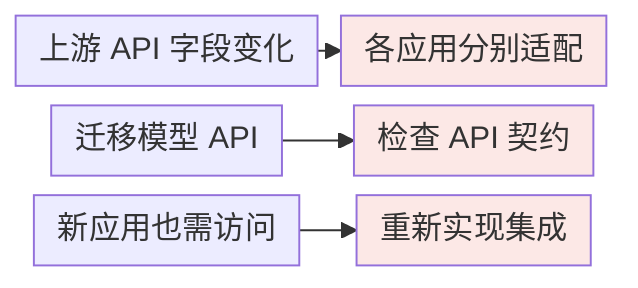
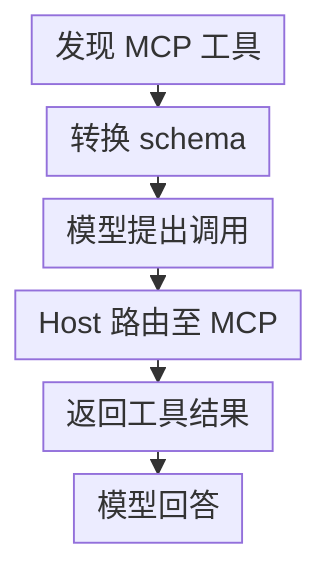
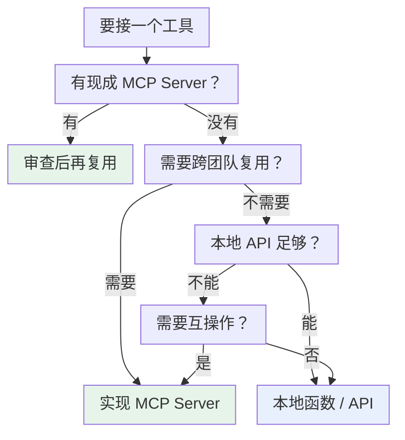

# 第六章：MCP 与 Function Calling 的区别与选型

## 6.1 这个问题容易问偏

「MCP 和 Function Calling 有什么区别」这个问题本身有点误导性，因为它暗示两者是并列的竞品。实际上：

> **MCP 和 Function Calling 解决不同接口边界，常被同一个 Host 组合使用；MCP 并不规定或要求模型必须支持 Function Calling。**

准确的区分是：

| | Function Calling | MCP |
|---|---|---|
| 解决的问题 | 模型**怎么表达**调用意图 | 工具**怎么被提供和发现** |
| 协议双方 | 模型 ↔ 应用 | 应用 ↔ 工具提供方 |
| 工具实现位置 | 不规定：可本地函数，也可远程 API | Server 暴露能力，可为本地进程或远程服务 |
| 层次 | 模型输出格式约定 | 工具生态标准 |

区别是接口边界，不是部署位置。Function Calling 本来就能触发远程服务；MCP 提供统一的发现、消息与能力协商。

## 6.2 Function Calling 的真实痛点

复制一份 Schema 看起来不算什么工作量，但把账算到团队规模就不一样了。

若 **5 个应用**分别独立适配 **8 个工具**，就有 **40 个适配组合**；共享 SDK 或内部服务可减少重复代码，MCP 是标准化这类适配的一种方式。

**各自维护适配器**



图中各项的完整含义：

- 缺少共享适配时的维护风险
- 检查 Schema 与回填格式
- 重复实现发现与授权

核心风险是：没有共享适配层时，同一工具会在多个应用里重复维护。Function Calling 本身不负责跨应用的工具管理和互操作；这部分可以用 MCP，也可以由已有共享 SDK 或内部服务承担。

## 6.3 常见集成：Host 用 Function Calling 路由 MCP Tool

项目里最常见的接法，就是 Host 用 Function Calling 路由 MCP Tool。



完整消息顺序（含阶段说明）：

| 交互双方 | 消息或动作 |
| --- | --- |
| 说明：宿主程序（内含 MCP Client）, MCP Server | 启动时 |
| 宿主程序（内含 MCP Client） → MCP Server | tools/list |
| MCP Server → 宿主程序（内含 MCP Client）（返回） | MCP 格式的工具定义 |
| 说明：宿主程序（内含 MCP Client） | 转换成模型原生的；Function Calling Schema |
| 说明：模型, 宿主程序（内含 MCP Client） | 运行时 |
| 宿主程序（内含 MCP Client） → 模型 | messages + tools（普通 FC 格式） |
| 模型 → 宿主程序（内含 MCP Client）（返回） | tool_calls（普通 FC 输出） |
| 说明：模型 | 此桥接不要求模型；理解 MCP 传输 |
| 宿主程序（内含 MCP Client） → MCP Server | tools/call（路由到对应 Server） |
| MCP Server → 宿主程序（内含 MCP Client）（返回） | 执行结果 |
| 宿主程序（内含 MCP Client） → 模型 | 按模型 API 回填工具结果 |
| 模型 → 宿主程序（内含 MCP Client）（返回） | 最终答案 |

在这种集成中，模型的视角确实是普通 Function Calling，能力发现、schema 转换、调用路由和结果回传都在 Host 层完成。这种桥接很常见，但不是 MCP 的规范要求。

沿着这条集成链路往下看，会得到两个结论：

1. **模型不支持某厂商的 Function Calling 时，只有这条桥接路径不可用**。Host 仍可通过结构化输出、确定性工作流或人工界面调用 MCP Tool；
2. **若由模型选择 Tool，工具 schema 工程仍然适用**。MCP 规定互操作格式，不保证模型会正确选择或填写参数。

桥接不一定是逐字段复制。MCP 2026-07-28 使用 JSON Schema 2020-12，允许的关键词范围可能超出模型 strict 子集；Host 应拒绝不支持的定义，或做明确记录、可测试的转换，而不是静默删约束。工具结果的 `content`、`structuredContent`、`outputSchema` 也需按模型可接收的内容类型映射，不能一律当字符串而丢失图片、资源引用或错误标志。

## 6.4 选型：什么时候用哪个

### 6.4.1 Function Calling 够用的场景

**快速原型和 Demo**。目标是跑通想法，直接在代码里定义 Schema 最快。搭 MCP Server 的时间可能超过原型本身的价值。

**工具只服务这一个应用**。查本公司某张私有表的接口，绝不会被其他地方用到，写在项目里反而更清晰。为它单独维护一个进程是过度设计。

**需要对执行逻辑做精细控制**。权限校验、参数二次处理、特殊错误处理、调用链路追踪，直接嵌在调用代码里最方便。MCP Server 是独立进程，这类定制要额外约定。

**部署环境受限**。不能启动子进程时无法使用本地 stdio Server，但仍可连接远程 Streamable HTTP Server。比较现有 API 与 MCP 的运维成本，而不是因此断言 MCP 不可用。

### 6.4.2 MCP 更合适的场景

**已有维护中的 Server**。先核查发布者、许可证、更新状态、协议版本及权限范围。旧官方示例可能已归档，社区存在实现不等于已经安全测试或适合当前业务。

**工具需要跨项目或跨团队复用**。MCP 可把上游业务适配收敛到 Server 一侧；客户端仍需维护模型桥接、权限和版本兼容，不是所有变更都能自动受益。

**工具规模上来了**。这里不给绝对数字门槛（「超过 3 个就上 MCP」这种说法没意义），要看三个维度综合：

| 维度 | 倾向 Function Calling | 倾向 MCP |
|---|---|---|
| 复用边界 | 一个应用消费，现有适配可维护 | 多种 Host 需要共享能力契约 |
| 运维责任 | 应用团队统一维护现有调用链 | 提供方能承担 Server 的版本、认证和可用性 |
| 变更影响 | 变化局限于一个调用方 | 多个调用方重复跟随上游 API 变化 |

这些维度比工具代码行数更有意义。几十行的函数不必单独部署成服务，一个高价值且被多种 Host 复用的工具也可能值得标准化。

**Agent 需要接入多种独立工具来源**。代码执行、文件系统、数据库和外部 API 可以通过 MCP 模块化接入；但“在做 Agent”本身不是选型依据，已有接口若能满足复用与治理需求，也可以保留。

### 6.4.3 判断流程



图中各项的完整含义：

- 社区有现成 MCP Server 吗?
- 先核查维护状态、权限 及版本兼容后复用
- 需要跨项目 / 跨团队复用吗?
- 已有本地函数或 API 能满足需求吗?
- 实现或保留本地函数 / API 可用 Function Calling 驱动
- 还需要跨 Host 的 标准发现与互操作吗?

### 6.4.4 混用是常态

实际项目里最常见的形态不是二选一，而是**混用**：

```python
# 通用能力走 MCP：文件系统、GitHub、数据库，用社区现成的
mcp_tools = await load_mcp_tools(["filesystem", "github", "postgres"])

# 业务专属能力走 Function Calling：内嵌，方便加权限和审计
local_tools = [check_user_quota_schema, internal_billing_schema]

tools = mcp_tools + local_tools
```

示例中的函数为应用伪代码。业务专属能力也可以供多个应用共享 MCP Server；真正的依据是复用边界、权限、部署和维护责任，而非“通用/专属”的二分。

## 6.5 实际跑一遍 MCP

可在本地只读目录做一次实验，记录版本、配置、发现结果和故障现象。没有实际运行过，不应把教程中的问题写成自己的生产经验。

### 6.5.1 最简接入

```json
{
  "mcpServers": {
    "filesystem": {
      "command": "/absolute/path/to/reviewed-filesystem-server",
      "args": ["/Users/me/projects"]
    }
  }
}
```

这是示意配置，需替换成已安装、已审阅并固定版本的实际启动入口；宿主是否要重启由产品决定。目录参数是 filesystem Server 的实现配置，**不是 Roots 协议本身**。Roots 只是上下文提示而非强制沙箱，且在 2026-07-28 已弃用；文件访问还要靠服务端路径校验和 OS 隔离。

旧 `@modelcontextprotocol/server-github` 已归档；GitHub 官方实现见 github/github-mcp-server<sup>[【284】](../../book/references.zh.md#ref-284)</sup>。令牌应由凭据管理器或受控环境注入，不应提交到配置仓库。

### 6.5.2 自己写一个 Server

```python
from mcp.server.fastmcp import FastMCP

mcp = FastMCP("order-service")

@mcp.tool()
def get_order(order_id: str) -> dict:
    """根据订单号查询订单详情。不支持模糊搜索。"""
    return db.query_order(order_id)

@mcp.resource("orders://recent")
def recent_orders() -> str:
    """最近 24 小时的订单摘要（只读）"""
    return format_orders(db.recent(hours=24))

if __name__ == "__main__":
    mcp.run()
```

对 `@mcp.tool()`，SDK 根据参数类型生成输入 Schema，并用 docstring 生成描述；Host 再决定如何向模型暴露它。[第三章](../01-function-calling/03-tool-schema-design.zh.md)的描述写法仍适用。`@mcp.resource()` 注册的则是可读取资源，不会仅因函数存在就变成模型工具。

这里的 `db` 和 `format_orders` 需应用实现，并加入认证与对象级过滤。SDK 示例不声明支持所有协议版本，需固定依赖后按目标版本验证。

### 6.5.3 实际会踩的坑

| 坑 | 现象 | 原因 |
|---|---|---|
| **stdout 污染** | Server 连不上，报 JSON 解析错误 | stdio 模式下 `print` 调试信息混进了协议流。日志必须走 stderr |
| **环境变量丢失** | shell 能跑，GUI 客户端启动失败 | 子进程通常继承父进程环境，但 GUI 宿主未必加载 shell 配置，宿主也可能过滤变量 |
| **工具名冲突** | 模型调错 Server 的工具 | 多个 Server 有同名工具，需要加前缀区分 |
| **上下文膨胀** | 响应变慢、成本飙升 | 接了太多 Server，几十个工具定义每轮全量传 |
| **版本不匹配** | 部分功能不可用 | Server 实现的是旧规范版本，新特性用不了 |

如果 Host 全量注入工具，就会产生上下文开销；可用[第三章](../01-function-calling/03-tool-schema-design.zh.md)的筛选方法。版本不兼容则应按协议矩阵解决，不能靠减少工具数量掩盖。

## 6.6 常见错误

### 6.6.1 说 MCP 必然建立在 Function Calling 之上

二者并非替代品，也不是必然上下游。Function Calling 是常见的模型适配层；MCP 定义 Host/Client 与 Server 的协议。Host 可采用其他机制发起 `tools/call`。

### 6.6.2 只说「MCP 更标准化」

应说清具体减少了什么：工具跨应用复用、从已知 Server 发现能力、集中维护上游适配。Server 地址、认证配置、模型桥接和兼容测试仍需有人负责。

### 6.6.3 不比较维护成本就引入 MCP

一个只有自己用、逻辑十行的内部工具，包成独立进程只是增加了部署和运维负担。选型要看复用需求，不是看技术新旧。

### 6.6.4 以为用了 MCP 就不用管工具描述

协议标准化了传输格式，没有标准化描述质量。Server 的 docstring 写得烂，模型照样选错工具。

### 6.6.5 忽略 MCP 的上下文成本

MCP 工具发现不强制模型全量注入。Host 可先分页发现、缓存，再按权限检索相关工具；评估实际注入 token 与工具召回率，不能按 Server 数直接算固定成本。

### 6.6.6 忽略第三方 Server 的信任问题

本地 Server 涉及代码执行，远程 Server 涉及数据外传，两者都需信任审查。工具描述本身也可能被投毒，见[工具协议安全](15-tool-protocol-security.zh.md)。

## 6.7 本章总结

1. **MCP 与 Function Calling 可以配合，但不存在强制依赖**；
2. **本质区别是接口双方和职责**，不是本地与远程；
3. **MCP 减少重复适配**，但共享 SDK 等方案也能复用，仍须比较维护成本；
4. **在 Function Calling 桥接中，模型无需感知 MCP**；模型不支持 FC 时，Host 可选择其他 MCP 调用路径；
5. **FC 适合轻量、专属、需精细控制、部署受限的场景**；
6. **MCP 更适合共享能力契约和多个独立工具来源**，前提是有可信实现与明确运维责任；
7. **判断顺序**：先看社区有没有现成的 → 再看要不要复用 → 再看环境和维护成本；
8. **可以混用**：MCP、现有 API 和本地函数都可由同一 Host 路由。


## 参考资料

<!-- centralized-bibliography -->
本章的参考资料、阅读建议与来源说明见[集中参考资料章节](../../book/references.zh.md#reading-tools-06)。
