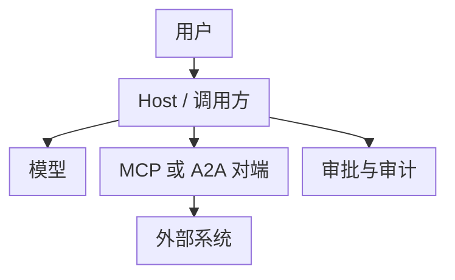

# 第十五章：Tool Protocol 安全

## 15.1 先划信任边界

MCP 和 A2A 都让不受模型控制的数据、描述和动作进入 Agent 链路。协议可互操作，不等于对端、工具描述或参数可信。

Host/调用方应是策略执行点：验证身份和来源、限制工具与数据、审批高风险动作、记录可追溯证据。不要让模型文本、Agent Card 或工具 description 自行决定权限。

## 15.2 OAuth 2.1、PKCE 与 audience

MCP 授权能力在协议中是 **OPTIONAL**；采用该授权规范的受保护 HTTP Server 是 OAuth Resource Server，Client 是 OAuth Client。stdio 不套用这套 HTTP 授权发现流程，而由环境或受控配置提供凭据。A2A 可声明 OAuth，也支持其他 security scheme，不能一概要求 OAuth。

2026-07-28 MCP 规范引用的是 **OAuth 2.1 IETF draft-13**，不是已发布 RFC；Client ID Metadata Documents 同样引用草案。RFC 9728（受保护资源元数据）、RFC 8707（资源指示符）等则是已发布 RFC。这里陈述的是 MCP 引用版本，不声称这些草案是 IETF 截至今日的最新修订。

| 控制项 | 要求 |
|---|---|
| **Authorization Code + PKCE** | 公共客户端使用 Authorization Code 流程与 PKCE（S256）；不要用隐式流程或把 client secret 放进桌面/浏览器应用。 |
| **精确 redirect URI** | 按规范精确匹配登记的回调 URI；原生应用 loopback 端口有 RFC 8252 定义的例外，不能扩展成任意通配符。 |
| **audience/resource** | 授权请求和 token 请求都指定 RFC 8707 `resource`；资源服务器验证令牌目标、issuer、有效期、scope 和对象权限。JWT 验签，opaque token 按相应 introspection/服务端机制验证。 |
| **最小 scope** | 令牌只授予当前用户、当前 Server 和当前操作所需权限；读写、项目和租户要分开。 |
| **刷新与撤销** | 短生命周期 access token；保护 refresh token，并支持撤销、轮换和异常会话失效。 |

`audience` 检查防止“拿给 A 的 token 调 B”。仅验证签名或 `scope` 不够：令牌必须是**为当前资源服务器签发**的。

授权发现从受保护资源元数据找到授权服务器，再读取其 OAuth/OIDC 元数据。发现出来的 URL 仍要做 SSRF 和来源校验。当前 MCP 推荐支持 Client ID Metadata Documents，动态客户端注册 DCR 已弃用但保留兼容；凭据按 issuer 隔离，issuer 变化时不能复用旧 client secret。授权响应带 `iss` 时必须和预先记录的 issuer 比较；对端声明会提供却缺失时应拒绝。

### 15.2.1 禁止 token passthrough

Client 将**为目标 MCP Server 签发**的 access token 发给该 Server 是正常用法。被禁止的 token passthrough 是：MCP Server 接受并使用本来发给其他服务的 token，或把收到的 token 不加校验地转交下游 API。Server 访问下游需建立独立授权关系，使用面向下游的凭据；token exchange 只有相关系统明确支持时才可采用。

Token passthrough 会混淆 Client 与 Resource Server 的责任，绕过预期的令牌受众边界并增加日志泄露面，但转发本身不会修改 token 中的 `aud`。这会形成 confused deputy（混淆代理）风险：一个有下游权限的服务被诱导替其他调用者执行未获授权的操作。

## 15.3 工具与内容的两类攻击

### 15.3.1 SSRF 与网络出口

URL、回调地址、文件 URI 和 A2A/MCP endpoint 都是潜在 SSRF 输入。执行网络工具前应：

1. 只允许 `https` 等明确 scheme，并用 allowlist 限制域名、端口、路径与重定向次数；
2. 面向公网抓取的工具默认拒绝 loopback、link-local、私网、metadata IP 和 IPv6 等价地址；内部工具通过独立策略精确放行。DNS 校验须与实际连接目标绑定，每次重定向重新检查；
3. 使用隔离的 egress proxy、短超时、响应大小上限和无凭据网络段；
4. 对本地 Streamable HTTP MCP Server 校验 `Origin`，默认仅绑定 loopback，以防 DNS rebinding。

不要只按 URL 字符串过滤：域名重绑定、十进制/IPv6 地址、重定向和代理都会绕过简单黑名单。

### 15.3.2 Tool poisoning 与间接提示注入

Tool 的名称、description、Agent Card、Resource 内容和工具返回值都是不可信输入。恶意内容可能诱导模型泄露数据、扩大 scope 或调用不相关的写工具。

防御要点：

- 将工具元数据与返回内容标为不可信数据，禁止其修改系统策略、审批结果或身份；
- 安装前固定 Server 来源、版本和发布者；审阅所请求的文件、网络、环境变量和 OAuth scope；
- 以 allowlist 向模型暴露工具；高风险工具拆成只读、草稿和提交三步；
- 服务端重新校验参数、租户、对象归属与授权，不能相信模型生成的 JSON；
- 限制 Resource URI、工具输出长度和可执行内容，防止上下文投毒与数据外带。

工具 annotations（如 `readOnlyHint`、`destructiveHint`、`idempotentHint`）是不可信提示，不是沙箱、授权或幂等实现。描述/Schema 更新后应重新审阅；MCP 2026-07-28 的 Schema 可包含 `$ref` 和组合结构，解析时还要限制远程解析、递归、资源消耗与缓存作用域，避免把验证器变成新的网络入口。

## 15.4 最小权限、审批与审计

安全不是每次都弹确认框。确认应与风险绑定，且必须向用户显示**将对哪个对象执行什么动作、使用什么身份、影响范围是什么**。

| 风险 | 建议控制 |
|---|---|
| 读取公开资料 | 限域、速率限制、审计 |
| 读取用户/租户数据 | 用户授权、对象级访问控制、脱敏 |
| 写草稿或创建可撤销对象 | 显示预览；按策略可自动化 |
| 发布、删除、转账、改权限、外发数据 | 明确人工审批、幂等键、二次校验；能回滚的设计回滚，不能回滚的先说明后果并准备补偿 |

审计记录至少包含：请求关联 ID、用户/服务身份、Agent/Server 身份与版本、授权主体和 scope、工具名、已验证参数摘要、审批决定、结果、时间、错误及数据分类。日志应避免记录 bearer token、原始机密或不必要的个人数据。

审批还要绑定规范化后的具体参数、目标对象、执行身份和有效期。审批后若金额、收件人或工具定义改变，就重新校验并按策略重新审批，避免用户同意的是一次操作，实际执行的却是另一次。

### 15.4.1 A2A 的额外注意点

Agent Card 是能力声明，不是信任证明。按 A2A 1.0 的 `securitySchemes` 与 `securityRequirements` 完成所需认证，能力条目也可声明自己的要求。Webhook 应按约定验证 bearer token、签名或其他认证，并处理重放、重复通知与任务关联；并非所有 A2A webhook 都强制使用同一种签名方案。

任务、artifact 和 file URI 也需要对象级授权与内容扫描；“Agent 自己说已经完成”不能替代对结果、来源和写入动作的验证。

## 15.5 上线检查表

- [ ] MCP/A2A endpoint、redirect URI、issuer 和 audience 均为 allowlist；
- [ ] 公共 OAuth Client 使用 Authorization Code + PKCE S256；
- [ ] 每个资源服务器按令牌类型验证有效性、issuer、目标资源、有效期、scope 和租户；
- [ ] 未将 access token 转发给未声明的下游；
- [ ] Tool、Card、Resource 与返回值均按不可信输入处理；
- [ ] URL 工具具备 DNS、重定向、私网和 metadata 防护；
- [ ] 高影响动作有预览、明确审批、幂等性和服务端复核；
- [ ] 审计日志可关联一次任务全链路，且已做机密与隐私最小化。

## 15.6 常见错误

### 15.6.1 把 Agent Card 或 Tool description 当成授权证明

它们只是对端声明，也是潜在不可信输入。权限必须由认证身份、服务端策略和对象级检查决定。

### 15.6.2 只验证 token 签名，不验证 audience

签名有效不代表令牌是发给当前资源服务器的。还要检查 issuer、`aud`、到期时间、scope 与租户。

### 15.6.3 混淆正常携带令牌与 token passthrough

Client 向令牌指定的 MCP Server 携带令牌是正常流程；MCP Server 不能拿这份令牌访问其他 audience，或接受发给其他 API 的令牌来冒充自身授权。

### 15.6.4 用确认弹窗替代最小权限

用户无法审查隐藏参数和复杂调用链。审批只处理剩余高风险，基础边界仍靠 allowlist、隔离和服务端校验。

## 15.7 本章总结

1. 协议互操作不建立信任，Host 与 Server 分别执行授权；
2. OAuth 流程要落实 PKCE、精确回调、audience、最小 scope、轮换与撤销；
3. 工具元数据、Card、Resource 和返回值都是不可信输入；
4. URL、回调和远端 endpoint 必须经过 SSRF 与网络出口控制；
5. 高影响动作需要明确审批、幂等、服务端复核与最小化审计。

## 参考资料

<!-- centralized-bibliography -->
本章的参考资料、阅读建议与来源说明见[集中参考资料章节](../../book/references.zh.md#reading-tools-15)。
