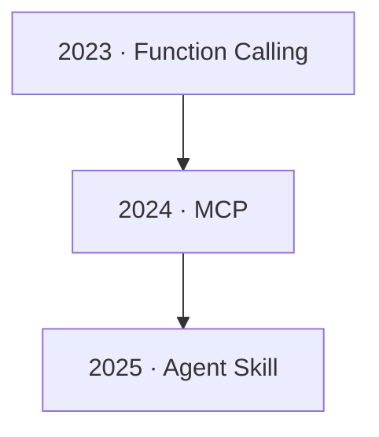
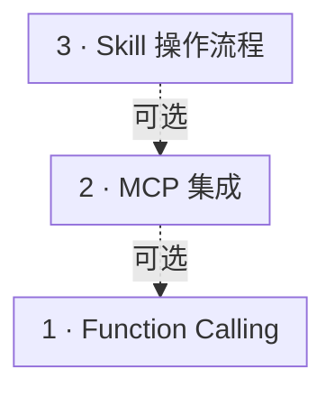
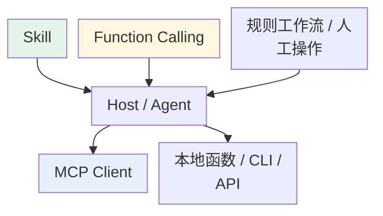
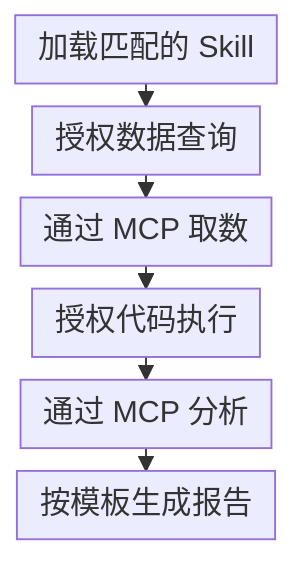

# 第十章：Function Calling、MCP、Skill 三者关系

## 10.1 为什么会有三个概念

最典型的误解是把这三个当成「不同厂商在不同时期推出的竞争方案，选一个用就行」。

它们是**可组合的三种接口与内容机制**，不是必须逐层依赖的技术栈。

可以先看**每句话的主语是谁**：

| | 谁在说话 | 说什么 |
|---|---|---|
| **Function Calling** | 模型 | 「我要调这个函数，参数是这些」 |
| **MCP** | 工具服务 | 「我能提供这些函数」 |
| **Skill** | 操作手册 | 「用这些工具，按这个流程做」 |

主语不同、对话对象不同、粒度不同——这就是三者的本质差异。

### 10.1.1 代表性发布节点不等于依赖关系

这些代表性发布时间对应不同问题，并不是前后替代关系：Function Calling 让生成文本的模型能够提出外部调用请求；MCP 减少不同应用重复编写集成代码的工作；Agent Skill 为已有工具提供使用流程。

这条时间线指 OpenAI Function Calling、MCP 和 Anthropic Agent Skills 的发布节点，不是工具调用、接口标准化或流程复用思想的起源。三者分别处理：

- Function Calling 解决**调用协议**问题：模型和程序之间需要一套结构化的表达方式；
- MCP 处理重复对接的问题，把工具、资源和提示模板的接入**标准化**，让兼容的应用复用服务端能力；
- Skill 处理任务步骤和标准的重复维护，组织**知识与流程复用**，并不要求工具先通过 MCP 接入。

## 10.2 从「谁和谁通信」定位三者

Skill 层中，Agent 扫描和加载包含 `SKILL.md`、脚本及模板的知识模块。MCP 层中，Client 与 Server 交换 `tools/list`、`tools/call` 等 JSON-RPC 消息。Function Calling 层中，模型输出 `tool_calls` JSON，宿主回填工具消息。跨层连接是可选的：Skill 可以使用 MCP，Host 也可以把 MCP 定义与结果转换成模型的函数调用格式。每层内部都有双向交互，并不是强制执行的三步流水线。

图中各项的完整含义：

- 知识模块 SKILL.md + 脚本 + 模板

| 层次 | 发生在哪两个角色之间 | 本质 | 粒度 |
|---|---|---|---|
| Function Calling | 模型 ↔ 宿主程序 | 单次调用的格式规范 | 一次函数调用 |
| MCP | MCP Client ↔ MCP Server | 工具的标准化封装与发现 | 一个工具 / 一组工具 |
| Skill | Agent ↔ 知识模块 | 流程与标准的可复用封装 | 一类完整任务 |

注意粒度的跨度：「查询订单表」是一个 **MCP 工具**，「代码审查」「数据分析报告」是一个 **Skill**——一个 Skill 内部可能有好几个步骤，每步可调用多个 MCP 工具；由 LLM 驱动时，常以 Function Calling 或结构化输出表达调用意图。

## 10.3 组合关系不是强制依赖

可以用反例检查是否混淆了职责：

图中各项的完整含义：

- Skill 定义流程
- Host / Agent 选择与执行
- MCP Client 调用 Server
- Function Calling 模型提出调用

这些路径都能成立：

- **没有原生 Function Calling**，Host 仍可用结构化文本、规则或人工选择触发工具；区别在可靠性和适配成本；
- **MCP 可与 Function Calling 配合**：许多 Host 会把 MCP Tool 转成模型 schema，但 MCP 不强制这条适配路径。[第六章](../02-mcp/06-mcp-vs-function-calling.zh.md) 详细拆过这条时序链；
- **需要外部操作的 Skill 依赖宿主提供相应能力，而非特定协议**：执行中可使用 MCP、内嵌函数或其他受控集成。

仅有 Function Calling 加执行器就能工作；确定性程序也能单独用 MCP；纯写作 Skill 可以不调任何外部工具。三者都不是另外两者成立的必要条件。

## 10.4 三种边界，三种不同的失败

| | 边界 | 典型失败 |
|---|---|---|
| **Function Calling** | 模型提议 → 应用执行 | 工具选错、参数语义错、未授权调用 |
| **MCP** | Client → Server | 版本不兼容、认证失败、超时后结果未知 |
| **Skill** | 可复用知识 → 当前任务上下文 | 错误触发、过时指令、脚本依赖缺失 |

“参数是合法 JSON”“Server 能连接”“Skill 已加载”分别只证明一个环节通过，不能证明整个任务完成。

## 10.5 一个完整场景串起三层

用户说：**「帮我分析最近三个月的销售数据，找出下滑的产品线，给改进建议。」**

完整消息顺序（含阶段说明）：

| 交互双方 | 消息或动作 |
| --- | --- |
| 用户 → Agent | 分析销售数据并给建议 |
| Agent → Skill 层 | 扫描 Skill 元数据 |
| Skill 层 → Agent（返回） | 匹配到「数据分析报告」Skill |
| Agent → Skill 层 | 加载 SKILL.md 正文 |
| Skill 层 → Agent（返回） | 流程：取数 → 趋势分析 → 按模板成文 |
| 说明：Agent, MCP Servers | 第一步：取数 |
| Agent → 模型 | 任务 + 流程 + 可用工具定义 |
| 模型 → Agent（返回） | tool_calls: query_database(sql=...) |
| Agent → Agent | 校验查询范围、参数与用户权限 |
| Agent → MCP Client | 路由调用 |
| MCP Client → MCP Servers | tools/call → 数据库 Server |
| MCP Servers → MCP Client（返回） | 查询结果 |
| MCP Client → Agent（返回） | 结果 |
| Agent → 模型 | tool 消息回填 |
| 说明：Agent, MCP Servers | 第二步：趋势分析 |
| 模型 → Agent（返回） | tool_calls: run_python(code=...) |
| Agent → Agent | 检查执行权限、隔离与资源预算 |
| Agent → MCP Client | 路由调用 |
| MCP Client → MCP Servers | tools/call → Python 执行器 Server |
| MCP Servers → MCP Client（返回） | 分析结果 |
| MCP Client → Agent（返回） | 结果 |
| Agent → 模型 | tool 消息回填 |
| 说明：Agent, Skill 层 | 第三步：按 Skill 模板成文 |
| 模型 → Agent（返回） | 结构化分析报告 |
| Agent → 用户（返回） | 返回报告 |

放到这个流程里看，三层分工分别是：

- **Skill 指导流程**——说明先取数、再分析、最后按模板成文。业务告警阈值需声明由谁制定，不能把任意百分比叫作统计显著；
- **MCP 提供能力发现与调用接口**——Client 从已知 Server 取得工具列表，Host 再按权限和任务筛选，不是连接建立后所有工具自动进入模型上下文；
- **Function Calling 做模型与工具的通信**——每一次 `tool_calls` 输出和 `tool` 消息回填。

Host 还需验证用户可访问的销售范围、限制 SQL、隔离 Python 执行器，并保留数据时间与来源。MCP 2026-07-28、Agent Skills 文件格式和模型工具 API 的版本分别管理；任何一层升级都要回归这条完整链路。

图中展示成功路径。查询失败时不能继续生成销售结论；数据只覆盖部分日期时要明确范围，分析脚本失败则保留已取得的数据并报告缺失步骤。销量下滑不直接证明原因，改进建议还要区分数据支持的判断与待验证假设。

## 10.6 常见错误

### 10.6.1 当成三个竞争方案

它们可以共同出现，也可以单独使用；先明确要解决的是模型输出、能力接入还是流程复用。

### 10.6.2 说不清依赖方向

更准确的关系是：Host 按 Skill 指令编排能力；MCP 标准化一部分能力接入；Function Calling 是模型选择工具时常见的表达层。三者可组合，不构成强制的单向依赖。

### 10.6.3 认为三者缺一不可

任何一项缺失都可有其他实现路径。小项目也可能需要标准化或流程复用，不能只按项目大小决定。

### 10.6.4 混淆粒度

一个 Skill 不等于一个工具。它可描述整类任务，也可只组织写作标准；是否调用工具、调用几次不是格式规定。

### 10.6.5 把 MCP 说成「Anthropic 版的 Function Calling」

MCP 不是 FC 的替代实现，也不建立在 FC 之上。同一个 MCP Server 可以服务不同 Host；当 Host 使用模型工具接口时，可将工具定义翻译成各家的 FC schema，也可采用其他调用路径。

### 10.6.6 只背概念不讲协作

如果要向别人解释这三者，拿一个具体场景把三层串起来，通常比分别背三段定义更能说明问题。

## 10.7 本章总结

1. **三者是可组合机制，不是强制依赖栈**；
2. **主语法可以快速区分**：模型说「我要调」、服务说「我能提供」、手册说「按这个流程做」；
3. **发布时间不证明依赖**，这几类问题和方法在具体产品发布前已经存在；
4. **Host 可按 Skill 编排 MCP 或其他能力**；MCP Tool 可由模型提议或确定性流程触发，执行前仍需校验；
5. **粒度跨度大**：一次调用 / 一个工具 / 一类完整任务；
6. **不是缺一不可**：FC 配合执行器就能工作，是否引入 MCP 或 Skill 取决于接口和流程的复用需求，而非项目规模门槛；
7. **完整调用链要包含授权、失败恢复与结果证据**，不能只画成功路径。

## 参考资料

<!-- centralized-bibliography -->
本章的参考资料、阅读建议与来源说明见[集中参考资料章节](../../book/references.zh.md#reading-tools-10)。
